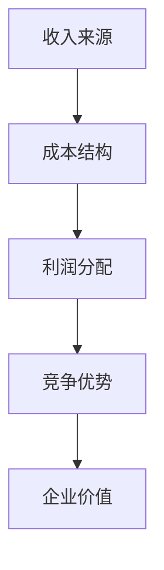
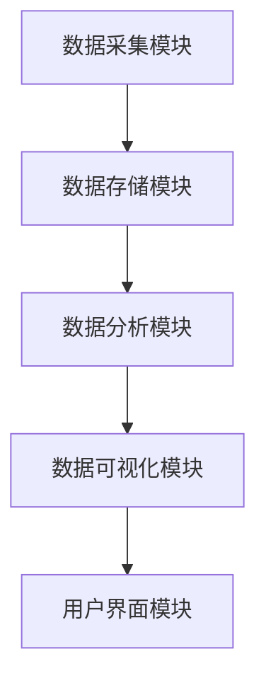
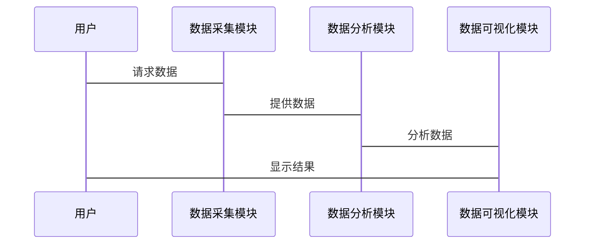

                 

# 彼得林奇如何分析公司的盈利模式

## 关键词：彼得·林奇，盈利模式，投资分析，财务指标，公司分析，投资策略

## 摘要：彼得·林奇是一位世界级的投资专家，他通过深入分析公司的盈利模式来选择投资标的。本文将详细讲解彼得·林奇的投资理念，盈利模式的分析框架，以及如何将这些方法应用到实际投资中。文章内容包括背景介绍、核心概念、分析方法、实际案例和投资策略等，帮助读者全面理解并掌握彼得·林奇的盈利模式分析技巧。

---

## 第一部分：彼得·林奇投资理念与盈利模式分析概述

### 第1章：彼得·林奇与盈利模式分析

#### 1.1 彼得·林奇的生平与投资理念

- **1.1.1 彼得·林奇的生平简介**
  彼得·林奇（Peter Lynch）是美国著名的投资专家，曾任管理着麦哲伦基金（Fidelity Magellen）的基金经理，创造了该基金的辉煌业绩。他以长期价值投资著称，注重分析公司的基本面，尤其是盈利模式。

- **1.1.2 林奇的投资哲学与方法**
  林奇的投资理念强调长期持有优质股票，关注公司的盈利能力和成长性。他认为，投资者应该选择那些具有稳定盈利模式、良好财务状况和持续增长潜力的公司。

- **1.1.3 林奇对盈利模式的关注点**
  林奇认为，盈利模式是公司创造利润的核心机制。他关注公司的收入来源、成本结构、利润分配以及竞争优势，以评估公司的盈利能力和可持续性。

#### 1.2 盈利模式的基本概念与分析框架

- **1.2.1 盈利模式的定义与分类**
  盈利模式是指公司通过核心业务活动赚取利润的方式。常见的盈利模式包括销售产品或服务、订阅模式、广告模式等。

- **1.2.2 盈利模式的核心要素与特征**
  盈利模式的核心要素包括收入来源、成本结构和利润分配。其特征包括稳定性、可持续性和可扩展性。

- **1.2.3 盈利模式的分析框架**
  分析盈利模式需要考虑公司的收入构成、成本控制、利润分配和竞争优势。通过分析这些因素，可以评估公司的盈利能力和成长潜力。

---

### 第2章：盈利模式分析的核心概念与联系

#### 2.1 盈利模式的核心原理

- **2.1.1 盈利模式的构成要素**
  盈利模式由收入来源、成本结构和利润分配三部分组成。收入来源是公司获得收入的方式，成本结构是公司运营所需的各种成本，利润分配是公司如何将利润分配给股东或其他利益相关者。

- **2.1.2 盈利模式与企业价值的关系**
  盈利模式是企业价值的核心驱动因素。稳定的盈利模式能够为公司带来持续的现金流，从而提升企业价值。

- **2.1.3 盈利模式的驱动因素**
  盈利模式的驱动因素包括市场需求、竞争优势、成本控制和创新能力。这些因素共同决定了公司的盈利能力和成长潜力。

#### 2.2 核心概念对比与ER实体关系图

- **2.2.1 盈利模式与成本结构的对比分析**
  盈利模式关注公司如何获取收入，而成本结构关注公司如何管理成本。两者的对比可以帮助评估公司的盈利能力。

- **2.2.2 盈利模式与收入来源的对比分析**
  收入来源是盈利模式的重要组成部分。通过对比不同的收入来源，可以评估公司的收入结构是否合理。

- **2.2.3 ER实体关系图（Mermaid流程图）**

---

### 第3章：盈利模式分析的算法原理

#### 3.1 盈利模式分析的算法流程

- **3.1.1 数据收集与预处理**
  收集公司的财务数据、行业数据和市场数据，并进行清洗和整理，确保数据的准确性和完整性。

- **3.1.2 数据分析与建模**
  使用统计分析和机器学习算法对数据进行建模，评估公司的盈利能力、成本控制和竞争优势。

- **3.1.3 模型验证与优化**
  验证模型的准确性，并根据实际结果进行优化，以提高模型的预测能力。

#### 3.2 盈利模式分析的数学模型与公式

- **3.2.1 利润率计算公式**
  利润率 = 净利润 / 收入

- **3.2.2 盈利能力分析模型**
  净利润率 = 净利润 / 收入  
  毛利率 = 毛利 / 收入

- **3.2.3 财务指标与盈利模式的关系公式**
  净资产收益率（ROE） = 净利润 / 净资产  
  资产回报率（ROA） = 净利润 / 总资产

---

### 第4章：盈利模式分析的系统架构与设计

#### 4.1 系统分析与架构设计

- **4.1.1 系统功能需求分析**
  系统需要具备数据采集、分析、建模和可视化功能，能够支持投资者进行盈利模式分析。

- **4.1.2 系统架构设计（Mermaid架构图）**

- **4.1.3 系统接口设计**
  系统需要与财务数据源、市场数据源和用户界面进行接口设计，确保数据的流畅传输和交互。

#### 4.2 系统交互与实现

- **4.2.1 系统交互流程（Mermaid序列图）**

- **4.2.2 核心功能模块实现**
  核心功能模块包括数据采集、数据分析和数据可视化。每个模块都需要实现具体的功能，例如数据清洗、模型训练和图表生成。

- **4.2.3 系统测试与优化**
  对系统进行全面测试，发现并修复问题，优化系统的性能和用户体验。

---

### 第5章：盈利模式分析的项目实战

#### 5.1 项目环境与工具安装

- **5.1.1 分析工具的选择与安装**
  常用的分析工具包括Python、R、Excel和数据库管理工具。选择合适的工具并进行安装。

- **5.1.2 数据源获取与准备**
  从可靠的财务数据源获取公司数据，并进行清洗和整理，确保数据的准确性和完整性。

- **5.1.3 项目开发环境配置**
  配置开发环境，安装必要的库和工具，例如Pandas、Matplotlib和Seaborn。

#### 5.2 核心功能实现

- **5.2.1 数据分析与建模代码实现**
  使用Python编写代码，进行数据清洗、建模和分析。例如，使用Pandas进行数据处理，使用Scikit-learn进行机器学习建模。

- **5.2.2 盈利模式可视化工具开发**
  使用Matplotlib或Seaborn绘制图表，展示公司的盈利能力、成本结构和竞争优势。

- **5.2.3 系统测试与调试**
  对系统进行全面测试，确保各个模块的正常运行，发现并修复潜在的问题。

---

### 第6章：盈利模式分析的最佳实践与投资策略

#### 6.1 盈利模式分析的技巧与注意事项

- **6.1.1 分析中的常见误区**
  避免只关注短期利润，忽视长期增长潜力。同时，不要过度依赖单一指标，忽略其他重要因素。

- **6.1.2 数据分析的常见问题及解决方案**
  数据不足或不准确是常见的问题。解决方案包括数据清洗、数据增强和数据验证。

- **6.1.3 投资决策中的关键点**
  关注公司的收入增长、成本控制和竞争优势。同时，考虑宏观经济环境和行业发展趋势。

#### 6.2 投资策略的制定与实施

- **6.2.1 投资组合的构建与优化**
  根据分析结果，选择具有稳定盈利模式和良好财务状况的公司，构建投资组合并进行优化。

- **6.2.2 风险管理与控制**
  设定止损点和止盈点，分散投资风险，避免过度集中于某一只股票。

- **6.2.3 长期跟踪与评估**
  定期评估投资组合的绩效，根据市场变化和公司情况调整投资策略。

---

## 总结

彼得·林奇的盈利模式分析方法为投资者提供了重要的指导。通过深入分析公司的收入来源、成本结构和竞争优势，投资者可以更好地评估公司的盈利能力和成长潜力。本文通过理论与实践相结合，详细讲解了盈利模式的分析方法和投资策略，帮助读者掌握彼得·林奇的投资理念，并在实际投资中应用这些方法。

---

## 拓展阅读

- 《彼得·林奇的成功投资》
- 《投资学基础》
- 《财务报表分析》

