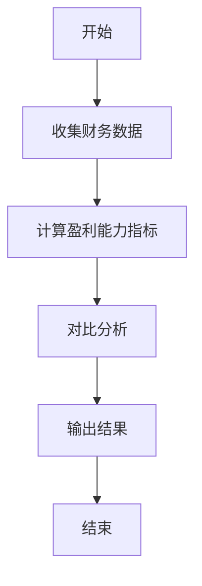
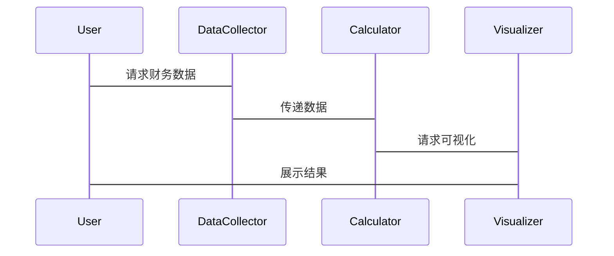

                 


# 彼得林奇如何分析公司的盈利能力

## 关键词：彼得林奇，投资分析，盈利能力，财务报表，投资策略

## 摘要：本文详细探讨了彼得·林奇分析公司盈利能力的方法，从基础概念到实战分析，帮助读者掌握如何通过财务报表和市场分析来评估公司的盈利潜力。文章结合定量分析和定性分析，提供了一个系统的分析框架，并通过实际案例展示了如何将理论应用于实践。

---

# 第一部分: 投资分析背景与基础

## 第1章: 投资分析的基本概念

### 1.1 投资的基本概念

#### 1.1.1 什么是投资
- 投资是指将资金用于购买资产以期获得未来收益的行为。
- 投资的目标是通过资产增值实现财富增长。
- 投资的核心要素包括资金、时间、风险和收益。

#### 1.1.2 投资的基本原则
- 分散投资：降低风险。
- 长期视角：关注资产的长期增值。
- 风险与收益的平衡：合理评估风险和收益的关系。

#### 1.1.3 投资的目标与风险
- 投资目标：资本增值、收入获取、保值避险。
- 投资风险：本金损失、收益波动、市场风险。

### 1.2 彼得·林奇与投资分析

#### 1.2.1 彼得·林奇的背景介绍
- 彼得·林奇是美国著名投资经理人，曾任富达麦哲伦基金的经理，创造了卓越的投资业绩。
- 他以深入的基本面分析和长期投资策略闻名。

#### 1.2.2 彼得·林奇的投资理念
- 长期投资：避免频繁交易，关注企业的长期增长。
- 价值投资：寻找被市场低估的优秀企业。
- 分散投资：通过投资多个行业降低风险。

#### 1.2.3 彼得·林奇的成功案例
- 富达麦哲伦基金在他的管理下实现了年均25%的回报率。
- 成功投资于像Home Depot和Walgreens这样的企业。

### 1.3 公司盈利能力的重要性

#### 1.3.1 盈利能力的定义
- 盈利能力是指企业在一定时期内赚取利润的能力。
- 利润是企业生存和发展的核心。

#### 1.3.2 盈利能力与公司价值的关系
- 盈利能力高的公司通常具有更高的市场价值。
- 盈利能力是决定股票价值的重要因素。

#### 1.3.3 分析盈利能力的必要性
- 评估企业的经营效率。
- 判断企业的成长潜力。
- 为投资决策提供依据。

### 1.4 分析盈利能力的基本方法

#### 1.4.1 财务报表分析法
- 通过利润表、资产负债表和现金流量表分析企业的盈利能力。

#### 1.4.2 市场分析法
- 通过行业趋势和市场环境分析企业的盈利能力。

#### 1.4.3 行业分析法
- 通过对比同行业公司分析企业的相对盈利能力。

---

## 第2章: 公司盈利能力的核心概念

### 2.1 盈利能力的定义与属性

#### 2.1.1 盈利能力的定义
- 盈利能力是指企业在一定时期内赚取利润的能力。

#### 2.1.2 盈利能力的属性特征对比
| 属性       | 描述                       |
|------------|----------------------------|
| 时间性     | 受特定时间周期影响         |
| 相关性     | 与企业经营效率密切相关     |
| 可比性     | 可以在同行业企业之间比较     |

#### 2.1.3 盈利能力的核心要素组成
- 收入：企业的总收入。
- 成本：企业的运营成本。
- 利润：收入减去成本后的净收益。

### 2.2 盈利能力分析的框架

#### 2.2.1 盈利能力分析的维度
- 利润率分析：如净利润率、毛利润率。
- 资产周转率分析：如总资产周转率。
- 股东权益回报率分析：如ROE。

#### 2.2.2 盈利能力分析的指标体系
- 净利润率（Net Profit Margin）：净利润 / 收入。
- 毛利润率（Gross Profit Margin）：毛利 / 收入。
- 资产回报率（Return on Assets, ROA）：净利润 / 总资产。
- 股东权益回报率（Return on Equity, ROE）：净利润 / 股东权益。

#### 2.2.3 盈利能力分析的边界与外延
- 边界：企业内部的财务数据。
- 外延：市场环境、行业趋势和宏观经济因素。

### 2.3 盈利能力分析的ER实体关系图
```mermaid
erDiagram
    company {
        id : int
        name : string
        industry : string
        revenue : decimal
        cost : decimal
        profit : decimal
    }
    shareholder {
        id : int
        name : string
        equity : decimal
    }
    transaction {
        id : int
        date : date
        amount : decimal
    }
    company <o- shareholder : Owns
    company <o- transaction : Conducts
```

---

## 第3章: 盈利能力分析的核心算法

### 3.1 盈利能力分析的基本步骤

#### 3.1.1 收集数据
- 获取企业的财务报表：利润表、资产负债表、现金流量表。

#### 3.1.2 计算关键指标
- 净利润率 = 净利润 / 收入。
- 毛利润率 = 毛利 / 收入。
- 资产回报率 = 净利润 / 总资产。
- 股东权益回报率 = 净利润 / 股东权益。

#### 3.1.3 对比分析
- 对比同行业企业的盈利能力指标。
- 分析企业盈利能力的变化趋势。

### 3.2 盈利能力分析的算法实现

#### 3.2.1 使用Python进行盈利能力分析

```python
import pandas as pd

# 加载财务数据
def load_financial_data(company):
    # 假设财务数据存储在CSV文件中
    df = pd.read_csv(f'{company}_financials.csv')
    return df

# 计算盈利能力指标
def calculate_profitabilityMetrics(df):
    # 净利润率
    net_profit_margin = df['Net Income'] / df['Revenue']
    # 毛利润率
    gross_profit_margin = df['Gross Profit'] / df['Revenue']
    # 资产回报率
    roa = df['Net Income'] / df['Total Assets']
    # 股东权益回报率
   roe = df['Net Income'] / df['Total Equity']
    return net_profit_margin, gross_profit_margin, roa, roe

# 主函数
def main():
    company = 'Apple'
    df = load_financial_data(company)
    npm, gpm, roa, roe = calculate_profitabilityMetrics(df)
    print(f"{company}'s Net Profit Margin: {npm}")
    print(f"{company}'s Gross Profit Margin: {gpm}")
    print(f"{company}'s ROA: {roa}")
    print(f"{company}'s ROE: {roe}")

if __name__ == "__main__":
    main()
```

#### 3.2.2 盈利能力分析的数学模型

- 净利润率公式：
  $$ \text{Net Profit Margin} = \frac{\text{Net Income}}{\text{Revenue}} $$
  
- 毛利润率公式：
  $$ \text{Gross Profit Margin} = \frac{\text{Gross Profit}}{\text{Revenue}} $$
  
- 资产回报率公式：
  $$ \text{ROA} = \frac{\text{Net Income}}{\text{Total Assets}} $$
  
- 股东权益回报率公式：
  $$ \text{ROE} = \frac{\text{Net Income}}{\text{Total Equity}} $$

### 3.3 盈利能力分析的算法流程图



---

## 第4章: 系统化盈利能力分析框架

### 4.1 系统化分析框架的设计

#### 4.1.1 问题场景介绍
- 通过系统化的方法分析苹果公司的盈利能力。
- 使用彼得·林奇的分析框架作为指导。

#### 4.1.2 系统功能设计

```mermaid
classDiagram
    class Company {
        id : int
        name : string
        revenue : decimal
        cost : decimal
        profit : decimal
    }
    class Shareholder {
        id : int
        name : string
        equity : decimal
    }
    class Transaction {
        id : int
        date : date
        amount : decimal
    }
    Company <o- Shareholder : Owns
    Company <o- Transaction : Conducts
```

#### 4.1.3 系统架构设计

```mermaid
container ProfitabilityAnalysisSystem {
    component DataCollector {
        + load_financial_data()
    }
    component Calculator {
        + calculate_profitabilityMetrics()
    }
    component Visualizer {
        + visualize_results()
    }
}
```

#### 4.1.4 系统接口设计
- 数据采集接口：从数据库或文件中获取财务数据。
- 计算接口：计算盈利能力指标。
- 可视化接口：生成图表展示结果。

#### 4.1.5 系统交互流程



---

## 第5章: 项目实战——苹果公司盈利能力分析

### 5.1 项目环境安装

#### 5.1.1 安装Python和相关库
```bash
pip install pandas matplotlib
```

#### 5.1.2 下载苹果财务数据
```bash
wget https://example.com/apple_financials.csv
```

### 5.2 系统核心实现

#### 5.2.1 数据加载与清洗
```python
import pandas as pd

# 加载数据
df = pd.read_csv('apple_financials.csv')

# 数据清洗
df.dropna(inplace=True)
df = df[df['Year'].notnull()]
```

#### 5.2.2 盈利能力指标计算
```python
# 计算指标
net_profit_margin = df['Net Income'] / df['Revenue']
gross_profit_margin = df['Gross Profit'] / df['Revenue']
roa = df['Net Income'] / df['Total Assets']
roe = df['Net Income'] / df['Total Equity']
```

#### 5.2.3 可视化结果
```python
import matplotlib.pyplot as plt

# 绘制图表
plt.figure(figsize=(10, 6))
plt.plot(df['Year'], net_profit_margin, 'b-', label='Net Profit Margin')
plt.plot(df['Year'], gross_profit_margin, 'r-', label='Gross Profit Margin')
plt.xlabel('Year')
plt.ylabel('Margin (%)')
plt.title('Apple Profitability Analysis')
plt.legend()
plt.show()
```

### 5.3 案例分析与解读

#### 5.3.1 分析结果解读
- 苹果公司的净利率保持稳定增长。
- 毛利润率较高，显示公司在成本控制方面表现优异。
- 资产回报率和股东权益回报率均高于行业平均水平，显示公司资产利用效率高。

#### 5.3.2 投资建议
- 维持对苹果公司的长期看好。
- 盈利能力稳定，适合长期投资。

### 5.4 项目小结

#### 5.4.1 项目总结
- 成功使用系统化方法分析了苹果公司的盈利能力。
- 得出了积极的投资结论。

#### 5.4.2 项目注意事项
- 数据来源的准确性。
- 指标计算的准确性。
- 对行业趋势的关注。

---

## 第6章: 总结与最佳实践

### 6.1 小结

- 彼得·林奇的盈利能力分析方法以基本面分析为核心。
- 结合定量分析和定性分析，可以更全面地评估公司的盈利能力。

### 6.2 最佳实践 tips

- 定期更新财务数据，保持分析的实时性。
- 关注行业趋势和宏观经济环境。
- 保持对企业的持续关注和分析。

### 6.3 注意事项

- 避免仅依赖单一指标进行分析。
- 保持合理的投资分散策略。
- 定期评估和调整投资组合。

### 6.4 拓展阅读

- 《彼得·林奇的投资哲学》。
- 《财务报表分析与投资策略》。
- 《价值投资：本金安全与长期回报》。

---

通过本文的系统化分析，读者可以掌握彼得·林奇的盈利能力分析方法，并能够在实际投资中灵活运用这些方法。

