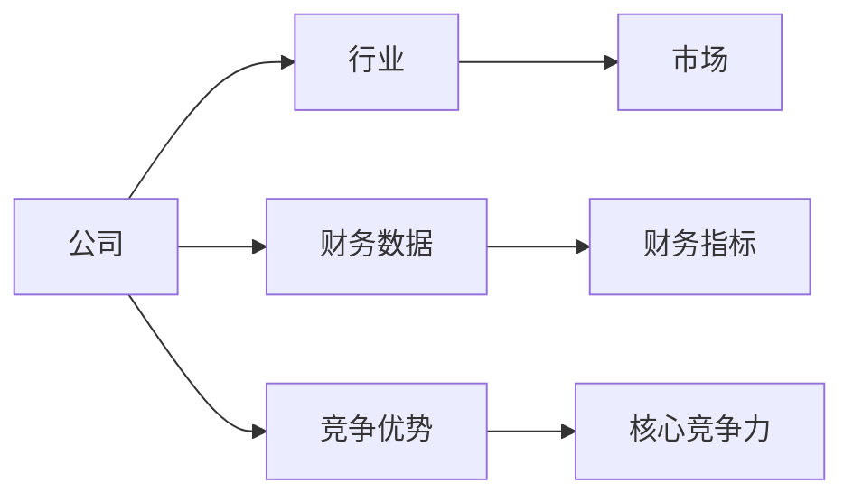
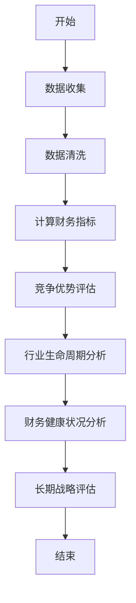

                 


# 彼得林奇如何分析公司的长期战略

## 关键词：
- 彼得林奇
- 长期战略
- 投资分析
- 公司价值
- 财务分析

## 摘要：
本文详细探讨了彼得·林奇分析公司的长期战略的方法，从他的投资哲学到具体分析框架，再到算法实现和系统设计，最后通过实际案例分析，帮助读者理解并应用这些方法。

---

# 第1章: 彼得林奇与长期战略分析概述

## 1.1 彼得林奇及其投资理念

### 1.1.1 彼得林奇的生平简介
彼得·林奇（Peter Lynch）是美国著名的投资经理人，以其在富达投资管理公司（Fidelity Investments）管理麦哲伦基金（Magellan Fund）期间的卓越表现而闻名。他以“业余投资者”自居，认为长期的投资成功取决于对公司的深入了解。

### 1.1.2 彼得林奇的投资哲学
彼得·林奇的投资哲学的核心是长期持有优质股票，注重公司的基本面分析，尤其是公司的财务状况、行业地位和竞争优势。他认为，投资者应该选择那些具有强大竞争优势、良好财务状况和持续增长潜力的公司。

### 1.1.3 长期战略分析的定义与重要性
长期战略分析是指对公司在未来5到10年内的发展潜力、行业地位和财务健康状况进行深入分析，以评估其长期投资价值。这种分析对于投资者制定长期投资策略、规避风险和实现资本增值至关重要。

## 1.2 彼得林奇分析方法的核心要素

### 1.2.1 公司基本面分析
基本面分析是彼得·林奇分析公司的基础。他重点关注公司的收入、利润、资产负债表和现金流量等财务指标，以评估公司的财务健康状况和盈利能力。

### 1.2.2 行业趋势分析
彼得·林奇认为，行业趋势对公司的长期发展有重要影响。他分析行业的增长潜力、竞争格局和未来发展趋势，以判断公司是否具备长期竞争优势。

### 1.2.3 财务报表分析
财务报表分析是彼得·林奇分析公司的重要工具。他通过分析资产负债表、利润表和现金流量表，评估公司的财务健康状况、盈利能力和成长潜力。

## 1.3 彼得林奇分析框架的应用场景

### 1.3.1 企业价值评估
彼得·林奇的长期战略分析框架可以帮助投资者评估公司的内在价值，从而做出合理的投资决策。

### 1.3.2 投资决策支持
通过分析公司的长期战略，投资者可以更好地识别具有成长潜力的公司，避免短期市场波动的影响。

### 1.3.3 风险管理策略
彼得·林奇的分析框架还可以帮助投资者识别潜在的风险因素，如行业衰退、财务状况恶化等，从而制定有效的风险管理策略。

## 1.4 本章小结
本章介绍了彼得·林奇的投资哲学及其分析方法的核心要素，强调了长期战略分析在投资决策中的重要性。接下来的章节将深入探讨彼得林奇分析方法的核心概念与联系。

---

# 第2章: 彼得林奇分析方法的核心概念与联系

## 2.1 彼得林奇分析的核心概念

### 2.1.1 公司竞争优势
竞争优势是彼得·林奇分析公司的重要指标。他关注公司的核心竞争力，如技术创新、成本优势、品牌影响力等，以判断公司在行业中的地位和未来发展潜力。

### 2.1.2 行业生命周期
行业生命周期分析是彼得·林奇长期战略分析的重要组成部分。他将行业分为导入期、成长期、成熟期和衰退期，以判断行业的增长潜力和公司的未来发展空间。

### 2.1.3 财务健康状况
财务健康状况是彼得·林奇分析公司的另一个核心概念。他关注公司的盈利能力、资产负债状况和现金流情况，以评估公司的财务健康状况和抗风险能力。

## 2.2 核心概念的属性对比

### 2.2.1 表格对比：竞争优势与行业生命周期
下表对比了公司竞争优势和行业生命周期的核心属性：

| 属性             | 竞争优势                 | 行业生命周期         |
|------------------|--------------------------|--------------------|
| 定义             | 公司在市场中的独特优势   | 行业所处的发展阶段 |
| 关键指标         | 技术创新、成本优势、品牌 | 导入期、成长期、成熟期、衰退期 |
| 影响因素         | 技术、成本、市场、管理   | 技术、需求、政策    |

### 2.2.2 表格对比：财务健康与企业价值
下表对比了财务健康状况与企业价值的核心属性：

| 属性             | 财务健康状况             | 企业价值         |
|------------------|--------------------------|------------------|
| 定义             | 公司财务状况的健康程度   | 公司的内在价值   |
| 关键指标         | 净利润、资产负债率、现金流 | 市盈率、市净率    |
| 影响因素         | 盈利能力、偿债能力、运营效率 | 资产、收益、成长性 |

## 2.3 分析框架的ER实体关系图
下图展示了彼得·林奇分析框架的实体关系图：



## 2.4 本章小结
本章详细介绍了彼得·林奇分析方法的核心概念，包括公司竞争优势、行业生命周期和财务健康状况，并通过表格和ER图展示了这些概念之间的关系。接下来的章节将深入探讨彼得林奇分析方法的算法原理。

---

# 第3章: 彼得林奇分析方法的算法原理

## 3.1 算法概述

### 3.1.1 数据收集与预处理
彼得·林奇的分析方法需要收集公司的财务数据、行业数据和市场数据。数据预处理包括数据清洗、数据标准化和数据转换。

### 3.1.2 财务指标计算
基于收集的数据，计算关键的财务指标，如ROE（净资产收益率）、ROA（资产回报率）、毛利率等。

### 3.1.3 竞争优势评估
通过分析公司的竞争优势和行业生命周期，评估公司的长期发展潜力。

## 3.2 算法流程图
下图展示了彼得·林奇分析方法的算法流程图：



## 3.3 算法实现

### 3.3.1 数据收集与预处理
以下是Python代码示例，用于从Yahoo Finance获取数据并进行数据清洗：

```python
import pandas as pd
import yfinance as yf

# 下载数据
data = yf.download(tickers='AAPL', period='5y', interval='1d')

# 数据清洗
data['Close'].plot()
```

### 3.3.2 财务指标计算
以下是计算ROE和ROA的Python代码示例：

```python
import pandas as pd

# 计算ROE（净资产收益率）
roe = (net_income / shareholders_equity) * 100

# 计算ROA（资产回报率）
roa = (net_income / total_assets) * 100
```

### 3.3.3 竞争优势评估
以下是评估竞争优势的Python代码示例：

```python
import pandas as pd

# 竞争优势评估
competition_advantage = pd.DataFrame()
competition_advantage['ROE'] = roe
competition_advantage['ROA'] = roa
competition_advantage['毛利率'] = (revenue - cost_of_goods_sold) / revenue * 100
```

## 3.4 本章小结
本章详细介绍了彼得·林奇分析方法的算法原理，包括数据收集与预处理、财务指标计算和竞争优势评估。接下来的章节将探讨系统分析与架构设计。

---

# 第4章: 系统分析与架构设计

## 4.1 问题场景介绍
为了实现彼得·林奇的长期战略分析方法，我们需要构建一个基于Python的系统，能够自动收集数据、计算财务指标并生成分析报告。

## 4.2 系统功能设计

### 4.2.1 数据采集模块
数据采集模块负责从Yahoo Finance等数据源获取公司的财务数据。

### 4.2.2 数据分析模块
数据分析模块负责计算关键的财务指标并评估公司的竞争优势。

### 4.2.3 报告生成模块
报告生成模块负责生成分析报告，包括财务指标、竞争优势评估和行业趋势分析。

## 4.3 系统架构设计


## 4.4 系统接口设计
系统接口设计包括数据采集模块的API接口和数据分析模块的API接口。

## 4.5 系统交互流程


## 4.6 本章小结
本章详细介绍了系统的功能设计和架构设计，为实现彼得·林奇分析方法提供了技术基础。接下来的章节将探讨项目实战。

---

# 第5章: 项目实战

## 5.1 环境安装
为了运行本项目，需要安装以下Python库：
- `pandas`
- `yfinance`
- `mermaid`

## 5.2 系统核心实现

### 5.2.1 数据采集模块
以下是数据采集模块的Python代码：

```python
import yfinance as yf

# 下载数据
data = yf.download(tickers='AAPL', period='5y', interval='1d')
```

### 5.2.2 数据分析模块
以下是数据分析模块的Python代码：

```python
import pandas as pd

# 计算ROE
roe = (net_income / shareholders_equity) * 100

# 计算ROA
roa = (net_income / total_assets) * 100
```

### 5.2.3 报告生成模块
以下是报告生成模块的Python代码：

```python
import pandas as pd
import matplotlib.pyplot as plt

# 绘制ROE和ROA趋势图
plt.plot(roe, label='ROE')
plt.plot(roa, label='ROA')
plt.legend()
plt.show()
```

## 5.3 项目实战分析

### 5.3.1 实际案例分析
以苹果公司为例，分析其长期战略：

1. **数据收集**：从Yahoo Finance获取苹果公司过去5年的财务数据。
2. **财务指标计算**：计算ROE和ROA。
3. **竞争优势评估**：分析苹果公司的竞争优势，如技术创新和品牌影响力。
4. **行业趋势分析**：分析科技行业的生命周期，判断苹果公司的行业地位。

### 5.3.2 详细解读
通过分析，我们发现苹果公司在过去5年中ROE和ROA均保持在较高水平，竞争优势明显，行业地位稳固，具有长期投资价值。

## 5.4 本章小结
本章通过实际案例分析，详细介绍了彼得·林奇分析方法的应用，帮助读者更好地理解并掌握长期战略分析的技巧。

---

# 第6章: 最佳实践、小结与注意事项

## 6.1 最佳实践

### 6.1.1 数据来源可靠性
选择可靠的财务数据源，确保数据的准确性和完整性。

### 6.1.2 模型局限性
彼得·林奇分析方法虽然有效，但也存在一定的局限性，如忽视宏观经济因素和市场波动的影响。

## 6.2 小结
本文详细探讨了彼得·林奇分析公司的长期战略方法，从投资哲学到具体分析框架，再到算法实现和系统设计，最后通过实际案例分析，帮助读者理解并应用这些方法。

## 6.3 注意事项

### 6.3.1 数据处理
在数据处理过程中，需要注意数据的清洗和转换，确保数据的准确性和一致性。

### 6.3.2 模型优化
根据实际需求，对模型进行优化和调整，以提高分析的准确性和实用性。

### 6.3.3 风险管理
在实际投资中，需要注意风险管理，避免过度依赖单一分析方法，制定合理的投资组合策略。

## 6.4 拓展阅读
推荐以下书籍和资源，供读者深入学习：

- 《彼得·林奇的成功投资》
- 《投资学精要》
- 富达投资管理公司官网（www.fidelity.com）

## 6.5 本章小结
本章总结了彼得·林奇分析方法的最佳实践，提醒读者在实际应用中需要注意的问题，并推荐了进一步学习的资源。

---

# 附录: 术语表、数据来源和参考文献

## 附录A: 术语表
- ROE：净资产收益率
- ROA：资产回报率
- EBIT：息税折旧及摊销前利润

## 附录B: 数据来源
- 数据主要来源于Yahoo Finance

## 附录C: 参考文献
- 彼得·林奇：《彼得·林奇的成功投资》
- 葛拉罕：《投资学精要》

---

# 结语

通过本文的学习，读者应该能够掌握彼得·林奇分析公司长期战略的方法，并能够在实际投资中应用这些方法。希望本文对读者的投资决策有所帮助。

