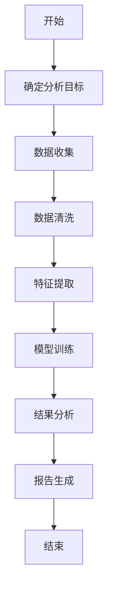
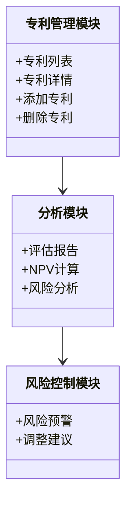
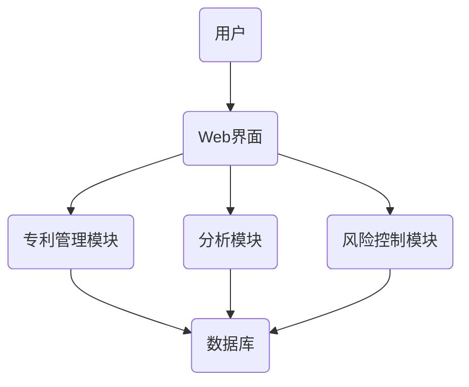
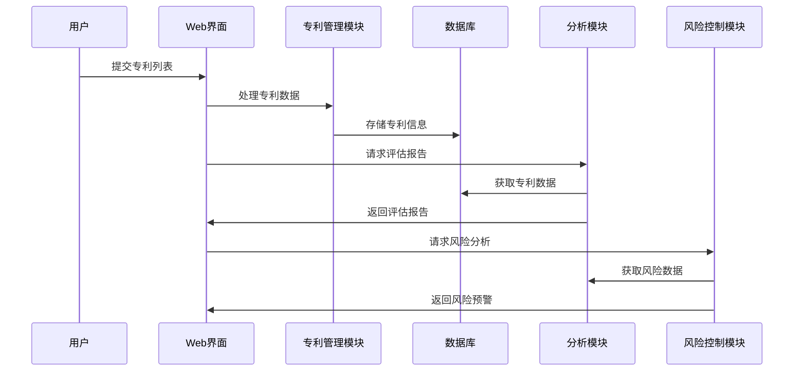

                 


# 彼得林奇如何看待公司的专利组合战略

## 关键词：专利组合战略、彼得·林奇、知识产权、投资评估、技术分析

## 摘要：本文从彼得·林奇的投资视角探讨专利组合战略的重要性，分析其评估方法，并结合技术分析和系统架构设计，提供实际案例和最佳实践。

---

# 文章正文

## 第1章: 专利组合战略的背景与基础

### 1.1 专利的基本概念与价值

#### 1.1.1 专利的定义与特点

专利是一种法律保护的知识产权，授予发明人对其发明的独占权。其特点包括独占性、地域性、时间性和可转让性。专利分为发明专利、实用新型专利和外观设计专利，分别保护技术方案、产品构造或设计。

#### 1.1.2 专利的分类与保护范围

专利主要分为技术专利和非技术专利。技术专利保护技术方案，如机械装置、软件算法；非技术专利保护商业方法、艺术设计等。专利的保护范围由权利要求书确定，涵盖发明的核心技术特征。

#### 1.1.3 专利在企业中的价值

专利不仅是技术保护手段，更是企业的重要资产。它通过提供市场垄断权，增强竞争力，防止竞争对手侵权。专利还可以通过授权使用、转让或质押融资，为企业创造直接经济价值。

### 1.2 专利组合的定义与优势

#### 1.2.1 专利组合的定义

专利组合是多个专利的集合，通过协同作用形成强大的知识产权保护网。它不仅覆盖单一技术的多个方面，还能在不同技术领域形成交叉保护。

#### 1.2.2 专利组合的核心要素

- **技术相关性**：专利之间应围绕同一技术领域或相关技术，形成协同效应。
- **覆盖全面性**：专利组合应覆盖技术的各个方面，防止竞争对手在任何环节突破。
- **法律有效性**：每项专利都需具备法律有效性，包括新颖性、创造性和实用性。

#### 1.2.3 专利组合与单一专利的对比

专利组合通过多专利的协同，提供更强的保护和更高的经济价值。单一专利保护范围有限，而组合专利能形成多层次、多维度的防护体系。

### 1.3 专利组合战略的背景与重要性

#### 1.3.1 专利组合战略的背景

随着技术快速发展，企业竞争日益激烈，单一专利难以全面保护企业利益。专利组合战略成为企业维持技术优势、防范风险的重要手段。

#### 1.3.2 专利组合战略的重要性

- **防御性优势**：防止竞争对手侵犯技术。
- **进攻性优势**：通过专利组合发起反诉，获取经济利益。
- **战略价值**：增强企业市场地位，吸引投资者。

#### 1.3.3 专利组合战略的边界与外延

专利组合不应过于分散，以免资源分散，降低整体价值。其外延包括专利布局、管理优化和风险控制，确保组合的有效性和经济性。

## 第2章: 彼得·林奇的专利组合战略视角

### 2.1 彼得·林奇与专利组合战略

#### 2.1.1 彼得·林奇的投资者背景

彼得·林奇是著名基金经理，以其深入的基本面分析著称。他认为，专利组合是企业核心竞争力的重要组成部分，能显著影响企业价值。

#### 2.1.2 专利组合在投资中的重要性

林奇认为，专利组合不仅保护技术，还直接影响企业盈利能力。强大的专利组合能提升企业定价权，增加市场份额，从而提升投资价值。

#### 2.1.3 专利组合与企业价值

林奇在评估企业时，会分析专利组合的质量、数量和布局。他关注专利的经济价值，包括授权使用收入、侵权赔偿能力等。

### 2.2 彼得·林奇的专利组合评估方法

#### 2.2.1 专利组合的质量评估

- **技术先进性**：评估专利的技术创新程度。
- **法律稳定性**：检查专利的法律有效性。
- **市场相关性**：专利是否与市场需求匹配。

#### 2.2.2 专利组合的经济价值评估

- **收入潜力**：评估专利的授权使用收入。
- **成本分析**：评估维护和诉讼成本。
- **市场地位**：评估专利对市场竞争的影响。

#### 2.2.3 专利组合的战略意义

- **防御性作用**：防止竞争对手侵权。
- **进攻性作用**：通过专利诉讼获取经济利益。
- **战略协同**：与其他知识产权形成协同效应。

### 2.3 彼得·林奇的专利组合投资逻辑

#### 2.3.1 专利组合的市场地位分析

林奇关注专利组合是否覆盖关键市场和技术，是否能有效阻止竞争对手进入。

#### 2.3.2 专利组合的竞争优势分析

评估专利组合是否形成技术壁垒，是否能为企业带来持久的竞争优势。

#### 2.3.3 专利组合的财务表现分析

分析专利组合的收入、成本和利润情况，评估其对企业财务状况的影响。

## 第3章: 专利组合战略的管理与优化

### 3.1 专利组合的构建与管理

#### 3.1.1 专利组合的构建原则

- **技术领先性**：选择具有创新性的专利。
- **市场相关性**：确保专利与市场需求匹配。
- **法律有效性**：确保每项专利的法律稳定性。

#### 3.1.2 专利组合的管理流程

1. **需求分析**：明确技术领域和市场目标。
2. **专利筛选**：选择相关专利。
3. **组合优化**：调整专利结构，最大化价值。
4. **动态调整**：根据市场变化及时更新。

#### 3.1.3 专利组合的动态调整

定期评估专利组合的有效性，及时淘汰低效专利，引入新技术专利，保持组合的活力和竞争力。

### 3.2 专利组合的优化策略

#### 3.2.1 专利组合的优化目标

- **提高整体价值**：通过优化提升专利组合的经济价值。
- **降低管理成本**：精简专利数量，降低维护成本。
- **增强防御能力**：通过优化提升组合的防御效果。

#### 3.2.2 专利组合的优化方法

- **技术聚焦**：围绕核心技术创新布局。
- **地域扩展**：在重要市场申请专利。
- **交叉保护**：在多个技术领域形成交叉保护。

#### 3.2.3 专利组合的优化案例

某科技公司通过优化专利组合，将专利数量从50项减少到30项，同时提高了技术覆盖范围和市场影响力。

### 3.3 专利组合的风险与控制

#### 3.3.1 专利组合的主要风险

- **法律风险**：专利无效或被挑战。
- **市场风险**：技术过时或市场需求变化。
- **管理风险**：管理不善导致价值流失。

#### 3.3.2 专利组合风险的控制措施

- **定期审查**：确保专利的有效性。
- **动态调整**：适应市场和技术变化。
- **风险评估**：定期评估风险，制定应对策略。

#### 3.3.3 专利组合的风险评估模型

使用NPV模型评估专利组合的经济价值，考虑各项专利的收入和成本，预测整体风险和收益。

---

## 第4章: 专利组合战略的技术分析

### 4.1 专利组合的定量分析方法

#### 4.1.1 专利组合的经济价值评估模型

**NPV计算公式**：
$$ NPV = \sum_{t=0}^{n} \frac{C_t}{(1 + r)^t} $$
其中，\( C_t \) 是第t年的净现金流，\( r \) 是折现率。

#### 4.1.2 专利组合的定量分析步骤

1. **确定每项专利的收入和成本**。
2. **预测未来现金流**。
3. **计算NPV**，评估整体经济价值。

### 4.2 专利组合的技术分析流程

#### 4.2.1 专利组合的技术分析流程图



#### 4.2.2 专利组合的技术分析算法

使用Python进行NPV计算：

```python
def calculate_npv(cash_flows, discount_rate):
    npv = 0
    for t, cf in enumerate(cash_flows):
        npv += cf / (1 + discount_rate) ** t
    return npv

# 示例数据
cash_flows = [100, 200, 300]
discount_rate = 0.1

print("NPV:", calculate_npv(cash_flows, discount_rate))
```

---

## 第5章: 专利组合战略的系统架构设计

### 5.1 系统分析与设计

#### 5.1.1 系统功能设计

- **专利管理模块**：管理专利信息。
- **分析模块**：评估专利组合价值。
- **风险控制模块**：监控和管理风险。

#### 5.1.2 领域模型设计



#### 5.1.3 系统架构设计



#### 5.1.4 系统接口设计

- **添加专利接口**：`POST /api/patent/add`
- **删除专利接口**：`DELETE /api/patent/remove`
- **评估报告接口**：`GET /api/patent/analyze`

#### 5.1.5 系统交互设计



---

## 第6章: 项目实战

### 6.1 项目环境安装

安装Python和必要的库：

```bash
pip install numpy
pip install matplotlib
pip install pandas
```

### 6.2 系统核心实现

#### 6.2.1 核心代码实现

```python
import numpy as np
import pandas as pd

def calculate_npv(cash_flows, discount_rate):
    return np.npv(discount_rate, cash_flows)

cash_flows = [100, 200, 300]
discount_rate = 0.1

print("NPV:", calculate_npv(cash_flows, discount_rate))
```

#### 6.2.2 代码应用解读

该代码计算专利组合的NPV，评估其经济价值。通过输入现金流和折现率，计算整体NPV，辅助投资决策。

#### 6.2.3 实际案例分析

以某公司专利组合为例，计算其NPV，评估整体经济价值，指导投资决策。

#### 6.2.4 项目小结

通过实战项目，掌握专利组合评估方法，提升技术分析能力。

---

## 第7章: 最佳实践与小结

### 7.1 最佳实践

- **定期审查**：定期检查专利组合的有效性。
- **动态调整**：根据市场变化及时优化组合。
- **风险管理**：建立风险评估机制，制定应对策略。

### 7.2 小结

本文从彼得·林奇的视角探讨专利组合战略，分析其评估方法，结合技术分析和系统设计，提供实际案例和最佳实践。

### 7.3 投资建议

投资者应关注专利组合的质量、经济价值和战略意义，选择具备强大专利组合的企业进行投资。

### 7.4 风险管理

建立有效的风险评估和控制机制，降低专利组合战略的风险。

### 7.5 拓展阅读

推荐阅读《专利管理与战略》、《彼得·林奇的投资哲学》等书籍，深入理解专利组合战略和投资哲学。

---

# 结语

通过本文的分析和实战，读者可以全面理解彼得·林奇如何看待专利组合战略，并掌握相关技术和方法，提升投资决策和风险管理能力。

