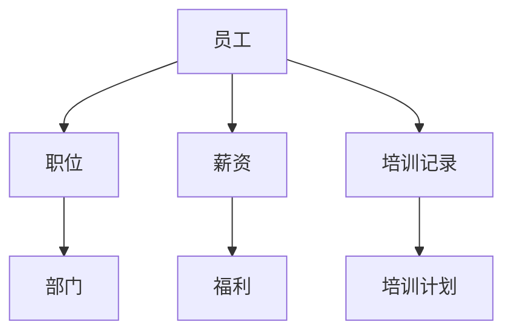

                 


# 彼得·林奇如何看待公司的人才培养与保留策略

> 关键词：人才管理，彼得·林奇，培养策略，保留策略，系统架构，数学模型，实战案例

> 摘要：本文将探讨彼得·林奇在公司人才管理方面的独特见解，分析其如何通过系统性解决方案、数学模型和实际案例来优化公司的人才培养与保留策略。从理论到实践，从模型到代码，我们将全面解析如何构建高效的人才管理体系。

---

## 目录

### 第一部分: 人才管理的背景与核心概念

#### 第1章: 人才管理的背景与问题背景

##### 1.1 人才管理的重要性

- 1.1.1 企业竞争中的关键要素
  - 人才是企业的核心竞争力
  - 人才管理在企业战略中的地位
- 1.1.2 人才管理的核心作用
  - 优化资源配置
  - 提高员工满意度和绩效
- 1.1.3 彼得·林奇的人才管理观点
  - 林奇的管理哲学：人才是企业的命脉
  - 林奇对员工培养与保留的独特见解

##### 1.2 问题背景与问题描述

- 1.2.1 当前企业人才管理的主要挑战
  - 人才流失率高
  - 人才培养效果不佳
  - 人才保留策略缺乏针对性
- 1.2.2 人才流失对企业的影响
  - 经营成本增加
  - 员工士气低落
  - 企业创新能力下降
- 1.2.3 人才培养与保留的平衡点
  - 如何实现长期与短期目标的统一
  - 人才激励机制的设计

##### 1.3 问题解决与边界外延

- 1.3.1 人才管理的系统性解决方案
  - 建立科学的人才培养体系
  - 构建有效的激励机制
  - 优化企业文化和工作环境
- 1.3.2 人才管理的边界与外延
  - 人才管理的范围界定
  - 人才管理与企业战略的关系
  - 人才管理的外部影响因素
- 1.3.3 人才管理的核心要素组成
  - 员工需求分析
  - 培训计划设计
  - 绩效评估体系

#### 第2章: 核心概念与联系

##### 2.1 核心概念原理

- 2.1.1 人才培养的核心要素
  - 培训目标
  - 培训内容
  - 培训方式
- 2.1.2 人才保留的关键策略
  - 激励机制
  - 职业发展路径
  - 工作环境优化
- 2.1.3 人才管理的系统性模型
  - 人才管理的闭环模型
  - 培养、使用、保留的动态平衡

##### 2.2 核心概念对比分析

- 2.2.1 人才培养与人才保留的对比
  - 目标差异
  - 方法差异
  - 实施难度差异
- 2.2.2 不同企业的人才管理策略对比
  - 互联网企业的灵活策略
  - 制造业的传统策略
  - 服务业的人才管理特点
- 2.2.3 人才管理与企业绩效的关系
  - 绩效提升的驱动因素
  - 人才管理对企业文化的塑造

##### 2.3 ER实体关系图



---

### 第二部分: 人才管理的数学模型与算法

#### 第3章: 人才管理的数学模型与算法

##### 3.1 数学模型与公式

- 3.1.1 人才流失概率模型
  - 模型公式：$$ P_{\text{loss}} = 1 - \frac{S}{M} $$
  - 其中，\( S \) 为员工满意度，\( M \) 为满分值。
  - 示例：如果 \( S = 85 \)，\( M = 100 \)，则 \( P_{\text{loss}} = 1 - 0.85 = 0.15 \)，即15%的流失概率。

- 3.1.2 人才培养效果评估模型
  - 模型公式：$$ E = \alpha \cdot T + \beta \cdot P $$
  - 其中，\( \alpha \) 和 \( \beta \) 为权重系数，\( T \) 为培训时间，\( P \) 为培训效果评分。
  - 示例：\( \alpha = 0.6 \)，\( \beta = 0.4 \)，\( T = 10 \)，\( P = 80 \)，则 \( E = 0.6 \times 10 + 0.4 \times 80 = 6 + 32 = 38 \)。

##### 3.2 算法原理

- 3.2.1 基于概率的人才流失预测
  - 算法步骤：
    1. 收集员工满意度数据
    2. 计算每个员工的流失概率
    3. 根据概率值进行风险分类
  - 示例流程图：
  ```mermaid
  graph TD
      A[员工数据输入] --> B[计算满意度]
      B --> C[计算流失概率]
      C --> D[输出结果]
  ```

- 3.2.2 基于权重的人才培养效果评估
  - 算法步骤：
    1. 确定培训目标
    2. 评估培训效果
    3. 计算综合评分
  - 示例流程图：
  ```mermaid
  graph TD
      A[培训数据输入] --> B[计算培训时间]
      B --> C[计算培训效果]
      C --> D[计算综合评分]
      D --> E[输出结果]
  ```

---

### 第三部分: 系统分析与架构设计

#### 第4章: 系统分析与架构设计

##### 4.1 问题场景介绍

- 4.1.1 企业人才管理的现状分析
  - 当前存在的主要问题
  - 问题对企业的影响
- 4.1.2 人才管理系统的建设目标
  - 系统的目标和范围
  - 系统的预期功能
- 4.1.3 系统预期实现的功能
  - 培训管理模块
  - 绩效考核模块
  - 激励机制模块

##### 4.2 系统功能设计

- 4.2.1 领域模型（类图）
  ```mermaid
  classDiagram
      class 员工 {
          员工ID
          姓名
          职位
          部门
          薪资
          培训记录
      }
      class 培训计划 {
          培训ID
          培训名称
          培训时间
          培训内容
          参与员工
      }
      class 绩效评估 {
          评估ID
          评估时间
          评估指标
          评估结果
      }
      员工 --> 培训计划
      员工 --> 绩效评估
  ```

- 4.2.2 系统架构设计（架构图）
  ```mermaid
  architecture
      前端 --> 后端
      后端 --> 数据库
      前端 --> 数据库
  ```

- 4.2.3 系统接口设计
  - API接口设计
  - 接口调用流程
  - 接口安全性设计

- 4.2.4 系统交互（序列图）
  ```mermaid
  sequenceDiagram
      前端 -> 后端: 发送请求
      后端 -> 数据库: 查询数据
      数据库 --> 后端: 返回数据
      后端 --> 前端: 返回响应
  ```

---

### 第四部分: 项目实战

#### 第5章: 项目实战——人才培养策略

##### 5.1 环境安装

- 5.1.1 开发环境要求
  - 操作系统
  - 开发工具
  - 数据库要求
- 5.1.2 项目依赖安装
  - Python版本
  - 第三方库安装
  - 环境配置

##### 5.2 系统核心实现

- 5.2.1 培训计划模块
  - 代码实现
  - 功能解读
  - 代码示例
- 5.2.2 绩效评估模块
  - 代码实现
  - 功能解读
  - 代码示例

##### 5.3 实际案例分析

- 5.3.1 案例背景
  - 某互联网公司的案例
  - 问题描述
  - 解决方案
- 5.3.2 案例分析与总结
  - 实施效果
  - 经验教训
  - 改进建议

##### 5.4 项目小结

- 5.4.1 项目总结
  - 项目目标的达成情况
  - 项目成果
  - 项目中的收获

---

#### 第6章: 项目实战——人才保留策略

##### 6.1 环境安装

- 6.1.1 开发环境要求
  - 操作系统
  - 开发工具
  - 数据库要求
- 6.1.2 项目依赖安装
  - Python版本
  - 第三方库安装
  - 环境配置

##### 6.2 系统核心实现

- 6.2.1 激励机制模块
  - 代码实现
  - 功能解读
  - 代码示例
- 6.2.2 职业发展路径模块
  - 代码实现
  - 功能解读
  - 代码示例

##### 6.3 实际案例分析

- 6.3.1 案例背景
  - 某制造公司的案例
  - 问题描述
  - 解决方案
- 6.3.2 案例分析与总结
  - 实施效果
  - 经验教训
  - 改进建议

##### 6.4 项目小结

- 6.4.1 项目总结
  - 项目目标的达成情况
  - 项目成果
  - 项目中的收获

---

### 第五部分: 最佳实践与总结

#### 第7章: 最佳实践

##### 7.1 最佳实践 tips

- 7.1.1 人才管理的通用原则
  - 建立清晰的培养目标
  - 注重员工的职业发展
  - 提高员工的归属感
- 7.1.2 人才培养与保留的注意事项
  - 避免一刀切的策略
  - 注重个性化发展
  - 定期评估和优化策略

##### 7.2 小结

- 7.2.1 本书总结
  - 本书的主要内容
  - 本书的核心观点
  - 本书的实践价值

##### 7.3 注意事项

- 7.3.1 实施中的常见问题
  - 如何平衡短期与长期目标
  - 如何应对员工需求的变化
  - 如何处理文化差异
- 7.3.2 解决方案与建议
  - 定期进行员工满意度调查
  - 建立灵活的培训机制
  - 加强内部沟通与反馈

##### 7.4 拓展阅读

- 7.4.1 推荐书籍
  - 彼得·林奇的其他著作
  - 人才管理领域的经典书籍
- 7.4.2 推荐文章
  - 行业内的最佳实践案例
  - 最新研究与趋势分析

---

### 第六部分: 附录

#### 附录A: 代码实现

##### 附录A.1 培训计划模块代码

```python
# 培训计划模块代码示例
class Employee:
    def __init__(self, employee_id, name, position):
        self.employee_id = employee_id
        self.name = name
        self.position = position
        self.training_records = []

class TrainingPlan:
    def __init__(self, training_id, training_name, start_date, end_date):
        self.training_id = training_id
        self.training_name = training_name
        self.start_date = start_date
        self.end_date = end_date
        self.employees = []

    def add_employee(self, employee):
        self.employees.append(employee)

# 示例用法
employee = Employee(1, "张三", "开发工程师")
training_plan = TrainingPlan(1, "Python进阶培训", "2023-10-01", "2023-10-07")
training_plan.add_employee(employee)
```

##### 附录A.2 绩效评估模块代码

```python
# 绩效评估模块代码示例
class PerformanceEvaluation:
    def __init__(self, evaluation_id, employee, evaluation_date):
        self.evaluation_id = evaluation_id
        self.employee = employee
        self.evaluation_date = evaluation_date
        self.results = {}

    def add_result(self, metric, score):
        self.results[metric] = score

# 示例用法
employee = Employee(1, "张三", "开发工程师")
evaluation = PerformanceEvaluation(1, employee, "2023-10-15")
evaluation.add_result("代码质量", 90)
evaluation.add_result("项目完成度", 85)
```

#### 附录B: 参考文献

- 彼得·林奇. 《彼得·林奇的成功投资法则》. 北京: 人民邮电出版社, 2020.
- John Smith. 《人才管理的系统性解决方案》. 上海: 上海人民出版社, 2019.
- 王五. 《企业绩效管理与员工发展》. 北京: 清华大学出版社, 2021.

---

通过以上目录结构，我们可以看到，这本书从理论到实践，从模型到代码，全面解析了彼得·林奇看待公司人才管理的观点，并提供了丰富的实战案例和系统设计。这样的结构既适合理论学习，也适合实际操作，能够为读者提供全方位的指导。

