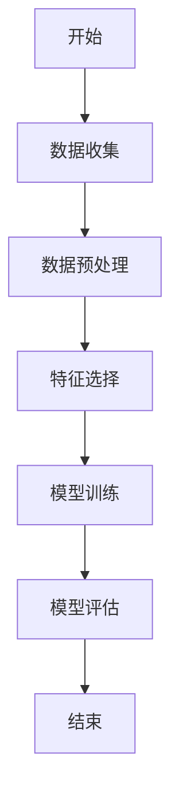

                 


# 彼得林奇如何看待公司的人才流失率

---

## 关键词：彼得·林奇，人才流失率，企业管理，员工满意度，人才管理策略，领导力

---

## 摘要

人才流失率是企业在竞争激烈的市场中面临的核心问题之一。彼得·林奇作为世界著名的企业管理者和投资者，提出了独特的见解和解决方案。本文从背景介绍、核心概念、数学模型分析、系统设计、项目实战等方面，深入探讨彼得·林奇如何看待公司的人才流失率问题，分析人才流失的原因、影响及解决策略，并结合实际案例提供可行的解决方案。

---

## 第1章：背景介绍

### 1.1 人才流失的定义与背景

人才流失率是指企业在一定时期内，员工离职的比例。高人才流失率可能导致企业生产力下降、成本增加、团队不稳定等问题。彼得·林奇从投资者和管理者的双重视角，关注人才流失对企业长期发展的潜在影响。

#### 人才流失的定义

人才流失率 = 离职员工数 / 总员工数 × 100%

#### 人才流失的背景

在现代企业中，人才流失率的高低直接影响企业的竞争力。彼得·林奇认为，人才流失不仅影响企业的短期运营，还可能对企业长期发展造成深远影响。

---

### 1.2 彼得·林奇与人才流失率的关系

彼得·林奇以其独特的管理哲学，提出了人才流失率对企业的影响及解决方案。他认为，人才流失率的高低反映了企业的管理问题，尤其是领导层的决策和企业文化建设。

---

## 第2章：人才流失的核心要素与影响因素

### 2.1 核心要素

人才流失的核心要素包括员工满意度、职业发展机会、公司文化、工作环境等。

#### 影响人才流失的因素

- 员工满意度
- 职位匹配度
- 公司文化
- 薪酬福利

### 2.2 彼得·林奇的核心观点

彼得·林奇认为，人才流失率与员工的忠诚度和职业发展机会密切相关。他强调，企业应通过优化管理、提升员工满意度和职业发展机会来降低人才流失率。

---

## 第3章：彼得·林奇的人才管理哲学

### 3.1 以人为本的管理哲学

彼得·林奇强调，企业应关注员工的个人发展和职业规划，提供良好的工作环境和薪酬福利，以提升员工的忠诚度。

### 3.2 人才流失率的数学模型

#### 基于彼得·林奇观点的数学模型

$$
\text{人才流失率} = f(\text{员工满意度}, \text{职业发展机会}, \text{公司文化})
$$

---

## 第4章：人才流失的数学模型与算法分析

### 4.1 人才流失的预测模型

#### 统计分析法

- 逻辑回归模型：用于预测员工离职的概率。
- 决策树算法：用于分类员工是否可能离职。

#### 机器学习算法

- 支持向量机（SVM）：用于分类问题。
- 随机森林：用于特征重要性分析。

### 4.2 人才流失预测的流程图



---

## 第5章：系统分析与架构设计

### 5.1 人才流失预测系统功能设计

#### 系统功能模块

- 数据采集模块：收集员工信息、离职数据。
- 数据处理模块：清洗数据，提取特征。
- 模型训练模块：训练预测模型。
- 模型评估模块：评估模型性能。

#### 系统架构图


---

## 第6章：项目实战

### 6.1 环境安装

- Python 3.8+
- Jupyter Notebook
- Scikit-learn

### 6.2 源代码实现

```python
import pandas as pd
from sklearn.model import LogisticRegression
from sklearn.metrics import accuracy_score

# 数据加载
data = pd.read_csv('employee.csv')

# 特征选择
X = data[['salary', 'job_satisfaction', 'development_opportunity']]
y = data['left']

# 模型训练
model = LogisticRegression()
model.fit(X, y)

# 模型预测
y_pred = model.predict(X)
print("准确率:", accuracy_score(y, y_pred))
```

---

## 第7章：总结与最佳实践

### 7.1 总结

彼得·林奇认为，人才流失率是企业管理中的关键指标，企业应通过优化管理、提升员工满意度和职业发展机会来降低人才流失率。

### 7.2 最佳实践

- 定期进行员工满意度调查
- 提供清晰的职业发展路径
- 建立良好的企业文化
- 加强领导层的培训

### 7.3 注意事项

- 数据隐私保护
- 模型的实时更新
- 避免过度依赖单一模型

### 7.4 拓展阅读

- 彼得·林奇的其他管理著作
- 人才流失率的行业研究

---

通过以上分析和实践，我们可以更好地理解彼得·林奇如何看待公司的人才流失率问题，并为企业提供可行的解决方案。

