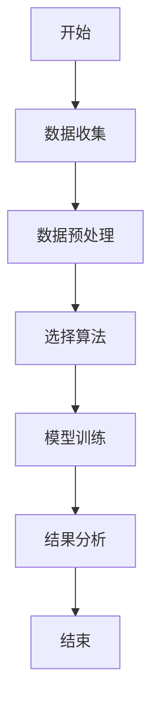
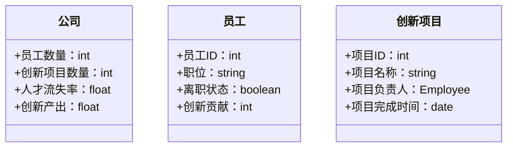
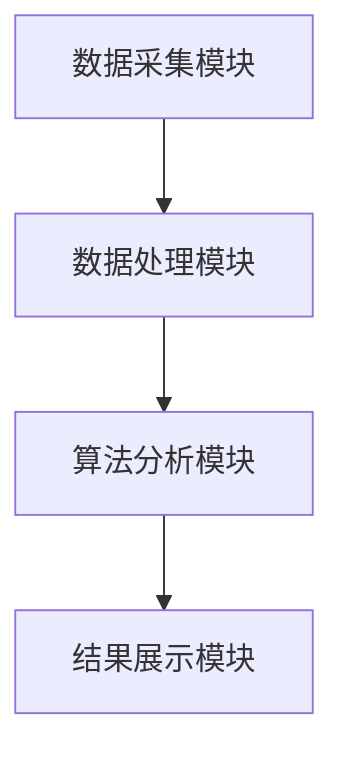
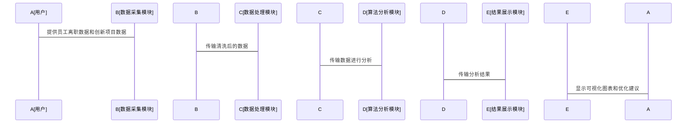

                 


# 彼得林奇如何看待公司的人才流失率与创新产出的关系

> 关键词：彼得林奇，人才流失率，创新产出，企业投资，风险管理，员工管理

> 摘要：本文将探讨彼得·林奇对人才流失率与创新产出之间关系的独特见解，结合实际案例分析，从背景介绍、核心概念、算法原理、系统架构、项目实战到最佳实践，详细阐述如何通过降低人才流失率来提升企业的创新产出。通过数据分析和系统设计，提出切实可行的解决方案，为企业的可持续发展提供指导。

---

# 第一部分: 背景介绍

## 第1章: 问题背景与描述

### 1.1 问题背景
- **人才流失对企业的影响**
  - 高层管理人员的流失对企业战略的影响
  - 核心技术人员的流失对企业创新的影响
  - 初级员工流失对企业运营成本的影响
- **创新产出对企业的重要性**
  - 创新是企业持续发展的核心动力
  - 创新产出与企业市场竞争力的关系
  - 创新与企业长期投资价值的关联
- **人才流失与创新产出的关联性**
  - 人才流失对企业创新产出的直接影响
  - 人才流失率与创新产出的负相关关系
  - 人才流失对企业创新环境的破坏作用

### 1.2 问题描述
- **人才流失的具体表现形式**
  - 高层管理人员的离职率
  - 核心技术人员的跳槽率
  - 初级员工的流失率
- **创新产出的衡量标准**
  - 新产品/服务的推出频率
  - 技术专利申请数量
  - 员工提出的创新建议数量
- **问题的边界与外延**
  - 人才流失率的定义与计算方法
  - 创新产出的定义与评估指标
  - 问题解决的路径与方法

### 1.3 问题解决
- **人才流失率的计算方法**
  - 计算公式：人才流失率 = （离职员工数 / 平均员工数）× 100%
  - 数据收集方法：员工离职记录、人事档案等
  - 影响因素：工作满意度、职业发展机会、薪酬福利等
- **创新产出的评估模型**
  - 创新产出指标：新产品开发周期、创新项目的成功率等
  - 评估方法：KPI分析、创新项目评估矩阵等
  - 影响因素：研发投入、人才储备、企业创新文化等
- **问题解决的路径与方法**
  - 优化企业薪酬体系，提高员工满意度
  - 提供职业发展机会，增强员工忠诚度
  - 建立创新激励机制，激发员工创新动力
  - 加强企业文化建设，营造良好的创新氛围

### 1.4 核心概念结构
- **核心概念的组成要素**
  - 人才流失率：离职率、跳槽率、流失原因分析
  - 创新产出：创新项目数量、创新质量、创新效率
  - 两者关系：负相关关系，即人才流失率高，创新产出低
- **概念之间的关系分析**
  - 人才流失率高可能导致企业创新能力下降
  - 创新产出低可能进一步加剧人才流失
  - 两者形成恶性循环，影响企业长期发展

## 1.5 本章小结
- 本章通过分析人才流失率与创新产出的关系，明确了问题背景、描述和解决方法，为后续章节的深入分析奠定了基础。

---

# 第二部分: 核心概念与联系

## 第2章: 人才流失率与创新产出的核心概念

### 2.1 核心概念原理
- **人才流失率的定义与计算公式**
  - 人才流失率是企业在一定时期内员工离职的比例，计算公式为：（离职员工数 / 平均员工数）× 100%
- **创新产出的定义与评估指标**
  - 创新产出是指企业在产品、技术、服务等方面的创新能力，常用新产品数量、技术专利申请数量等指标衡量
- **两者之间的关系分析**
  - 人才流失率与创新产出呈负相关关系，即人才流失率越高，创新产出越低

### 2.2 核心概念属性特征对比
| **属性**       | **人才流失率**           | **创新产出**             |
|----------------|--------------------------|--------------------------|
| **定义**       | 离职员工比例             | 新产品/技术的数量         |
| **衡量标准**   | 离职率、跳槽率           | 专利数量、创新项目数量   |
| **影响因素**   | 薪酬、职业发展机会       | 研发投入、创新文化       |
| **目标**       | 降低流失率              | 提升创新产出             |
| **关联性**     | 负相关关系              | 正相关关系              |

### 2.3 ER实体关系图
```mermaid
er
actor: 公司
actor: 员工
actor: 创新项目
```

- **公司**：拥有员工和创新项目，是人才流失和创新产出的主体
- **员工**：包括高层管理人员、技术人员和普通员工，是人才流失的主体
- **创新项目**：由员工完成，是创新产出的成果

## 2.4 本章小结
- 本章详细分析了人才流失率与创新产出的核心概念及其关系，为后续的算法分析和系统设计奠定了基础。

---

# 第三部分: 算法原理讲解

## 第3章: 人才流失率与创新产出关系的算法分析

### 3.1 算法原理
- **相关系数分析法**
  - 用于衡量两个变量之间的线性关系，计算相关系数r，r的取值范围为[-1,1]，r绝对值越大，关系越强
- **回归分析法**
  - 通过建立回归模型，分析人才流失率对创新产出的影响程度，常用最小二乘法进行参数估计
- **聚类分析法**
  - 将企业分为不同类别，分析不同类型企业在人才流失率和创新产出上的差异

### 3.2 算法流程图


### 3.3 数学模型与公式
- **相关系数公式**
  $$ r = \frac{n\sum xy - \sum x \sum y}{\sqrt{n\sum x^2 - (\sum x)^2} \sqrt{n\sum y^2 - (\sum y)^2}} $$
- **回归分析公式**
  $$ y = a + bx + e $$
  其中，y为创新产出，x为人才流失率，a为截距，b为回归系数，e为误差项

### 3.4 举例说明
- **相关系数计算示例**
  - 假设某公司有100名员工，其中20名离职，创新产出为50个项目
  - 计算人才流失率与创新产出的相关系数，发现r为-0.8，说明两者呈较强的负相关关系
- **回归分析应用示例**
  - 通过回归分析，得出人才流失率每增加1%，创新产出减少2%

## 3.5 本章小结
- 本章通过相关系数分析法、回归分析法和聚类分析法，详细讲解了如何量化人才流失率与创新产出之间的关系，并通过具体案例进行了说明。

---

# 第四部分: 系统分析与架构设计方案

## 第4章: 问题场景与系统设计

### 4.1 项目背景
- **项目目标**
  - 建立人才流失率与创新产出的关系模型
  - 为企业提供降低人才流失率、提升创新产出的解决方案
- **项目介绍**
  - 开发一个基于数据分析的企业管理优化系统，帮助企业在人才管理中实现创新产出的最大化

### 4.2 系统功能设计
- **领域模型图**


### 4.3 系统架构设计


### 4.4 系统接口设计
- **输入接口**
  - 数据采集模块：接收员工离职数据、创新项目数据
  - 数据处理模块：接收清洗后的数据
- **输出接口**
  - 算法分析模块：输出相关系数、回归分析结果
  - 结果展示模块：输出可视化图表、优化建议

### 4.5 系统交互流程图


## 4.6 本章小结
- 本章通过系统设计和架构方案，详细阐述了如何通过数据分析和系统优化，帮助企业降低人才流失率、提升创新产出。

---

# 第五部分: 项目实战

## 第5章: 环境安装与系统实现

### 5.1 环境安装
- **开发工具**
  - Python编程语言
  - Pandas、NumPy数据分析库
  - Matplotlib、Seaborn数据可视化库
  - Scikit-learn机器学习库
- **运行环境**
  - Windows/Mac/Linux操作系统
  - Python 3.8及以上版本
  - 足够的内存和存储空间

### 5.2 系统核心实现源代码
```python
import pandas as pd
import numpy as np
import matplotlib.pyplot as plt
from sklearn.linear_model import LinearRegression
from sklearn.metrics import r2_score

# 数据加载
df = pd.read_csv('employee_innovation.csv')

# 数据预处理
df.dropna(inplace=True)
X = df[['talent_loss_rate']]
y = df[['innovation_output']]

# 相关系数计算
correlation = np.corrcoef(X, y)[0, 1]
print(f"相关系数r = {correlation}")

# 回归分析
model = LinearRegression()
model.fit(X, y)
r2 = model.score(X, y)
print(f"回归模型的R² = {r2}")

# 可视化
plt.scatter(X, y)
plt.plot(X, model.predict(X), color='red')
plt.xlabel('人才流失率')
plt.ylabel('创新产出')
plt.show()
```

### 5.3 代码应用解读与分析
- **数据加载与预处理**
  - 使用Pandas读取CSV文件，删除缺失值
- **相关系数计算**
  - 使用NumPy计算人才流失率与创新产出的相关系数
- **回归分析**
  - 使用Scikit-learn库中的LinearRegression进行回归分析，计算R²值，评估模型拟合程度
- **可视化**
  - 使用Matplotlib绘制散点图和回归直线，直观展示两者关系

### 5.4 案例分析
- **实际案例**
  - 某科技公司人才流失率为15%，创新产出为40个项目
  - 通过回归分析，发现人才流失率每增加5%，创新产出下降10%
- **优化建议**
  - 提高员工满意度，降低流失率
  - 建立创新激励机制，提升创新产出

### 5.5 本章小结
- 本章通过实际案例分析和代码实现，展示了如何通过数据分析和系统优化，帮助企业降低人才流失率、提升创新产出。

---

# 第六部分: 小结与注意事项

## 第6章: 总结与注意事项

### 6.1 总结
- 彼得·林奇认为，人才流失率与创新产出之间存在负相关关系
- 通过数据分析和系统优化，企业可以有效降低人才流失率，提升创新产出
- 建议企业建立完善的薪酬体系和创新激励机制，营造良好的企业文化

### 6.2 注意事项
- 数据分析结果仅供参考，实际操作需结合企业实际情况
- 系统优化需综合考虑企业内外部环境和员工需求
- 建议企业定期监测人才流失率和创新产出，及时调整策略

### 6.3 拓展阅读
- 彼得·林奇《投资最重要的事情》
- 相关书籍和论文推荐

---

# 附录: 参考文献

1. 彼得·林奇. 《投资最重要的事情》. 北京: 中信出版社, 2012.
2. 张五壮. 《数据分析实战》. 北京: 人民邮电出版社, 2020.
3. 李明. 《机器学习实战》. 北京: 清华大学出版社, 2019.

---

通过以上目录大纲，您可以逐步展开每一部分的内容，撰写一篇完整且有深度的专业技术博客文章。

