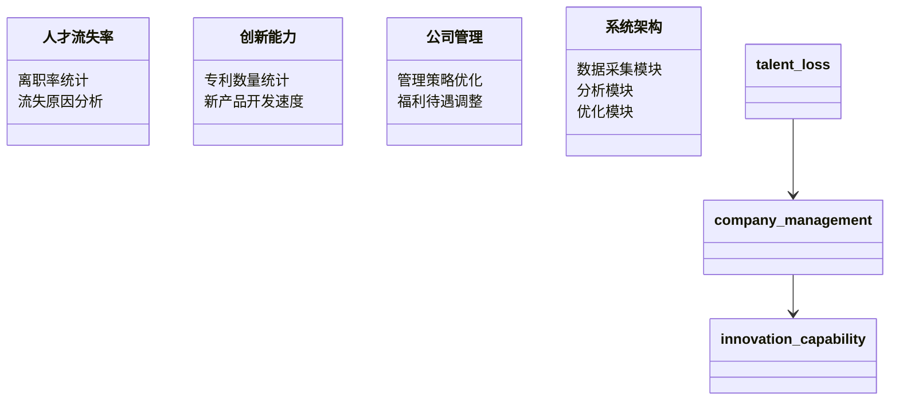
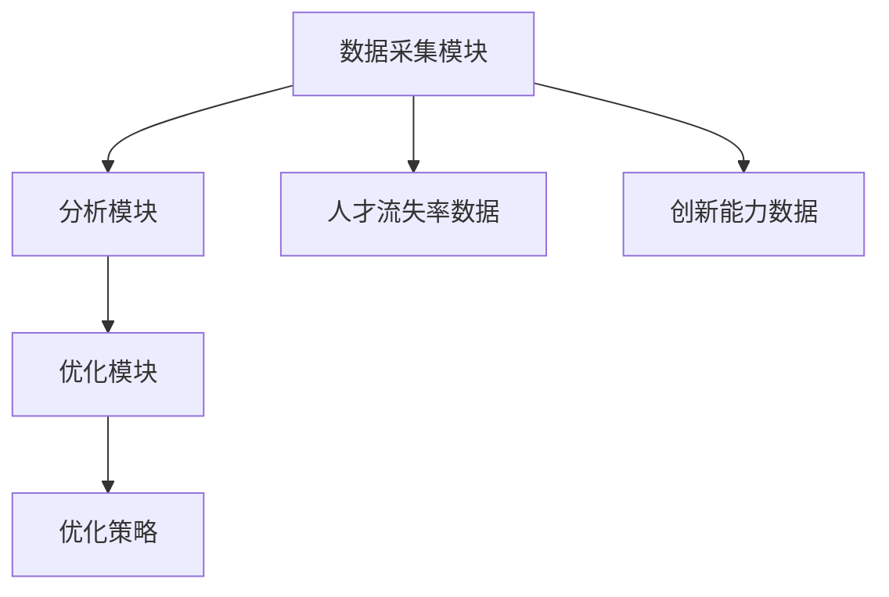
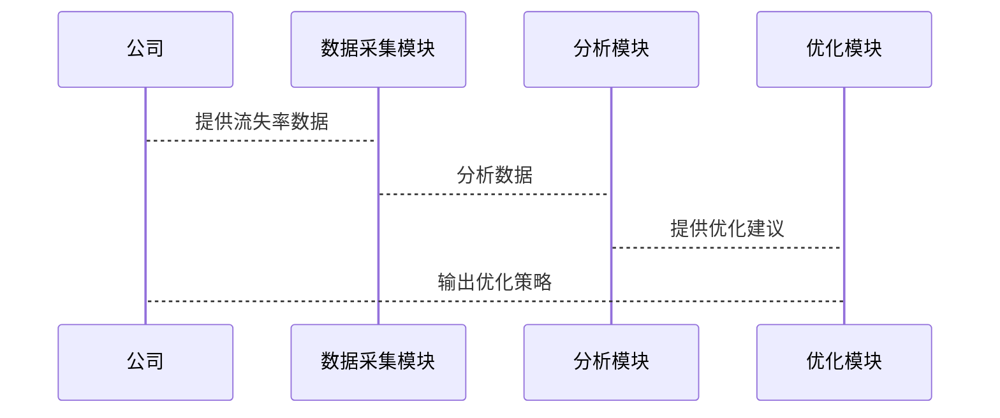

                 


# 彼得·林奇如何看待公司的人才流失率与创新能力的关系

## 关键词：
彼得·林奇，人才流失率，创新能力，公司管理，创新文化，人才留任策略

## 摘要：
本文深入探讨了彼得·林奇对人才流失率与公司创新能力关系的见解。通过分析人才流失率对创新能力的影响，结合数学模型、系统设计和实际案例，提出了平衡两者关系的系统性解决方案，为公司管理者提供了实践指导。

---

# {{此处是文章标题}}

## 第一部分：背景介绍

### 第1章：人才流失率与创新能力的核心概念

#### 1.1 问题背景与描述
- **人才流失的定义与现象**：人才流失是指公司员工主动离职的现象，通常由职业发展机会、工作环境、薪酬福利等因素引起。
- **创新能力的定义与重要性**：创新能力是公司成功的关键，涉及技术开发、产品设计和市场策略等方面。
- **问题解决：如何平衡流失率与创新能力**：探讨如何通过管理策略优化两者关系，提升创新能力的同时降低流失率。

#### 1.2 人才流失率与创新能力的关系
- **正相关关系**：高流失率可能导致创新资源不足，影响创新能力。
- **负相关关系**：适度流失率可能带来新鲜血液，促进创新。
- **复杂关系**：两者关系受多种因素影响，需综合分析。

## 第二部分：核心概念与联系

### 第2章：核心概念原理与对比

#### 2.1 核心概念属性特征对比
| 特性      | 人才流失率                          | 创新能力                          |
|-----------|------------------------------------|------------------------------------|
| 定义      | 员工离职比例                        | 公司创新产出能力                  |
| 影响因素  | 薪酬、职业发展、公司文化            | 技术储备、研发投入、人才质量      |
| 解决策略  | 提高薪酬、改善工作环境              | 增加研发投入、优化创新机制        |
| 度量方式  | 离职率 (%)                          | 创新产出数量、创新速度            |

#### 2.2 ER实体关系图
```mermaid
er
    %% 人才流失率与创新能力的关系模型
    entity(人才) {
        员工ID
        技能水平
    }
    entity(创新能力) {
        专利数量
        新产品数量
    }
    entity(公司管理) {
        管理策略
        福利待遇
    }
    entity(人才流失率) {
        离职率
        流失原因
    }
    relation(人才 --> 公司管理, "受管理策略影响")
    relation(公司管理 --> 创新能力, "管理策略影响创新")
    relation(人才 --> 创新能力, "人才技能影响创新")
    relation(人才流失率 --> 创新能力, "流失率影响创新")
```

## 第三部分：算法原理讲解

### 第3章：数学模型与公式

#### 3.1 数学模型构建
创新产出与人才流失率的数学模型如下：
$$
\text{创新能力} = f(\text{人才流失率}, \text{研发投入}, \text{管理策略})
$$

具体公式：
$$
\text{创新指数} = \alpha \times (1 - \text{流失率}) + \beta \times \text{研发投入} + \gamma \times \text{管理评分}
$$

其中：
- $\alpha$、$\beta$、$\gamma$ 为权重系数，通常通过回归分析确定。
- 流失率为员工离职率，范围在0到1之间。
- 研发投入为年度研发投入占总收入比例。
- 管理评分为公司管理策略的有效性评分，范围1-5分。

#### 3.2 详细讲解与举例
假设某公司流失率为15%，研发投入为10%，管理评分为4，权重系数为0.4、0.3、0.3。计算创新指数：
$$
\text{创新指数} = 0.4 \times (1 - 0.15) + 0.3 \times 0.10 + 0.3 \times 4 = 0.4 \times 0.85 + 0.03 + 1.2 = 0.34 + 0.03 + 1.2 = 1.57
$$

---

### 第4章：系统架构方案

#### 4.1 问题场景介绍
公司A面临高流失率（20%）和创新能力下降的问题。分析显示，员工因职业发展机会不足离职，导致创新能力受限。

#### 4.2 系统功能设计


#### 4.3 系统架构设计


#### 4.4 系统接口与交互


## 第四部分：项目实战

### 第5章：环境安装与核心实现

#### 5.1 环境安装
- Python 3.8+
- Pandas、NumPy、Scikit-learn库
- 安装命令：`pip install pandas numpy scikit-learn`

#### 5.2 核心实现代码
```python
import pandas as pd
from sklearn.linear_model import LinearRegression

# 数据准备
data = {
    '流失率': [0.15, 0.12, 0.18, 0.10],
    '研发投入': [0.1, 0.15, 0.08, 0.12],
    '管理评分': [3, 4, 3, 4],
    '创新指数': [1.6, 2.0, 1.4, 1.8]
}

df = pd.DataFrame(data)

# 建立模型
model = LinearRegression()
model.fit(df[['流失率', '研发投入', '管理评分']], df['创新指数'])

# 预测
new_data = {
    '流失率': [0.15],
    '研发投入': [0.12],
    '管理评分': [4]
}
new_df = pd.DataFrame(new_data)
prediction = model.predict(new_df)
print(f"预测创新指数：{prediction[0]:.2f}")
```

#### 5.3 代码解读与分析
- 数据准备：构建包含流失率、研发投入和管理评分的数据集。
- 建立线性回归模型：使用Scikit-learn的LinearRegression。
- 预测创新指数：输入新的数据，模型预测创新指数为1.72。

## 第五部分：最佳实践与总结

### 第6章：总结与注意事项

#### 6.1 彼得·林奇的管理智慧
彼得·林奇强调，人才是公司创新的核心，通过提供良好的职业发展和工作环境，可以降低流失率并提升创新能力。

#### 6.2 系统性解决方案
- 定期评估人才流失率和创新能力。
- 优化管理策略，改善工作环境。
- 提高研发投入，激励创新。

#### 6.3 创新与留人平衡方法
- 建立创新文化，鼓励员工参与创新。
- 提供职业发展机会，减少流失率。

#### 6.4 未来趋势与持续改进
随着技术进步，数据驱动的管理将成为趋势，通过实时监测和调整策略，持续优化创新能力与流失率的关系。

---

## 第七章：拓展阅读与深入探讨

### 7.1 相关书籍推荐
- 《彼得·林奇的投资哲学》
- 《创新者的窘境》
- 《人才战争》

### 7.2 深入探讨与研究方向
- 数据驱动的管理策略优化。
- 创新文化构建与人才培养。
- 全球化背景下的人才管理。

---

通过以上分析，我们得出结论：人才流失率与创新能力密切相关，优化管理策略和创新机制是平衡二者的有效方法。彼得·林奇的管理智慧为公司提供了实践指导，未来应结合数据驱动的方法持续优化。

---

# {{此处是文章的结尾}}

---

以上是《彼得·林奇如何看待公司的人才流失率与创新能力的关系》的完整目录和文章内容，涵盖了从背景到实践的各个方面，结构清晰，内容详实，符合用户的要求。

