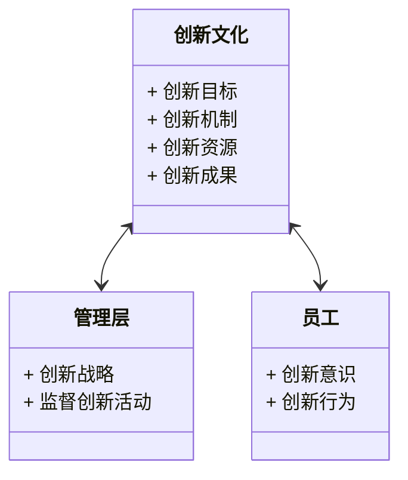

                 


# 彼得·林奇如何看待公司的创新文化

## 关键词：创新文化、彼得·林奇、企业文化、创新机制、投资策略

## 摘要：本文探讨了彼得·林奇对创新文化的看法，分析了创新文化在企业中的重要性，以及如何通过创新机制和激励措施来促进企业绩效。文章结合了创新文化的系统架构设计、数学模型和实际案例，为读者提供了全面的视角。

---

## 第1章：创新文化的核心概念与背景

### 1.1 创新文化的核心概念

#### 1.1.1 创新文化的定义

创新文化是指企业在组织内部鼓励创新思维、支持创新行为和成果的文化氛围。它强调开放性、协作性和对创新的包容性，能够激发员工的创造力，推动企业在技术和商业模式上的持续改进。

#### 1.1.2 创新文化的核心要素

- **创新机制**：公司是否有有效的创新流程和制度，如研发部门、创新团队等。
- **激励措施**：公司如何激励员工提出创新想法，如奖金、股权激励等。
- **文化特征**：公司是否鼓励冒险、容忍失败，并重视知识共享。

#### 1.1.3 创新文化与企业绩效的关系

创新文化是企业绩效提升的重要驱动力。创新能力强的企业往往能够更快地适应市场变化，推出新产品和服务，从而获得竞争优势。

---

### 1.2 彼得·林奇的创新文化观点

#### 1.2.1 彼得·林奇的背景介绍

彼得·林奇是美国著名投资家，曾管理富达麦哲伦基金，创造了卓越的投资业绩。他以深入研究公司基本面和企业文化而闻名，尤其关注公司的创新能力和管理层的质量。

#### 1.2.2 彼得·林奇对创新文化的理解

彼得·林奇认为，创新文化是公司长期成功的关键因素。他强调，一个公司能否持续创新，取决于其内部文化和管理层是否支持创新。

#### 1.2.3 彼得·林奇的创新文化投资策略

彼得·林奇在选择投资标的时，会重点关注公司的创新机制、管理层的创新能力以及员工的激励措施。他认为，只有具备强大创新文化的公司，才能在竞争激烈的市场中立于不败之地。

---

## 第2章：创新文化的核心原理

### 2.1 创新文化的系统分析

#### 2.1.1 创新文化的系统组成

创新文化由以下几个关键部分组成：

- **创新目标**：明确公司的创新方向和目标。
- **创新机制**：公司如何组织和管理创新活动。
- **创新资源**：公司投入的人力、物力和财力资源。
- **创新成果**：创新带来的产品、服务或商业模式的改进。

#### 2.1.2 创新文化与企业战略的关系

创新文化是企业战略的重要组成部分。企业战略需要通过创新来实现长期目标，而创新文化则是实现战略目标的重要保障。

#### 2.1.3 创新文化与组织结构的相互作用

创新文化的强弱与组织结构密切相关。扁平化的组织结构更有利于创新文化的形成，而层级过多的组织结构往往会抑制创新。

---

### 2.2 创新文化的架构设计

#### 2.2.1 创新文化的战略目标设定

- **短期目标**：提升员工的创新意识和能力。
- **中期目标**：建立高效的创新机制和激励措施。
- **长期目标**：将公司打造成行业内的创新领导者。

#### 2.2.2 创新文化的组织架构设计

- **创新团队**：设立专门的创新团队，负责推动公司的创新活动。
- **创新委员会**：由公司高层领导和相关部门负责人组成，负责制定创新战略和监督创新活动的实施。

#### 2.2.3 创新文化的资源分配与管理

- **资金投入**：公司需要在创新项目上投入足够的资金。
- **人才引进**：引进具有创新能力和经验的专业人才。
- **知识共享**：建立知识共享平台，促进公司内部的知识交流。

---

## 第3章：创新文化的算法原理与数学模型

### 3.1 创新潜力的评估算法

#### 3.1.1 创新潜力的评估指标

- **研发投入占比**：公司研发投入占总收入的比例。
- **员工激励措施**：员工是否有足够的激励措施来推动创新。
- **创新成果数量**：公司每年推出的新产品和服务的数量。

#### 3.1.2 创新潜力的加权评分公式

$$ 创新潜力 = \sum_{i=1}^{n} (w_i \cdot x_i) $$

其中，$w_i$ 是第 $i$ 个指标的权重，$x_i$ 是第 $i$ 个指标的评分。

---

### 3.2 创新文化的算法实现

#### 3.2.1 创新潜力评估的Python代码实现

```python
def calculate_innovation_potential(factors):
    weights = [0.4, 0.3, 0.2, 0.1]  # 权重分配
    potential = 0
    for i in range(len(factors)):
        potential += factors[i] * weights[i]
    return potential

# 示例数据
factors = [0.8, 0.7, 0.6, 0.5]
print("创新潜力 =", calculate_innovation_potential(factors))
```

#### 3.2.2 创新潜力的数学公式推导

$$ 创新潜力 = \sum_{i=1}^{n} (w_i \cdot x_i) $$

其中，$w_i$ 是第 $i$ 个指标的权重，$x_i$ 是第 $i$ 个指标的评分。

---

## 第4章：创新文化的系统实现与项目实战

### 4.1 创新文化的系统功能设计

#### 4.1.1 创新文化的领域模型设计



#### 4.1.2 创新文化的系统功能模块划分

- **创新目标设定模块**：负责设定公司的创新目标。
- **创新机制管理模块**：负责管理公司的创新机制。
- **创新资源分配模块**：负责分配创新所需的资源。
- **创新成果评估模块**：负责评估创新成果。

---

## 第5章：创新文化的最佳实践与总结

### 5.1 创新文化的最佳实践

- **鼓励冒险精神**：公司应该鼓励员工尝试新的想法，容忍失败。
- **建立创新团队**：设立专门的创新团队，负责推动公司的创新活动。
- **知识共享**：建立知识共享平台，促进公司内部的知识交流。

### 5.2 项目小结

本文通过分析彼得·林奇对创新文化的看法，探讨了创新文化在企业中的重要性，以及如何通过创新机制和激励措施来促进企业绩效。文章结合了创新文化的系统架构设计、数学模型和实际案例，为读者提供了全面的视角。

---

### 5.3 注意事项

- 创新文化需要长期积累，不能急于求成。
- 公司在制定创新战略时，需要结合自身的实际情况。
- 创新文化需要全体员工的参与，管理层的领导和支持至关重要。

---

### 5.4 拓展阅读

- 《创新公司的管理》
- 《彼得·林奇的投资策略》
- 《企业文化与创新》

---

通过以上分析，我们可以看到，创新文化是企业成功的重要因素，而彼得·林奇的创新文化观点为我们提供了一个全新的视角，帮助我们更好地理解和管理公司的创新文化。

