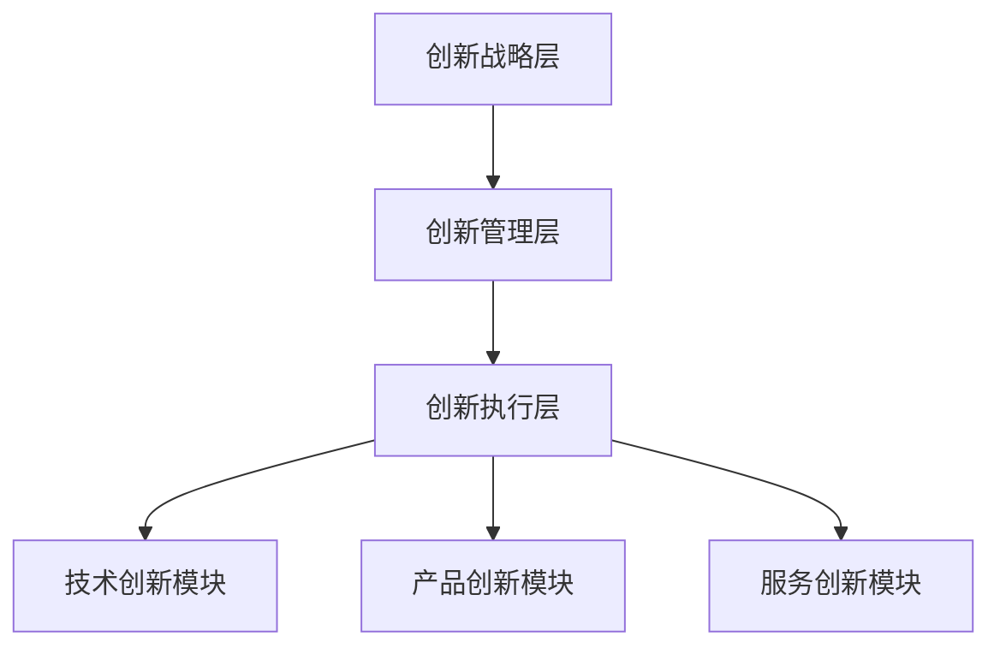
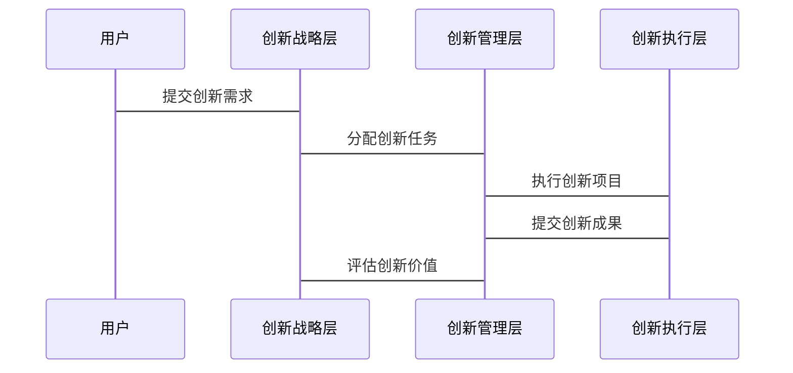

                 


# 彼得林奇如何看待公司的创新能力

> 关键词：彼得林奇，公司创新能力，创新类型，创新结构，创新动力，创新阻力，创新机会，创新价值，创新系统，创新项目，创新总结

> 摘要：本文从彼得·林奇的视角出发，探讨公司创新能力的核心概念、类型、动力与阻力、机会识别与价值评估、系统分析与设计、项目实战案例以及总结与展望。通过详细分析，帮助读者理解如何通过创新提升企业竞争力，应对市场变化和挑战。

---

## 第一部分：公司创新能力的背景与意义

### 第1章：公司创新能力的定义与重要性

#### 1.1 创新能力的核心概念

创新是指通过引入新的思想、方法、技术或产品，以满足市场需求或解决现有问题的过程。公司创新能力是企业在市场中保持竞争力的关键能力，涉及技术创新、产品创新、服务创新和商业模式创新等多个方面。

- **创新的定义**：创新不仅仅是产品的改进，还包括流程优化、管理方式变革等多方面的突破。
- **创新的重要性**：创新能力决定了企业能否在快速变化的市场中生存和发展，是企业核心竞争力的源泉。
- **创新能力的构成要素**：包括技术能力、研发能力、市场敏感度、组织灵活性等。

#### 1.2 创新能力的背景与意义

随着科技的飞速发展和市场竞争的加剧，企业的创新能力变得尤为重要。创新不仅是企业应对竞争的手段，更是企业持续增长的动力源泉。

- **商业环境的变化**：市场需求多样化、技术更新换代快、竞争对手不断涌现，这些都要求企业具备快速创新的能力。
- **创新能力的价值**：创新能够带来新的市场机会，提高企业的利润率，增强客户忠诚度，同时在技术、产品或服务上形成差异化优势。
- **可持续发展**：创新是企业实现可持续发展的关键，通过创新优化资源利用，减少环境影响，提升企业的社会责任感。

#### 1.3 创新能力的评估与价值

评估创新能力需要从多个维度进行，包括创新的频率、创新的成功率、创新的影响力等。

- **评估维度**：
  - 创新投入：企业在研发、培训等方面的投入。
  - 创新产出：新产品数量、专利申请数量等。
  - 创新效果：创新对企业收入、利润和市场份额的影响。
- **创新的价值**：创新不仅带来经济收益，还能提升企业的品牌形象和市场地位，增强员工的创造力和凝聚力。

#### 1.4 创新能力的误区与常见问题

在追求创新能力的过程中，企业常常陷入一些误区，如过度追求技术而忽视市场需求，或者创新资源分配不合理等。

- **误区**：
  - 过度关注技术，忽视市场需求。
  - 创新投入不足，导致创新能力薄弱。
  - 创新成果难以商业化，无法产生实际价值。
- **常见问题**：
  - 创新团队缺乏协作，导致创新效率低下。
  - 创新文化未建立，员工缺乏创新动力。
  - 创新风险评估不足，导致创新失败。

---

### 第2章：创新类型与创新结构

#### 2.1 创新类型的分类

创新可以分为多种类型，每种类型都有其独特的特点和适用场景。

- **技术创新**：通过引入新技术或改进现有技术，提升产品的性能或降低成本。
- **产品创新**：开发新产品或改进现有产品，以满足市场需求。
- **服务创新**：优化服务流程，提升客户体验。
- **商业模式创新**：改变企业的盈利模式，如订阅制、免费增值模式等。

#### 2.2 创新结构的分析

创新结构是指企业内部创新活动的组织方式和管理流程。

- **创新结构的层次划分**：
  - 顶层：战略层面，制定创新方向和目标。
  - 中层：管理层面，负责创新项目的实施和协调。
  - 底层：执行层面，具体执行创新任务。
- **创新结构的相互关系**：战略层为创新提供方向，管理层确保资源支持，执行层负责具体实施，三者相互协作，共同推动创新。

#### 2.3 创新类型与企业发展的关系

不同类型的创新对企业发展的影响也不同，企业需要根据自身情况选择合适的创新类型。

- **技术创新对企业的影响**：技术创新通常需要较高的研发投入，但能够带来长期的技术优势。
- **产品创新对企业的影响**：产品创新能够快速满足市场需求，提升市场份额。
- **服务创新对企业的影响**：服务创新能够提升客户满意度，增强客户忠诚度。
- **商业模式创新对企业的影响**：商业模式创新能够改变企业的盈利方式，提升整体盈利能力。

---

### 第3章：创新动力与创新阻力

#### 3.1 创新动力的来源

创新动力是指推动企业进行创新的各种内外部因素。

- **市场需求的变化**：消费者需求的变化促使企业不断创新以满足市场需求。
- **技术进步的推动**：技术的发展为企业的创新提供了新的可能性。
- **企业内部激励机制**：通过奖励机制激励员工提出创新想法。
- **竞争压力的驱动**：竞争对手的创新活动迫使企业加快创新步伐。

#### 3.2 创新阻力的分析

创新阻力是指阻碍企业进行创新的各种因素。

- **企业内部的组织惯性**：企业长期形成的固定模式和思维方式阻碍创新。
- **资源限制与成本问题**：资金、技术、人才等资源的不足限制了创新活动。
- **创新风险与不确定性**：创新活动存在失败的可能，企业需要承担一定的风险。
- **员工认知与文化障碍**：员工缺乏创新意识或企业文化不支持创新。

#### 3.3 如何克服创新阻力

克服创新阻力需要企业从组织结构、文化氛围、资源分配等多个方面进行调整。

- **建立创新文化**：鼓励员工提出创新想法，营造开放、包容的企业文化。
- **优化组织结构**：设立专门的创新部门，协调不同部门的创新活动。
- **提高员工创新能力**：通过培训和学习提升员工的创新意识和能力。
- **创新风险管理策略**：建立风险评估机制，制定应对措施，降低创新失败的风险。

---

### 第4章：创新机会识别与创新价值评估

#### 4.1 创新机会的识别方法

识别创新机会需要企业深入分析市场、技术、竞争对手和自身资源。

- **市场需求分析**：通过市场调研了解消费者需求的变化趋势。
- **技术发展趋势**：关注前沿技术的发展，寻找技术突破点。
- **竞争对手分析**：研究竞争对手的创新动向，寻找市场空白。
- **企业自身资源评估**：评估企业的技术、资金、人才等资源，确定创新方向。

#### 4.2 创新价值的评估模型

创新价值评估是确定创新项目是否值得投资的重要步骤。

- **价值评估的维度**：
  - 经济价值：创新项目对企业的收入和利润的贡献。
  - 社会价值：创新项目对社会发展的促进作用。
  - 竞争价值：创新项目在市场中的竞争优势。
- **价值评估的关键指标**：
  - 投资回报率（ROI）：创新项目的投资与收益的比率。
  - 市场占有率：创新项目在市场中的份额。
  - 创新周期：从创新到商业化的时间长度。

#### 4.3 创新价值的数学模型

创新价值评估可以采用多种数学模型，如净现值（NPV）模型。

- **净现值模型**：
  - 公式：NPV = ∑ (现金流入现值) - 初始投资
  - 说明：通过计算创新项目未来现金流的现值，与初始投资进行比较，判断项目的可行性。

#### 4.4 创新机会的案例分析

通过具体案例分析，说明如何识别创新机会和评估创新价值。

- **案例**：某科技公司通过市场调研发现消费者对智能设备的需求，决定开发一款智能手表。通过技术分析，公司选择采用最新的传感器技术，最终产品成功推向市场，提高了公司的市场份额和品牌形象。

---

## 第五章：创新系统的分析与设计

### 5.1 创新系统的分析

创新系统是指支持企业创新活动的组织结构、流程和工具。

- **系统功能设计**：
  - 确定创新目标和方向。
  - 制定创新策略和计划。
  - 组织和协调创新活动。
  - 监控和评估创新成果。
- **系统架构设计**：
  - 分层架构：战略层、管理层、执行层。
  - 模块化设计：技术创新模块、产品创新模块、服务创新模块等。

### 5.2 创新系统的架构设计

使用Mermaid图描述创新系统的架构。



### 5.3 创新系统的接口设计

创新系统需要与企业其他系统进行交互，确保信息的流通和资源的协调。

- **接口设计**：
  - 与市场部门接口：获取市场需求信息。
  - 与技术部门接口：协调技术创新活动。
  - 与财务部门接口：评估创新项目的经济价值。

### 5.4 创新系统的交互设计

使用Mermaid图描述创新系统的交互流程。



---

## 第六章：项目实战与案例分析

### 6.1 环境安装

为了进行创新项目分析，首先需要建立一个完整的创新管理系统，包括市场分析模块、技术分析模块、项目管理模块等。

### 6.2 系统核心实现源代码

以下是一个创新项目管理系统的简化代码示例：

```python
class InnovationProject:
    def __init__(self, name, type, budget):
        self.name = name
        self.type = type  # 可以是技术、产品、服务等
        self.budget = budget
        self.progress = 0

    def update_progress(self, new_progress):
        self.progress = new_progress

class InnovationManager:
    def __init__(self):
        self.projects = []

    def add_project(self, project):
        self.projects.append(project)

    def assess_project_value(self, project):
        # 简单的价值评估模型，可以根据实际情况扩展
        return project.progress * project.budget * 0.01
```

### 6.3 代码应用解读与分析

上述代码定义了一个创新项目的类和一个创新经理的类。创新经理可以管理多个创新项目，并评估项目的价值。通过这种方法，企业可以系统地管理创新活动，确保创新项目顺利进行。

### 6.4 实际案例分析

以某互联网公司为例，该公司通过建立创新管理系统，成功推出了一款新产品，显著提升了市场占有率。

### 6.5 项目小结

通过项目实战，企业可以更好地理解创新系统的运作方式，优化创新流程，提升创新能力。

---

## 第七章：总结与展望

### 7.1 创新能力的总结

- **核心总结**：创新能力是企业核心竞争力的重要组成部分，能够帮助企业应对市场变化和竞争压力。
- **彼得林奇的观点**：彼得·林奇认为，创新能力是企业长期成功的关键，企业需要不断进行创新，才能在市场中立于不败之地。

### 7.2 创新的未来展望

随着科技的不断进步和市场的进一步变化，创新将继续成为企业发展的核心动力。未来，企业需要更加注重创新能力的培养，建立完善的创新体系，以应对更加复杂和激烈的市场竞争。

### 7.3 创新能力的未来发展

- **技术驱动创新**：人工智能、大数据等技术将推动创新进入新的阶段。
- **全球化创新**：企业需要在全球范围内寻找创新机会，建立全球化的创新网络。
- **可持续创新**：绿色技术、循环经济等将成为创新的重要方向，企业需要在创新中融入可持续发展的理念。

---

## 参考文献

1. 彼得·林奇：《彼得·林奇的投资策略》
2. 克里斯·阿吉里斯：《创新管理》
3. 约瑟夫·熊彼特：《创新理论》

---

通过以上内容，我们可以看到，彼得·林奇高度重视公司的创新能力，认为这是企业持续发展的关键。企业需要从多个方面提升创新能力，包括技术创新、产品创新、服务创新和商业模式创新，同时克服创新阻力，识别创新机会，建立完善的创新系统，才能在激烈的市场竞争中立于不败之地。

