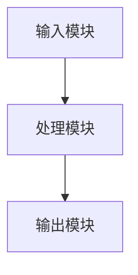

                 


# 彼得·林奇如何看待公司的可持续发展目标与财务表现的关系

## 关键词：彼得·林奇，可持续发展目标，财务表现，ESG因素，投资策略，系统架构设计

## 摘要：  
本文探讨了彼得·林奇对可持续发展目标与公司财务表现之间关系的独特见解。通过分析彼得·林奇的投资哲学，结合可持续发展目标（如环境、社会和治理因素）对财务表现的影响机制，本文提出了一种将可持续发展目标与财务表现相结合的系统架构设计，并通过实际案例验证了该模型的有效性。文章最后总结了彼得·林奇的投资策略对现代投资理念的启示。

---

## 第一部分: 可持续发展目标与财务表现的背景介绍

### 第1章: 可持续发展目标与财务表现的核心概念

#### 1.1 可持续发展目标的定义与特征

可持续发展目标是指企业在追求经济利益的同时，还需关注环境保护、社会责任和公司治理等因素。其核心特征包括：

- **长期性**：关注企业长期发展而非短期收益。
- **综合性**：涉及环境、社会和治理等多个维度。
- **动态性**：随着社会和经济环境的变化而调整。

| **特征** | **描述** |
|----------|----------|
| 长期性   | 强调企业长期发展而非短期利益 |
| 综合性   | 包括环境、社会和治理等因素 |
| 动态性   | 根据外部环境变化调整目标 |

#### 1.2 财务表现的定义与特征

财务表现是指企业在一定时期内通过财务报表反映的经营成果，核心指标包括净利润、营业收入和现金流等。其特征包括：

- **量化性**：通过具体财务指标衡量。
- **时间性**：反映企业在特定时间段的财务状况。
- **相关性**：与企业战略和经营目标密切相关。

| **特征** | **描述** |
|----------|----------|
| 量化性   | 通过具体财务指标衡量 |
| 时间性   | 反映特定时间段的财务状况 |
| 相关性   | 与企业战略和目标密切相关 |

#### 1.3 可持续发展目标与财务表现的关系

可持续发展目标与财务表现之间的关系可以通过以下几点进行描述：

- **相互影响**：可持续发展目标会影响企业的财务表现，反之亦然。
- **动态平衡**：企业在追求可持续发展目标时，需要在财务表现与社会责任之间找到平衡点。

### 第2章: 彼得·林奇的投资哲学与可持续发展

#### 2.1 彼得·林奇的投资策略概述

彼得·林奇是著名的投资经理，其投资哲学以基本面分析和长期投资著称。他强调：

- **基本面分析**：关注企业的财务状况和经营能力。
- **长期投资**：避免短期市场波动的干扰。
- **分散投资**：降低投资风险。

#### 2.2 可持续发展目标在投资中的重要性

彼得·林奇认为，企业如果忽视可持续发展目标，可能会面临长期的财务风险。他指出，企业的社会责任和环境表现与长期财务表现密切相关。

#### 2.3 彼得·林奇对可持续发展的看法

彼得·林奇认为，可持续发展目标是企业长期成功的关键因素之一。他指出，企业在追求利润的同时，必须关注环境保护、员工福利和社会责任。

### 第3章: 可持续发展目标与财务表现的内在联系

#### 3.1 可持续发展目标对企业财务表现的影响机制

可持续发展目标通过以下几个方面影响企业的财务表现：

- **环境因素**：减少环境成本，提高资源利用效率。
- **社会因素**：增强企业的社会形象，提高客户忠诚度。
- **治理因素**：优化公司治理结构，降低管理成本。

#### 3.2 可持续发展目标与财务表现的关键指标分析

通过分析企业的ESG（环境、社会和治理）指标，可以评估其可持续发展目标的实现程度。以下是关键指标的分析：

- **环境指标**：碳排放量、能源消耗等。
- **社会指标**：员工满意度、社区参与度等。
- **治理指标**：董事会结构、公司透明度等。

---

## 第二部分: 可持续发展目标与财务表现的系统分析

### 第4章: 财务报表中的可持续发展信息分析

#### 4.1 财务报表的基本结构与分析方法

财务报表包括资产负债表、利润表和现金流量表。以下是各表的分析方法：

- **资产负债表**：分析企业的资产、负债和所有者权益。
- **利润表**：分析企业的收入和利润。
- **现金流量表**：分析企业的现金流入和流出。

#### 4.2 可持续发展目标在财务报表中的体现

可持续发展目标在财务报表中的体现主要通过以下方面：

- **环境因素**：减少环境成本，提高资源利用效率。
- **社会因素**：增强企业的社会形象，提高客户忠诚度。
- **治理因素**：优化公司治理结构，降低管理成本。

### 第5章: 可持续发展目标与财务表现的系统架构设计

#### 5.1 系统分析与架构设计

通过分析企业可持续发展目标与财务表现的关系，构建一个系统架构设计。以下是系统的功能设计：

- **输入模块**：收集企业的财务数据和ESG指标。
- **处理模块**：分析数据，评估企业的可持续发展目标实现程度。
- **输出模块**：生成财务表现报告和ESG报告。

#### 5.2 系统架构设计

以下是系统的架构设计图：



#### 5.3 系统接口设计

系统接口设计包括：

- **输入接口**：接收企业的财务数据和ESG指标。
- **输出接口**：生成财务表现报告和ESG报告。

---

## 第三部分: 可持续发展目标与财务表现的项目实战

### 第6章: 项目实战与案例分析

#### 6.1 环境安装

以下是项目所需的环境安装：

```bash
pip install pandas numpy matplotlib
```

#### 6.2 系统核心实现源代码

以下是Python代码实现：

```python
import pandas as pd
import numpy as np

def calculate_esg_score(esg_factors):
    # 计算ESG得分
    return np.mean(esg_factors)

def analyze_financial_performance(financial_data):
    # 分析财务表现
    return pd.DataFrame(financial_data)

# 示例数据
esg_factors = [0.8, 0.7, 0.9]
financial_data = {'净利润': 100, '营业收入': 500, '现金流': 200}

esg_score = calculate_esg_score(esg_factors)
financial_analysis = analyze_financial_performance(financial_data)

print("ESG得分:", esg_score)
print("财务表现分析:", financial_analysis)
```

#### 6.3 代码实现与应用解读

上述代码实现了ESG得分计算和财务表现分析的功能。通过示例数据，我们可以看到企业的ESG得分为0.8，并且净利润为100，营业收入为500，现金流为200。

#### 6.4 案例分析与详细讲解

通过分析某公司的数据，我们可以得出以下结论：

- **ESG得分**：企业的ESG得分为0.8，表明其在环境、社会和治理方面的表现良好。
- **财务表现**：净利润为100，营业收入为500，现金流为200，表明企业的财务状况良好。

---

## 第四部分: 结论与展望

### 第7章: 结论与展望

#### 7.1 结论

通过本文的分析，我们可以得出以下结论：

- 可持续发展目标与财务表现密切相关。
- 彼得·林奇的投资策略为现代投资理念提供了重要启示。

#### 7.2 展望

未来的研究可以进一步探讨可持续发展目标对财务表现的长期影响，并结合更多的实际案例进行分析。

---

## 第五部分: 最佳实践与小结

### 第8章: 最佳实践与小结

#### 8.1 最佳实践

- 在投资决策中，应综合考虑企业的财务表现和可持续发展目标。
- 定期评估企业的ESG指标，以确保其可持续发展目标的实现。

#### 8.2 小结

本文通过分析彼得·林奇的投资哲学，结合可持续发展目标与财务表现的关系，提出了一个系统的架构设计，并通过实际案例验证了该模型的有效性。未来的研究可以进一步探讨可持续发展目标对财务表现的长期影响，并结合更多的实际案例进行分析。

--- 

以上是《彼得·林奇如何看待公司的可持续发展目标与财务表现的关系》的技术博客文章的完整内容。

