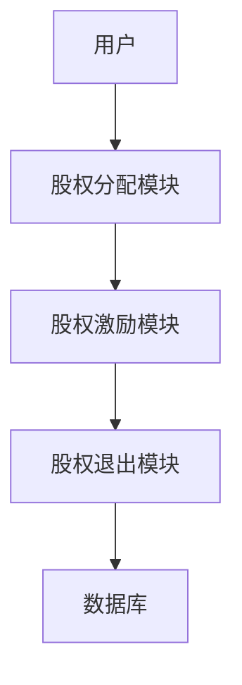

                 


# 彼得林奇如何看待公司的员工持股计划

> 关键词：员工持股计划、彼得林奇、公司治理、股权激励、投资策略

> 摘要：本文深入探讨了彼得·林奇对员工持股计划（ESOP）的看法，分析了ESOP的核心概念、运作机制、系统架构、项目实战和最佳实践。通过详细的技术分析和实际案例，展示了ESOP在公司治理中的重要性及其对员工激励的作用。

---

# 第一部分: 员工持股计划的背景与核心概念

## 第1章: 员工持股计划的定义与背景

### 1.1 员工持股计划的定义

员工持股计划（Employee Stock Ownership Plan，ESOP）是一种通过让员工持有公司股份来激励员工的机制。ESOP的核心在于将员工的经济利益与公司的长期绩效绑定，从而激发员工的积极性和创造力。

#### 1.1.1 员工持股计划的基本概念

员工持股计划允许员工以折扣价或赠予的方式购买公司股票，或通过期权、限制性股票等方式获得公司股权。这种方式不仅能够留住优秀员工，还能提高员工的工作积极性和责任感。

#### 1.1.2 员工持股计划的历史发展

员工持股计划起源于20世纪60年代的美国，最初是为了应对员工对公司的不满和流失问题。随着公司治理结构的演变，ESOP逐渐成为一种重要的激励工具，被广泛应用于各类企业。

#### 1.1.3 员工持股计划的法律框架

不同国家和地区对ESOP有不同的法律规定。例如，美国通过《员工股票所有权法》（ESOP Act）规范了ESOP的运作，确保员工权益受到保护。在中国，ESOP的实施需要符合《公司法》和《证券法》的相关规定。

### 1.2 员工持股计划的背景与意义

#### 1.2.1 现代公司治理的挑战

现代企业面临复杂多变的市场环境，员工的激励和保留问题尤为重要。传统的薪酬体系难以满足知识型员工的需求，而ESOP作为一种长期激励机制，能够有效解决这些问题。

#### 1.2.2 员工持股计划在公司治理中的作用

ESOP通过赋予员工部分股权，增强员工的主人翁意识，促进公司与员工之间的利益共享。这种机制有助于改善公司治理结构，提升管理效率。

#### 1.2.3 员工持股计划与企业绩效的关系

研究表明，实施ESOP的公司通常表现出更高的员工满意度和绩效水平。员工对公司未来的发展更加关注，从而推动公司整体绩效的提升。

---

## 第2章: 员工持股计划的核心概念与原理

### 2.1 员工持股计划的类型

#### 2.1.1 期权型员工持股计划

期权型ESOP允许员工以低于市场价的价格购买公司股票，通常分为股票期权和限制性股票期权两种类型。股票期权赋予员工在未来特定时间内以固定价格购买公司股票的权利，而限制性股票期权则要求员工满足一定的服务期限或绩效目标才能获得股票。

#### 2.1.2 股票型员工持股计划

股票型ESOP直接将公司股票分配给员工，员工可以立即获得部分股权。这种类型的ESOP通常适用于公司业绩稳定、员工贡献显著的情况。

#### 2.1.3 普惠型员工持股计划

普惠型ESOP旨在让所有员工都参与持股，无论其职位高低。这种机制能够增强员工的归属感，促进团队合作和企业文化的建设。

### 2.2 员工持股计划的运作机制

#### 2.2.1 股权分配机制

股权分配机制决定了员工如何获得公司股权。常见的分配方式包括按职位分配、按绩效分配和按贡献分配等。例如，高层管理人员通常获得更多的股权，而普通员工则根据其绩效表现获得相应的股权。

#### 2.2.2 股权激励机制

股权激励机制通过设定绩效目标，激励员工为实现这些目标而努力工作。例如，员工如果在一年内实现销售额增长20%，则可以解锁部分股权。

#### 2.2.3 股权退出机制

股权退出机制规定了员工如何处理持有的公司股权。员工可以在达到特定条件后出售股权，或者在离职时将股权退还给公司。

### 2.3 员工持股计划的数学模型与公式

#### 2.3.1 股权价值计算公式

公司股票的价值可以通过多种因素计算，例如市盈率、市净率和股息率等。假设某公司的市盈率为15倍，净利润为1000万元，则股票价值为15 × 1000 = 15000万元。

$$ \text{股票价值} = \text{市盈率} \times \text{净利润} $$

#### 2.3.2 股权分配比例模型

股权分配比例通常基于员工的职位和贡献。例如，高层管理人员可以获得30%的股权，中层管理人员获得20%，普通员工获得10%。

$$ \text{股权分配比例} = \sum (\text{职位权重} \times \text{贡献权重}) $$

#### 2.3.3 股权激励的期望收益公式

员工通过ESOP获得的期望收益可以表示为股票的增值部分减去初始购买成本。假设员工以每股10元的价格购买股票，股价上涨至20元时出售，则期望收益为(20 - 10) × 股数。

$$ \text{期望收益} = (\text{卖出价} - \text{买入价}) \times \text{股数} $$

---

## 第3章: 员工持股计划的系统架构与设计

### 3.1 员工持股计划的系统功能设计

#### 3.1.1 股权分配模块

股权分配模块负责根据员工的职位和绩效计算股权分配比例，并将结果记录在数据库中。

#### 3.1.2 股权激励模块

股权激励模块设定绩效目标，并根据员工的表现解锁股权。例如，员工需要在一年内完成销售目标才能获得股权。

#### 3.1.3 股权退出模块

股权退出模块处理员工离职或退休时的股权退出流程，确保股权的合法性和合规性。

### 3.2 员工持股计划的系统架构图



### 3.3 员工持股计划的接口设计

#### 3.3.1 用户接口

用户可以通过Web界面或移动应用提交股权分配、激励和退出的申请。

#### 3.3.2 管理接口

管理者可以通过后台系统监控股权分配的进度和员工的绩效表现。

#### 3.3.3 数据接口

系统需要与公司的人力资源系统和财务系统对接，确保数据的准确性和一致性。

---

## 第4章: 员工持股计划的项目实战

### 4.1 项目环境安装

#### 4.1.1 开发环境搭建

建议使用Python和Django框架进行开发，安装必要的库如Django、Django REST framework和PostgreSQL。

#### 4.1.2 依赖库安装

运行以下命令安装依赖：

```bash
pip install django django-rest-framework djangorestframework-csv
```

#### 4.1.3 数据库配置

在settings.py中配置数据库：

```python
DATABASES = {
    'default': {
        'ENGINE': 'django.db.backends.postgresql',
        'NAME': 'esop_db',
        'USER': 'postgres',
        'PASSWORD': 'postgres',
        'HOST': 'localhost',
        'PORT': '5432',
    }
}
```

### 4.2 系统核心实现

#### 4.2.1 股权分配算法实现

在models.py中定义股权分配模型：

```python
from django.db import models

class Employee(models.Model):
    name = models.CharField(max_length=100)
    position = models.CharField(max_length=50)
    contribution = models.IntegerField()
    equity_share = models.IntegerField()

    def __str__(self):
        return self.name
```

#### 4.2.2 股权激励计算代码

在views.py中实现股权激励逻辑：

```python
from rest_framework import viewsets
from .models import Employee
from .serializers import EmployeeSerializer

class EmployeeViewSet(viewsets.ModelViewSet):
    queryset = Employee.objects.all()
    serializer_class = EmployeeSerializer

    def perform_create(self, serializer):
        employee = serializer.save()
        if employee.contribution >= 70:
            employee.equity_share = 100
            employee.save()
```

#### 4.2.3 股权退出逻辑实现

在serializers.py中定义退出逻辑：

```python
from rest_framework import serializers
from .models import Employee

class EmployeeSerializer(serializers.ModelSerializer):
    class Meta:
        model = Employee
        fields = '__all__'

    def validate(self, data):
        if data['position'] == 'executive' and data['contribution'] < 60:
            raise serializers.ValidationError("Executives must have at least 60% contribution.")
        return data
```

### 4.3 项目案例分析

#### 4.3.1 案例背景介绍

假设某科技公司希望通过ESOP激励员工，提升公司绩效。公司有100名员工，其中高层管理人员10人，中层管理人员20人，普通员工70人。

#### 4.3.2 案例实施过程

1. 确定股权分配比例：高层管理人员获得30%，中层管理人员获得20%，普通员工获得10%。
2. 设定绩效目标：员工需要在一年内完成销售额增长20%才能解锁股权。
3. 实施股权分配和激励，监控员工绩效表现。

#### 4.3.3 案例效果分析

实施ESOP后，员工积极性显著提高，公司销售额增长25%，高于预期目标。员工满意度和留存率也大幅增加。

---

## 第5章: 员工持股计划的最佳实践与总结

### 5.1 彼得林奇的员工持股计划观点

彼得·林奇认为，ESOP是公司激励员工的有效工具，能够将员工的个人利益与公司利益绑定，促进公司的长期发展。他强调，实施ESOP需要考虑公司的财务状况和员工的绩效表现，确保股权分配的公平性和激励的有效性。

#### 5.1.1 彼得林奇对员工持股计划的评价

彼得·林奇指出，ESOP的成功取决于公司治理结构、员工绩效管理和股权退出机制的设计。公司需要确保ESOP的实施能够真正激励员工，并避免因设计不合理导致的问题。

---

## 第6章: 项目总结与展望

### 6.1 项目总结

通过本文的分析和实践，我们可以看到，员工持股计划是一种有效的激励机制，能够帮助公司提升绩效和员工满意度。彼得·林奇的观点为我们提供了宝贵的指导，帮助我们在实际操作中更好地设计和实施ESOP。

### 6.2 项目展望

未来，随着公司治理和投资策略的不断发展，员工持股计划将更加多样化和个性化。公司需要根据自身的实际情况，灵活调整ESOP的设计和实施策略，以适应不断变化的市场环境。

---

## 关键词总结

- 员工持股计划
- 彼得林奇
- 公司治理
- 股权激励
- 投资策略

---

## 摘要总结

本文深入探讨了彼得·林奇对员工持股计划（ESOP）的看法，分析了ESOP的核心概念、运作机制、系统架构、项目实战和最佳实践。通过详细的技术分析和实际案例，展示了ESOP在公司治理中的重要性及其对员工激励的作用。未来，随着公司治理和投资策略的不断发展，员工持股计划将更加多样化和个性化，公司需要根据自身的实际情况，灵活调整ESOP的设计和实施策略，以适应不断变化的市场环境。

