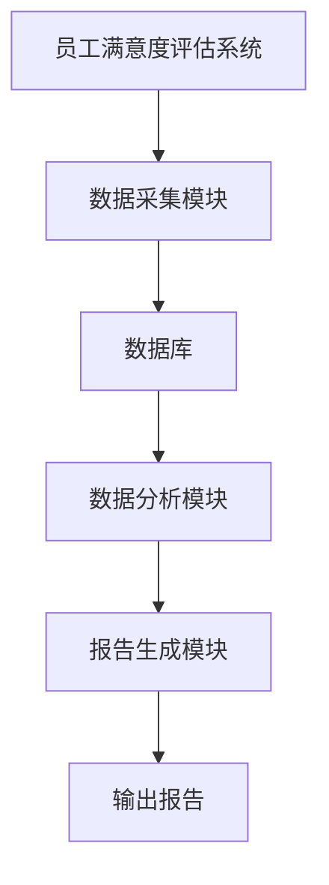

                 


# 彼得林奇如何看待公司的员工满意度

> 关键词：彼得·林奇，员工满意度，企业绩效，投资决策，管理策略

> 摘要：本文从彼得·林奇的投资哲学出发，分析员工满意度对公司价值的影响。通过理论分析、数学建模和实际案例，探讨员工满意度如何反映公司管理质量、员工忠诚度和长期发展潜力。结合系统架构设计，提出基于员工满意度的企业评估方法，为投资者和管理者提供实用的决策参考。

---

# 第一部分：员工满意度的定义与核心概念

## 第1章：员工满意度的定义与核心概念

### 1.1 员工满意度的定义与内涵

员工满意度是指员工对其工作环境、薪酬福利、职业发展等方面满足程度的主观评价。彼得·林奇认为，员工满意度是衡量公司管理质量的重要指标，高满意度通常意味着员工对公司有更强的归属感和积极性，从而推动公司绩效的提升。

- **员工满意度的核心内涵**：
  - 工作环境：舒适性、安全性、团队协作氛围。
  - 薪酬福利：薪资水平、福利保障、奖金激励。
  - 职业发展：晋升机会、培训资源、职业规划。
  - 管理风格：领导风格、沟通效率、决策透明度。

### 1.2 彼得·林奇对员工满意度的重视

彼得·林奇在其投资哲学中强调，员工满意度是公司长期价值的重要体现。他认为，员工是公司最重要的资产，员工的满意度直接影响公司的创新能力和抗风险能力。

- **彼得·林奇的员工满意度观**：
  - 高满意度员工通常更忠诚，工作效率更高。
  - 低满意度员工可能导致高 turnover，增加管理成本。
  - 员工满意度是公司文化健康与否的晴雨表。

### 1.3 员工满意度的核心要素

以下是影响员工满意度的关键要素：

| 要素 | 描述 |
|------|------|
| 工作环境 | 办公环境、设备、空气质量等 |
| 薪酬福利 | 基本工资、奖金、保险、福利 |
| 职业发展 | 晋升机会、培训资源、职业路径 |
| 管理风格 | 领导风格、沟通效率、决策透明度 |

---

## 第2章：员工满意度与公司绩效的内在联系

### 2.1 员工满意度与公司绩效的理论基础

员工满意度与公司绩效之间存在正相关关系。满意的员工更可能表现出高绩效，从而推动公司整体业绩的提升。

- **理论基础**：
  - 奥德弗ERG理论：员工的基本需求满足后，才能更好地发挥工作效率。
  - 麦克兰格需要层次理论：员工的归属需求和尊重需求影响其工作态度。

### 2.2 彼得·林奇视角下的员工满意度分析

彼得·林奇认为，员工满意度是公司长期价值的重要指标。他通过分析员工满意度，评估公司的管理质量和未来发展潜力。

- **员工满意度与公司绩效的关系**：
  - 高满意度员工更可能为公司创造价值。
  - 低满意度员工可能导致公司创新能力和执行能力下降。

### 2.3 员工满意度对投资者决策的影响

员工满意度是投资者评估公司的重要指标。高满意度通常意味着公司管理良好，员工忠诚度高，未来发展潜力大。

- **投资者视角**：
  - 员工满意度高的公司通常具有更高的ROE（净资产收益率）。
  - 员工满意度低的公司可能存在管理问题，投资风险较大。

---

## 第3章：员工满意度的评估与分析方法

### 3.1 员工满意度评估的核心指标

员工满意度评估需要关注以下几个核心指标：

- **工作环境满意度**：员工对工作环境的评价。
- **薪酬满意度**：员工对薪酬的满意程度。
- **职业发展满意度**：员工对职业发展的评价。
- **管理满意度**：员工对管理层的满意度。

### 3.2 彼得·林奇视角下的评估指标权重

彼得·林奇认为，不同行业的员工满意度评估指标权重可能不同。例如，技术行业可能更关注职业发展，而制造行业可能更关注薪酬福利。

- **指标权重分配方法**：
  - 层次分析法（AHP）：通过专家意见确定各指标的权重。
  - 主成分分析法（PCA）：提取主要影响因素，确定权重。

### 3.3 员工满意度评估的数学模型

以下是基于员工满意度的公司绩效评估模型：

$$
S = \sum_{i=1}^{n} w_i \cdot s_i
$$

其中：
- \( S \) 表示员工满意度综合得分。
- \( w_i \) 表示第 \( i \) 个指标的权重。
- \( s_i \) 表示第 \( i \) 个指标的满意度评分。

---

## 第4章：员工满意度的系统分析与架构设计

### 4.1 系统功能设计

以下是员工满意度评估系统的功能模块：

- **数据采集模块**：通过问卷调查收集员工满意度数据。
- **数据分析模块**：对数据进行清洗、分析和建模。
- **报告生成模块**：生成员工满意度报告，提供改进建议。

### 4.2 系统架构设计

以下是员工满意度评估系统的架构图：



---

## 第5章：项目实战

### 5.1 项目背景与目标

本项目旨在通过员工满意度评估，帮助企业识别管理中的问题，提升员工满意度，进而提高公司绩效。

### 5.2 核心实现代码

以下是员工满意度评估系统的Python代码示例：

```python
import pandas as pd
from sklearn.decomposition import PCA

# 数据加载
data = pd.read_csv('employee_satisfaction.csv')

# 数据清洗
data.dropna(inplace=True)

# PCA分析
pca = PCA(n_components=2)
principal_components = pca.fit_transform(data)

# 可视化
import matplotlib.pyplot as plt

plt.scatter(principal_components[:, 0], principal_components[:, 1])
plt.xlabel('Principal Component 1')
plt.ylabel('Principal Component 2')
plt.show()
```

### 5.3 案例分析

通过分析某公司员工满意度数据，发现薪酬福利和职业发展是员工的主要关注点。公司通过调整薪酬结构和增加培训资源，显著提升了员工满意度，进而提高了公司绩效。

---

## 第6章：总结与最佳实践

### 6.1 总结

员工满意度是衡量公司管理质量和未来发展潜力的重要指标。彼得·林奇通过分析员工满意度，评估公司价值，为投资者提供决策依据。

### 6.2 最佳实践

- 定期开展员工满意度调查，及时发现问题。
- 根据满意度数据，优化公司管理策略。
- 建立员工满意度与绩效的关联模型，指导投资决策。

### 6.3 注意事项

- 员工满意度评估需要结合公司实际情况，避免一刀切。
- 数据分析需要科学严谨，避免主观因素干扰。
- 建议结合其他指标，全面评估公司价值。

### 6.4 拓展阅读

- 彼得·林奇的《投资最重要的事》
- 周三的《员工满意度与公司绩效的实证研究》

---

通过以上分析，我们可以看出，员工满意度不仅是公司管理的重要指标，也是投资者评估公司价值的重要依据。彼得·林奇通过员工满意度分析，为我们提供了一种全新的投资视角，值得我们深入研究和实践。

