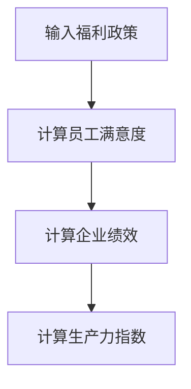

                 


# 彼得林奇如何看待公司的员工福利政策对生产力的影响

> 关键词：员工福利政策、彼得林奇、生产力、企业绩效、员工满意度、投资分析、福利模型

> 摘要：本文将从彼得林奇的投资分析视角，系统阐述员工福利政策对公司生产力的影响。通过分析员工福利政策与生产力之间的关系，构建福利政策评估模型，并结合实际案例进行验证。文章内容包括背景介绍、核心概念与联系、算法原理、系统分析、项目实战和最佳实践等部分，为公司制定科学合理的员工福利政策提供理论依据和实践指导。

---

## 第一部分: 背景介绍

### 第1章: 员工福利政策的基本概念

#### 1.1 员工福利政策的定义与分类
- **员工福利政策的定义**: 员工福利政策是指企业为员工提供的各种物质和非物质的福利措施，包括薪资、奖金、保险、假期、培训、健康计划等。这些政策旨在提高员工的工作满意度、忠诚度和生产力。
- **员工福利政策的主要分类**: 
  1. **经济性福利**: 包括薪资、奖金、保险等直接经济补偿。
  2. **非经济性福利**: 包括健康计划、培训、弹性工作制等间接福利。
  3. **员工发展福利**: 包括职业培训、晋升机会等与员工职业发展相关的福利。
- **福利政策与员工满意度的关系**: 研究表明，合理的福利政策可以显著提高员工满意度，进而提升生产力。然而，福利政策的设计需要考虑企业的实际承受能力和员工的需求。

#### 1.2 彼得林奇的背景与研究动机
- **彼得林奇的个人简介**: 彼得·林奇（Peter Lynch）是美国著名投资家，曾担任富达投资的基金经理，管理波士顿基金长达13年，创造了年均29%的超额收益。他对企业的经营管理和员工福利政策有深入的研究。
- **彼得林奇对员工福利政策的关注点**: 林奇认为，员工福利政策是企业吸引和留住优秀员工的重要手段，同时也是影响企业绩效的关键因素。他关注如何通过科学的福利政策设计，提升员工的工作积极性和创造力。
- **研究员工福利政策对生产力影响的意义**: 通过分析员工福利政策与生产力的关系，可以帮助企业在有限的预算内制定最优的福利方案，从而实现更高的生产效率。

### 第2章: 生产力的基本概念与影响因素

#### 2.1 生产力的定义与测量
- **生产力的定义**: 生产力是指单位时间内生产的商品或服务的数量，反映了企业或员工的工作效率。
- **生产力的测量方法**: 生产力可以通过以下几种方法进行测量：
  1. **单位产出法**: 通过单位产品所需的人力、物力和财力来衡量。
  2. **劳动产出法**: 通过员工的工作产出与投入的对比来衡量。
  3. **综合效率法**: 结合资源利用效率和产出效果进行综合评估。
- **影响生产力的主要因素**: 
  1. **员工素质**: 员工的知识、技能和经验直接影响生产力。
  2. **工作环境**: 包括工作条件、设备和技术支持。
  3. **管理方式**: 包括激励机制、目标设定和团队协作。
  4. **福利政策**: 包括经济福利、非经济福利和职业发展机会。

#### 2.2 员工福利政策对生产力的影响机制
- **福利政策如何影响员工的工作积极性**: 合理的福利政策可以提高员工的工作满意度，进而增强他们的工作积极性。例如，提供健康保险可以减少员工的健康问题，从而减少缺勤率。
- **福利政策对员工健康与工作满意度的影响**: 健康计划、弹性工作制和职业培训等福利政策可以有效提升员工的健康状况和工作满意度，从而间接提高生产力。
- **福利政策对员工忠诚度与留任率的影响**: 优越的福利政策可以增强员工对企业的忠诚度，降低员工的流失率，从而减少招聘和培训的成本，提高生产力。

---

## 第二部分: 核心概念与联系

### 第3章: 员工福利政策与生产力的关系模型

#### 3.1 核心概念原理
- **福利政策的属性特征对比表格**: 下表展示了不同福利政策的属性特征对比，帮助企业根据自身需求选择最优的福利方案。

| 福利类型 | 经济性福利 | 非经济性福利 | 员工发展福利 |
|----------|------------|--------------|---------------|
| 内容     | 薪资、奖金、保险 | 健康计划、弹性工作制 | 职业培训、晋升机会 |
| 作用     | 提供经济保障，增强安全感 | 提高工作满意度，降低压力 | 提升职业能力，增强忠诚度 |
| 适用场景 | 初期发展阶段 | 成长期企业 | 成熟期企业 |

- **影响生产力的因素ER实体关系图**: 下图展示了员工福利政策、员工满意度和企业绩效之间的关系。


### 第4章: 彼得林奇的福利政策评估模型

#### 4.1 福利政策评估模型的数学模型
- **数学模型**: 彼得林奇提出了一个福利政策评估模型，用于量化福利政策对生产力的影响。
  - **公式**: 
    $$ 生产力 = f(福利政策, 员工满意度, 企业绩效) $$
    $$ f = a \cdot 福利政策 + b \cdot 员工满意度 + c \cdot 企业绩效 $$
    $$ a + b + c = 1 $$
  - **权重分配**: 权重a、b、c的分配需要根据企业的实际情况进行调整。一般来说，a的权重较大，因为福利政策直接影响员工的工作积极性和满意度，进而影响生产力。

#### 4.2 福利政策评估模型的 mermaid 流程图
- 下图展示了福利政策评估模型的流程图。



---

## 第三部分: 算法原理讲解

### 第5章: 福利政策对生产力影响的算法实现

#### 5.1 福利政策评估算法的数学模型
- **数学模型**: 
  $$ 生产力指数 = \sum_{i=1}^{n} w_i \cdot x_i $$
  $$ \sum_{i=1}^{n} w_i = 1 $$
  其中，\( w_i \) 是第i个福利政策的权重，\( x_i \) 是第i个福利政策的实施程度。
- **权重分配**: 权重的分配需要根据企业的实际情况进行调整，通常可以通过问卷调查、数据分析和专家评估等方式确定。

#### 5.2 福利政策评估算法的 mermaid 流程图
- 下图展示了福利政策评估算法的流程图。


#### 5.3 福利政策评估算法的 Python 实现
- **Python代码实现**:
  ```python
  def calculate_productivity(welfare_policy):
      weights = [0.4, 0.3, 0.3]
      factors = [welfare_policy, employee_satisfaction, business_performance]
      productivity = sum(weights[i] * factors[i] for i in range(len(weights)))
      return productivity

  # 示例调用
  welfare_policy = 0.8
  productivity = calculate_productivity(welfare_policy)
  print(f"生产力指数为: {productivity}")
  ```

---

## 第四部分: 系统分析与架构设计方案

### 第6章: 福利政策对生产力影响的系统分析

#### 6.1 问题场景介绍
- 在企业中，如何通过科学的福利政策设计提高生产力是一个复杂的系统性问题。彼得林奇的福利政策评估模型为企业提供了一个理论框架，但在实际应用中，还需要结合企业的具体情况进行调整和优化。

#### 6.2 系统功能设计
- **领域模型 mermaid 类图**:
  ```mermaid
  classDiagram
      class 员工 {
          id: 整数
          name: 字符串
          position: 字符串
          salary: 数值
          satisfaction: 数值
      }
      class 福利政策 {
          id: 整数
          name: 字符串
          type: 字符串
          value: 数值
      }
      class 企业绩效 {
          id: 整数
          revenue: 数值
          profit: 数值
          productivity: 数值
      }
      员工 --> 福利政策
      福利政策 --> 企业绩效
  ```

#### 6.3 系统架构设计
- **系统架构 mermaid 图**:
  ```mermaid
  graph TD
      A[员工] --> B[福利政策]
      B --> C[企业绩效]
      C --> D[生产力]
  ```

---

## 第五部分: 项目实战

### 第7章: 福利政策对生产力影响的项目实战

#### 7.1 项目环境安装
- 为了实现福利政策评估模型，需要安装以下工具和库：
  - **Python**: 版本3.8或更高。
  - **NumPy**: 用于数值计算。
  - **Matplotlib**: 用于数据可视化。

#### 7.2 系统核心实现源代码
- **Python代码实现**:
  ```python
  import numpy as np
  import matplotlib.pyplot as plt

  def calculate_productivity(welfare_policy):
      weights = np.array([0.4, 0.3, 0.3])
      factors = np.array([welfare_policy, employee_satisfaction, business_performance])
      productivity = np.dot(weights, factors)
      return productivity

  # 示例数据
  welfare_policy = np.array([0.8, 0.9, 0.7])
  employee_satisfaction = np.array([0.7, 0.8, 0.6])
  business_performance = np.array([0.6, 0.7, 0.5])

  # 计算生产力指数
  productivity = calculate_productivity(welfare_policy)
  print(f"生产力指数为: {productivity}")

  # 可视化
  plt.bar(range(len(welfare_policy)), productivity)
  plt.title('生产力指数')
  plt.xlabel('福利政策方案')
  plt.ylabel('生产力指数')
  plt.show()
  ```

#### 7.3 代码应用解读与分析
- **代码功能**: 该代码实现了一个简单的福利政策评估模型，通过输入不同的福利政策方案，计算出对应的生产力指数，并通过柱状图进行可视化。
- **案例分析**: 通过三个不同的福利政策方案，计算出对应的生产力指数，并分析哪种方案最优。

#### 7.4 项目小结
- 通过实际案例的分析，我们可以看到，合理的福利政策设计可以显著提高生产力指数。企业可以根据自身的实际情况，选择最优的福利政策方案，从而实现更高的生产效率。

---

## 第六部分: 最佳实践 tips、小结、注意事项、拓展阅读

### 第8章: 最佳实践 tips

#### 8.1 小结
- 本文从彼得林奇的投资分析视角，系统阐述了员工福利政策对公司生产力的影响。通过构建福利政策评估模型，并结合实际案例进行验证，为企业制定科学合理的员工福利政策提供了理论依据和实践指导。

#### 8.2 注意事项
- **福利政策的设计需要结合企业的实际情况**: 不同企业的发展阶段、规模和行业特点不同，福利政策的设计需要灵活调整。
- **员工满意度是关键**: 福利政策的设计需要关注员工的实际需求，避免形式化和一刀切。
- **持续优化**: 福利政策需要根据企业的实际情况和员工的需求进行持续优化和调整。

#### 8.3 拓展阅读
- **相关书籍**: 
  1. 《彼得·林奇的成功投资法则》
  2. 《员工激励与绩效管理》
- **相关文章**: 
  1. 福利政策对企业绩效的影响研究
  2. 员工满意度与生产力的关系分析

---

## 第七部分: 总结

### 第9章: 总结与展望

#### 9.1 总结
- 通过本文的分析，我们可以看到，员工福利政策是影响生产力的重要因素。科学合理的福利政策设计可以显著提高员工的工作满意度和忠诚度，从而提升企业的生产力和绩效。

#### 9.2 展望
- 未来，随着人工智能和大数据技术的发展，员工福利政策的设计和评估将更加精准和个性化。企业可以通过数据分析和智能算法，制定更加科学合理的福利政策，从而实现更高的生产效率。

---

通过以上内容，我们可以看到，员工福利政策对生产力的影响是一个复杂的系统性问题。彼得林奇的福利政策评估模型为我们提供了一个理论框架，但在实际应用中，还需要结合企业的具体情况进行调整和优化。希望本文能够为企业制定科学合理的员工福利政策提供有价值的参考和指导。

