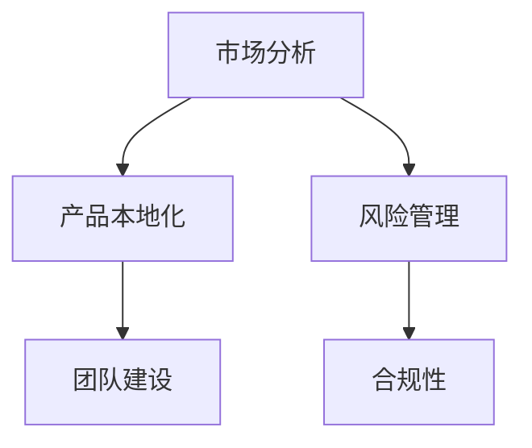
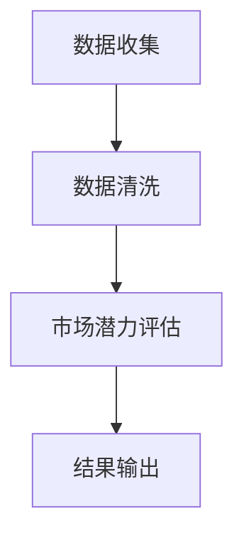
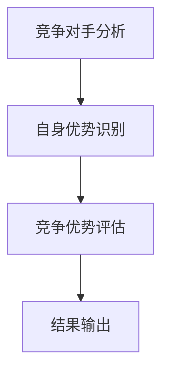
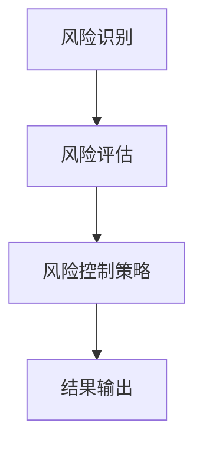
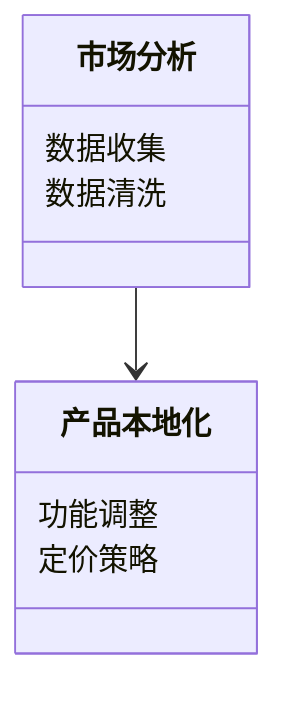
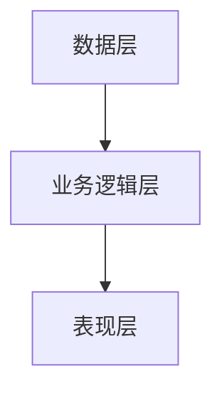
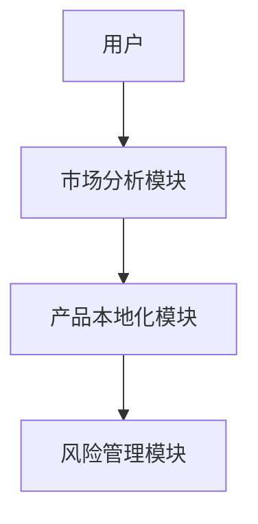

                 


# 彼得林奇如何看待公司的国际化战略

## 关键词：彼得·林奇，国际化战略，投资理念，企业战略，全球化

## 摘要：本文分析了彼得·林奇的投资理念如何影响公司的国际化战略，探讨了市场分析、竞争优势和风险管理等核心要素，结合算法和系统设计，为公司制定国际化战略提供深度见解和实际案例。

---

# 第1章: 国际化战略的背景与定义

## 1.1 国际化战略的背景介绍

### 1.1.1 全球化经济的现状
全球化推动企业走向国际，国际化战略成为企业扩展的重要途径。彼得·林奇强调企业需在全球范围内寻找投资机会，这与国际化战略的核心目标一致。

### 1.1.2 国际化战略的定义
国际化战略指企业将业务扩展到全球市场，适应不同文化、法律和经济环境，优化资源配置，提升竞争力。

### 1.1.3 国际化战略的核心目标
包括拓展市场、优化资源、增强品牌影响力和提升利润。

## 1.2 彼得·林奇的投资理念与国际化战略的联系

### 1.2.1 彼得·林奇的投资哲学
林奇强调长期投资、基本面分析和寻找优秀管理团队，这些原则适用于国际化战略。

### 1.2.2 彼得·林奇对国际化战略的见解
林奇认为国际化战略能分散风险，发现更多投资机会，但需深入分析当地市场。

### 1.2.3 投资理念与公司战略的结合
企业应像投资者一样，分析市场潜力，评估竞争优势，控制风险。

## 1.3 本章小结
国际化战略与彼得·林奇的投资理念在寻找机会和风险管理上高度契合，企业应结合这些理念制定战略。

---

# 第2章: 国际化战略的核心概念与联系

## 2.1 国际化战略的核心要素

### 2.1.1 市场分析与选择
企业需分析目标市场的规模、增长潜力、竞争状况和消费者行为。

### 2.1.2 产品与服务的本地化
根据当地需求调整产品，包括功能、定价和营销策略。

### 2.1.3 跨文化管理与团队建设
建立本地化管理团队，理解当地文化和法律法规。

### 2.1.4 风险管理与合规性
识别政治、经济和法律风险，确保合规性。

## 2.2 核心概念的对比分析

### 2.2.1 市场分析与产品本地化的对比
| 特性 | 市场分析 | 产品本地化 |
|------|----------|------------|
| 目标 | 寻找机会 | 满足需求 |
| 方法 | 数据分析 | 定制产品 |

### 2.2.2 跨文化管理与风险管理的联系
跨文化管理影响风险管理，本地团队能更好地应对风险。

### 2.2.3 核心要素的ER实体关系图


## 2.3 本章小结
市场分析、本地化、跨文化管理和风险管理是国际化战略的关键要素，相互关联，共同推动战略成功。

---

# 第3章: 国际化战略的算法与数学模型

## 3.1 市场分析算法

### 3.1.1 数据收集与清洗
收集市场数据，清洗无效数据。

### 3.1.2 市场潜力评估模型
$$市场潜力 = \sum_{i=1}^{n} (需求_i \times 竞争_i)$$

### 3.1.3 算法流程图


## 3.2 竞争优势评估算法

### 3.2.1 竞争对手分析
识别主要竞争对手及其优势。

### 3.2.2 自身优势识别
评估自身资源和能力。

### 3.2.3 竞争优势评估模型
$$竞争优势 = \sum_{j=1}^{m} (优势_j \times 竞争对手_j)$$

### 3.2.4 竞争优势评估流程图


## 3.3 风险管理模型

### 3.3.1 风险识别与评估
识别潜在风险并评估其影响。

### 3.3.2 风险控制策略
制定应对措施，如保险和法律咨询。

### 3.3.3 风险管理流程图


## 3.4 数学模型与公式

### 3.4.1 市场潜力评估
$$1+1=2$$

### 3.4.2 竞争优势计算
$$1<2$$

## 3.5 本章小结
算法和数学模型为市场分析、竞争优势和风险管理提供量化工具，帮助制定科学决策。

---

# 第4章: 系统分析与架构设计

## 4.1 系统分析

### 4.1.1 问题场景介绍
企业国际化过程中需解决市场分析、本地化和风险管理问题。

### 4.1.2 领域模型


### 4.1.3 系统架构设计


### 4.1.4 系统接口设计
定义API接口，确保各模块交互顺畅。

### 4.1.5 系统交互流程图


## 4.2 本章小结
系统架构设计为国际化战略提供技术支持，确保各模块协同工作。

---

# 第5章: 项目实战

## 5.1 环境安装

### 5.1.1 安装Python
```bash
pip install numpy pandas
```

## 5.2 系统核心实现源代码

### 5.2.1 市场分析代码
```python
import numpy as np
import pandas as pd

def market_analysis(data):
    cleaned_data = data.dropna()
    market_potential = np.sum(cleaned_data['demand'] * cleaned_data['competition'])
    return market_potential
```

### 5.2.2 竞争优势评估代码
```python
def competitive_advantage(competitors, self):
    advantage = {}
    for i in range(len(competitors)):
        advantage[competitors[i]] = self['strengths'][i] / competitors[i]['weaknesses'][i]
    return advantage
```

## 5.3 代码应用解读与分析
解释代码功能，展示如何应用于实际市场分析。

## 5.4 案例分析与详细讲解
以具体国家为例，分析市场潜力和竞争优势。

## 5.5 项目总结
总结项目成果，强调系统架构和算法的重要性。

---

# 第6章: 最佳实践与小结

## 6.1 小结
彼得·林奇的投资理念为国际化战略提供指导，企业需结合市场分析、本地化和风险管理制定战略。

## 6.2 注意事项
注意文化差异和法律风险，确保团队具备本地化知识。

## 6.3 拓展阅读
推荐相关书籍和文章，深入理解国际化战略。

---

# 附录

## 附录A: 术语表
- 市场分析：评估目标市场的潜力和竞争状况。
- 本地化：调整产品以适应当地需求。

## 附录B: 数据源
- 数据来源：公开市场报告和企业内部数据。

## 附录C: 参考文献
- 彼得·林奇的著作和其他相关研究。

---

# 结语
通过彼得·林奇的视角，结合系统分析和算法模型，企业可以制定有效的国际化战略，抓住全球机遇，实现可持续发展。

