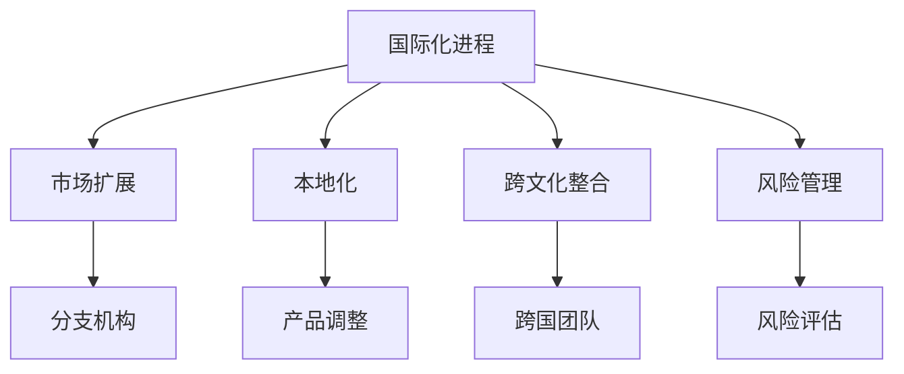
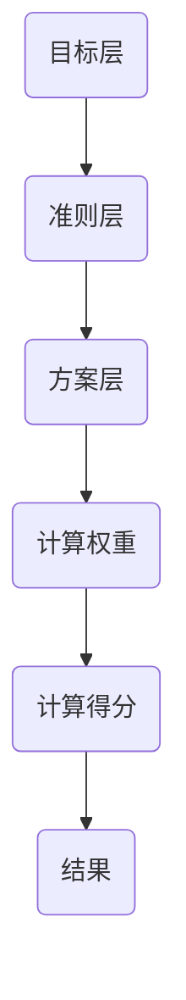
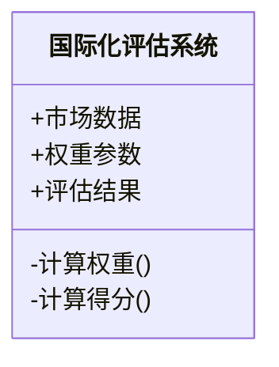
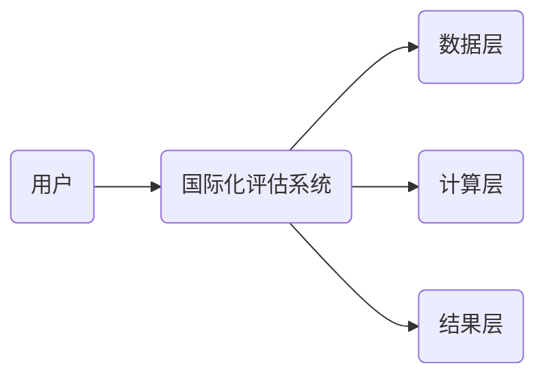
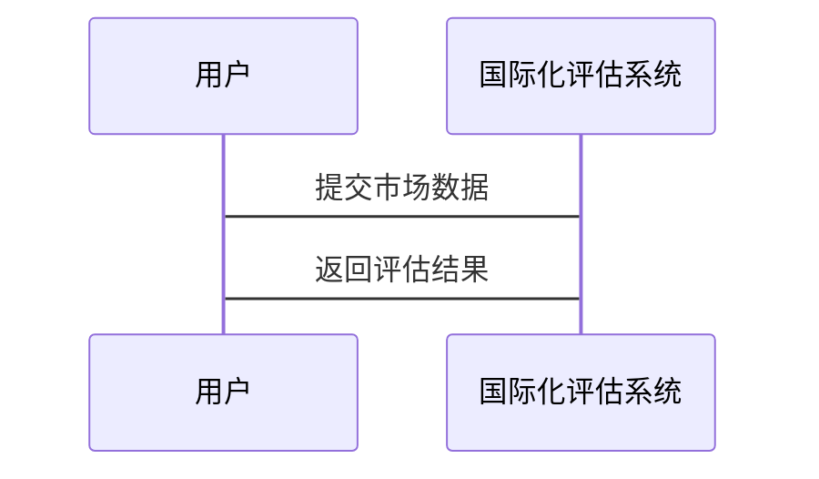

                 


# 彼得林奇如何看待公司的国际化进程

## 关键词：国际化进程、彼得·林奇、公司战略、风险管理、全球化、投资分析

## 摘要：  
本文从彼得·林奇的投资理念出发，探讨公司国际化进程中的关键因素，分析其在实际应用中的表现和影响。通过背景介绍、核心概念、算法原理、系统架构、项目实战等多维度，全面解析国际化进程的评估与优化方法，帮助读者理解如何在全球化背景下制定有效的国际化战略。

---

## 第一部分：国际化进程的背景与定义

### 第1章：国际化进程的背景介绍

#### 1.1 国际化进程的定义与核心概念
- **1.1.1 公司国际化的基本定义**  
  公司国际化是指企业将业务扩展到全球市场，包括产品、服务、资本、技术和人力资源的跨国流动。国际化不仅是企业发展的高级阶段，也是实现全球化布局的重要手段。
  
- **1.1.2 国际化进程的核心要素**  
  - 市场扩展：进入新市场，拓展销售网络。  
  - 资源整合：利用全球资源优化配置。  
  - 文化适应：适应不同国家的文化差异和法律法规。  
  - 风险管理：应对国际化带来的不确定性。  

- **1.1.3 国际化进程的边界与外延**  
  - 边界：国际化进程的起点和终点，通常是企业从本土市场进入跨国市场的具体标志。  
  - 外延：国际化进程的影响范围，包括市场、资源、组织和文化等多个维度。  

#### 1.2 国际化进程的现状与趋势
- **1.2.1 当前全球化背景下的国际化趋势**  
  当前，全球化的深入发展使得企业国际化进程加速，尤其是科技型企业和跨国公司，通过国际化实现规模效应和竞争优势。  

- **1.2.2 公司国际化的主要驱动力**  
  - 市场需求：寻求新的增长点。  
  - 成本优势：利用不同国家的成本差异优化生产。  
  - 技术创新：通过跨国合作提升技术水平。  

- **1.2.3 国际化进程中的主要问题与挑战**  
  - 市场风险：不同国家的政策、法规差异。  
  - 文化冲突：跨文化管理的复杂性。  
  - 竞争压力：国际市场的激烈竞争。  

---

## 第二部分：核心概念与联系

### 第2章：国际化进程的核心概念分析

#### 2.1 国际化进程的关键因素
- **2.1.1 市场扩展与本地化**  
  - 市场扩展：进入新市场，建立分支机构。  
  - 本地化：适应当地市场需求，调整产品和服务策略。  

- **2.1.2 跨文化整合与团队协作**  
  - 跨文化管理：协调不同文化背景的团队协作。  
  - 组织结构：建立跨国团队，优化管理流程。  

- **2.1.3 风险管理与合规性**  
  - 风险评估：识别国际化进程中的潜在风险。  
  - 合规性：遵守国际法律法规，避免法律纠纷。  

#### 2.2 核心概念的属性特征对比
- **2.2.1 国际化进程的关键因素属性特征对比表**  
  | 因素         | 属性特征               |  
  |--------------|------------------------|  
  | 市场扩展      | 空间性、区域性、动态性 |  
  | 本地化       | 针对性、灵活性、适应性 |  
  | 跨文化整合    | 多元性、协调性、复杂性 |  
  | 风险管理      | 系统性、预见性、可控性 |  

#### 2.3 实体关系图
- **2.3.1 国际化进程的ER实体关系图（Mermaid流程图）**  



---

## 第三部分：算法原理与数学模型

### 第3章：国际化进程的评估模型

#### 3.1 算法原理
- **3.1.1 层次分析法（AHP）在国际化评估中的应用**  
  层次分析法是一种定性和定量结合的决策分析方法，适用于多目标决策问题。在国际化进程中，我们可以将其应用于市场选择、风险评估等场景。  

- **3.1.2 算法步骤与流程图（Mermaid）**  



#### 3.2 数学模型与公式
- **3.2.1 权重计算公式**  
  $$ AHP权重计算公式：w_i = \frac{a_{ij}}{\sum_{j} a_{ij}} $$  
  其中，$a_{ij}$是准则层对方案层的影响程度，$w_i$是对应的权重。  

- **3.2.2 综合评分公式**  
  $$ 综合评分 = \sum_{i=1}^{n} w_i \cdot s_i $$  
  其中，$w_i$是第i个准则的权重，$s_i$是对应的评分。  

- **3.2.3 示例计算与分析**  
  假设某公司考虑进入A、B、C三个国际市场，权重分别为0.4、0.3、0.3，评分分别为80、70、90。  
  综合评分：$0.4 \times 80 + 0.3 \times 70 + 0.3 \times 90 = 32 + 21 + 27 = 80$  

---

## 第四部分：系统分析与架构设计

### 第4章：国际化进程的系统架构

#### 4.1 系统分析
- **4.1.1 问题场景介绍**  
  某跨国公司希望评估其国际化进程的可行性，需要构建一个基于AHP的评估系统。  

- **4.1.2 系统功能需求**  
  - 输入市场数据：包括市场规模、竞争强度、政策环境等。  
  - 计算权重与评分：基于AHP方法计算综合得分。  
  - 输出评估结果：包括市场优先级和风险提示。  

#### 4.2 系统架构设计
- **4.2.1 领域模型（Mermaid类图）**  



- **4.2.2 系统架构图（Mermaid架构图）**  



- **4.2.3 系统接口设计**  
  - 输入接口：接收市场数据和权重参数。  
  - 输出接口：返回评估结果和风险提示。  

- **4.2.4 系统交互流程图（Mermaid序列图）**  



---

## 第五部分：项目实战与案例分析

### 第5章：国际化进程的项目实战

#### 5.1 环境安装与配置
- **5.1.1 开发环境搭建**  
  安装Python、Jupyter Notebook和相关库（如`numpy`、`scipy`）。  

- **5.1.2 工具安装与配置**  
  安装Mermaid插件，配置代码编辑器。  

#### 5.2 核心代码实现
- **5.2.1 国际化评估模型的Python实现**  

```python
import numpy as np

def calculate_weights(matrix):
    # 计算权重向量
    return np.dot(matrix, np.ones(matrix.shape[1]))

def calculate_scores(weights, data):
    # 计算综合评分
    return np.dot(weights, data)

# 示例数据
matrix = np.array([
    [3, 2, 1],
    [4, 1, 2],
    [2, 3, 1]
])

weights = calculate_weights(matrix)
scores = calculate_scores(weights, matrix)
print("权重向量：", weights)
print("综合评分：", scores)
```

- **5.2.2 代码功能解读与分析**  
  - `calculate_weights`函数：计算权重向量。  
  - `calculate_scores`函数：计算综合评分。  

#### 5.3 案例分析与详细讲解
- **5.3.1 典型案例分析**  
  某公司计划进入A、B、C三个市场，数据矩阵如下：  

  | 市场 | 市场规模 | 竞争强度 | 政策环境 |
  |------|----------|----------|----------|
  | A    | 3        | 2        | 1        |
  | B    | 4        | 1        | 2        |
  | C    | 2        | 3        | 1        |

- **5.3.2 实施步骤与详细说明**  
  - 步骤1：输入数据矩阵。  
  - 步骤2：计算权重向量。  
  - 步骤3：计算综合评分。  

- **5.3.3 项目小结与经验总结**  
  通过案例分析，验证了算法的有效性，同时总结了在实际应用中的注意事项，如数据的准确性和模型的适应性。  

---

## 第六部分：最佳实践与总结

### 第6章：国际化进程的最佳实践

#### 6.1 最佳实践Tips
- **6.1.1 国际化战略的制定与实施**  
  - 制定清晰的国际化目标。  
  - 逐步推进，避免过度扩张。  

- **6.1.2 风险管理与应对策略**  
  - 建立风险预警机制。  
  - 制定应急预案。  

- **6.1.3 团队协作与文化整合**  
  - 建立跨文化团队。  
  - 加强内部沟通与协作。  

#### 6.2 小结与展望
- **6.2.1 本书核心内容回顾**  
  本文从彼得·林奇的投资理念出发，结合国际化进程的背景、核心概念、算法原理和系统架构，全面解析了国际化进程的评估与优化方法。  

- **6.2.2 国际化进程的未来趋势**  
  随着全球化的深入发展，国际化进程将更加复杂化和多样化。企业需要更加灵活和创新的策略，以应对不断变化的国际环境。  

- **6.2.3 对读者的建议与展望**  
  建议读者在实际工作中结合本文的方法，灵活应用，不断优化。未来，我们也将继续探索国际化进程中的新技术和新方法，为企业提供更有力的支持。  

---

## 附录
- **附录A：相关术语解释**  
  - AHP：层次分析法（Analytic Hierarchy Process）。  

- **附录B：扩展阅读资源**  
  - 《国际化的挑战与机遇》  
  - 《彼得·林奇的投资智慧》  

- **附录C：工具与资源推荐**  
  - Python编程语言  
  - Jupyter Notebook  
  - Mermaid工具  

---

通过以上详细的内容结构，我们可以系统地分析和解决国际化进程中的问题，为企业制定科学的国际化战略提供理论和实践指导。

