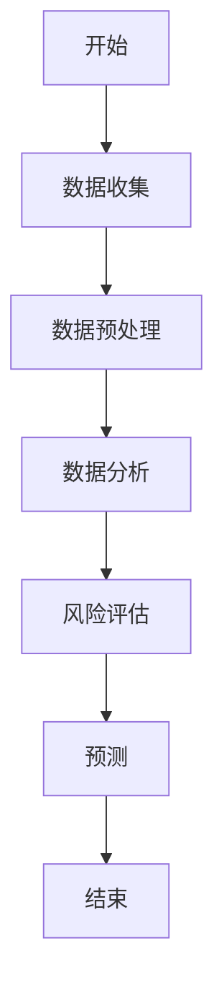
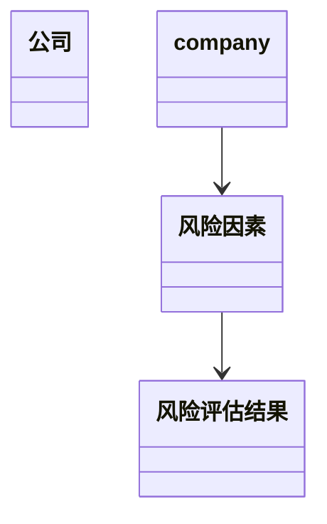
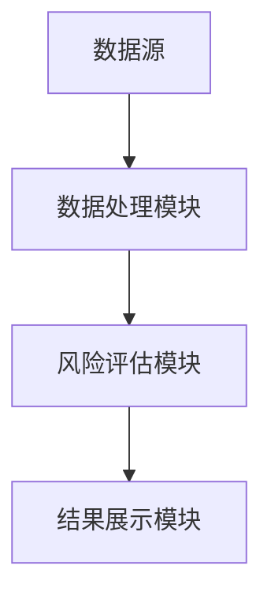
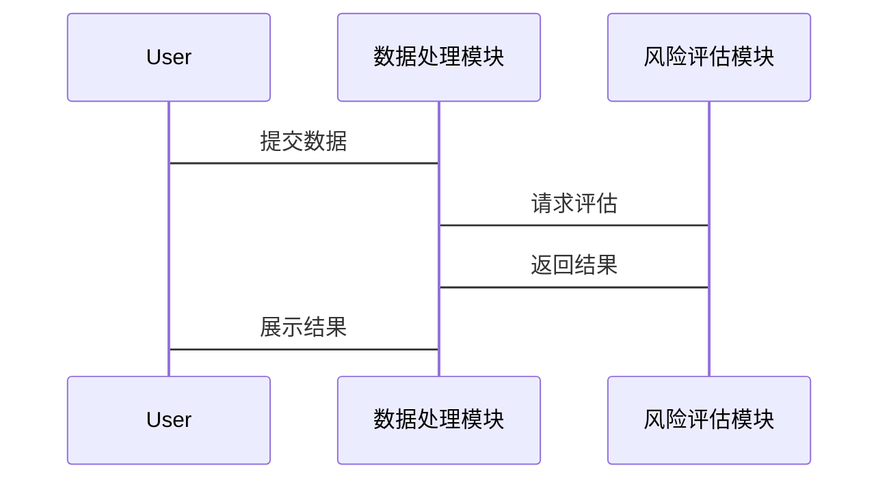

                 


# 彼得林奇如何看待公司的国际化风险

> 关键词：国际化风险，彼得·林奇，投资哲学，风险评估，系统分析

> 摘要：本文从彼得·林奇的投资哲学出发，系统地分析了国际化风险的核心概念、评估方法和应对策略。通过理论与实践相结合的方式，深入探讨了如何在全球化背景下，利用彼得·林奇的分析框架，有效识别和管理国际化风险。文章最后结合实际案例，给出了风险管理的最佳实践建议。

---

## 第1章 国际化风险的背景与重要性

### 1.1 国际化风险的定义与特征

国际化风险是指企业在跨国经营过程中，由于经济、政治、文化、法律等因素的差异和不确定性，可能对企业经营目标、财务状况和市场表现造成不利影响的风险。其核心特征包括：

- **跨文化性**：不同国家的法律法规、消费习惯和商业伦理差异显著。
- **复杂性**：涉及多个维度，包括经济、政治、法律、社会等。
- **动态性**：全球化进程中的政治经济环境不断变化，风险也随之调整。
- **关联性**：国际化风险往往与其他类型的商业风险（如市场风险、信用风险）交织在一起。

### 1.2 彼得·林奇与国际化风险的关联

彼得·林奇是全球著名投资家，以其独特的企业分析方法闻名。他关注企业的基本面，注重企业的财务健康状况和管理层质量。在国际化风险的分析中，林奇的方法具有以下特点：

- **数据驱动**：林奇强调通过企业财务数据和市场数据进行分析，而非仅仅依赖直觉。
- **长期视角**：他倾向于长期观察企业的国际化战略和市场表现，以判断风险的持续性。
- **系统性分析**：林奇注重从宏观到微观的多层次分析，包括行业趋势、企业竞争地位等。

### 1.3 本章小结

国际化风险是企业在全球化过程中必须面对的挑战。彼得·林奇的分析方法为我们提供了一个系统性的视角，强调通过数据和基本面分析来识别和管理风险。

---

## 第2章 国际化风险的核心概念与联系

### 2.1 国际化风险的核心要素

国际化风险可以从以下几个核心要素进行分析：

- **经济环境因素**：汇率波动、通货膨胀、利率变化等。
- **政治法律因素**：政策变化、贸易壁垒、税收政策等。
- **市场竞争因素**：国际竞争格局、市场准入门槛等。
- **企业自身因素**：国际化战略、风险管理能力、财务状况等。

### 2.2 彼得·林奇分析方法的原理

彼得·林奇的分析方法可以总结为以下几个步骤：

1. **数据收集**：收集企业的财务报表、市场数据和行业报告。
2. **基本面分析**：分析企业的盈利能力、资产负债情况和现金流。
3. **行业趋势分析**：研究行业的增长潜力和竞争格局。
4. **风险评估**：结合宏观环境和企业状况，评估潜在风险。

### 2.3 国际化风险与彼得·林奇分析方法的关系

国际化风险的多维度属性要求分析方法具备综合性。彼得·林奇的分析方法通过结合宏观经济和微观企业数据，提供了一种有效的风险评估框架。

---

## 第3章 彼得·林奇分析国际化风险的算法原理

### 3.1 算法概述

彼得·林奇的分析方法可以看作是一种基于数据的多维度评估算法，其核心目标是通过对企业基本面和行业趋势的分析，识别潜在的国际化风险。

### 3.2 算法流程

1. **数据收集与预处理**：收集企业的财务数据、市场数据和行业报告，清洗数据并标准化处理。
2. **数据分析与建模**：使用统计分析方法，识别企业的财务健康状况和行业趋势。
3. **风险评估与预测**：结合宏观经济指标，评估企业的国际化风险并进行预测。

### 3.3 算法原理的数学模型

以下是彼得·林奇分析方法中常用的几个数学模型：

1. **盈利能力分析**：
   $$ 利润率 = \frac{净利润}{营业收入} $$
2. **偿债能力分析**：
   $$ 负债率 = \frac{总负债}{总资产} $$
3. **现金流预测**：
   $$ 现金流预测 = a \times 当前现金流 + b \times 历史现金流 $$

### 3.4 算法流程图



### 3.5 本章小结

通过算法流程图可以看出，彼得·林奇的分析方法是一种系统性的数据驱动方法，能够有效识别和评估国际化风险。

---

## 第4章 系统分析与架构设计方案

### 4.1 系统分析

国际化风险分析系统需要具备以下功能：

- 数据采集与处理
- 风险评估模型构建
- 风险预测与预警

### 4.2 领域模型分析



### 4.3 系统架构设计



### 4.4 系统交互设计



### 4.5 本章小结

系统分析为国际化风险的评估提供了技术支持，彼得·林奇的分析方法可以嵌入到系统架构中，实现自动化风险评估。

---

## 第5章 项目实战：国际化风险评估系统开发

### 5.1 环境安装

开发环境：Python 3.8+

所需库：Pandas、NumPy、Matplotlib

安装命令：
```bash
pip install pandas numpy matplotlib
```

### 5.2 核心代码实现

以下是风险评估系统的部分代码示例：

```python
import pandas as pd
import numpy as np

# 数据预处理
def preprocess_data(data):
    # 删除缺失值
    data = data.dropna()
    # 标准化处理
    data = (data - data.mean()) / data.std()
    return data

# 风险评估模型
def risk_assessment(data):
    # 计算盈利能力
    profitability = data['净利润'] / data['营业收入']
    # 计算偿债能力
    leverage_ratio = data['总负债'] / data['总资产']
    # 综合风险指数
    risk_index = 0.5 * profitability + 0.5 * leverage_ratio
    return risk_index

# 主程序
def main():
    # 读取数据
    data = pd.read_csv('international_risk.csv')
    # 数据预处理
    processed_data = preprocess_data(data)
    # 风险评估
    risk_index = risk_assessment(processed_data)
    # 结果展示
    print('风险指数:', risk_index)

if __name__ == "__main__":
    main()
```

### 5.3 代码应用解读与分析

以上代码实现了数据预处理和风险评估的基本功能，用户可以根据具体需求进行扩展。

### 5.4 案例分析

以某跨国公司为例，假设我们收集了以下数据：

| 参数       | 数值    |
|------------|---------|
| 净利润     | 100万   |
| 营业收入   | 500万   |
| 总负债     | 300万   |
| 总资产     | 800万   |

通过代码计算：
$$ \text{风险指数} = 0.5 \times (100/500) + 0.5 \times (300/800) = 0.5 \times 0.2 + 0.5 \times 0.375 = 0.1 + 0.1875 = 0.2875 $$

### 5.5 本章小结

通过实际案例分析，我们可以看到彼得·林奇的分析方法在系统开发中的具体应用。

---

## 第6章 总结与最佳实践

### 6.1 总结

彼得·林奇的分析方法为我们提供了一个系统性的国际化风险评估框架。通过数据驱动的方法，我们可以有效识别和管理国际化风险。

### 6.2 最佳实践 tips

1. 在进行国际化投资时，应注重对目标市场的深入研究。
2. 使用彼得·林奇的分析方法时，需结合具体企业的实际情况。
3. 定期更新数据和模型，以适应不断变化的国际环境。

### 6.3 注意事项

- 风险评估结果仅供参考，实际投资需谨慎。
- 在使用模型时，应确保数据的准确性和完整性。

### 6.4 拓展阅读

- 彼得·林奇的《选股的艺术》
- 国际化风险管理的相关书籍和文献

---

## 结语

通过本文的分析，我们深入探讨了彼得·林奇如何看待公司的国际化风险，并结合实际案例，给出了风险管理的最佳实践建议。希望本文能为读者在国际化投资和风险管理领域提供有价值的参考。

