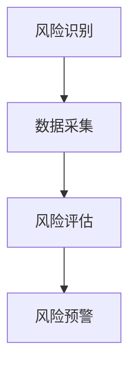

                 


# 彼得·林奇如何看待公司的地缘政治风险

## 关键词：彼得·林奇，地缘政治风险，投资策略，风险管理，公司价值

## 摘要：本文探讨了彼得·林奇对地缘政治风险的看法，分析了地缘政治风险的类型、影响因素及其对公司的潜在影响。通过数学模型和实际案例，本文详细阐述了如何评估和应对地缘政治风险，为投资者提供了实用的策略和工具。

---

# 第一部分：引言

## 第1章：彼得·林奇的投资理念与地缘政治风险

### 1.1 引言

地缘政治风险是投资过程中不可忽视的因素。本文将从彼得·林奇的投资理念出发，探讨地缘政治风险的定义、类型及其对投资决策的影响。

### 1.2 地缘政治风险的定义

地缘政治风险是指由于政治、经济、军事等外部因素的变化，对公司运营、财务状况或股价稳定性造成的潜在威胁。这种风险通常涉及国际关系、政策变化或地区冲突等因素。

### 1.3 彼得·林奇的投资理念

彼得·林奇以其长期投资和基本面分析著称，他认为投资者应关注公司的长期价值，而非短期市场波动。他强调深入研究公司基本面，以识别潜在风险和机会。

### 1.4 地缘政治风险对投资的影响

地缘政治风险可能影响公司的供应链、市场需求、政策环境等，进而影响其财务表现和股价。因此，投资者需要将地缘政治风险纳入投资决策中。

---

# 第二部分：地缘政治风险的核心概念

## 第2章：地缘政治风险的类型与影响

### 2.1 地缘政治风险的分类

| 类型                | 描述                                                                 |
|---------------------|----------------------------------------------------------------------|
| 政治风险            | 政府政策变化、政治动荡等影响公司运营的风险。                             |
| 经济风险            | 经济制裁、贸易壁垒等对公司的经济影响。                                 |
| 军事风险            | 地区冲突、战争等对公司供应链或市场的破坏。                             |

### 2.2 地缘政治风险的影响因素

| 影响因素            | 描述                                                                 |
|---------------------|----------------------------------------------------------------------|
| 国际关系            | 国家间的外交关系、联盟变化等。                                       |
| 经济制裁            | 对特定国家或公司的经济限制措施。                                     |
| 文化冲突            | 因文化差异导致的市场抵制或消费者行为变化。                           |

### 2.3 地缘政治风险与公司价值的关系

地缘政治风险通过影响公司的收入、成本和市场准入，进而影响其估值。例如，政治不稳定可能导致公司利润下降，从而降低股价。

---

## 第3章：地缘政治风险的评估模型

### 3.1 风险评估的基本原理

风险评估是一个系统性过程，包括识别风险、量化其影响和制定应对策略。以下是风险评估的步骤：

1. **风险识别**：识别可能影响公司的地缘政治风险因素。
2. **风险量化**：评估每个风险发生的概率及其对公司的影响程度。
3. **风险分析**：综合分析各风险的影响，制定应对策略。

### 3.2 彼得·林奇的地缘政治风险评估方法

彼得·林奇认为，投资者应关注地缘政治风险对公司长期价值的影响。他提出了以下方法：

1. **风险概率模型**：通过历史数据分析，计算特定地缘政治事件发生的概率。
2. **风险影响程度分析**：评估潜在风险对公司财务状况和股价的可能影响。

### 3.3 数学模型与公式

#### 3.3.1 风险概率计算公式

$$ P = \frac{\text{历史事件发生次数}}{\text{总样本数}} $$

例如，某地区战争在过去10年中发生了3次，总样本数为10，则战争发生的概率为30%。

#### 3.3.2 风险影响程度评估公式

$$ I = \sum_{i=1}^{n} w_i \times f_i $$

其中，$w_i$ 是影响因素的权重，$f_i$ 是影响因素的具体值。例如，经济制裁的影响程度为80%，政治动荡的影响程度为60%，则加权平均影响程度为70%。

---

## 第4章：地缘政治风险的系统分析

### 4.1 系统功能设计

以下是地缘政治风险评估系统的功能模块：

1. **风险识别模块**：识别潜在的地缘政治风险。
2. **数据采集模块**：收集相关历史数据和实时新闻。
3. **风险评估模块**：应用数学模型计算风险概率和影响程度。
4. **风险预警模块**：根据评估结果发出预警信号。

### 4.2 系统架构设计

以下是地缘政治风险评估系统的架构图：



---

## 第5章：地缘政治风险的项目实战

### 5.1 环境安装

为了实现地缘政治风险评估系统，需要以下工具和库：

- **编程语言**：Python
- **数据处理库**：Pandas、NumPy
- **数据可视化库**：Matplotlib、Seaborn
- **自然语言处理库**：NLTK

### 5.2 核心实现源代码

以下是一个简单的地缘政治风险评估工具的代码示例：

```python
import pandas as pd
import numpy as np

def calculate_risk_probability(history_data):
    # 计算风险概率
    probability = history_data['事件发生次数'] / history_data['总样本数']
    return probability

def calculate_risk_impact(history_data, weights):
    # 计算风险影响程度
    impact = np.dot(history_data['影响因素'], weights)
    return impact

# 示例数据
data = {
    '影响因素': [0.3, 0.5, 0.2],
    '权重': [0.2, 0.5, 0.3]
}
df = pd.DataFrame(data)

weights = df['权重']
impact = calculate_risk_impact(df, weights)
print(f"风险影响程度为：{impact}")
```

### 5.3 实际案例分析

以某跨国公司为例，假设其面临的政治风险概率为20%，经济风险概率为30%，军事风险概率为10%。假设政治风险的影响程度为80%，经济风险的影响程度为60%，军事风险的影响程度为40%。则加权平均影响程度为：

$$ I = 0.2 \times 80\% + 0.3 \times 60\% + 0.1 \times 40\% = 20\% + 18\% + 4\% = 42\% $$

---

## 第6章：结论与最佳实践

### 6.1 结论

地缘政治风险是投资决策中不可忽视的因素。通过系统的风险评估和量化，投资者可以更好地识别和应对这些风险，从而做出更明智的投资决策。

### 6.2 最佳实践

1. **定期评估风险**：随着国际形势的变化，定期更新风险评估。
2. **多元化投资**：通过多元化降低单一地缘政治风险的影响。
3. **关注政策变化**：密切关注政策变化，及时调整投资策略。

---

通过本文的分析，读者可以更好地理解地缘政治风险对公司的影响，并掌握如何利用数学模型和系统工具进行风险评估。这将帮助投资者在复杂多变的国际环境中做出更明智的投资决策。

