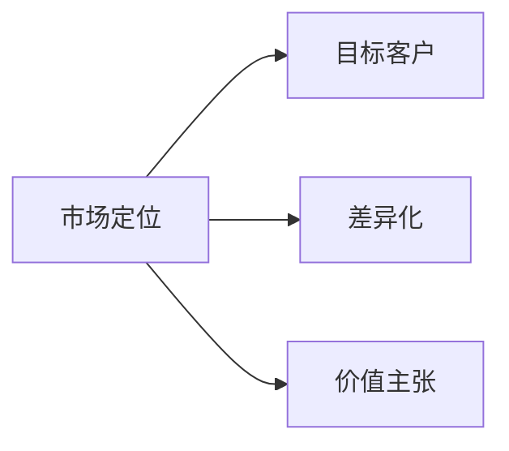
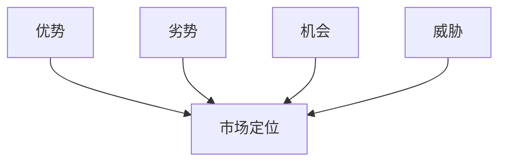
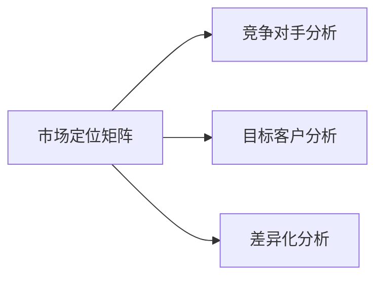
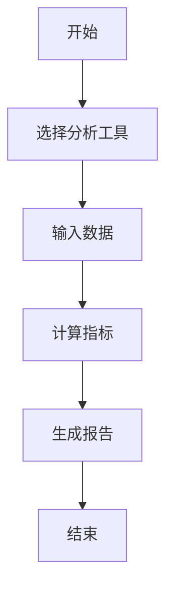
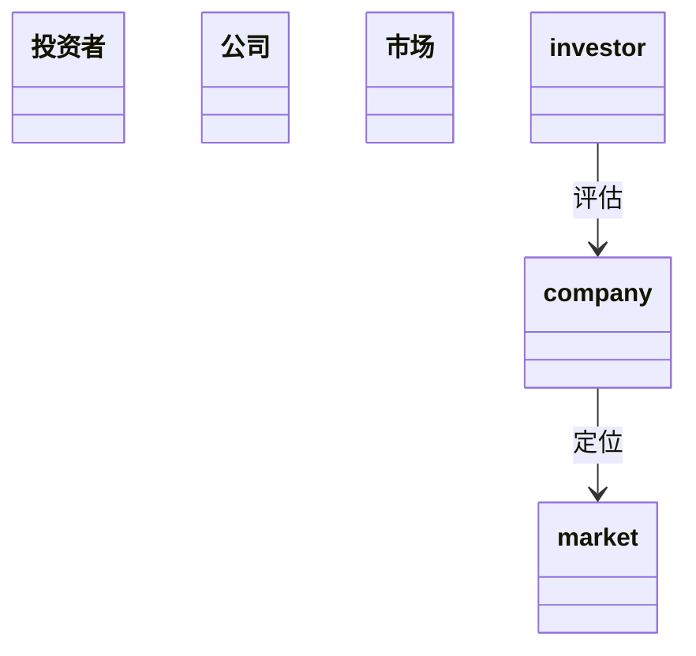
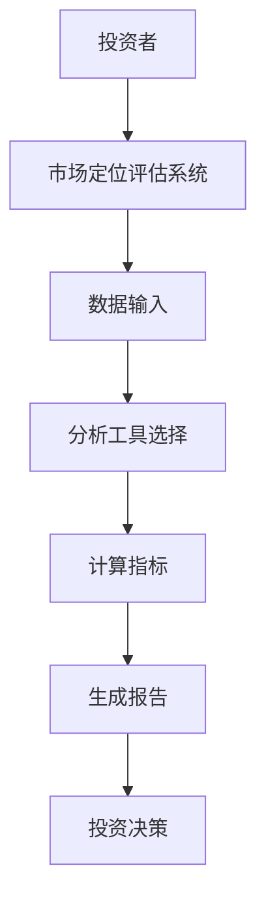

                 


# 彼得林奇如何看待公司的市场定位

## 关键词：彼得·林奇，市场定位，投资策略，量化分析，系统架构

## 摘要：彼得·林奇作为投资大师，强调公司市场定位的重要性。本文从市场定位的核心概念、分析工具、量化模型、系统架构到实际案例，全面解析彼得·林奇的市场定位观点，帮助投资者理解和应用这些方法进行投资决策。

---

# 第一部分: 公司市场定位的背景与重要性

## 第1章: 公司市场定位的基本概念

### 1.1 市场定位的核心概念

#### 1.1.1 市场定位的定义

市场定位是指企业确定其产品或服务在目标市场中的位置，通过独特的价值主张与竞争对手区分开来。彼得·林奇认为，市场定位是投资决策的关键因素之一，因为它决定了公司的竞争优势和长期发展潜力。

#### 1.1.2 市场定位的重要性

- 帮助企业在市场中找到独特的位置。
- 确定目标客户群体，优化资源配置。
- 为投资者提供评估公司价值的重要依据。

#### 1.1.3 市场定位的基本要素

| 要素 | 描述 |
|------|------|
| 产品定位 | 产品的功能、特点和用途。 |
| 价格定位 | 产品的定价策略。 |
| 渠道定位 | 分销渠道的选择。 |
| 促销定位 | 市场推广策略。 |

### 1.2 彼得·林奇的投资理念

#### 1.2.1 彼得·林奇的投资哲学

彼得·林奇强调长期投资和基本面分析，认为市场的波动为投资者提供了买入优质资产的机会。

#### 1.2.2 彼得·林奇对市场定位的关注

林奇认为，公司的市场定位决定了其在行业中的地位和竞争优势，是评估公司投资价值的重要因素。

#### 1.2.3 彼得·林奇的投资策略

- 选择具有强大竞争优势和良好市场定位的公司。
- 避免投资于市场定位不清晰或竞争力不足的公司。

---

# 第二部分: 市场定位的核心概念与分析工具

## 第2章: 市场定位的原理与分析框架

### 2.1 市场定位的原理

#### 2.1.1 市场定位的逻辑

市场定位是通过识别目标客户需求，制定差异化策略，从而在市场中占据有利位置。

#### 2.1.2 市场定位的核心要素

- 目标客户：公司致力于满足哪些客户群体的需求。
- 差异化：公司如何通过产品或服务与竞争对手区分开来。
- 价值主张：公司提供的独特价值和利益点。

#### 2.1.3 市场定位的层次模型



### 2.2 市场定位的分析工具

#### 2.2.1 SWOT分析

SWOT分析帮助企业识别优势、劣势、机会和威胁，从而制定有效的市场定位策略。



#### 2.2.2 五力模型

五力模型（波特的五力分析）帮助企业评估行业竞争结构，确定市场定位的可行性。

| 五力 | 描述 |
|------|------|
| 新进入者的威胁 | 行业进入壁垒高低。 |
| 替代品的威胁 | 替代品的可替代性。 |
| 供应商的议价能力 | 供应商的集中度和替代品。 |
| 客户的议价能力 | 客户的集中度和购买量。 |
| 竞争对手的 rivalry | 行业的竞争程度。 |

#### 2.2.3 市场定位矩阵

市场定位矩阵帮助企业分析公司在市场中的位置，优化定位策略。



---

# 第三部分: 市场定位的算法与数学模型

## 第3章: 市场定位的量化分析

### 3.1 市场定位的量化指标

#### 3.1.1 相对估值法

通过比较公司与同行的估值指标，判断其市场定位是否合理。

#### 3.1.2 绝对估值法

使用DCF模型评估公司内在价值，判断其市场定位是否低估或高估。

#### 3.1.3 市场定位指数

综合多个指标，评估公司在市场中的定位情况。

### 3.2 市场定位的数学模型

#### 3.2.1 相对估值模型

$$ EV/EBITDA = \frac{企业价值}{息税折旧及摊销前利润} $$

#### 3.2.2 DCF模型

$$ NPV = \sum_{t=1}^{n} \frac{CF_t}{(1+r)^t} + \frac{TV}{(1+r)^n} $$

### 3.3 算法流程图



### 3.4 本章小结

通过量化分析，投资者可以更准确地评估公司的市场定位，做出更明智的投资决策。

---

# 第四部分: 市场定位的系统分析与架构设计

## 第4章: 投资决策的系统架构

### 4.1 系统功能设计

#### 4.1.1 领域模型



### 4.2 系统架构设计



---

# 第五部分: 项目实战

## 第5章: 项目实战——微软的市场定位评估

### 5.1 环境安装

安装Python和相关库（如pandas, numpy, matplotlib）。

### 5.2 代码实现

```python
import pandas as pd
import numpy as np

# 示例数据：微软的财务数据和行业平均
data = {
    '公司': ['微软', '行业平均'],
    'Revenue': [150, 120],
    'Net Income': [40, 30],
    'EV': [1000, 800],
    'EBITDA': [50, 40]
}

df = pd.DataFrame(data)

# 计算EV/EBITDA
df['EV/EBITDA'] = df['EV'] / df['EBITDA']

print(df)
```

### 5.3 案例分析

通过对微软的市场定位分析，验证其市场定位的合理性，评估其投资价值。

### 5.4 项目小结

通过实际案例分析，投资者可以更好地理解如何应用市场定位分析工具和模型进行投资决策。

---

# 第六部分: 最佳实践与总结

## 第6章: 最佳实践与小结

### 6.1 投资建议

- 仔细研究公司的市场定位，选择具有强大竞争优势的公司。
- 结合定量和定性分析，全面评估公司的投资价值。

### 6.2 注意事项

- 市场定位分析应结合宏观经济环境和行业趋势。
- 定量分析应与定性分析相结合，避免片面结论。

### 6.3 拓展阅读

- 彼得·林奇的《彼得·林奇的投资哲学》
- 《投资学基础》

---

# 结语

通过本文的分析，读者可以全面理解彼得·林奇对市场定位的重视，并学会如何应用各种工具和方法进行投资分析。希望这些内容能够帮助投资者做出更明智的投资决策。

