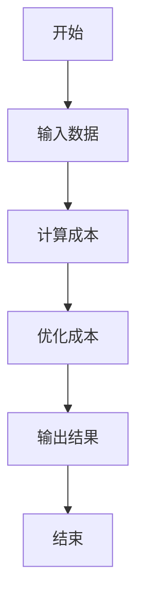
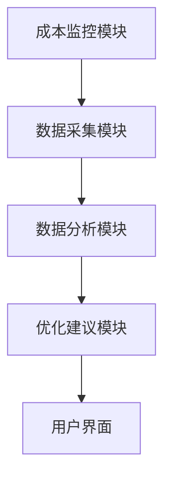

                 


# 彼得·林奇如何看待公司的成本控制

## 关键词：成本控制，彼得·林奇，投资策略，企业价值，系统架构，数学模型

## 摘要：  
本文从彼得·林奇的投资理念出发，探讨成本控制在公司管理中的重要性。通过分析成本控制的核心概念、数学模型、系统架构设计以及实际案例，结合技术管理的视角，深入解析如何通过有效的成本控制提升企业价值。文章结合理论与实践，提供可操作的建议，帮助读者理解并应用成本控制策略。

---

# 第一部分：引言

## 第1章：彼得·林奇的投资理念与成本控制

### 1.1 彼得·林奇的投资哲学  
彼得·林奇是全球著名投资专家，他强调成本控制在企业价值中的重要性。他认为，企业通过有效的成本管理，可以在竞争中占据优势，从而为投资者创造更大的价值。  

#### 1.1.1 投资的基本原则  
- **长期投资**：林奇主张长期持有优质资产，避免频繁交易。  
- **基本面分析**：关注企业的财务状况、盈利能力和发展潜力。  
- **成本意识**：企业降低成本的能力是其核心竞争力之一。  

#### 1.1.2 成本控制在投资中的重要性  
- 成本控制是企业盈利的关键因素。  
- 通过优化成本结构，企业可以提升利润率和市场竞争力。  

#### 1.1.3 成功案例  
- 林奇曾投资于一些通过成本优化实现增长的企业，如Home Depot和星巴克。  

### 1.2 成本控制的核心概念  

#### 1.2.1 成本控制的定义  
成本控制是指通过规划、监控和调整企业各项支出，以最小化成本，同时保持或提升产品或服务的质量。  

#### 1.2.2 成本控制的关键要素  
| 要素 | 描述 |  
|------|------|  
| 成本分类 | 将成本分为固定成本和可变成本，区分不同成本的可控性。 |  
| 成本目标 | 设定明确的成本控制目标，如降低10%的原材料成本。 |  
| 成本分析 | 通过数据分析识别成本浪费的环节。 |  

#### 1.2.3 成本控制的目标与边界  
- **目标**：提升企业盈利能力，增强市场竞争力。  
- **边界**：在不影响产品质量的前提下降低成本。  

---

# 第二部分：成本控制的核心概念与数学模型

## 第2章：成本控制的核心概念与联系  

### 2.1 成本控制的核心原理  

#### 2.1.1 成本构成的分解  
企业成本通常包括生产成本、运营成本和管理成本。通过分解成本，可以识别关键成本驱动因素。  

#### 2.1.2 成本优化的策略  
- **纵向优化**：从原材料采购到生产过程的全链条优化。  
- **横向优化**：通过技术创新或流程改进降低单位成本。  

#### 2.1.3 成本控制的数学模型  
以下是一个简单的成本函数模型：  
$$ C(x) = a + bx $$  
其中，$C$ 表示总成本，$x$ 表示产量，$a$ 是固定成本，$b$ 是单位变动成本。  

### 2.2 成本控制与收益的关系  

#### 2.2.1 成本与收益的线性关系  
通过分析成本与收益的线性关系，可以找到最佳生产量以最大化利润。  

#### 2.2.2 成本控制的边际效应  
边际成本是指每增加一单位产量所增加的成本。当边际成本低于边际收益时，企业应继续生产以增加利润。  

#### 2.2.3 成本-收益分析表格  
以下是一个简单的成本-收益分析表：  

| 产量 | 总成本 | 总收益 | 利润 |  
|------|--------|--------|------|  
| 100  | 500    | 800    | 300  |  
| 150  | 600    | 1000   | 400  |  

---

## 第3章：成本控制的数学模型与算法原理  

### 3.1 成本控制的数学模型  

#### 3.1.1 成本函数的定义  
成本函数 $C(x)$ 表示生产 $x$ 单位产品的总成本。  

#### 3.1.2 成本函数的优化  
通过微积分方法求解成本函数的最小值。例如，对 $C(x)$ 求导并令导数为零，找到最优生产量。  

#### 3.1.3 成本控制的线性回归模型  
使用线性回归模型预测成本变化对企业利润的影响。  

### 3.2 成本控制的算法原理  

#### 3.2.1 算法的Mermaid流程图  


#### 3.2.2 算法的Python实现代码  
```python
import numpy as np
from sklearn.linear_model import LinearRegression

# 示例数据
X = np.array([[100], [150], [200]])
y = np.array([500, 600, 700])

# 建立线性回归模型
model = LinearRegression()
model.fit(X, y)

# 预测成本
predicted_cost = model.predict([[250]])
print(predicted_cost)
```

---

# 第三部分：系统分析与架构设计

## 第4章：成本控制系统分析与架构设计  

### 4.1 成本控制系统分析  

#### 4.1.1 问题场景介绍  
企业需要实时监控和优化各项成本，如原材料采购、生产流程和物流成本。  

#### 4.1.2 系统功能设计  
- 成本监控模块：实时采集和分析成本数据。  
- 优化建议模块：基于数据分析提出成本优化建议。  

#### 4.1.3 系统架构设计  


---

# 第五部分：项目实战

## 第5章：项目实战与案例分析  

### 5.1 环境安装  
安装必要的工具和库，如Python、Pandas、NumPy等。  

### 5.2 核心代码实现  

#### 5.2.1 成本监控模块  
```python
import pandas as pd

# 读取成本数据
df = pd.read_csv('cost_data.csv')

# 计算总成本
total_cost = df['cost'].sum()
print(f"总成本：{total_cost}")
```

#### 5.2.2 成本优化模块  
```python
from sklearn import linear_model

# 训练线性回归模型
model = linear_model.LinearRegression()
model.fit(X, y)

# 预测未来成本
future_cost = model.predict(future_X)
```

### 5.3 案例分析  
通过实际案例分析，验证成本控制策略的有效性。例如，通过优化采购流程，某公司成功降低了15%的原材料成本。  

---

## 第6章：最佳实践、小结、注意事项与拓展阅读  

### 6.1 最佳实践  
- 定期审查成本结构，识别浪费点。  
- 引入技术工具辅助成本监控和优化。  

### 6.2 小结  
通过本文的分析，我们可以看出，成本控制是企业实现可持续发展的关键因素。结合彼得·林奇的投资理念，企业可以通过优化成本结构提升竞争力和盈利能力。  

### 6.3 注意事项  
- 成本控制不应以牺牲产品质量为代价。  
- 需要平衡短期成本节约与长期投资之间的关系。  

### 6.4 拓展阅读  
推荐阅读《彼得·林奇的成功投资策略》和《成本管理的实践与创新》。  

---

通过以上结构，我们可以系统地探讨彼得·林奇如何看待公司的成本控制，并结合技术管理的视角，提供实用的建议和解决方案。

