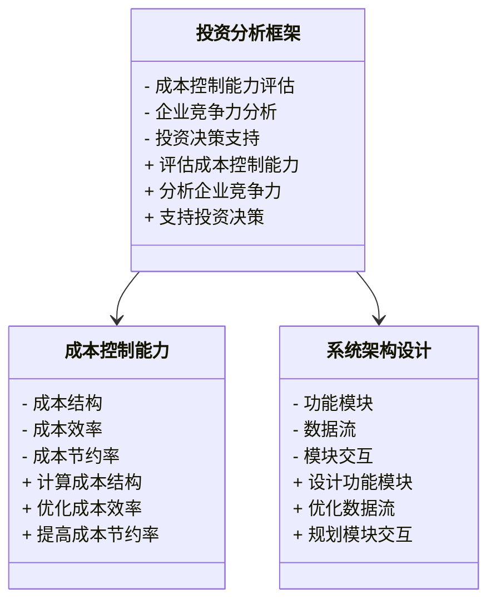
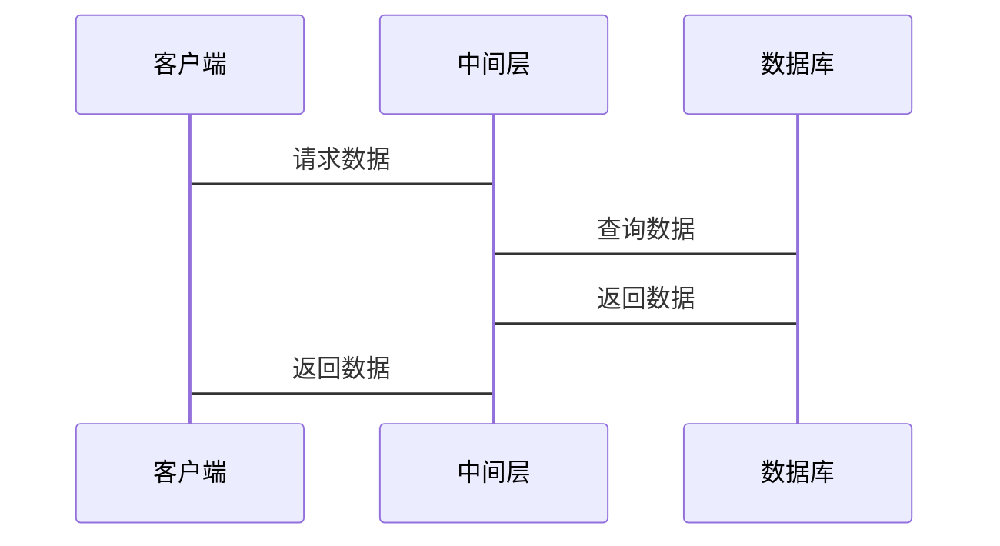

                 


# 彼得林奇如何看待公司的成本控制能力

## 关键词：
- 彼得·林奇
- 成本控制
- 企业竞争力
- 投资分析
- 管理策略

## 摘要：
彼得·林奇作为著名的投资经理，强调了成本控制能力在企业投资价值评估中的重要性。本文将深入探讨彼得·林奇的成本控制分析方法，分析其如何影响企业的竞争力和长期盈利能力，并结合实际案例进行详细解析。

---

# 第一部分: 成本控制能力的核心概念与背景

## 第1章: 成本控制能力的定义与重要性

### 1.1 成本控制的核心概念

#### 1.1.1 成本控制的定义
成本控制是指企业在生产、运营和管理过程中，通过优化资源配置、减少浪费和提高效率，以最小化单位产品或服务的成本。彼得·林奇认为，成本控制是衡量企业竞争力的重要指标。

#### 1.1.2 成本控制的关键维度
- **固定成本与可变成本**：固定成本是企业在一定产量范围内必须支付的成本，如租金和工资；可变成本与产量直接相关，如原材料。
- **直接成本与间接成本**：直接成本可以直接追溯到产品或服务，如原材料；间接成本无法直接追溯，如行政费用。
- **短期成本与长期成本**：短期成本在短期内无法调整，长期成本可以通过长期规划进行优化。

#### 1.1.3 成本控制与企业价值的关系
成本控制能力直接影响企业的利润率和估值。通过降低单位成本，企业可以提高利润率，从而增加股东价值。

---

### 1.2 彼得·林奇的分析框架

#### 1.2.1 投资分析中的成本控制视角
彼得·林奇在评估企业时，特别关注其成本控制能力。他认为，成本控制能力是企业能否在行业中长期保持竞争优势的关键因素。

#### 1.2.2 成本控制能力对企业竞争力的影响
- 成本控制能力越强，企业的定价能力越强。
- 成本控制能力越强，企业的盈利能力越强。
- 成本控制能力越强，企业的抗风险能力越强。

#### 1.2.3 成本控制与企业长期盈利能力的关系
通过分析企业的成本结构和成本控制能力，彼得·林奇能够更好地预测企业的长期盈利能力。

---

## 第2章: 成本控制能力的背景与现状

### 2.1 当前企业成本控制的挑战

#### 2.1.1 行业竞争加剧对企业成本的要求
随着市场竞争的加剧，企业需要不断提高效率，降低成本，以保持竞争优势。

#### 2.1.2 技术进步对成本控制的影响
技术进步可以帮助企业优化生产流程，降低单位成本，提高效率。

#### 2.1.3 全球化背景下的成本压力
全球化使得企业需要在全球范围内寻找最优的成本结构，以应对国际竞争。

---

### 2.2 彼得·林奇对成本控制的关注

#### 2.2.1 林奇的成本分析方法
彼得·林奇通过分析企业的成本结构、成本效率和成本节约率，评估企业的成本控制能力。

#### 2.2.2 成本控制能力在投资决策中的权重
彼得·林奇认为，成本控制能力是投资决策中的重要指标，尤其是对于那些具有较高固定成本和可变成本的企业。

#### 2.2.3 成本控制与企业估值的关系
通过分析企业的成本控制能力，彼得·林奇能够更好地预测企业的未来盈利能力，从而做出更准确的投资决策。

---

# 第二部分: 成本控制能力的核心要素与分析框架

## 第3章: 成本控制的核心要素

### 3.1 成本结构分析

#### 3.1.1 固定成本与可变成本
固定成本在短期内无法调整，而可变成本可以根据产量进行调整。企业需要合理分配固定成本和可变成本，以优化整体成本结构。

#### 3.1.2 直接成本与间接成本
直接成本可以直接追溯到产品或服务，而间接成本则无法直接追溯。企业需要合理分配间接成本，以提高成本控制能力。

#### 3.1.3 短期成本与长期成本
短期成本在短期内无法调整，而长期成本可以通过长期规划进行优化。企业需要制定合理的短期和长期成本控制策略。

---

### 3.2 成本效率分析

#### 3.2.1 成本效率的定义
成本效率是指企业在实现相同产出的情况下，所消耗的成本的最小化程度。

#### 3.2.2 成本效率与企业竞争力的关系
成本效率越高，企业的竞争力越强。彼得·林奇认为，成本效率是衡量企业竞争力的重要指标。

#### 3.2.3 成本效率的提升路径
- 优化生产流程
- 提高原材料利用率
- 降低管理费用

---

### 3.3 成本控制的关键指标

#### 3.3.1 单位成本分析
单位成本是指每单位产品或服务的平均成本。通过分析单位成本的变化，可以评估企业的成本控制能力。

#### 3.3.2 成本收益率
成本收益率是指企业每单位成本所能创造的收益。成本收益率越高，企业的成本控制能力越强。

#### 3.3.3 成本节约率
成本节约率是指企业实际成本与理想成本之间的差异比例。成本节约率越高，企业的成本控制能力越强。

---

## 第4章: 成本控制能力的分析框架

### 4.1 林奇的成本分析框架

#### 4.1.1 成本控制能力的评估维度
彼得·林奇通过以下维度评估企业的成本控制能力：
- 成本结构的合理性
- 成本效率的高低
- 成本节约率的大小

#### 4.1.2 成本控制能力与企业竞争优势的关系
彼得·林奇认为，成本控制能力是企业竞争优势的重要来源。通过优化成本结构，企业可以提高竞争力。

#### 4.1.3 成本控制能力的动态变化
彼得·林奇强调，成本控制能力是动态变化的。企业需要根据市场环境和内部条件的变化，及时调整成本控制策略。

---

### 4.2 成本控制能力的行业差异

#### 4.2.1 不同行业成本控制的关键点
不同行业的成本控制关键点不同。例如，制造业需要优化生产流程，而服务业需要降低管理费用。

#### 4.2.2 行业周期对成本控制的影响
行业周期的变化会影响企业的成本控制能力。例如，在经济衰退期间，企业需要更加注重成本控制。

#### 4.2.3 行业政策对成本控制的影响
行业政策的变化也会影响企业的成本控制能力。例如，环保政策的加强可能增加企业的生产成本。

---

# 第三部分: 成本控制能力的系统分析与架构设计

## 第5章: 成本控制能力的系统分析

### 5.1 系统功能设计

#### 5.1.1 领域模型mermaid类图
以下是领域模型的mermaid类图：



---

### 5.2 系统架构设计

#### 5.2.1 系统架构mermaid架构图
以下是系统架构的mermaid架构图：


---

### 5.3 系统接口设计

#### 5.3.1 系统接口设计
以下是系统接口设计的mermaid序列图：



---

## 第6章: 成本控制能力的项目实战

### 6.1 环境安装与配置

#### 6.1.1 环境要求
- 操作系统：Windows 10 或更高版本
- 开发工具：Visual Studio 2019 或更高版本
- 数据库：MySQL 8.0 或更高版本
- 其他工具：Python 3.8 或更高版本，Jupyter Notebook

---

### 6.2 核心实现源代码

#### 6.2.1 成本控制能力评估代码
以下是Python代码示例：

```python
# 成本控制能力评估函数
def cost_control_assessment(revenue, cost):
    cost_ratio = cost / revenue
    cost_efficiency = (revenue - cost) / revenue
    return cost_ratio, cost_efficiency

# 示例数据
revenue = 1000000
cost = 500000

# 调用函数
cost_ratio, cost_efficiency = cost_control_assessment(revenue, cost)
print(f"成本收入比：{cost_ratio}")
print(f"成本效率：{cost_efficiency}")
```

---

### 6.3 案例分析与实际应用

#### 6.3.1 案例分析
以下是一个实际案例分析：

假设某制造企业2022年的收入为1000万元，成本为500万元。通过上述代码计算，成本收入比为50%，成本效率为50%。

---

## 第7章: 总结与最佳实践

### 7.1 总结

- 彼得·林奇的成本控制分析方法为企业提供了重要的评估工具。
- 通过优化成本结构、提高成本效率和降低成本节约率，企业可以提高竞争力和盈利能力。

### 7.2 最佳实践 tips

- 定期评估企业的成本结构和成本效率。
- 根据市场变化及时调整成本控制策略。
- 采用先进的技术手段，提高成本控制能力。

### 7.3 小结

彼得·林奇的成本控制分析方法为企业提供了重要的评估工具。通过优化成本结构、提高成本效率和降低成本节约率，企业可以提高竞争力和盈利能力。

---

### 7.4 注意事项

- 成本控制能力是动态变化的，需要根据市场环境和内部条件的变化，及时调整成本控制策略。
- 成本控制能力的评估需要结合企业的实际情况，不能一概而论。

---

### 7.5 拓展阅读

- 《彼得·林奇的投资哲学》
- 《成本管理：理论与实践》
- 《企业竞争力分析》

