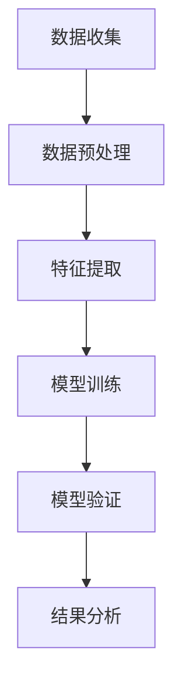
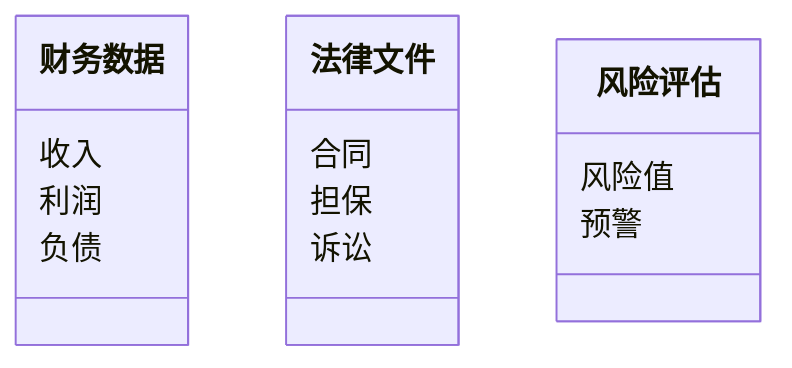
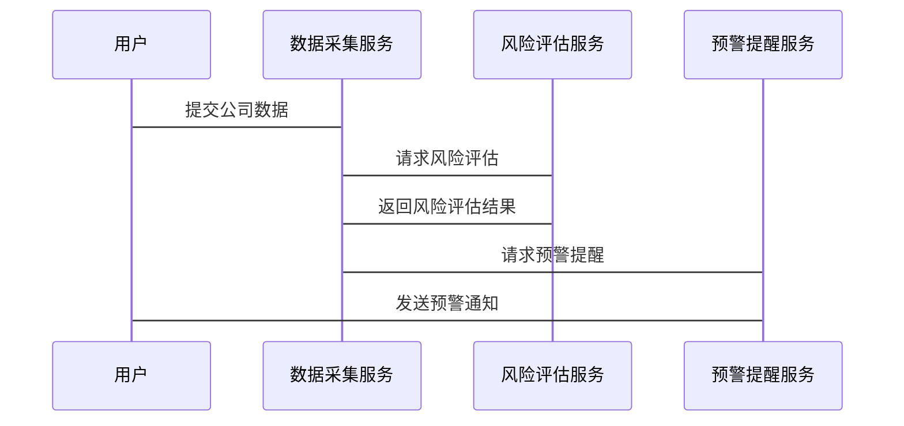

                 


# 彼得林奇如何看待公司的或有负债风险

## 关键词：彼得林奇，或有负债，财务风险，投资策略，企业风险管理

## 摘要：  
本文深入探讨了彼得·林奇对公司在处理或有负债风险时的看法。通过分析或有负债的概念、影响以及实际案例，结合定量分析和定性判断，本文为投资者提供了一套识别和评估公司或有负债风险的系统方法。

---

# 第一章：背景介绍

## 1.1 或有负债的定义与背景

### 1.1.1 或有负债的概念  
或有负债（Contingent Liabilities）是指公司可能在未来发生的潜在债务或责任。这些负债通常源于合同、法律纠纷、担保、诉讼或其他不确定事件。  
- **合同负债**：源于未履行的合同或协议。  
- **担保责任**：为其他方提供担保所产生的潜在债务。  
- **诉讼风险**：因法律纠纷可能产生的赔偿责任。  

### 1.1.2 或有负债的背景与重要性  
或有负债是企业财务健康的重要指标，尤其是在高负债行业（如制造业、建筑业）更为关键。它们可能影响企业的信用评级、融资成本和偿债能力。  

### 1.1.3 企业或有负债的分类与外延  
| 类型             | 描述                                   | 示例                     |  
|------------------|--------------------------------------|--------------------------|  
| 合同相关负债     | 未履行的合同或协议                   | 未交货的订单             |  
| 担保责任         | 为第三方提供担保                     | 银行贷款担保             |  
| 诉讼相关负债     | 因诉讼可能产生的赔偿责任             | 产品责任诉讼             |  
| 其他             | 其他潜在的或有负债                   | 环境污染赔偿             |  

---

## 1.2 企业或有负债的核心要素

### 1.2.1 或有负债的核心概念结构  
或有负债的结构化分析如下：  
- **触发条件**：什么事件会触发或有负债？  
- **责任范围**：潜在债务的具体金额和范围？  
- **法律依据**：是否有法律依据或合同支持？  

### 1.2.2 核心要素的特征对比表格  
| 特征             | 描述                                   | 示例                     |  
|------------------|--------------------------------------|--------------------------|  
| 触发条件         | 可能触发的事件                         | 诉讼判决                 |  
| 责任范围         | 涵盖的债务范围                         | 具体金额                 |  
| 法律依据         | 相关法律或合同                         | 担保合同                 |  

---

# 第二章：核心概念与联系

## 2.1 或有负债的核心原理

### 2.1.1 或有负债的形成机制  
或有负债通常源于公司经营中的不确定性和潜在风险。例如，未履行的合同、担保承诺或未决诉讼都可能引发或有负债。  

### 2.1.2 或有负债与财务报表的关系  
- **资产负债表**：或有负债通常不在资产负债表中直接反映，但可能影响企业的信用评级和融资能力。  
- **利润表**：潜在的赔偿或罚款可能影响企业的净利润。  

### 2.1.3 或有负债的潜在影响  
或有负债可能对企业的财务健康和市场价值产生重大影响，尤其是在以下情况下：  
- 负债金额巨大，超出企业偿债能力。  
- 或有负债涉及核心业务或主要资产。  
- 负债可能引发连锁反应，如债权人要求提前还款。  

---

## 2.2 或有负债与企业信用风险的关系

### 2.2.1 或有负债对信用评级的影响  
或有负债可能降低企业的信用评级，因为它们增加了企业的财务不确定性。  

### 2.2.2 或有负债与企业偿债能力的关联  
或有负债可能削弱企业的偿债能力，尤其是在以下情况下：  
- 或有负债金额较高，接近或超过企业现有资产。  
- 或有负债涉及多个债权人，可能引发多头追偿。  

---

# 第三章：算法原理讲解

## 3.1 或有负债风险评估的算法模型

### 3.1.1 数据收集与预处理  
- **数据来源**：公司财务报表、法律文件、行业报告。  
- **数据清洗**：去除缺失值、异常值，标准化处理。  

### 3.1.2 模型构建与验证  
使用逻辑回归模型预测或有负债风险：  
$$ P(\text{风险}) = \beta_0 + \beta_1 X_1 + \beta_2 X_2 + \ldots + \beta_n X_n $$  
其中，$X_i$ 是财务指标（如负债率、流动比率），$\beta_i$ 是回归系数。  

### 3.1.3 模型优化  
使用训练数据调整回归系数，确保模型的准确性和稳定性。  

---

## 3.2 使用 Mermaid 绘制算法流程图



---

## 3.3 算法的数学模型与公式

### 3.3.1 风险评估的数学模型  
$$ R = \alpha X + \beta Y $$
其中，$R$ 表示风险值，$X$ 和 $Y$ 分别表示相关财务指标。

### 3.3.2 模型的优化与调整  
$$ \text{损失函数} = \sum_{i=1}^{n} (y_i - \hat{y}_i)^2 $$
其中，$y_i$ 是实际值，$\hat{y}_i$ 是预测值。

---

# 第四章：系统分析与架构设计方案

## 4.1 问题场景介绍

### 4.1.1 企业或有负债风险的识别需求  
如何通过系统化的方法识别和评估公司或有负债风险？  

### 4.1.2 系统目标与功能需求  
- **目标**：建立一个自动化评估系统，识别或有负债风险。  
- **功能需求**：数据采集、风险评估、预警提醒。  

### 4.1.3 问题的边界与限制  
- 数据范围：公司过去三年的财务报表和法律文件。  
- 系统限制：仅支持单个公司分析，不支持批量处理。  

---

## 4.2 系统功能设计

### 4.2.1 领域模型（Mermaid 类图）



---

## 4.3 系统架构设计

### 4.3.1 系统架构（Mermaid 架构图）

```mermaid
container 系统架构 {
    service 数据采集服务 {
        数据采集模块
        数据预处理模块
    }

    service 风险评估服务 {
        特征提取模块
        模型训练模块
    }

    service 预警提醒服务 {
        风险预警模块
        通知模块
    }
}
```

---

## 4.4 系统接口设计

### 4.4.1 接口描述  
- 数据采集接口：接收公司财务数据和法律文件。  
- 风险评估接口：返回风险评估结果和预警信息。  

### 4.4.2 接口交互流程（Mermaid 序列图）



---

# 第五章：项目实战

## 5.1 项目背景介绍

### 5.1.1 案例背景  
某制造公司因未履行合同面临潜在诉讼赔偿，可能影响其信用评级。  

### 5.1.2 数据准备  
- 财务数据：过去三年的收入、利润、负债。  
- 法律文件：未履行的合同、担保协议、诉讼记录。  

---

## 5.2 系统核心实现

### 5.2.1 代码实现  
```python
import pandas as pd
from sklearn.linear_model import LogisticRegression

# 数据加载与预处理
data = pd.read_csv('负债数据.csv')
X = data[['收入', '利润', '负债']]
y = data['风险标签']

# 模型训练
model = LogisticRegression()
model.fit(X, y)

# 模型验证
score = model.score(X, y)
print(f"模型准确率：{score}")
```

### 5.2.2 代码应用解读  
- 数据加载：读取负债数据。  
- 模型训练：使用逻辑回归预测风险。  
- 模型验证：计算模型准确率。  

---

## 5.3 实际案例分析

### 5.3.1 案例分析  
假设某制造公司：  
- 收入：1000万元  
- 利润：200万元  
- 负债：500万元  

根据模型预测，风险值为0.8（高风险）。  

### 5.3.2 结果解读  
- 风险值较高，建议进一步调查潜在的诉讼或担保责任。  

---

## 5.4 项目小结  
通过实际案例分析，验证了系统的有效性和实用性，为投资者提供了可靠的决策支持工具。

---

# 第六章：最佳实践与注意事项

## 6.1 总结彼得·林奇的智慧  
- **关注或有负债**：彼得·林奇强调，或有负债是投资决策的重要考量因素。  
- **全面评估**：投资者应结合定量分析和定性判断，全面评估企业的财务风险。  

## 6.2 投资策略建议  
- **分散投资**：避免过度集中在高风险行业。  
- **定期复盘**：定期评估投资组合的或有负债风险。  

## 6.3 注意事项  
- **数据准确性**：确保数据来源可靠，避免误判。  
- **模型局限性**：模型是辅助工具，不能完全依赖。  

## 6.4 拓展阅读  
- 推荐阅读彼得·林奇的《投资任何股票的智慧》。  

---

# 第七章：结论

## 7.1 回顾与总结  
本文从彼得·林奇的视角，系统分析了公司或有负债风险的识别与评估方法。通过理论分析、算法讲解和案例实战，为投资者提供了一套实用的决策支持工具。  

## 7.2 展望未来  
随着企业经营环境的复杂化，对或有负债的识别和评估将更加重要。投资者应持续关注相关风险，优化投资策略。  

---

# 结语  
通过本文的学习，读者可以更好地理解彼得·林奇的投资智慧，并在实际投资中应用这些方法，做出更明智的决策。

