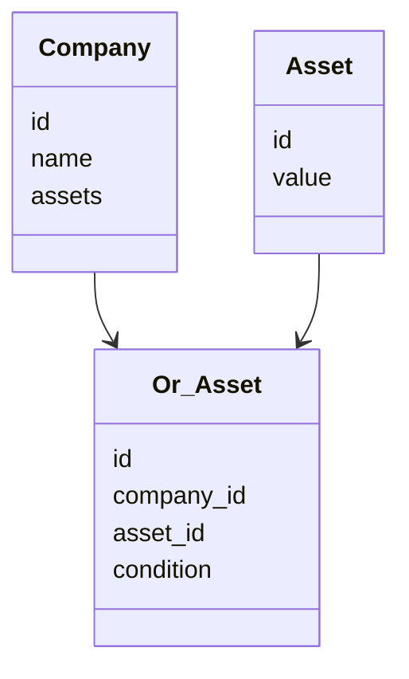
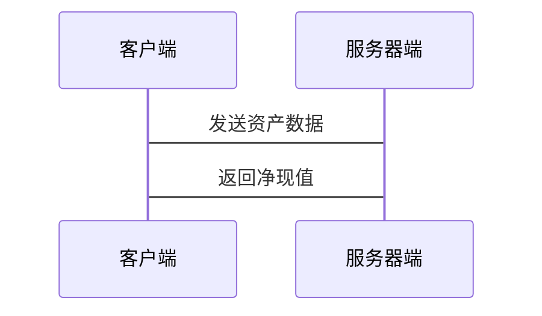

                 


# 彼得·林奇如何看待公司的或有资产价值

## 关键词：
- 彼得·林奇
- 或有资产
- 资产评估
- 投资策略
- 价值分析

## 摘要：
本文深入探讨了彼得·林奇在其投资生涯中如何评估公司的或有资产价值。通过分析其核心理念、数学模型、系统架构以及实际案例，详细解读了或有资产的定义、分类、评估方法及其在投资决策中的应用。文章结合理论与实践，为投资者提供了清晰的指导和实用的工具。

---

## 第一部分：引言

### 1.1 投资的基本概念
#### 1.1.1 投资的基本定义
投资是指将资金投入某个项目或资产，以期在未来获得收益或资本增值的经济活动。投资的核心目标是通过科学的分析和决策，最大化收益并降低风险。

#### 1.1.2 投资的核心原则
- **分散投资**：避免将所有资金投入单一资产，以降低风险。
- **长期视角**：关注企业的长期价值，而非短期波动。
- **基本面分析**：通过对企业财务状况、行业地位和管理层能力的分析，评估其潜在价值。

#### 1.1.3 彼得·林奇的背景与投资理念
彼得·林奇是美国著名投资专家，以其在共同基金领域的卓越表现闻名。他认为，投资的关键在于深入研究企业基本面，发现那些被市场低估的优质企业。

### 1.2 公司或有资产的定义与背景
#### 1.2.1 什么是公司或有资产
或有资产是指公司可能在未来某个条件下获得的资产，其存在取决于某些特定事件的发生。例如，未决诉讼的胜诉赔偿或期权合同的行权收益。

#### 1.2.2 或有资产的分类与特点
或有资产可以分为：
1. **潜在资产**：企业可能获得的未来收益，如专利申请的成功。
2. **或有负债**：企业可能在未来承担的潜在债务，如未决诉讼的赔偿。

#### 1.2.3 或有资产在企业价值中的作用
或有资产可能对企业的财务状况产生重大影响，尤其是在极端情况下。因此，在评估企业价值时，必须考虑这些潜在因素。

---

## 第二部分：核心概念与联系

### 2.1 或有资产的核心概念
#### 2.1.1 或有资产的定义与属性
- 或有资产的存在依赖于特定条件的满足。
- 或有资产的公允价值难以准确计量，通常需要假设和估算。

#### 2.1.2 或有资产与其他资产的对比
| 资产类型 | 现金流 | 确定性 | 时间价值 |
|----------|--------|---------|----------|
| 或有资产 | 不确定 | 低      | 高        |
| 固定资产 | 稳定   | 高      | 中        |

#### 2.1.3 或有资产的ER实体关系图
```mermaid
erDiagram
    company {
        id
        name
        address
    }
    asset {
        id
        name
        value
    }
    or_asset {
        id
        company_id
        asset_id
        condition
    }
    company o- or_asset
    asset o- or_asset
```

### 2.2 或有资产的评估方法
#### 2.2.1 现金流折现法
现金流折现法是评估或有资产价值的核心方法，公式如下：
$$ PV = \sum_{t=1}^{n} \frac{CF_t}{(1 + r)^t} $$
其中：
- \( PV \)：现值
- \( CF_t \)：第 \( t \) 年的现金流
- \( r \)：折现率

---

## 第三部分：数学模型与算法原理

### 3.1 现金流折现模型
#### 3.1.1 模型公式与解释
现金流折现模型通过将未来现金流折现为现值，评估资产的当前价值。例如，假设某公司未来3年的现金流分别为100万元、150万元和200万元，折现率为10%。现值计算如下：
$$ PV = \frac{100}{1.1} + \frac{150}{1.1^2} + \frac{200}{1.1^3} $$

#### 3.1.2 公式推导与数学证明
通过数学推导，现金流折现模型证明了未来现金流的当前价值可以通过贴现率进行调整，从而反映时间价值和风险因素。

#### 3.1.3 实际案例分析
以下是一个简单的现金流折现模型的Python实现：
```python
def npv(cash_flows, discount_rate):
    return sum(cf / (1 + discount_rate) ** t for t, cf in enumerate(cash_flows))

cash_flows = [100, 150, 200]
discount_rate = 0.1

print("净现值：", npv(cash_flows, discount_rate))
```

### 3.2 净现值模型
#### 3.2.1 净现值公式
净现值（NPV）是现金流折现值与初始投资的差值：
$$ NPV = PV - \text{初始投资} $$

#### 3.2.2 净现值计算步骤
1. 确定初始投资和未来现金流。
2. 选择适当的贴现率。
3. 计算未来现金流的现值。
4. 净现值为现值减去初始投资。

---

## 第四部分：系统分析与架构设计

### 4.1 系统分析
#### 4.1.1 问题场景介绍
评估公司或有资产价值的核心问题是如何准确计量其未来现金流的现值。

#### 4.1.2 领域模型Mermaid类图


#### 4.1.3 系统架构设计Mermaid架构图
```mermaid
container 客户端 {
    "" 
}
container 服务器端 {
    "" 
}
```

### 4.2 系统接口与交互设计
#### 4.2.1 系统接口设计
- 输入接口：公司名称、资产类型、现金流数据。
- 输出接口：净现值、内含收益率。

#### 4.2.2 系统交互Mermaid序列图


---

## 第五部分：项目实战

### 5.1 环境安装与数据准备
#### 5.1.1 环境配置
- Python 3.8+
- NumPy和Pandas库

#### 5.1.2 数据收集与处理
```python
import pandas as pd
data = pd.DataFrame({
    '现金流': [100, 150, 200],
    '年份': [1, 2, 3]
})
```

### 5.2 系统核心实现
#### 5.2.1 现金流折现模型实现
```python
import numpy as np

def npv(cash_flows, discount_rate):
    return np.sum(cash_flows / (1 + discount_rate) ** np.arange(len(cash_flows)))

print("净现值：", npv([100, 150, 200], 0.1))
```

#### 5.2.2 案例分析与代码实现
以下是一个完整的现金流折现模型的实现：
```python
import pandas as pd
import numpy as np

# 数据准备
data = pd.DataFrame({
    '现金流': [100, 150, 200],
    '年份': [1, 2, 3]
})

# 净现值计算
def calculate_npv(cash_flows, discount_rate):
    return np.npv(discount_rate, *cash_flows[::-1])

npv_value = calculate_npv(data['现金流'].values, 0.1)
print("净现值：", npv_value)
```

---

## 第六部分：总结

### 6.1 投资中的注意事项
- **分散投资**：避免将所有资金投入单一资产。
- **长期视角**：关注企业的长期价值，而非短期波动。

### 6.2 未来展望
随着技术的进步，或有资产的评估方法将更加精准和复杂，投资者需要不断学习和适应新的工具和技术。

---

通过本文的分析，我们可以看到，彼得·林奇看待公司的或有资产价值的方法，不仅仅是理论上的探讨，更需要实际的数学模型和系统架构的支持。希望本文能够为投资者提供有价值的参考和指导。

