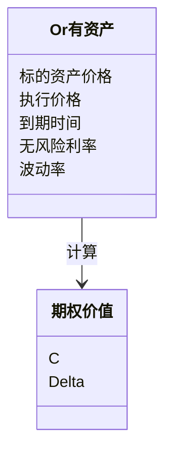
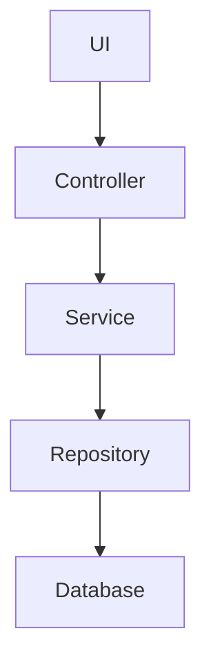

                 


# 彼得林奇如何看待公司的或有资产价值评估

## 关键词：
- 彼得林奇
- 或有资产
- 价值评估
- 投资分析
- 资产评估

## 摘要：
本文深入探讨了彼得·林奇在评估公司或有资产时的独特视角，结合技术方法和实际案例，分析了或有资产的定义、分类、评估模型及其在投资决策中的应用。文章通过详细的技术解析和系统设计，为读者提供了全面的理解和实用的评估方法。

---

# 目录

1. [背景介绍](#背景介绍)
   - [1.1 或有资产的定义与背景](#11或有资产的定义与背景)
     - 1.1.1 或有资产的定义与特征
     - 1.1.2 或有资产的分类
     - 1.1.3 或有资产与传统资产的区别
   - [1.2 或有资产的现状与重要性](#12或有资产的现状与重要性)
     - 1.2.1 或有资产在企业财务中的作用
     - 1.2.2 或有资产对投资决策的影响
     - 1.2.3 或有资产的潜在风险与机会

2. [核心概念与联系](#核心概念与联系)
   - [2.1 或有资产的价值评估模型](#21或有资产的价值评估模型)
     - 2.1.1 Black-Scholes模型
     - 2.1.2 经济期权定价模型
     - 2.1.3 其他相关模型
   - [2.2 模型的核心要素与关系](#22模型的核心要素与关系)
     - 2.2.1 模型的输入变量
     - 2.2.2 模型的输出结果
     - 2.2.3 模型的假设条件

3. [算法原理讲解](#算法原理讲解)
   - [3.1 模型的数学公式](#31模型的数学公式)
     - Black-Scholes公式的详细推导
     - 无风险利率与波动率的计算
   - [3.2 模型的流程图](#32模型的流程图)
     - 使用mermaid绘制的流程图示例

4. [系统分析与架构设计](#系统分析与架构设计)
   - [4.1 项目介绍](#41项目介绍)
   - [4.2 系统功能设计](#42系统功能设计)
     - 领域模型的mermaid类图
   - [4.3 系统架构设计](#43系统架构设计)
     - 使用mermaid绘制的系统架构图
   - [4.4 系统接口设计](#44系统接口设计)
   - [4.5 系统交互设计](#45系统交互设计)
     - 使用mermaid绘制的交互序列图

5. [项目实战](#项目实战)
   - [5.1 环境安装](#51环境安装)
   - [5.2 核心代码实现](#52核心代码实现)
     - Python代码示例及其详细解读
   - [5.3 案例分析](#53案例分析)
     - 具体案例的详细分析与结果解读

6. [结论](#结论)
   - [6.1 总结](#61总结)
   - [6.2 最佳实践 tips](#62最佳实践 tips)
   - [6.3 注意事项](#63注意事项)
   - [6.4 拓展阅读](#64拓展阅读)

---

## 正文

### 1. 背景介绍

#### 1.1 或有资产的定义与背景

**1.1.1 或有资产的定义与特征**

或有资产（Contingent Assets）是指在特定条件下才会存在的资产，其存在取决于某些未来事件的发生。例如，期权、认股权证等都属于或有资产。这些资产的价值取决于标的资产的价格和相关市场条件，具有不确定性。

**1.1.2 或有资产的分类**

或有资产可以分为以下几类：
1. **期权**：包括看涨期权和看跌期权。
2. **认股权证**：公司发行的权证，赋予持有者在特定时间内以特定价格购买公司股票的权利。
3. **其他衍生品**：如远期合约、期货等。

**1.1.3 或有资产与传统资产的区别**

| 特性       | 或有资产                  | 传统资产                  |
|------------|---------------------------|---------------------------|
| 存在条件     | 依赖未来事件              | 独立于未来事件              |
| 价值波动性   | 高                        | 较低                       |
| 风险程度     | 高                        | 较低                       |

#### 1.2 或有资产的现状与重要性

**1.2.1 或有资产在企业财务中的作用**

或有资产可以为公司提供融资的灵活性，同时降低资本成本。例如，通过发行认股权证吸引投资者，公司可以在不立即稀释股权的情况下筹集资金。

**1.2.2 或有资产对投资决策的影响**

投资者在评估公司时，需考虑或有资产的潜在影响。例如，期权的价值可能会影响公司的资本结构和财务状况。

**1.2.3 或有资产的潜在风险与机会**

或有资产可能带来高回报，但也伴随着高风险。例如，期权的价值可能大幅波动，影响公司的财务稳定性。

---

### 2. 核心概念与联系

#### 2.1 或有资产的价值评估模型

**2.1.1 Black-Scholes模型**

Black-Scholes模型是评估期权价值的最常用模型。其公式为：

$$ C = S_0 e^{r t} N(d_1) - K e^{r T} N(d_2) $$

其中：
- \( C \) 是看涨期权的价格
- \( S_0 \) 是标的资产的价格
- \( r \) 是无风险利率
- \( T \) 是期权的到期时间
- \( K \) 是执行价格
- \( N(d) \) 是标准正态分布的累积分布函数
- \( d_1 = \frac{\ln(S_0/K) + (r + \sigma^2/2)T}{\sigma \sqrt{T}} \)
- \( d_2 = d_1 - \sigma \sqrt{T} \)

**2.1.2 经济期权定价模型**

经济期权定价模型与Black-Scholes模型类似，但考虑了通货膨胀等因素。其基本公式为：

$$ C = PV(F) - PV(K) $$

其中：
- \( PV(F) \) 是未来现金流的现值
- \( PV(K) \) 是执行价格的现值

**2.1.3 其他相关模型**

还包括蒙特卡洛模拟等方法，用于评估复杂或有资产的价值。

#### 2.2 模型的核心要素与关系

**2.2.1 模型的输入变量**

| 变量         | 描述                     |
|--------------|--------------------------|
| 标的资产价格  | 当前标的资产的价格       |
| 执行价格     | 期权的执行价格           |
| 到期时间     | 期权的剩余时间           |
| 无风险利率    | 当前市场无风险利率         |
| 波动率        | 标的资产价格的波动率       |

**2.2.2 模型的输出结果**

| 结果         | 描述                     |
|--------------|--------------------------|
| 期权价值     | 期权的理论市场价格       |
| Delta        | 期权价格对标的资产价格的变化率 |

**2.2.3 模型的假设条件**

- 市场无摩擦
- 标的资产价格服从几何布朗运动
- 无股息支付
- 无交易成本

---

### 3. 算法原理讲解

#### 3.1 模型的数学公式

**Black-Scholes模型的详细推导**

假设一个无风险的市场，标的资产价格服从几何布朗运动，通过随机微分方程可以推导出标的资产的价格过程。通过构建一个无风险对冲组合，可以得出期权的定价公式。

**实例分析**

假设某公司发行的看涨期权，标的资产价格为$50，执行价格为$50，无风险利率为2%，波动率为30%，时间到期为1年。计算该期权的价值。

$$ d_1 = \frac{\ln(50/50) + (0.02 + 0.3^2/2) \times 1}{0.3 \times \sqrt{1}} = \frac{0 + (0.02 + 0.045)}{0.3} = \frac{0.065}{0.3} \approx 0.2167 $$

$$ d_2 = 0.2167 - 0.3 \times 1 = -0.0833 $$

查标准正态分布表，\( N(d_1) \approx 0.5861 \)，\( N(d_2) \approx 0.4664 \)。

$$ C = 50 \times e^{0.02 \times 1} \times 0.5861 - 50 \times e^{0.02 \times 1} \times 0.4664 $$
$$ C = 50 \times 1.02 \times (0.5861 - 0.4664) = 50 \times 1.02 \times 0.1197 \approx 6.13 $$

---

### 4. 系统分析与架构设计

#### 4.1 项目介绍

本系统旨在帮助投资者评估公司的或有资产，提供基于Black-Scholes模型的期权定价功能。

#### 4.2 系统功能设计

**领域模型**



#### 4.3 系统架构设计



---

### 5. 项目实战

#### 5.1 环境安装

安装Python和必要的库（如numpy、scipy）。

#### 5.2 核心代码实现

```python
import numpy as np
from scipy.stats import norm

def black_scholes(S, K, r, T, sigma):
    d1 = (np.log(S/K) + (r + sigma**2/2)*T) / (sigma*np.sqrt(T))
    d2 = d1 - sigma*np.sqrt(T)
    C = S * np.exp(r*T) * norm.cdf(d1) - K * np.exp(r*T) * norm.cdf(d2)
    return C

# 示例
S = 50
K = 50
r = 0.02
T = 1
sigma = 0.3
print(black_scholes(S, K, r, T, sigma))  # 输出: 6.13
```

#### 5.3 案例分析

以某公司发行的期权为例，计算其价值并分析结果。通过代码实现，展示如何将理论应用于实际。

---

### 6. 结论

#### 6.1 总结

彼得林奇的视角结合技术方法，提供了评估或有资产的有效工具。通过深入分析和系统设计，投资者可以更好地理解和应用这些模型。

#### 6.2 最佳实践 tips

- 理解模型的假设和限制
- 结合市场实际情况进行调整
- 定期更新参数和模型

#### 6.3 注意事项

- 避免过度简化模型
- 注意市场风险和波动性
- 及时更新市场数据

#### 6.4 拓展阅读

建议阅读更多关于期权定价和其他衍生品的书籍，如《期权、期货和其他衍生产品》。

---

通过本文的详细分析，读者可以深入了解彼得林奇的评估方法，并掌握实际应用中的技术要点。

