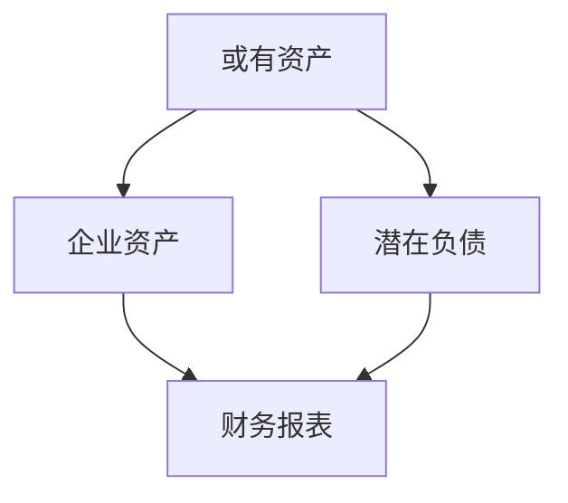
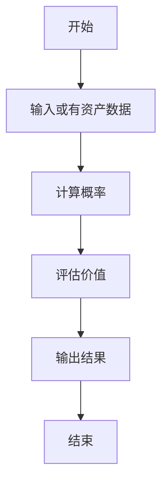
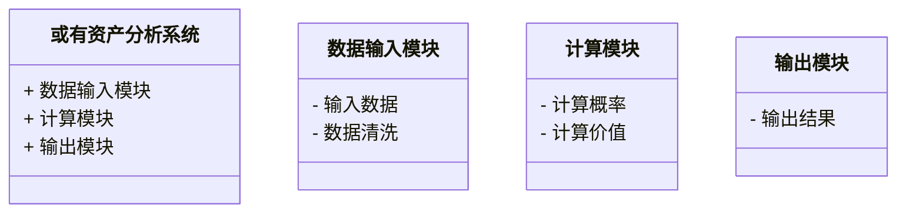
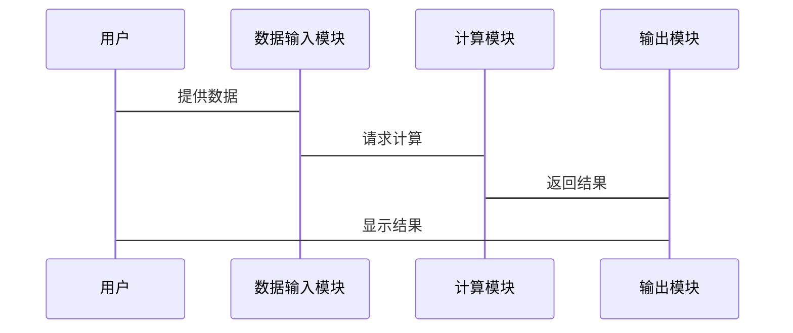

                 


# 彼得林奇如何看待公司的或有资产对长期价值创造的潜在贡献

## 关键词：彼得·林奇, 或有资产, 长期价值创造, 潜在贡献, 投资策略, 财务分析, 风险管理

## 摘要：本篇文章将深入探讨彼得·林奇如何通过分析公司的或有资产来评估其长期价值创造的潜力。我们将从或有资产的基本概念、核心概念、算法原理、系统分析与架构设计、项目实战以及最佳实践等多方面展开讨论，结合具体的案例分析和详细的代码实现，帮助读者全面理解彼得·林奇的投资策略以及如何在实际操作中应用这一理念。

---

## 目录大纲：

### 第1章：背景介绍

#### 1.1 或有资产的基本概念与背景
- 1.1.1 或有资产的定义与分类
- 1.1.2 或有资产在财务报表中的位置
- 1.1.3 或有资产对长期价值创造的重要性

#### 1.2 彼得·林奇的投资理念与或有资产
- 1.2.1 彼得·林奇的投资策略概述
- 1.2.2 或有资产在彼得·林奇投资策略中的地位
- 1.2.3 彼得·林奇如何评估或有资产的风险与机会

### 第2章：核心概念与联系

#### 2.1 或有资产的核心概念原理
- 2.1.1 或有资产的确认与计量标准
- 2.1.2 或有资产与企业财务健康的关系
- 2.1.3 或有资产的会计处理原则

#### 2.2 或有资产属性特征对比表格
| 属性       | 确定性或有资产 | 不确定性或有资产 |
|------------|----------------|------------------|
| 确定性      | 高             | 低               |
| 可计量性    | 高             | 低               |
| 风险程度    | 低             | 高               |
| 对价值影响  | 明显           | 不明显           |

#### 2.3 ER实体关系图（Mermaid流程图）


### 第3章：算法原理讲解

#### 3.1 或有资产价值量化算法
- 3.1.1 算法概述
- 3.1.2 算法步骤（Mermaid流程图）


- 3.1.3 Python实现
```python
def 计算或有资产价值(数据):
    概率 = 计算概率(数据)
    价值 = 概率 * 资产价值
    return 价值
```

#### 3.2 数学模型与公式
- 3.2.1 概率计算公式
$$ P = \frac{成功案例数}{总案例数} $$

- 3.2.2 价值计算公式
$$ V = P \times 资产价值 $$

### 第4章：系统分析与架构设计

#### 4.1 系统功能设计
- 4.1.1 领域模型（Mermaid类图）


#### 4.2 系统架构设计
- 4.2.1 架构设计（Mermaid架构图）


#### 4.3 系统接口设计与交互流程
- 4.3.1 接口设计
- 4.3.2 交互流程（Mermaid序列图）


### 第5章：项目实战

#### 5.1 环境安装
- 安装Python
- 安装相关库（如pandas, numpy）

#### 5.2 核心代码实现
```python
import pandas as pd
import numpy as np

def 计算概率(数据):
    成功案例数 = len(数据[数据['结果'] == '成功'])
    总案例数 = len(数据)
    概率 = 成功案例数 / 总案例数
    return 概率

数据 = pd.DataFrame({
    '资产': ['A', 'B', 'C', 'D'],
    '结果': ['成功', '失败', '成功', '成功']
})

概率 = 计算概率(数据)
价值 = 概率 * 100
print(价值)
```

#### 5.3 代码解读与分析
- 数据输入与处理
- 概率计算
- 价值计算
- 结果输出

#### 5.4 案例分析与详细讲解
- 案例背景
- 数据分析
- 结果解读

### 第6章：最佳实践

#### 6.1 小结
- 本章总结
- 关键点回顾

#### 6.2 注意事项
- 数据质量的重要性
- 模型的局限性
- 实际应用中的注意事项

#### 6.3 拓展阅读
- 推荐书籍
- 推荐文章
- 其他资源

---

通过以上目录大纲，我们可以全面、系统地探讨彼得·林奇如何看待公司的或有资产对长期价值创造的潜在贡献，并通过实际案例和代码实现，帮助读者更好地理解和应用这一理念。

