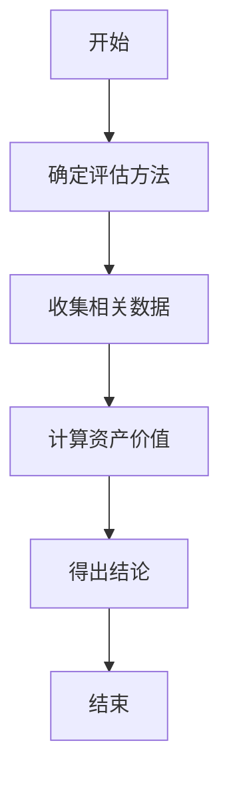

                 


# 彼得林奇如何看待公司的无形资产价值

## 关键词：彼得林奇，无形资产，投资策略，品牌价值，专利，商誉

## 摘要：本文深入探讨了彼得·林奇对无形资产价值的看法，分析了无形资产在企业中的重要性及其在投资决策中的作用。通过案例分析和理论探讨，本文揭示了如何评估和利用无形资产来选择优质投资标的。

---

## 第一部分：背景介绍

### #1 无形资产的定义与重要性

#### 1.1 无形资产的定义与特征
- 无形资产是指企业拥有或控制的，没有实物形态的长期资产，包括品牌、专利、商誉、技术诀窍等。
- 无形资产具有长期性、价值波动性、依赖性等特征，其价值往往难以量化。

#### 1.2 无形资产在企业中的重要性
- 无形资产是企业核心竞争力的重要组成部分，能够为企业带来持续的竞争优势。
- 在某些行业（如科技、消费品），无形资产的价值甚至超过有形资产。

#### 1.3 彼得林奇与无形资产价值的关联
- 彼得林奇是一位注重基本面分析的投资专家，他特别关注企业的无形资产，认为这些资产能够为企业创造超额收益。

---

### #2 无形资产的核心概念与联系

#### 2.1 无形资产的核心要素与结构
- 无形资产包括品牌、专利、商誉等，这些要素相互关联，共同构成了企业的无形资产体系。
- 通过ER图可以清晰地展示无形资产与企业其他资产的关系。

```mermaid
erDiagram
    company{}{
        id
        name
        industry
    }
    intangible_asset{}{
        id
        name
        type
        value
    }
    company}o--{intangible_asset} : owns
```

---

### #3 无形资产价值的评估方法

#### 3.1 无形资产评估的核心原理
- 无形资产评估需要考虑资产的未来收益能力，常用的方法包括市场法、收益法和成本法。
- 通过数学模型可以量化无形资产的价值，例如商誉的评估公式：

$$ \text{商誉} = \text{企业价值} - \text{可辨认净资产公允价值} $$

#### 3.2 无形资产评估的算法流程图
- 下面的流程图展示了无形资产评估的基本步骤：



---

### #4 彼得林奇的投资策略与实践

#### 4.1 彼得林奇的无形资产投资策略
- 彼得林奇注重选择那些拥有强大品牌、技术优势或独特商业模式的企业。
- 他通过分析企业的财务数据和市场地位，评估无形资产的潜在价值。

#### 4.2 投资案例分析
- 可口可乐：品牌价值是其核心资产，彼得林奇认为其品牌具有持续的盈利能力。
- 微软：专利和技术是其核心竞争力，微软的软件业务受益于其强大的技术储备。

---

### #5 无形资产的风险管理与应用

#### 5.1 风险管理策略
- 无形资产的风险主要来自市场变化和技术更新，投资者需要通过多元化投资来分散风险。
- 定期评估无形资产的价值变化，及时调整投资组合。

#### 5.2 项目实战
- 以某科技公司为例，通过分析其专利数量、品牌影响力和财务数据，评估其无形资产的价值。
- 使用Python编写评估模型，计算商誉和品牌价值。

---

## 第五部分：结论

### 5.1 本文总结
- 彼得·林奇的成功投资离不开对无形资产的深刻理解，无形资产是企业价值的重要组成部分。
- 投资者应学会识别和评估无形资产，以做出更明智的投资决策。

### 5.2 最佳实践 tips
- 定期关注企业的无形资产变化，尤其是品牌和技术方面的动态。
- 在评估无形资产时，结合定量分析和定性分析，以全面评估其价值。

### 5.3 注意事项
- 无形资产的评估具有一定的主观性，投资者需谨慎对待。
- 避免仅依赖单一评估方法，应综合多种方法进行分析。

### 5.4 拓展阅读
- 建议阅读彼得·林奇的《击败市场的秘诀》和《投资的智慧》，深入了解他的投资理念。
- 关注行业趋势，学习如何评估不同类型企业的无形资产价值。

---

通过以上分析，我们可以看到，彼得·林奇对无形资产的重视是其投资成功的关键之一。在实际操作中，投资者应结合企业的具体情况，合理评估无形资产的价值，做出明智的投资决策。

