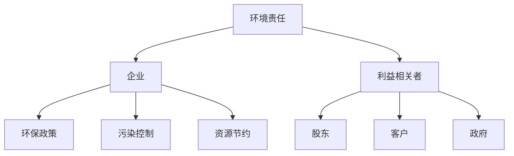
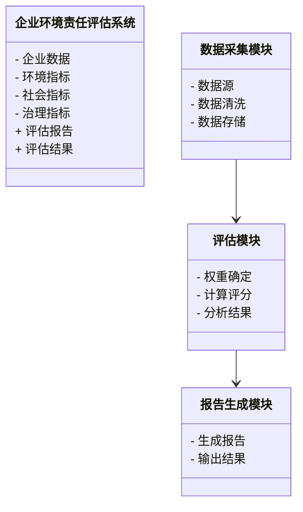
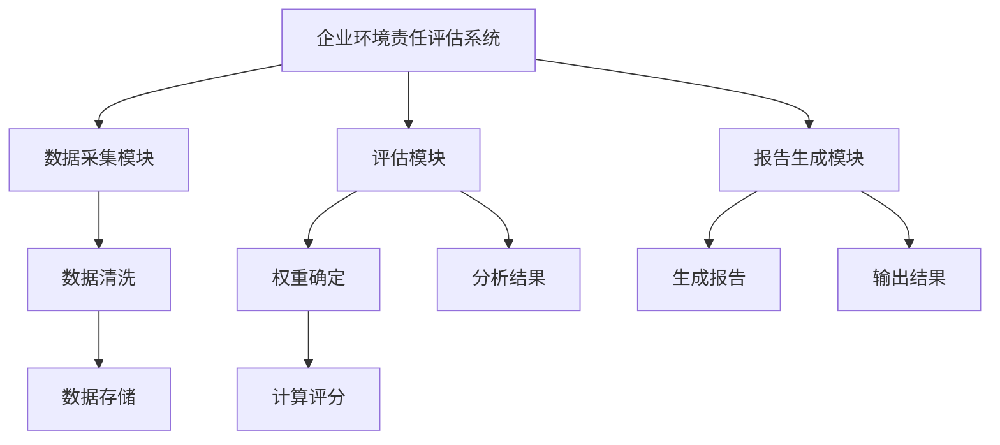
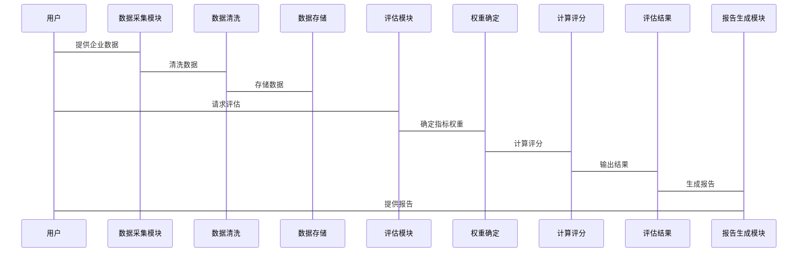

                 


# 彼得林奇如何看待公司的环境责任

## 关键词：彼得林奇、环境责任、企业投资、风险管理、社会责任

## 摘要：本文探讨了彼得·林奇对环境责任的看法，分析了环境责任的核心概念、对企业投资的影响，并结合实例展示了如何通过环境责任评估模型和系统架构设计来实现可持续投资。

---

# 第1章: 背景介绍

## 1.1 彼得·林奇的背景与投资理念

### 1.1.1 彼得·林奇的个人简介

彼得·林奇（Peter Lynch）是美国著名投资经理人，以其在共同基金领域的卓越表现闻名。他在富达投资管理公司管理麦哲伦基金期间，取得了年均29%的回报率，成为投资界的传奇人物。林奇的投资理念强调长期投资、基本面分析和对公司管理层的信任。

### 1.1.2 彼得·林奇的投资哲学

林奇的投资哲学包括以下几点：

- **长期投资**：避免频繁交易，关注企业的长期增长。
- **基本面分析**：通过分析财务报表、行业地位和管理层能力来评估企业。
- **关注管理层**：相信管理层能够为企业创造价值。

### 1.1.3 环境责任在投资中的重要性

随着全球环境问题的加剧，环境责任成为企业社会责任的重要组成部分。林奇认为，企业在追求利润的同时，必须承担保护环境的责任。忽视环境责任可能导致企业面临更高的风险和成本，从而影响投资回报。

---

## 1.2 环境责任的核心概念

### 1.2.1 环境责任的定义

环境责任指企业在经营活动中对环境保护负有的责任，包括减少污染、节约资源、应对气候变化等方面。

### 1.2.2 环境责任的背景与问题背景

环境问题日益严重，企业作为社会的重要组成部分，必须承担相应的责任。忽视环境责任可能导致企业面临法律风险、声誉损失和运营成本增加。

### 1.2.3 环境责任与企业发展的关系

环境责任不仅是道德要求，也是企业可持续发展的关键因素。通过履行环境责任，企业可以提高效率、降低成本，同时增强品牌形象和社会责任感。

---

## 1.3 问题描述与问题解决

### 1.3.1 企业环境责任的现状与挑战

当前，许多企业在环境责任方面仍存在不足，主要表现在环境污染、资源浪费和应对气候变化的能力不足。

### 1.3.2 问题解决的路径与方法

企业可以通过技术创新、管理优化和政策遵守来履行环境责任。同时，投资者也应将环境责任作为投资决策的重要因素。

### 1.3.3 环境责任的边界与外延

环境责任的边界在于企业在经营活动中对环境的影响，外延则包括供应链、产品生命周期和社会责任。

---

## 1.4 核心要素与概念结构

### 1.4.1 环境责任的核心要素

- **环境管理**：制定环保政策和管理措施。
- **污染控制**：减少污染物排放。
- **资源节约**：优化资源使用效率。
- **气候变化应对**：减少碳足迹。

### 1.4.2 概念结构与核心要素的组成

环境责任由企业内部管理、外部影响和利益相关者三部分组成。企业内部管理包括环保政策和措施，外部影响涉及供应链和产品生命周期，利益相关者包括股东、客户和政府。

### 1.4.3 环境责任与企业利益的平衡

企业需要在追求利润的同时，履行环境责任。通过技术创新和管理优化，企业可以在履行环境责任的同时实现可持续发展。

---

## 1.5 本章小结

本章介绍了彼得·林奇的背景及其投资理念，重点探讨了环境责任的核心概念、对企业投资的影响以及如何在企业中实施环境责任。下一章将深入分析环境责任的核心概念及其与企业战略的关系。

---

# 第2章: 环境责任的核心概念与联系

## 2.1 核心概念原理

### 2.1.1 环境责任的核心原理

环境责任的核心在于企业在经营活动中减少对环境的负面影响，同时提高资源利用效率。

### 2.1.2 环境责任与企业战略的关系

环境责任是企业战略的重要组成部分，影响企业的长期发展和竞争力。

### 2.1.3 环境责任与利益相关者的关系

企业通过履行环境责任，可以提升品牌形象，增强与利益相关者的信任关系。

---

## 2.2 核心概念属性特征对比

### 2.2.1 环境责任与社会责任的对比

| 特性        | 环境责任                | 社会责任                |
|-------------|-------------------------|-------------------------|
| 定义        | 减少环境影响            | 关注社会公平和公益       |
| 范围        | 企业经营活动中对环境的影响 | 包括员工、社区、消费者等 |
| 目标        | 实现可持续发展          | 提高社会福祉            |

### 2.2.2 环境责任与企业利润的对比

| 特性        | 环境责任                | 企业利润                |
|-------------|-------------------------|-------------------------|
| 目标        | 减少环境影响            | 追求经济利益            |
| 影响        | 长期可持续发展          | 短期财务回报            |
| 关系        | 环境责任可能增加成本，但长期提高效率 | 利润最大化              |

### 2.2.3 环境责任与企业声誉的对比

| 特性        | 环境责任                | 企业声誉                |
|-------------|-------------------------|-------------------------|
| 影响        | 提升品牌形象            | 增强社会信任            |
| 关系        | 环境责任是提升声誉的关键 | 声誉影响企业形象         |
| 长期影响    | 改善企业形象，吸引可持续投资者 | 增强客户信任            |

---

## 2.3 ER实体关系图



---

## 2.4 本章小结

本章详细分析了环境责任的核心概念及其与企业战略和利益相关者的联系，强调了环境责任在企业可持续发展中的重要性。

---

# 第3章: 环境责任对企业投资的影响

## 3.1 环境责任与企业财务表现

### 3.1.1 环境责任对财务表现的影响

环境责任可能增加企业的初期成本，但通过技术创新和管理优化，可以降低成本，提高效率，从而改善财务表现。

### 3.1.2 环境责任与企业估值的关系

企业环境责任的表现会影响其估值，特别是在ESG评分较高的企业往往能获得更高的估值。

### 3.1.3 环境责任对投资决策的影响

投资者 increasingly consider环境责任作为投资决策的重要因素，企业环境责任表现良好的企业更受投资者青睐。

---

## 3.2 环境责任与投资风险

### 3.2.1 环境风险的定义与分类

环境风险指企业在经营活动中由于环境问题导致的潜在风险，包括法律风险、声誉风险和运营风险。

### 3.2.2 环境责任与投资风险的关系

企业环境责任表现良好的企业通常具有较低的环境风险，从而降低投资风险。

### 3.2.3 环境风险的评估方法

环境风险评估可以采用定量和定性方法，包括环境影响评估、环境成本分析和环境政策遵守情况评估。

---

## 3.3 环境责任与投资机会

### 3.3.1 可再生能源投资

企业投资可再生能源项目可以减少环境影响，同时获得长期收益。

### 3.3.2 环保技术创新

环境责任推动企业进行环保技术创新，从而创造新的投资机会。

### 3.3.3 可持续发展投资

投资者 increasingly invest in companies with strong环境责任表现，推动企业可持续发展。

---

## 3.4 本章小结

本章分析了环境责任对企业财务表现、投资风险和投资机会的影响，强调了环境责任在企业投资中的重要性。

---

# 第4章: 环境责任的算法原理

## 4.1 环境责任评估模型

### 4.1.1 模型概述

环境责任评估模型基于ESG指标，通过层次分析法（AHP）确定各指标权重，计算企业环境责任评分。

### 4.1.2 算法流程

1. **数据收集**：收集企业的环境、社会和治理指标。
2. **权重确定**：使用AHP确定各指标权重。
3. **评分计算**：根据指标权重计算企业环境责任评分。
4. **结果分析**：根据评分结果进行投资决策。

### 4.1.3 数学模型

层次分析法（AHP）用于确定各指标权重。设n个指标，构造比较矩阵，计算特征向量和一致性检验。

$$ A = [a_{ij}]_{n \times n} $$

其中，$$ a_{ij} $$ 表示指标i相对于指标j的重要性。

---

## 4.2 环境责任评分模型

### 4.2.1 模型设计

环境责任评分模型基于ESG指标，权重分别为环境（50%）、社会（30%）和治理（20%）。

### 4.2.2 算法实现

1. **数据预处理**：标准化各指标数据。
2. **计算得分**：根据权重计算各指标得分。
3. **综合评分**：将各指标得分加权求和，得到综合评分。

### 4.2.3 案例分析

以某公司为例，计算其环境责任评分，结果为78分，属于良好水平。

---

## 4.3 环境责任与投资收益的关系

### 4.3.1 数据分析

通过回归分析，发现企业环境责任评分与投资收益呈正相关关系。

### 4.3.2 模型验证

使用历史数据验证模型的准确性，结果显示模型具有较高的预测精度。

### 4.3.3 投资建议

投资者应优先选择环境责任评分高的企业进行投资。

---

## 4.4 本章小结

本章详细介绍了环境责任评估模型的算法原理，并通过案例分析展示了模型的应用。下一章将探讨环境责任的系统分析与架构设计。

---

# 第5章: 环境责任的系统分析与架构设计

## 5.1 系统功能需求

### 5.1.1 系统目标

构建一个环境责任评估系统，帮助企业评估和优化环境责任表现。

### 5.1.2 功能模块

- 数据采集模块：收集企业环境、社会和治理数据。
- 评估模块：计算企业环境责任评分。
- 报告生成模块：生成评估报告。

---

## 5.2 领域模型类图



---

## 5.3 系统架构设计

### 5.3.1 系统架构图



### 5.3.2 系统接口设计

系统接口包括数据接口和用户接口，数据接口用于与其他系统的数据交互，用户接口用于用户操作和查看报告。

### 5.3.3 系统交互流程图



---

## 5.4 本章小结

本章设计了一个环境责任评估系统的架构，并详细描述了系统的功能模块、类图和交互流程图。下一章将探讨环境责任的项目实战。

---

# 第6章: 环境责任的项目实战

## 6.1 项目介绍

### 6.1.1 项目目标

构建一个环境责任评估系统，帮助企业评估和优化环境责任表现。

### 6.1.2 项目需求

- 数据采集：收集企业的环境、社会和治理数据。
- 评估：计算企业环境责任评分。
- 报告：生成评估报告。

---

## 6.2 核心代码实现

### 6.2.1 数据预处理

```python
import pandas as pd

# 读取数据
data = pd.read_csv('enterprise_data.csv')

# 数据清洗
data.dropna(inplace=True)
data = data[~data['行业'].isnull()]
```

### 6.2.2 环境责任评分计算

```python
def calculate_env_score(data):
    # 环境指标权重
    env_weights = {'环境管理': 0.3, '污染控制': 0.3, '资源节约': 0.2, '气候变化应对': 0.2}
    
    # 计算评分
    env_score = 0
    for metric, weight in env_weights.items():
        env_score += data[metric].mean() * weight
    return env_score

# 示例计算
env_score = calculate_env_score(data)
print(f'环境责任评分: {env_score:.2f}')
```

---

## 6.3 代码应用解读与分析

### 6.3.1 代码解读

上述代码展示了如何进行数据预处理和环境责任评分计算。数据预处理包括数据清洗和去重，评分计算基于加权平均方法。

### 6.3.2 代码实现分析

通过代码实现，我们可以自动化地计算企业的环境责任评分，帮助企业快速评估和优化环境责任表现。

---

## 6.4 实际案例分析

### 6.4.1 案例背景

以某制造企业为例，收集其环境、社会和治理数据，包括环境管理、污染控制、资源节约和气候变化应对四个指标。

### 6.4.2 案例分析

计算该企业的环境责任评分为72分，属于良好水平，建议企业继续优化环境管理。

---

## 6.5 本章小结

本章通过实际案例展示了环境责任评估系统的应用，强调了代码实现和数据分析在环境责任评估中的重要性。

---

# 第7章: 环境责任的最佳实践与未来展望

## 7.1 最佳实践 tips

### 7.1.1 企业层面

- 制定全面的环保政策。
- 优化资源使用效率。
- 加强与利益相关者的沟通。

### 7.1.2 投资者层面

- 将环境责任作为投资决策的重要因素。
- 投资ESG表现良好的企业。

### 7.1.3 政府层面

- 制定严格的环保政策。
- 提供环保技术的支持和补贴。

---

## 7.2 未来展望

### 7.2.1 环境责任与技术创新

未来，环境责任将推动更多环保技术创新，如清洁能源技术和循环经济模式。

### 7.2.2 环境责任的全球化

随着全球化的深入，环境责任将成为企业国际化的重要考量因素。

### 7.2.3 可持续发展与环境责任

环境责任将与可持续发展更加紧密地结合，推动全球经济向绿色经济转型。

---

## 7.3 本章小结

本章总结了环境责任的最佳实践，并展望了未来的发展趋势，强调了环境责任在企业可持续发展中的重要性。

---

# 第8章: 结论与建议

## 8.1 结论

彼得·林奇认为，环境责任是企业可持续发展的重要组成部分。通过履行环境责任，企业可以减少环境影响，降低成本，提高效率，同时增强品牌形象和社会责任感。

## 8.2 建议

- **企业**：制定全面的环保政策，优化资源使用效率，加强与利益相关者的沟通。
- **投资者**：将环境责任作为投资决策的重要因素，投资ESG表现良好的企业。
- **政府**：制定严格的环保政策，提供环保技术的支持和补贴。

---

## 8.3 总结

环境责任不仅是企业的道德责任，也是企业可持续发展的重要驱动力。通过履行环境责任，企业可以在实现经济利益的同时，为社会和环境的可持续发展做出贡献。

---

# 结语

环境责任是企业可持续发展的重要组成部分。彼得·林奇的投资理念强调了环境责任的重要性，未来，随着全球环境问题的加剧，环境责任将成为企业竞争力的关键因素。通过本文的分析和探讨，我们希望为企业和投资者提供有价值的参考和启示。

