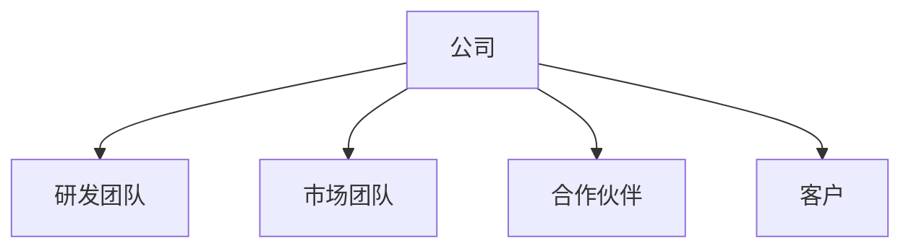
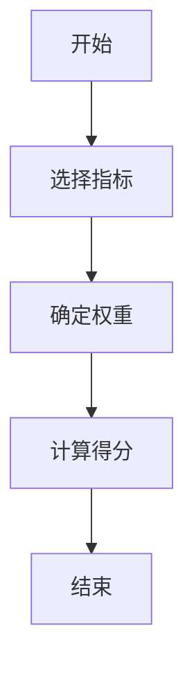
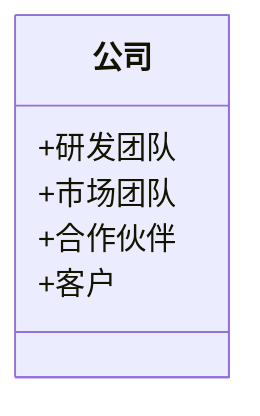
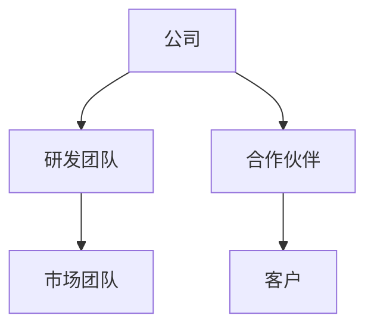

                 


# 彼得林奇如何看待公司的生态系统构建能力

## 关键词：彼得·林奇，公司生态系统，构建能力，投资分析，系统架构

## 摘要：本文从投资与技术的双重角度，深入分析了彼得·林奇对公司生态系统构建能力的看法。通过定义、结构、算法、系统架构和项目实战等维度，详细阐述了如何评估和构建公司的生态系统能力，最后给出了最佳实践的建议。

---

# 第一部分: 背景介绍

## 第1章: 公司生态系统构建能力的背景与重要性

### 1.1 生态系统构建能力的定义

#### 1.1.1 生态系统构建能力的核心概念

公司的生态系统构建能力是指企业在内部和外部构建协同工作的系统的能力，包括研发、市场、供应链等内部能力，以及合作伙伴、客户、供应商等外部能力。

#### 1.1.2 生态系统构建能力的边界与外延

- 内部能力：研发、市场、供应链、人力资源等。
- 外部能力：合作伙伴、客户、供应商、政府关系等。
- 外延：技术、商业、社会等多个维度。

### 1.2 生态系统构建能力的重要性

#### 1.2.1 企业发展的新趋势

- 数字化转型。
- 全球化竞争。
- 产业链协同。

#### 1.2.2 生态系统构建能力对企业竞争力的影响

- 提升整体效率。
- 增强抗风险能力。
- 促进创新与合作。

### 1.3 彼得·林奇的视角

#### 1.3.1 彼得·林奇的投资理念

- 长期投资。
- 价值投资。
- 企业基本面分析。

#### 1.3.2 彼得·林奇如何看待公司的生态系统构建能力

- 生态系统是企业长期竞争优势的核心。
- 构建强大的生态系统可以提升企业的抗风险能力和盈利能力。

### 1.4 本章小结

本章从定义、重要性和彼得·林奇的视角出发，阐述了公司生态系统构建能力的背景和核心意义。

---

# 第二部分: 核心概念与联系

## 第2章: 生态系统构建能力的核心要素

### 2.1 生态系统构建能力的结构

#### 2.1.1 内部能力：研发、市场、供应链等

- 研发能力：技术创新的核心。
- 市场能力：产品推广和用户获取。
- 供应链能力：原材料采购和物流管理。

#### 2.1.2 外部能力：合作伙伴、客户、供应商等

- 合作伙伴：技术、服务、渠道等方面的合作。
- 客户：需求反馈和品牌忠诚度。
- 供应商：原材料供应和成本控制。

### 2.2 核心概念的联系

#### 2.2.1 企业内部能力与外部能力的协同

- 内部能力为外部合作提供支持。
- 外部能力反哺内部能力，提升整体竞争力。

#### 2.2.2 生态系统构建能力与企业战略的关系

- 生态系统构建能力是企业战略的核心组成部分。
- 战略指导生态系统的构建方向和重点。

### 2.3 核心要素对比表格

| 要素 | 内部能力 | 外部能力 |
|------|----------|----------|
| 核心 | 研发能力 | 合作伙伴 |
| 支持 | 市场能力 | 客户关系 |
| 基础 | 供应链能力 | 供应商 |

### 2.4 ER实体关系图



---

# 第三部分: 算法原理讲解

## 第3章: 生态系统构建能力的评估算法

### 3.1 评估指标体系

#### 3.1.1 指标选择

- 内部指标：研发效率、市场占有率、供应链响应速度。
- 外部指标：合作伙伴数量、客户满意度、供应商稳定性。

#### 3.1.2 指标权重

- 内部指标权重：50%。
- 外部指标权重：50%。

### 3.2 算法原理

#### 3.2.1 综合评估模型

$$ \text{综合得分} = \sum_{i=1}^{n} w_i \cdot x_i $$

其中：
- \( w_i \) 为第 \( i \) 个指标的权重。
- \( x_i \) 为第 \( i \) 个指标的得分。

#### 3.2.2 数学模型

$$ \text{综合得分} = 0.5 \cdot \text{内部指标得分} + 0.5 \cdot \text{外部指标得分} $$

---

## 3.3 算法流程图



---

# 第四部分: 系统分析与架构设计

## 第4章: 生态系统构建能力的系统架构设计

### 4.1 问题场景介绍

- 企业需要构建一个高效的生态系统。
- 系统需要支持内部和外部能力的协同。

### 4.2 系统功能设计

#### 4.2.1 领域模型



### 4.3 系统架构设计


### 4.4 系统接口设计

- 内部接口：研发团队与市场团队的协作接口。
- 外部接口：合作伙伴与客户的交互接口。

### 4.5 系统交互设计



---

# 第五部分: 项目实战

## 第5章: 项目实战分析

### 5.1 环境安装

- 操作系统：Linux或Windows。
- 开发工具：Python、Java、C++等。

### 5.2 核心实现源代码

#### 5.2.1 评估模型代码

```python
def calculate_score(internal_score, external_score):
    weight_internal = 0.5
    weight_external = 0.5
    total_score = weight_internal * internal_score + weight_external * external_score
    return total_score
```

#### 5.2.2 交互逻辑代码

```python
class Company:
    def __init__(self):
        self.research_team = []
        self.marketing_team = []
        self.partners = []
        self.customers = []

    def add_partner(self, partner):
        self.partners.append(partner)

    def add_customer(self, customer):
        self.customers.append(customer)
```

### 5.3 案例分析

#### 5.3.1 案例介绍

某科技公司通过构建强大的研发团队和合作伙伴网络，成功提升了其生态系统构建能力。

#### 5.3.2 实施过程

1. 优化研发团队。
2. 建立合作伙伴关系。
3. 推动市场推广。

### 5.4 实施效果

- 提升了研发效率。
- 增加了市场份额。
- 提高了客户满意度。

### 5.5 代码应用解读

- 使用 `calculate_score` 函数评估公司生态系统的综合得分。
- 使用 `Company` 类管理合作伙伴和客户关系。

### 5.6 项目小结

通过实际案例，验证了生态系统构建能力评估模型的有效性和可操作性。

---

# 第六部分: 最佳实践

## 第6章: 最佳实践与注意事项

### 6.1 小结

- 生态系统构建能力是企业长期竞争优势的核心。
- 彼得·林奇的投资理念与生态系统构建能力密切相关。

### 6.2 注意事项

- 确保内部能力与外部能力的协同。
- 定期评估和优化生态系统。
- 加强跨部门协作。

### 6.3 扩展阅读

- 《彼得·林奇的投资哲学》
- 《企业生态系统构建实战》

---

# 结语

通过本文的分析，我们可以看到，彼得·林奇对公司的生态系统构建能力有着深刻的理解。从投资和系统的角度出发，结合实际案例和最佳实践，我们可以更好地理解和提升公司的生态系统构建能力。希望本文对您有所帮助！

