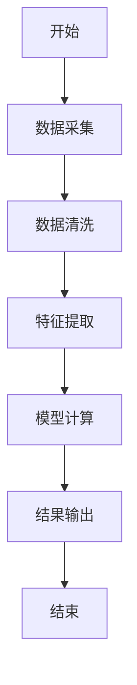
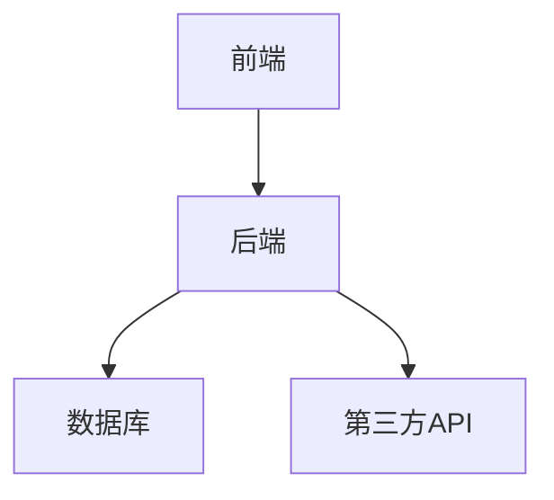
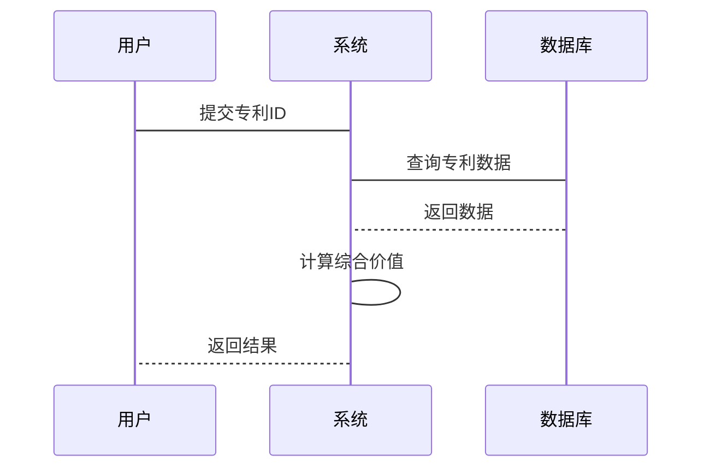

                 


# 彼得林奇如何看待公司的知识产权战略

## 关键词：知识产权战略、彼得林奇、企业价值、知识产权保护、投资价值

## 摘要：本文从彼得林奇的投资视角，分析知识产权战略对公司价值的影响。通过核心概念、评估算法、系统架构、实战案例等方面，探讨如何制定有效的知识产权战略，保护企业核心资产，提升投资价值。

---

## 第一部分: 知识产权战略的背景与重要性

### 第1章: 知识产权的基本概念与重要性

#### 1.1 知识产权的定义与核心要素

##### 1.1.1 知识产权的定义
知识产权是法律保护的无形资产，包括专利权、商标权、著作权和商业秘密等。这些权利赋予拥有者在特定领域内的专有权，防止他人未经许可的使用。

##### 1.1.2 知识产权的核心要素
- **创新性**：知识产权必须具有新颖性，能够为企业带来竞争优势。
- **保护性**：通过法律手段确保权利不被侵犯。
- **经济性**：知识产权的价值体现在其对企业的经济贡献，包括直接收入和市场竞争力提升。

##### 1.1.3 知识产权在现代商业中的作用
在现代商业中，知识产权不仅是企业核心竞争力的体现，还是吸引投资的关键因素。拥有强大的知识产权组合，能够有效防御竞争对手，提升企业的市场地位。

#### 1.2 知识产权的重要性

##### 1.2.1 知识产权对企业的核心价值
知识产权是企业的无形资产，能够为企业创造长期价值。例如，专利技术可以转化为产品，提升市场份额；商标则是品牌价值的象征。

##### 1.2.2 知识产权对投资价值的影响
投资者在评估企业价值时，会考虑其知识产权的强度。拥有大量高质量知识产权的企业，通常具有更高的市场价值和抗风险能力。

##### 1.2.3 知识产权在现代经济中的地位
在知识经济时代，知识产权已成为经济增长的核心驱动力。企业通过知识产权保护创新成果，推动技术进步和经济发展。

#### 1.3 本书的研究背景与目标

##### 1.3.1 当前知识产权保护的现状
当前，知识产权保护日益重要，但许多企业仍然缺乏有效的知识产权战略。特别是在技术快速发展的领域，知识产权的价值更加凸显。

##### 1.3.2 知识产权战略对企业的影响
有效的知识产权战略能够帮助企业建立竞争优势，抵御市场竞争，同时提升企业的长期价值。

##### 1.3.3 本书的研究目标与框架
本书旨在从投资的角度，分析知识产权战略对企业价值的影响，为企业制定有效的知识产权管理策略提供指导。

---

## 第2章: 知识产权战略的核心概念与联系

### 2.1 知识产权的分类与特点

#### 2.1.1 专利权
专利权保护发明，涵盖技术方案、方法和产品的外观设计。专利权的有效期通常为20年，需每年支付维护费用。

#### 2.1.2 商标权
商标权保护品牌标识，包括文字、图形和组合。商标权的有效期可以无限续展，只要企业持续使用并缴纳费用。

#### 2.1.3 著作权
著作权保护文学、艺术和科学作品，包括书籍、软件和音乐。著作權的保护期限通常为作者 lifetime 加上50年。

#### 2.1.4 商业秘密
商业秘密包括配方、技术、客户名单等，需通过合同和保密措施保护。泄露商业秘密可能导致严重的经济损失。

### 2.2 知识产权的战略属性分析

#### 2.2.1 知识产权的法律属性
- **独占性**：知识产权的排他性使用权。
- **地域性**：在特定国家或地区内有效。
- **时间性**：有一定的时间限制，需定期续展。

#### 2.2.2 知识产权的经济属性
- **可转化性**：可以转化为实际收益。
- **可交易性**：可以通过授权、转让等方式实现价值。

#### 2.2.3 知识产权的战略属性
- **防御性**：防止竞争对手模仿。
- **进攻性**：通过知识产权诉讼主动维护市场地位。

### 2.3 知识产权与企业价值的关系

#### 2.3.1 知识产权对企业竞争力的影响
- **技术壁垒**：专利技术可以防止竞争对手进入市场。
- **品牌价值**：强大的商标和品牌可以提升客户忠诚度和市场份额。

#### 2.3.2 知识产权对投资价值的影响
- **资产增值**：知识产权是企业价值的重要组成部分。
- **风险降低**：拥有知识产权可以降低技术替代风险。

#### 2.3.3 知识产权对企业长期发展的意义
- **创新驱动**：知识产权鼓励企业持续创新，保持竞争优势。
- **资产保值**：有效的知识产权管理可以确保资产价值长期稳定。

### 2.4 知识产权与企业战略的关系

#### 2.4.1 知识产权在企业战略中的地位
知识产权是企业战略的重要组成部分，特别是在技术密集型行业。

#### 2.4.2 知识产权与企业核心竞争力的关系
强大的知识产权组合可以形成技术壁垒，提升企业的核心竞争力。

#### 2.4.3 知识产权与企业创新的关系
知识产权保护创新成果，激励企业不断投入研发，推动技术进步。

---

## 第3章: 知识产权评估的核心算法与数学模型

### 3.1 知识产权评估的基本原理

#### 3.1.1 知识产权评估的定义
知识产权评估是对知识产权的经济价值进行量化的过程，通常考虑其市场潜力、技术先进性和法律风险等因素。

#### 3.1.2 知识产权评估的主要方法
- **市场法**：通过市场交易案例进行评估。
- **收益法**：基于未来现金流的折现值进行评估。
- **成本法**：基于开发成本进行评估。

#### 3.1.3 知识产权评估的核心指标
- **技术先进性**：评估专利的技术水平和创新程度。
- **市场潜力**：评估知识产权的市场应用前景。
- **法律风险**：评估知识产权的法律稳定性。

### 3.2 知识产权评估的数学模型

#### 3.2.1 加权评分法
加权评分法是一种常用的评估方法，将多个评估指标赋予不同的权重，计算综合得分。

##### 公式
$$
V = \sum (w_i \times s_i)
$$

其中，\( V \) 是综合价值，\( w_i \) 是各指标的权重，\( s_i \) 是各指标的评分。

##### 示例
假设某专利的技术先进性评分为90分，市场潜力评分为80分，法律风险评分为85分，各指标的权重分别为40%、30%和30%。则综合价值计算如下：

$$
V = 0.4 \times 90 + 0.3 \times 80 + 0.3 \times 85 = 36 + 24 + 25.5 = 85.5
$$

综合价值为85.5分，属于高价值专利。

---

## 第4章: 知识产权评估系统的算法原理与实现

### 4.1 知识产权评估系统的算法原理

#### 4.1.1 系统功能模块
- 数据采集模块：收集专利、商标等数据。
- 评估计算模块：基于数学模型计算知识产权价值。
- 结果展示模块：以图表形式展示评估结果。

#### 4.1.2 算法流程图


### 4.2 系统实现代码

#### 4.2.1 数据采集与预处理
```python
import pandas as pd

# 数据采集
patent_data = pd.read_csv('patent.csv')

# 数据清洗
patent_data.dropna(inplace=True)
patent_data['score'] = patent_data['score'].astype(int)
```

#### 4.2.2 模型计算
```python
def calculate_value(weights, scores):
    return sum(w * s for w, s in zip(weights, scores))

weights = [0.4, 0.3, 0.3]
scores = [90, 80, 85]

value = calculate_value(weights, scores)
print(f"综合价值：{value}")
```

---

## 第5章: 知识产权评估系统的系统架构与实现

### 5.1 系统架构设计

#### 5.1.1 系统架构图


#### 5.1.2 功能模块
- 前端：用户交互界面。
- 后端：处理数据和计算。
- 数据库：存储知识产权数据。
- 第三方API：获取外部数据源。

### 5.2 系统实现

#### 5.2.1 系统接口设计
```python
class PatentEvaluator:
    def __init__(self, database):
        self.database = database

    def evaluate_patent(self, patent_id):
        data = self.database.get_patent(patent_id)
        value = calculate_value(data['weights'], data['scores'])
        return value
```

#### 5.2.2 系统交互流程图


---

## 第6章: 知识产权战略的项目实战

### 6.1 项目背景与目标

#### 6.1.1 项目背景
选择一家科技公司，分析其知识产权战略，评估其知识产权组合的价值。

#### 6.1.2 项目目标
- 评估公司现有知识产权的价值。
- 分析竞争对手的知识产权布局。
- 提出优化知识产权战略的建议。

### 6.2 项目实施步骤

#### 6.2.1 数据收集
收集公司和竞争对手的专利、商标等数据。

#### 6.2.2 数据分析
使用上述模型计算知识产权价值，识别核心专利和薄弱环节。

#### 6.2.3 战略制定
基于分析结果，制定知识产权战略，包括申请新专利、收购技术等。

---

## 第7章: 知识产权战略的最佳实践与小结

### 7.1 最佳实践

#### 7.1.1 定期评估知识产权价值
企业应定期评估知识产权的价值，及时调整战略。

#### 7.1.2 加强知识产权保护
通过法律手段保护知识产权，防止侵权行为。

#### 7.1.3 与企业战略相结合
知识产权战略应与企业整体战略相结合，形成协同效应。

### 7.2 小结

通过本文的分析，我们可以看到，知识产权战略是企业成功的关键因素之一。彼得林奇的投资理念提醒我们，知识产权不仅是企业的资产，更是其未来发展的基石。企业应重视知识产权的保护和管理，将其作为核心战略之一。

---

## 第8章: 知识产权战略的未来展望

### 8.1 人工智能与知识产权
人工智能技术的发展将改变知识产权的评估和保护方式，自动化工具将提高评估效率。

### 8.2 知识产权全球化
随着全球经济的全球化，知识产权的跨国保护和管理将变得更加重要。

### 8.3 可持续发展与知识产权
知识产权在推动可持续发展中的作用将越来越重要，绿色专利将是一个重要方向。

---

## 结语

通过本文的深入分析，我们可以看到，知识产权战略是企业成功的关键因素之一。彼得林奇的投资理念提醒我们，知识产权不仅是企业的资产，更是其未来发展的基石。企业应重视知识产权的保护和管理，将其作为核心战略之一。

