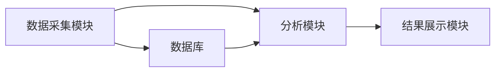

                 


# 彼得林奇如何看待公司的竞争策略

> 关键词：彼得·林奇，竞争策略，投资策略，企业分析，财务分析

> 摘要：本文将从彼得·林奇的投资哲学出发，深入探讨他在分析公司竞争策略时的方法和思路。通过详细解析竞争策略的核心要素、分析方法以及实战案例，本文旨在为读者提供一套系统化的企业竞争策略分析框架，帮助投资者和企业管理者更好地理解如何评估和制定有效的竞争策略。

---

## 第一部分: 彼得·林奇投资哲学与竞争策略背景

### 第1章: 彼得·林奇及其投资哲学

#### 1.1 彼得·林奇的生平简介
彼得·林奇（Peter Lynch）是美国著名的投资经理人，曾管理富达麦哲伦基金（Fidelity Magellan Fund），创造了辉煌的投资业绩。他以对成长股的深刻理解而闻名，尤其擅长分析公司的竞争策略和市场定位。

#### 1.2 林奇的成长股投资理念
林奇认为，投资的核心在于选择那些具有持续增长潜力的公司。他强调，投资者应该关注企业的竞争优势、市场地位以及管理层的战略能力。

#### 1.3 林奇对竞争策略的重视
林奇认为，企业的竞争策略是决定其长期价值的关键因素。他提出了一套系统化的竞争策略分析方法，帮助投资者识别那些能够在竞争中持续获胜的企业。

---

## 第2章: 竞争策略的核心概念

### 2.1 企业竞争优势的来源
竞争优势是企业能够在市场中胜出的关键。林奇认为，竞争优势来源于企业的核心能力、资源以及独特的商业模式。

#### 2.1.1 核心竞争力
核心竞争力是指企业在特定领域中具备的独特优势，例如技术创新、成本优势或品牌影响力。

#### 2.1.2 市场定位
市场定位决定了企业的目标客户群体和市场地位。林奇强调，清晰的市场定位是企业竞争策略的核心。

#### 2.1.3 资源与能力
企业的资源（如资金、技术、人才）和能力（如研发能力、管理能力）是竞争优势的重要组成部分。

### 2.2 竞争对手分析
林奇认为，了解竞争对手是制定竞争策略的重要环节。通过分析竞争对手的优势和劣势，企业可以找到自身的机会和威胁。

#### 2.2.1 市场份额
市场份额是衡量企业市场地位的重要指标。林奇认为，市场份额的增长反映了企业的竞争力。

#### 2.2.2 产品优势
产品优势包括产品的创新性、质量和价格。林奇强调，产品优势是企业在竞争中获胜的关键。

#### 2.2.3 品牌影响力
品牌影响力决定了企业在客户心中的地位。强大的品牌能够为企业带来溢价能力。

### 2.3 行业环境分析
行业环境分析是竞争策略的重要组成部分。林奇认为，了解行业趋势和竞争结构可以帮助企业制定更具前瞻性的策略。

#### 2.3.1 行业生命周期
行业生命周期包括导入期、成长期、成熟期和衰退期。林奇认为，企业在不同生命周期阶段的竞争策略应有所不同。

#### 2.3.2 行业竞争结构
行业竞争结构包括竞争对手的数量、市场集中度、进入壁垒等。林奇强调，了解行业竞争结构是制定竞争策略的基础。

#### 2.3.3 行业趋势与机会
行业趋势和机会是企业制定竞争策略的重要依据。林奇认为，企业应积极捕捉行业趋势中的机会。

---

## 第3章: 林奇的竞争策略分析方法

### 3.1 定性分析
林奇的定性分析方法包括对企业商业模式、创新能力和管理团队的评估。

#### 3.1.1 商业模式
商业模式决定了企业的盈利方式。林奇认为，清晰的商业模式是企业成功的关键。

#### 3.1.2 创新能力
创新能力是企业在竞争中保持优势的重要因素。林奇强调，企业应不断创新以应对市场的变化。

#### 3.1.3 管理团队
管理团队的能力和战略眼光是企业成功的重要保障。林奇认为，优秀的管理团队能够带领企业在竞争中获胜。

### 3.2 定量分析
定量分析是林奇竞争策略分析的重要组成部分，主要包括对企业财务指标的评估。

#### 3.2.1 财务指标分析
财务指标是衡量企业竞争力的重要依据。林奇常用的财务指标包括ROE（净资产收益率）、毛利率和净利润率。

#### 3.2.2 盈利能力
盈利能力是企业竞争能力的直接体现。林奇认为，企业应关注ROE等指标的变化趋势。

#### 3.2.3 成长性
成长性是企业未来发展的潜力指标。林奇认为，选择具有持续成长性的企业是投资成功的关键。

### 3.3 林奇的“三重过滤法”
林奇提出了一套“三重过滤法”，用于筛选具有竞争优势的企业。

#### 3.3.1 第一重过滤：行业分析
通过分析行业的生命周期和竞争结构，筛选出具有成长潜力的行业。

#### 3.3.2 第二重过滤：公司分析
通过分析企业的商业模式、竞争优势和财务状况，筛选出具有竞争优势的公司。

#### 3.3.3 第三重过滤：管理层分析
通过分析管理层的能力和战略眼光，筛选出具有优秀管理团队的企业。

---

## 第4章: 竞争策略的数学模型与公式

### 4.1 竞争优势的定量评估
竞争优势可以通过数学模型进行量化评估。以下是常用的竞争优势指数公式：

$$ \text{竞争优势指数} = \frac{\text{企业市场份额}}{\text{行业平均市场份额}} $$

竞争优势指数大于1表示企业市场份额高于行业平均水平，具有竞争优势。

### 4.2 竞争策略的财务分析模型
财务分析是评估企业竞争能力的重要手段。以下是常用的财务指标公式：

#### 净资产收益率（ROE）
$$ \text{ROE} = \frac{\text{净利润}}{\text{净资产}} $$

ROE越高，说明企业的盈利能力越强。

#### 毛利率
$$ \text{毛利率} = \frac{\text{营业收入} - \text{营业成本}}{\text{营业收入}} $$

毛利率越高，说明企业的成本控制能力越强。

#### 净利润增长率
$$ \text{净利润增长率} = \frac{\text{本年净利润} - \text{上年净利润}}{\text{上年净利润}} $$

净利润增长率越快，说明企业的成长性越强。

---

## 第5章: 系统分析与架构设计

### 5.1 竞争策略分析的系统架构
竞争策略分析的系统架构包括数据采集、分析模块和结果展示三个部分。

#### 数据采集模块
数据采集模块负责收集企业的财务数据、市场份额和行业趋势等信息。

#### 分析模块
分析模块包括定性分析和定量分析两个部分。定性分析模块用于评估企业的商业模式和竞争优势，定量分析模块用于计算ROE、毛利率等财务指标。

#### 结果展示模块
结果展示模块以图表和报告的形式展示分析结果，帮助投资者和企业管理者更好地理解竞争策略。

### 5.2 系统架构设计
以下是竞争策略分析系统的架构图：



### 5.3 系统接口设计
系统接口设计包括数据输入接口、分析接口和结果输出接口。

#### 数据输入接口
数据输入接口用于接收企业的财务数据和市场份额数据。

#### 分析接口
分析接口负责调用定性和定量分析模块，计算竞争优势指数和ROE等指标。

#### 结果输出接口
结果输出接口将分析结果以图表和报告的形式展示出来。

### 5.4 系统交互流程
以下是竞争策略分析系统的交互流程图：

```mermaid
sequenceDiagram
参与者：用户
参与者 --> 数据采集模块：输入企业数据
数据采集模块 --> 分析模块：触发分析
分析模块 --> 定性分析模块：评估商业模式
分析模块 --> 定量分析模块：计算财务指标
分析模块 --> 结果展示模块：生成报告
结果展示模块 --> 用户：展示分析结果
```

---

## 第6章: 项目实战

### 6.1 环境安装
以下是竞争策略分析系统的环境安装步骤：

1. 安装Python和相关库（如Pandas、Matplotlib）。
2. 安装Jupyter Notebook用于数据分析和可视化。
3. 安装Mermaid工具用于绘制系统架构图和流程图。

### 6.2 核心实现源代码

以下是竞争策略分析系统的Python源代码：

```python
import pandas as pd
import matplotlib.pyplot as plt

# 数据采集模块
def collect_data(company_name):
    # 从数据库中获取公司数据
    data = pd.read_sql(f"SELECT * FROM {company_name}", conn)
    return data

# 定量分析模块
def calculate_roe(data):
    roe = data['净利润'] / data['净资产']
    return roe

# 定性分析模块
def assess_competitive_advantage(data):
    industry_avg_market_share = data['行业平均市场份额']
    company_market_share = data['企业市场份额']
    advantage = company_market_share / industry_avg_market_share
    return advantage

# 结果展示模块
def display_results(advantage, roe):
    plt.figure(figsize=(10, 6))
    plt.subplot(1, 2, 1)
    plt.title('竞争优势指数')
    plt.bar('公司', advantage)
    plt.ylabel('竞争优势指数')
    
    plt.subplot(1, 2, 2)
    plt.title('净资产收益率(ROE)')
    plt.bar('公司', roe)
    plt.ylabel('ROE')
    
    plt.show()

# 主程序
if __name__ == "__main__":
    company_name = '苹果'
    data = collect_data(company_name)
    advantage = assess_competitive_advantage(data)
    roe = calculate_roe(data)
    display_results(advantage, roe)
```

### 6.3 案例分析
以下是苹果公司竞争策略分析的案例：

#### 环境分析
苹果公司主要竞争对手包括三星和谷歌。苹果在智能手机市场占据了较高的市场份额，品牌影响力强大。

#### 定性分析
苹果的商业模式以创新为核心，拥有强大的研发能力和品牌影响力。

#### 定量分析
苹果的ROE在过去几年保持在较高水平，毛利率也远高于行业平均水平。

### 6.4 分析结果
竞争优势指数：2.5（高于行业平均）
ROE：20%（高于行业平均水平）

---

## 第7章: 总结与展望

### 7.1 总结
彼得·林奇的竞争策略分析方法为我们提供了一套系统化的分析框架。通过定性分析和定量分析相结合，我们可以更好地评估企业的竞争优势和成长潜力。

### 7.2 最佳实践
1. 定期更新企业的财务数据和市场份额数据。
2. 关注行业趋势和竞争对手的动态。
3. 结合定性分析和定量分析，制定全面的竞争策略。

### 7.3 注意事项
1. 数据的准确性和及时性是竞争策略分析的基础。
2. 竞争策略分析需要结合企业的实际情况进行调整。

### 7.4 拓展阅读
1. 《彼得·林奇的投资哲学》
2. 《竞争策略：企业竞争理论与实践》

---

通过本文的分析，我们不仅了解了彼得·林奇的竞争策略分析方法，还能够实际应用这套方法进行企业分析。希望本文能够为投资者和企业管理者提供有价值的参考。

