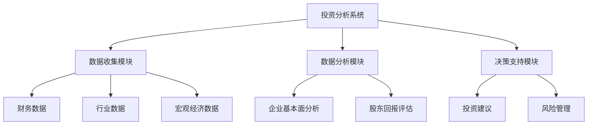

                 


# 彼得林奇如何看待公司的股东回报

> **关键词：** 彼得·林奇、股东回报、投资策略、企业价值、风险管理  
> **摘要：** 彼得·林奇作为投资大师，其对股东回报的分析方法和投资策略对企业价值和投资者收益有着深远影响。本文将详细探讨林奇的投资理念、股东回报的构成因素、选股标准、投资策略，并通过实际案例分析，为读者提供全面的指导。

---

## 第1章 彼得·林奇的投资理念概述

### 1.1 彼得·林奇的背景与投资风格

彼得·林奇（Peter Lynch）是全球最著名、最成功的基金经理之一。他在富达投资管理公司（Fidelity）的任职期间，管理的麦哲伦基金（Magellan Fund）取得了惊人的投资回报，年平均回报率高达29%，远超同期市场表现。林奇的投资风格以长期投资、价值发现和深入基本面分析为核心，强调对企业的深入了解和对管理层的信任。

### 1.2 股东回报的定义与重要性

股东回报是指投资者在持有公司股份期间所获得的收益，主要包括股息回报、资本增值和股东权益的变化。林奇认为，股东回报不仅是企业财务健康的重要指标，也是投资者决策的关键依据。一个公司能够持续为股东创造价值，不仅体现在盈利能力上，还体现在其管理层的诚信和执行力上。

### 1.3 林奇投资方法的核心要素

林奇的投资方法强调以下几点：
1. **长期投资**：避免短期市场波动的干扰，关注企业的长期价值。
2. **基本面分析**：深入研究企业的财务状况、行业地位和竞争优势。
3. **管理层信任**：信任管理层的能力和诚信，认为优秀的管理层能够为股东创造持续价值。

---

## 第2章 股东回报的构成与影响因素

### 2.1 股东回报的构成要素

股东回报主要由以下三部分构成：
1. **股息回报**：公司向股东分配的股息。
2. **资本增值**：股价上涨带来的资本收益。
3. **股东权益变化**：包括股票回购、资产重估等因素。

### 2.2 影响股东回报的主要因素

影响股东回报的因素众多，以下是关键因素：

| **因素类别** | **具体因素** | **影响分析** |
|--------------|--------------|--------------|
| **企业基本面** | 盈利能力、负债率、现金流 | 盈利能力高的企业能持续分红和增值。 |
| **行业因素** | 行业周期、竞争格局 | 行业景气度和竞争程度决定企业的成长空间。 |
| **管理层因素** | 管理能力、决策风格 | 优秀的管理层能优化资产配置，提高股东回报。 |
| **宏观经济** | 利率、通货膨胀、经济周期 | 宏观环境影响企业的经营环境和估值水平。 |

### 2.3 林奇对股东回报影响因素的独特见解

林奇特别强调企业基本面和管理层的重要性。他认为，一家企业的盈利能力、现金流状况以及管理层的决策能力是决定股东回报的关键因素。例如，他偏好那些具有稳定盈利能力和良好现金流的企业，同时注重管理层是否具有诚信和能力。

### 2.4 案例分析：苹果与通用电气的股东回报对比

以苹果和通用电气为例，分析两者的股东回报差异。

#### 苹果的股东回报分析
- **盈利能力**：苹果长期保持高盈利能力，净利润率高达20%以上。
- **股息回报**：苹果从2012年开始分红，股息率稳步增长。
- **资本增值**：苹果股价从2009年到2020年增长了10倍以上。

#### 通用电气的股东回报分析
- **盈利能力**：通用电气在2008年金融危机后，盈利能力下降，负债率上升。
- **股息回报**：通用电气曾是高股息股票的代表，但因财务问题，股息被下调。
- **资本增值**：通用电气股价在2008年后表现低迷，资本增值有限。

#### 对比与启示
- 苹果的成功在于其持续的创新能力、强大的现金流和高效的管理层。
- 通用电气的教训在于过度依赖杠杆和行业周期性带来的风险。

---

## 第3章 彼得·林奇的选股标准与方法

### 3.1 林奇选股的核心标准

林奇选股注重以下指标：

| **指标类别** | **具体指标** | **分析标准** |
|--------------|--------------|--------------|
| **估值指标** | 市盈率（P/E）、市净率（P/B） | 偏好合理估值，避免过高估值。 |
| **盈利指标** | 净利润率、ROE（净资产收益率） | 重视盈利能力和股东权益回报。 |
| **成长指标** | 收入增长率、净利润增长率 | 偏好具有持续成长能力的企业。 |
| **财务健康指标** | 负债率、现金流 | 低负债率和稳定现金流是重要考量。 |

### 3.2 林奇的选股方法

林奇的选股方法可以总结为以下几个步骤：

1. **行业筛选**：选择具有成长潜力的行业，避开夕阳行业。
2. **基本面分析**：深入研究企业的财务报表，评估盈利能力、现金流和资产负债表。
3. **管理层评估**：关注管理层的诚信和决策能力，认为优秀管理层是企业成功的关键。
4. **估值评估**：通过市盈率、市净率等指标，寻找被市场低估的企业。
5. **投资决策**：根据以上分析，决定是否投资并制定投资计划。

### 3.3 案例分析：林奇如何选择成长股

以苹果为例，林奇在1990年代末期投资苹果时，苹果正处于转型期。他通过分析苹果的财务状况，发现其负债率低、现金流充裕，同时看好其在个人电脑市场的潜力。此外，乔布斯回归后展现出的卓越领导能力和创新战略，进一步增强了林奇的信心。

---

## 第4章 投资策略与风险管理

### 4.1 林奇的投资策略

林奇的投资策略可以总结为以下几点：

1. **长期投资**：避免频繁交易，关注企业的长期价值。
2. **分散投资**：通过投资不同类型的企业分散风险。
3. **价值投资**：寻找被市场低估的企业，长期持有。

### 4.2 风险管理

林奇非常重视风险管理，他认为风险管理是投资成功的关键。他的风险管理方法包括：

1. **分散投资**：通过投资不同行业的企业分散行业风险。
2. **止损机制**：设定止损点，避免亏损过大。
3. **定期评估**：定期评估投资组合，及时调整。

### 4.3 案例分析：如何管理投资风险

以通用电气为例，林奇在投资通用电气时，虽然看好其在多个行业的布局，但忽视了其资产负债表的风险。后期通用电气因财务问题导致股价大幅下跌，林奇及时调整投资组合，避免了更大的损失。

---

## 第5章 系统分析与架构设计

### 5.1 投资分析系统的构建

为了系统化地分析股东回报，可以构建一个投资分析系统，包括以下几个模块：

1. **数据收集模块**：收集企业的财务数据、行业数据和宏观经济数据。
2. **数据分析模块**：对企业基本面进行分析，评估股东回报潜力。
3. **决策支持模块**：根据分析结果，生成投资建议。

### 5.2 系统架构设计

以下是投资分析系统的架构图：



### 5.3 系统接口设计

系统接口设计包括数据接口和用户接口。数据接口用于获取实时数据，用户接口用于展示分析结果。

---

## 第6章 项目实战：苹果公司的股东回报分析

### 6.1 环境安装

需要安装以下工具：
1. 数据分析工具：Excel、Python（Pandas库）。
2. 绘图工具：Matplotlib、Tableau。

### 6.2 核心实现

以下是Python代码示例：

```python
import pandas as pd
import matplotlib.pyplot as plt

# 数据加载
df = pd.read_csv('apple_stock.csv')

# 股价趋势图
plt.figure(figsize=(10, 6))
plt.plot(df['Date'], df['Close'], label='Apple Stock Price')
plt.xlabel('Date')
plt.ylabel('Price')
plt.title('Apple Stock Price Trend')
plt.legend()
plt.show()
```

### 6.3 案例分析

通过对苹果公司过去十年的股价和股息数据进行分析，可以得出以下结论：
1. 苹果股价长期呈上升趋势，资本增值显著。
2. 苹果股息回报稳定增长，体现了企业的盈利能力和分红能力。
3. 苹果的股东回报在科技行业中处于领先地位，主要得益于其强大的创新能力和高效的管理层。

---

## 第7章 总结与启示

### 7.1 全文总结

彼得·林奇的投资理念和方法为投资者提供了宝贵的指导。他强调企业基本面分析、管理层信任和风险管理，为最大化股东回报提供了系统的框架。

### 7.2 投资中的注意事项

1. **长期投资**：避免短期波动，关注企业的长期价值。
2. **风险管理**：设置止损点，分散投资组合。
3. **持续学习**：关注行业动态，及时调整投资策略。

### 7.3 拓展阅读

推荐以下书籍和资源：
1. 《彼得·林奇的成功投资》
2. 《投资之道》
3. 富达投资管理公司官网（https://www.fidelity.com）

---

通过以上分析，我们可以看到，彼得·林奇的投资理念和方法不仅适用于机构投资者，也对个人投资者具有重要的指导意义。希望本文能为读者在投资决策中提供有价值的参考。

