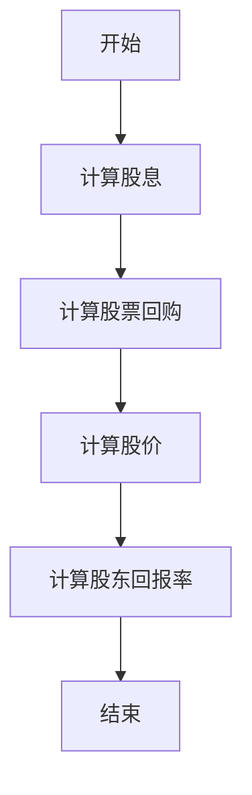
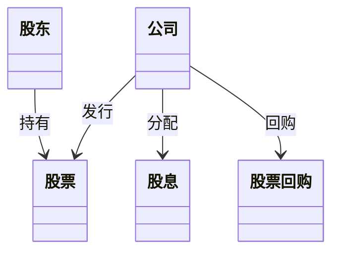
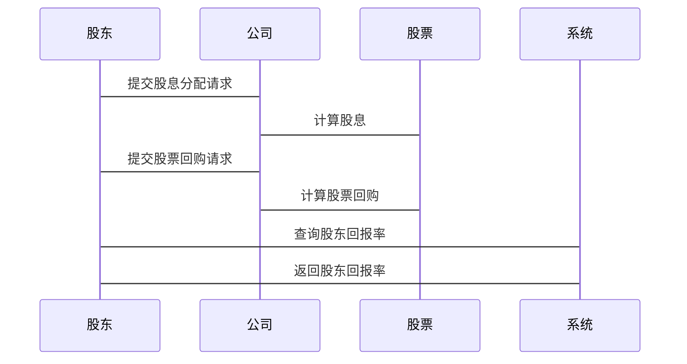

                 


# 彼得·林奇如何看待公司的股东回报政策

> 关键词：股东回报政策、彼得·林奇、股息、股票回购、投资策略

> 摘要：本文将从彼得·林奇的视角出发，详细探讨公司股东回报政策的核心概念、算法原理、系统架构、项目实战等方面，通过技术手段深度剖析股东回报政策的实现方式及其对投资决策的影响。

---

# 第一部分: 股东回报政策的背景与重要性

## 第1章: 股东回报政策的概述

### 1.1 股东回报政策的定义与核心概念

#### 1.1.1 股东回报政策的定义
股东回报政策是指公司通过股息分配、股票回购等方式，向股东返还资本或增加股东价值的政策。其核心目标是最大化股东利益，同时保持公司的长期健康发展。

#### 1.1.2 股东回报政策的核心要素
- **股息支付率**：公司每年分配的股息占净利润的比例。
- **股票回购**：公司用自有资金从市场上回购股票，减少流通股数量，从而提高每股收益。
- **股息再投资**：股东将获得的股息用于再投资，享受复利效应。

#### 1.1.3 股东回报政策的边界与外延
- 股东回报政策的边界：公司必须确保有足够的现金流和盈利能力来支持回报政策。
- 股东回报政策的外延：包括股票分红、股票回购、股份增持等多种形式。

### 1.2 股东回报政策的重要性

#### 1.2.1 股东回报政策对企业价值的影响
- 提高股东信心，增强市场对公司的信任。
- 优化资本结构，降低企业杠杆率，降低财务风险。
- 通过回购减少流通股数量，提升每股收益。

#### 1.2.2 股东回报政策对投资者信心的作用
- 定期的股息分配能够为投资者提供稳定的现金流，增强投资的安全感。
- 股票回购可以提升股价，间接增加股东的财富。

#### 1.2.3 股东回报政策与公司治理的关系
- 股东回报政策是公司治理的重要组成部分，反映了公司对股东的责任和承诺。
- 有效的股东回报政策能够吸引长期投资者，优化股权结构。

### 1.3 彼得·林奇与股东回报政策

#### 1.3.1 彼得·林奇的投资者背景与理念
彼得·林奇是美国著名投资经理，以其独特的投资理念闻名。他强调基本面分析，注重公司的财务健康和管理层质量。

#### 1.3.2 彼得·林奇对股东回报政策的关注点
- 林奇认为，股东回报政策是公司财务健康的重要指标。
- 他偏好那些能够稳定分配股息并进行股票回购的公司。

#### 1.3.3 彼得·林奇的经典投资案例分析
- **案例1：可口可乐公司**：林奇认为该公司通过稳定的股息分配和股票回购，成功提升了股东回报。
- **案例2：通用电气公司**：林奇曾对该公司在股票回购方面的决策持批评态度，认为其影响了公司的长期发展。

---

## 第2章: 股东回报政策的核心概念与联系

### 2.1 股东回报政策的核心原理

#### 2.1.1 股东回报的实现方式
- **股息分配**：公司将净利润的一部分以股息形式分配给股东。
- **股票回购**：公司从市场上回购股票，减少流通股数量，提升每股收益。
- **资本公积金转增股本**：公司将资本公积金转为股本，增加股东权益。

#### 2.1.2 股东回报的周期性分析
- 股东回报具有周期性，通常与公司的盈利周期密切相关。
- 在经济繁荣时期，股东回报政策更容易实施；在经济衰退时期，公司可能减少或暂停回报政策。

#### 2.1.3 股东回报的可持续性评估
- 公司需要确保股东回报政策的可持续性，避免因过度分配导致现金流枯竭。

### 2.2 股东回报政策与公司财务指标的关系

#### 2.2.1 股息率与股东回报的关系
- 股息率 = 股息/股价
- 股息率越高，股东回报率越高。

#### 2.2.2 股票回购与股东回报的关联
- 股票回购可以提升股价，间接增加股东财富。
- 股票回购通常通过减少流通股数量来提高每股收益。

#### 2.2.3 净利润与股东回报的综合分析
- 净利润是股东回报的基础，净利润越高，股东回报的可能性越大。
- 公司需要在净利润和股东回报之间找到平衡点。

### 2.3 股东回报政策的ER实体关系图

```mermaid
er
actor: 投资者
actor: 公司
actor: 股东
```

---

## 第3章: 股东回报政策的算法原理

### 3.1 股东回报率的计算方法

#### 3.1.1 股东回报率的定义
股东回报率是指股东通过股息、股票回购等方式获得的总回报占初始投资的比例。

#### 3.1.2 股东回报率的计算公式
$$股东回报率 = \frac{股息 + 股票回购}{股价}$$

### 3.2 股东回报率的算法流程



### 3.3 股东回报率的Python实现

```python
def calculate_shareholder_return(dividends, stock_repurchases, stock_price):
    return (dividends + stock_repurchases) / stock_price

# 示例数据
dividends = 1.5
stock_repurchases = 2.0
stock_price = 50.0

# 计算股东回报率
shareholder_return = calculate_shareholder_return(dividends, stock_repurchases, stock_price)
print(f"股东回报率 = {shareholder_return:.2f}")
```

---

## 第4章: 股东回报政策的系统分析与架构设计

### 4.1 系统功能设计

#### 4.1.1 领域模型图



#### 4.1.2 系统架构设计


### 4.2 系统接口设计

#### 4.2.1 接口描述
- **输入接口**：股息、股票回购、股价
- **输出接口**：股东回报率

#### 4.2.2 接口交互图



---

## 第5章: 股东回报政策的项目实战

### 5.1 项目环境安装

```bash
pip install mermaid
```

### 5.2 核心代码实现

```python
def calculate_shareholder_return(dividends, stock_repurchases, stock_price):
    return (dividends + stock_repurchases) / stock_price

# 示例数据
dividends = 1.5
stock_repurchases = 2.0
stock_price = 50.0

# 计算股东回报率
shareholder_return = calculate_shareholder_return(dividends, stock_repurchases, stock_price)
print(f"股东回报率 = {shareholder_return:.2f}")
```

### 5.3 案例分析

#### 5.3.1 案例介绍
以苹果公司为例，分析其股东回报政策。

#### 5.3.2 分析过程
- 苹果公司近年来通过股息分配和股票回购，持续提升股东回报。
- 2023年，苹果公司每股股息为0.22美元，股票回购总额为800亿美元。

#### 5.3.3 结论
苹果公司的股东回报政策是成功的，其高分红和回购策略有效提升了股东价值。

---

## 第6章: 结论与最佳实践

### 6.1 结论

- 彼得·林奇认为，股东回报政策是公司财务健康的重要体现。
- 股东回报政策需要结合公司实际情况，制定合理的分配策略。

### 6.2 投资建议

- **长期投资者**：应关注公司长期的股东回报政策。
- **短期投资者**：应关注股息分配和股票回购的短期影响。

### 6.3 注意事项

- 股东回报政策的实施需要考虑公司的财务状况和市场环境。
- 投资者应结合公司基本面和行业趋势，制定合理的投资策略。

### 6.4 拓展阅读

- 《彼得·林奇的投资哲学》
- 《股东价值创造的艺术》

---

通过本文的分析，我们可以看到，彼得·林奇对股东回报政策的深刻理解为我们提供了宝贵的借鉴。投资者和公司管理层都可以从中获得启发，制定更加科学的股东回报政策，实现股东价值的最大化。

