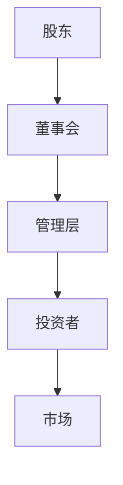
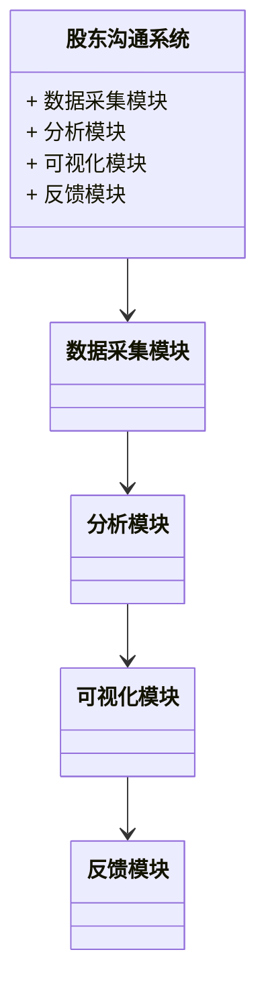

                 


# 彼得·林奇如何看待公司的股东沟通策略

**关键词：** 股东沟通、彼得·林奇、投资策略、企业治理、投资者关系

**摘要：**  
本文从彼得·林奇的投资理念出发，探讨股东沟通在企业治理中的重要性。通过分析彼得·林奇的沟通策略，结合数学模型和系统架构设计，提出一套完整的股东沟通策略分析框架。文章详细讲解了股东沟通的核心概念、数学模型、系统架构，并通过实际案例分析，给出了股东沟通策略的实施步骤和最佳实践。

---

## # 第1章: 股东沟通的重要性

### # 1.1 股东沟通的背景与意义

#### # 1.1.1 股东沟通的定义与核心要素
股东沟通是指企业在与股东及其利益相关者进行信息交流的过程中，通过正式或非正式的渠道传递信息，以实现信息共享、增强信任、优化决策的过程。核心要素包括：
- **信息传递者**：企业高管、董事会成员等。
- **信息接收者**：股东、投资者、利益相关者。
- **信息内容**：企业财务状况、战略规划、经营成果等。
- **沟通渠道**：股东大会、财报发布、投资者会议等。

#### # 1.1.2 股东沟通在企业治理中的作用
股东沟通不仅是企业治理的重要组成部分，也是企业与外部利益相关者建立信任关系的关键环节。其作用包括：
- **增强透明度**：通过公开信息，增强企业与股东之间的信任。
- **优化决策**：通过信息共享，帮助股东做出更明智的投资决策。
- **提升企业形象**：良好的沟通策略有助于提升企业在市场中的声誉。

#### # 1.1.3 股东沟通的现状与挑战
当前，股东沟通面临以下挑战：
- **信息不对称**：企业与股东之间的信息获取存在不平等。
- **沟通效率低下**：传统沟通方式效率较低，难以满足现代企业的需求。
- **技术与文化的障碍**：数字化沟通工具的应用尚未普及，文化差异也会影响沟通效果。

### # 1.2 彼得·林奇与股东沟通的关联

#### # 1.2.1 彼得·林奇的投资理念概述
彼得·林奇是美国著名投资家，以其对基本面分析的重视而闻名。他认为，成功的投资不仅依赖于市场分析，更需要对企业内部经营状况的深入理解。

#### # 1.2.2 股东沟通在投资决策中的重要性
彼得·林奇认为，有效的股东沟通是企业与投资者建立信任的重要桥梁。他强调，企业应该通过定期的沟通活动，向投资者传递真实、准确的信息。

#### # 1.2.3 彼得·林奇如何通过股东沟通评估企业价值
彼得·林奇通过分析企业的股东沟通策略，评估企业的管理团队是否能够清晰传达企业战略和财务状况。他认为，良好的沟通能力是企业治理能力的体现。

---

## # 第2章: 股东沟通的核心概念与联系

### # 2.1 股东沟通的核心概念

#### # 2.1.1 股东与利益相关者的定义与区别
- **股东**：企业所有权的持有者，享有分红和投票权。
- **利益相关者**：包括员工、客户、供应商等，与企业有直接利益关系的群体。

#### # 2.1.2 股东沟通的主要形式与分类
股东沟通的形式可以分为以下几类：
- **正式沟通**：股东大会、财报发布、监管报告等。
- **非正式沟通**：投资者电话会议、社交媒体互动等。

#### # 2.1.3 股东沟通的目标与关键指标
- **目标**：增强透明度，提升投资者信心。
- **关键指标**：投资者参与度、信息传播效率、股东满意度等。

#### # 2.2 股东沟通的关键属性对比

##### # 2.2.1 不同沟通形式的优缺点对比（表格形式）

| 沟通形式      | 优点                          | 缺点                          |
|---------------|-------------------------------|-------------------------------|
| 股东大会      | 权威性强，信息全面            | 程序复杂，成本较高            |
| 投资者会议    | 互动性强，信息反馈及时        | 参与人数有限                  |
| 社交媒体      | 成本低，传播速度快            | 信息容易被误读                |

##### # 2.2.2 股东沟通中的关键角色关系（Mermaid 实体关系图）



---

## # 第3章: 彼得·林奇的股东沟通策略分析

### # 3.1 彼得·林奇的股东沟通策略

#### # 3.1.1 彼得·林奇的投资者沟通原则
- **真实性**：传递真实、准确的信息。
- **及时性**：及时披露重要信息。
- **简洁性**：避免过于复杂的术语。

#### # 3.1.2 彼得·林奇如何通过股东沟通评估企业基本面
彼得·林奇通过分析企业的股东沟通策略，评估企业的基本面。他特别关注以下几点：
- **管理层的透明度**：管理层是否愿意公开企业面临的挑战。
- **财务数据的准确性**：财务报告是否真实反映企业状况。
- **战略的清晰度**：企业战略是否清晰，并能够通过沟通传递给投资者。

#### # 3.1.3 彼得·林奇的股东沟通策略实施步骤
1. **明确沟通目标**：确定沟通的核心信息和目标群体。
2. **选择合适的沟通渠道**：根据目标群体的特点选择沟通方式。
3. **制定沟通计划**：包括时间表、内容安排等。
4. **实施沟通**：通过多种渠道传递信息。
5. **评估沟通效果**：通过反馈机制评估沟通效果。

---

## # 第4章: 股东沟通的数学模型与算法原理

### # 4.1 股东沟通效果的量化模型

#### # 4.1.1 情绪分析算法
通过分析投资者对沟通内容的情绪反应，评估沟通效果。常用的情绪分析算法包括：
- **情感分析指标**：积极、消极、中性。
- **情绪强度**：情绪的强度可以通过词语的情感得分计算得出。

#### # 4.1.2 情绪分析模型
$$ 情绪得分 = \sum (\text{词语情感值} \times \text{词语权重}) $$

#### # 4.1.3 情绪分析的实现步骤
1. **文本预处理**：去除停用词、分词。
2. **情感词典匹配**：匹配词语的情感值。
3. **情绪得分计算**：计算整体情绪得分。
4. **情绪分类**：根据情绪得分进行分类（积极、消极、中性）。

### # 4.2 股东沟通的预测模型

#### # 4.2.1 基于历史数据的股东反应预测
通过分析历史股东反应数据，建立预测模型。常用的模型包括：
- **线性回归模型**：预测股价波动与沟通效果的关系。
- **时间序列模型**：预测未来股价走势。

#### # 4.2.2 股东沟通对股价影响的数学模型
$$ \text{股价波动} = \beta_0 + \beta_1 \times \text{沟通效果} + \epsilon $$

---

## # 第5章: 系统分析与架构设计方案

### # 5.1 股东沟通系统的总体架构

#### # 5.1.1 系统功能模块划分
- **数据采集模块**：采集股东沟通数据。
- **分析模块**：分析沟通效果。
- **可视化模块**：展示分析结果。
- **反馈模块**：根据反馈优化系统。

#### # 5.1.2 系统功能设计（领域模型Mermaid类图）



#### # 5.1.3 系统架构设计（Mermaid架构图）

```mermaid
C4Context
    title 股东沟通系统的架构设计
   主体
    子系统 投资者关系管理 (investor_relation_management)
    子系统 数据分析引擎 (data_analysis_engine)
    子系统 数据存储 (data_storage)
    子系统 用户界面 (user_interface)
    关系
    investor_relation_management --> data_analysis_engine
    data_analysis_engine --> data_storage
    user_interface --> data_storage
```

---

## # 第6章: 项目实战

### # 6.1 环境安装
需要安装以下工具：
- **Python**：用于数据分析和编程。
- **Mermaid**：用于绘制图表。
- **情感分析库**：如TextBlob、 VaderSentiment。

### # 6.2 核心代码实现

#### # 6.2.1 情感分析代码
```python
from textblob import TextBlob
from textblob.sentiments import Sentiment

def analyze_sentiment(text):
    blob = TextBlob(text)
    sentiment = blob.sentiment
    return sentiment.polarity, sentiment.subjectivity
```

#### # 6.2.2 情感分析案例
```python
text = "The company's new strategy is very promising."
polarity, subjectivity = analyze_sentiment(text)
print(f"Polarity: {polarity}, Subjectivity: {subjectivity}")
```

---

## # 第7章: 总结与最佳实践

### # 7.1 总结
彼得·林奇的股东沟通策略强调了真实性和透明度。通过有效的沟通，企业可以提升投资者信心，优化决策。

### # 7.2 最佳实践 tips
- **保持透明**：及时披露重要信息。
- **简化语言**：避免使用复杂的术语。
- **互动交流**：通过多种渠道与投资者互动。

### # 7.3 注意事项
- **避免过度承诺**：不要在沟通中做出无法兑现的承诺。
- **关注反馈**：通过反馈机制不断优化沟通策略。

### # 7.4 拓展阅读
- 彼得·林奇的经典著作《彼得·林奇的投资哲学》。
- 《投资者关系管理》相关书籍。

---

通过本文的分析，我们可以看到，股东沟通不仅是企业治理的重要环节，也是投资决策的关键因素。彼得·林奇的沟通策略为我们提供了一个全新的视角，帮助我们更好地理解如何通过有效的沟通提升企业价值。

