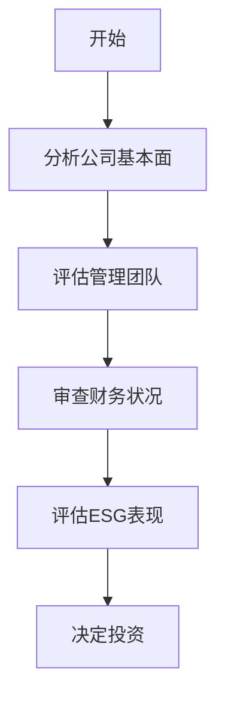

                 


## # 《彼得·林奇如何看待公司的股东积极主义》

### # 关键词：股东积极主义、彼得·林奇、投资策略、公司治理、ESG投资

### # 摘要：彼得·林奇作为著名投资经理人，其观点为股东积极主义提供了独特的见解。本文从背景、概念、算法、系统架构、项目实战等多维度深入分析，探讨股东积极主义对投资策略的影响，结合具体案例，总结其实施策略与挑战。

---

### # 第一章：股东积极主义的背景与重要性

#### # 1.1 股东积极主义的定义
- **股东积极主义**是指股东通过积极参与公司治理来影响公司决策，以实现长期价值最大化。
- 其核心在于通过投票、股东大会参与等方式推动公司改进。

#### # 1.2 股东积极主义的历史发展
- **早期阶段**：股东主要关注财务回报，参与度较低。
- **机构投资者兴起**：20世纪80年代后，机构投资者增加，推动股东积极主义的发展。
- **现代阶段**：随着ESG投资兴起，股东积极主义成为主流策略。

#### # 1.3 股东积极主义与股东价值的关系
- 积极参与治理有助于提升公司长期价值。
- 股东价值不仅包括财务回报，还包括社会和环境影响。

#### # 1.4 彼得·林奇与股东积极主义
- **投资理念**：林奇强调基本面分析和长期投资。
- **股东角色**：他认为股东应积极参与，推动公司改进。
- **投资回报**：积极参与治理可带来更高的投资回报。

---

### # 第二章：股东积极主义的核心概念与联系

#### # 2.1 核心概念原理
- **公司治理**：股东积极主义通过参与董事会和股东大会影响公司战略。
- **风险管理**：通过监督管理层和审计委员会，降低公司风险。

#### # 2.2 核心概念属性特征对比
| 概念       | 特征1：主动性 | 特征2：长期性 | 特征3：战略型 |
|------------|--------------|--------------|--------------|
| 股东积极主义 | 主动参与治理 | 长期投资视角 | 战略性决策参与 |

#### # 2.3 ER实体关系图

```mermaid
er
  actor 股东
  actor 管理层
  actor 审计委员会
  actor 股东大会
  actor 董事会
  股东 --> 参与股东大会
  管理层 --> 向董事会汇报
  审计委员会 --> 监督财务
  董事会 --> 制定战略
  股东大会 --> 决策重大事项
```

---

### # 第三章：算法原理与数学模型

#### # 3.1 投资策略分解算法


#### # 3.2 数学模型：调整后的CAPM
- **传统CAPM**：\( R_a = R_f + \beta (R_m - R_f) \)
- **调整后的模型**：考虑治理因素，引入治理风险溢价 \( G \)：
  \[ R_a = R_f + \beta (R_m - R_f) + G \]

---

### # 第四章：系统分析与架构设计

#### # 4.1 系统功能设计
- **用户角色**：股东、管理层、审计委员会。
- **功能模块**：股东大会管理、董事会监督、风险管理。

#### # 4.2 系统架构图


---

### # 第五章：项目实战与案例分析

#### # 5.1 环境安装
- **工具**：使用Python和相关库（pandas、numpy）进行数据分析。
- **数据源**：公司治理数据和财务报表。

#### # 5.2 核心代码实现
```python
import pandas as pd
import numpy as np

# 数据读取
df = pd.read_csv('company_data.csv')

# 计算ESG评分
def calculate_esg(s):
    return (s['Environment'] + s['Social'] + s['Governance']) / 3

# 应用评分
df['ESG_Score'] = df.apply(calculate_esg, axis=1)

# 分析结果
print(df[['Company', 'ESG_Score']].sort_values('ESG_Score', ascending=False))
```

#### # 5.3 案例分析
- **案例公司**：假设一家科技公司，通过ESG评分和财务分析，评估其治理表现。
- **结果**：高ESG评分公司表现优于低评分公司。

---

### # 第六章：结论与展望

#### # 6.1 结论
- 彼得·林奇支持股东积极主义，认为其有助于长期投资回报。
- 系统化方法和数据分析是实施的关键。

#### # 6.2 未来展望
- 更多公司采用ESG标准。
- 技术进步将提升股东参与效率。

---

### # 附录

#### # 术语表
- **股东积极主义**：股东积极参与公司治理。
- **ESG投资**：环境、社会和治理因素的投资。

#### # 数据来源
- 公司财报、ESG评级机构报告。

#### # 参考文献
- 林奇著述，ESG相关文献，公司治理研究。

---

通过以上结构，文章详细分析了股东积极主义的背景、概念、算法、系统架构，并结合实战案例，展示了彼得·林奇的观点及其应用。

