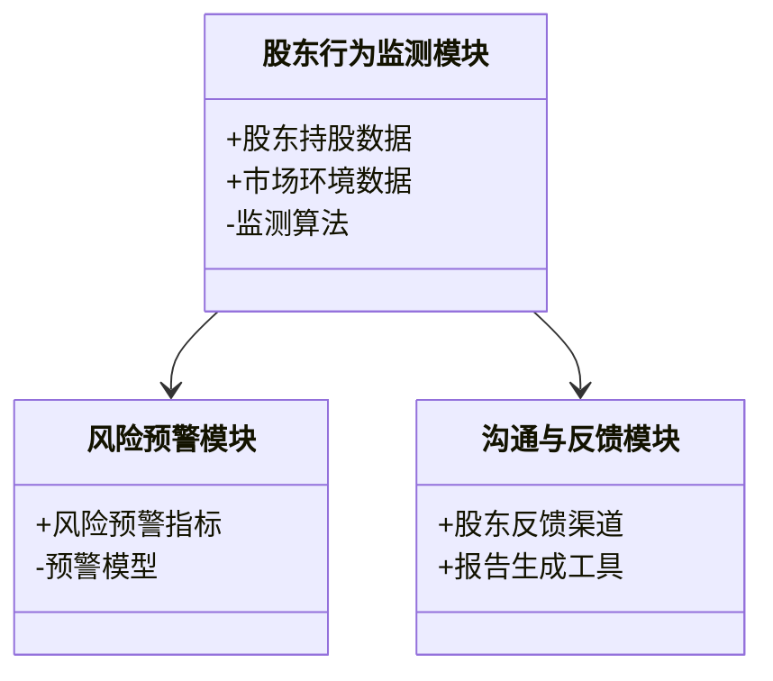
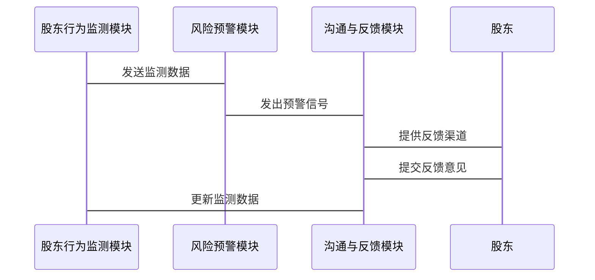

                 


# 彼得林奇如何看待公司的股东积极主义应对策略

## 关键词：彼得·林奇，股东积极主义，公司治理，投资策略，风险管理，股东参与

## 摘要：本文探讨了彼得·林奇对股东积极主义的见解，分析了公司在面对股东积极主义时的应对策略。通过结合理论分析和实际案例，本文详细阐述了如何预测和应对股东行为，设计了数学模型和算法，提供了系统架构和项目实战的解决方案，最后总结了最佳实践和注意事项。

---

# 第一部分：股东积极主义的背景与概念

## 第1章：股东积极主义的定义与背景

### 1.1 股东积极主义的定义

#### 1.1.1 股东积极主义的核心概念
股东积极主义是指股东主动参与公司治理，通过行使投票权、提出议案、监督管理层等方式，影响公司决策，以实现自身利益最大化。其核心在于股东不仅仅是资金提供者，更是公司治理的参与者。

#### 1.1.2 股东积极主义的历史发展
股东积极主义起源于20世纪60年代，随着股东维权意识的增强和公司治理结构的演变，逐渐成为公司治理中的重要现象。近年来，随着利益相关者资本主义的兴起，股东积极主义进一步得到重视。

#### 1.1.3 股东积极主义的现状与趋势
当前，股东积极主义在全球范围内蓬勃发展，尤其是在美国、欧洲等市场。越来越多的机构投资者开始积极行使股东权利，推动公司实现更高的治理透明度和价值创造。

---

### 1.2 股东积极主义与公司治理的关系

#### 1.2.1 公司治理的基本框架
公司治理包括董事会、管理层、股东和其他利益相关者的权利和责任分配。股东积极主义强调股东在治理中的作用，但需平衡与其他利益相关者的权益。

#### 1.2.2 股东在公司治理中的角色
股东通过投票、监督和提出议案等方式，影响公司的战略、风险管理、高管薪酬等决策。积极的股东参与可以提升公司治理效率，但也可能引发管理层与股东之间的冲突。

#### 1.2.3 股东积极主义对现代公司治理的影响
股东积极主义推动了公司治理的透明化和责任化，但也可能导致短期主义和管理层过度迎合股东需求的问题。

---

## 第2章：股东积极主义的核心概念与特征

### 2.1 股东积极主义的核心要素

#### 2.1.1 股东权利的行使
股东权利包括投票权、知情权、质询权等。积极行使这些权利是股东积极主义的核心表现。

#### 2.1.2 股东参与公司治理的动机
股东参与治理的动机可能包括追求更高的投资回报、实现特定的治理目标（如环境保护）或避免代理成本。

#### 2.1.3 股东积极主义的目标与边界
股东积极主义的目标是实现自身利益最大化，但需在法律和道德的边界内进行，避免过度干预公司日常运营。

---

### 2.2 股东积极主义与股东消极主义的对比

#### 2.2.1 股东消极主义的定义与特征
股东消极主义是指股东不主动参与公司治理，仅关注投资回报。其特点是低参与度和高容忍度。

#### 2.2.2 股东积极主义与消极主义的区别
| 特性                | 积极主义             | 消极主义             |
|---------------------|----------------------|----------------------|
| 参与程度            | 高                   | 低                   |
| 目标                | 高透明度、高回报     | 追求回报，不干预治理 |
| 风险                | 高                   | 低                   |

#### 2.2.3 两种策略对公司价值的影响
股东积极主义可能导致公司治理更高效，但也可能引发短期行为和治理冲突。消极主义则可能导致治理低效，但公司可以更专注于长期战略。

---

# 第二部分：股东积极主义的应对策略

## 第3章：公司应对股东积极主义的策略框架

### 3.1 公司应对股东积极主义的核心原则

#### 3.1.1 透明化与沟通的重要性
公司应通过定期报告、股东大会等方式与股东保持透明沟通，降低信息不对称。

#### 3.1.2 股东关系管理的策略
公司需建立专门的股东关系管理部门，主动了解股东需求，提供个性化服务。

#### 3.1.3 公司治理结构的优化
优化董事会结构，增加独立董事比例，确保董事会能够代表股东利益。

---

### 3.2 股东积极主义的预测与预警机制

#### 3.2.1 股东行为的预测模型
基于历史数据和市场环境，建立股东行为预测模型，识别潜在的积极股东。

#### 3.2.2 股东积极主义风险的预警方法
通过分析股东持股比例、集中度、历史行为等指标，建立风险预警机制。

#### 3.2.3 预测与预警的数学模型
$$ P = \sum_{i=1}^{n} w_i x_i $$
其中，$P$ 表示股东积极的概率，$w_i$ 是各指标的权重，$x_i$ 是指标的值。

---

## 第4章：股东积极主义的数学模型与算法

### 4.1 股东积极主义的预测模型

#### 4.1.1 模型的构建与假设
- 数据来源：股东历史行为、市场环境、公司基本面。
- 假设：股东行为与市场环境、公司绩效相关。

#### 4.1.2 模型的输入变量与输出变量
- 输入：股东持股比例、市场波动率、公司ROE。
- 输出：股东积极概率。

#### 4.1.3 模型的数学表达式
$$ P = \frac{1}{1 + e^{-\beta X}} $$
其中，$X$ 是输入特征的线性组合，$\beta$ 是系数。

---

### 4.2 股东积极主义影响的评估算法

#### 4.2.1 算法的步骤与流程
1. 收集数据：股东行为、公司绩效。
2. 数据预处理：归一化、缺失值处理。
3. 建立模型：逻辑回归、随机森林。
4. 验证模型：交叉验证、ROC曲线。

#### 4.2.2 算法的数学推导
使用逻辑回归模型：
$$ \ln\left(\frac{P}{1-P}\right) = \beta_0 + \beta_1 x_1 + \beta_2 x_2 $$

#### 4.2.3 算法的代码实现
```python
import pandas as pd
from sklearn.linear_model import LogisticRegression
from sklearn.metrics import roc_auc_score

# 数据准备
data = pd.DataFrame({
    '持股比例': [0.1, 0.2, 0.15, 0.3],
    '市场波动率': [0.1, 0.2, 0.15, 0.25],
    '积极概率': [1, 1, 0, 0]
})

# 模型训练
model = LogisticRegression()
model.fit(data[['持股比例', '市场波动率']], data['积极概率'])

# 模型验证
y_pred = model.predict_proba(data[['持股比例', '市场波动率']])[:, 1]
print("ROC-AUC:", roc_auc_score(data['积极概率'], y_pred))
```

---

# 第三部分：系统分析与架构设计

## 第5章：应对股东积极主义的系统架构

### 5.1 系统功能模块设计

#### 5.1.1 股东行为监测模块
- 实时监测股东持股变化、投票行为。
- 提供股东行为的可视化报告。

#### 5.1.2 风险预警模块
- 基于预测模型，发出风险预警。
- 提供应对策略建议。

#### 5.1.3 沟通与反馈模块
- 提供在线沟通渠道，收集股东意见。
- 定期发布公司治理报告。

---

### 5.2 系统架构设计

#### 5.2.1 领域模型（mermaid 类图）


#### 5.2.2 系统交互流程（mermaid 序列图）


---

## 第6章：项目实战

### 6.1 环境安装

#### 6.1.1 安装Python和相关库
```bash
pip install numpy pandas scikit-learn matplotlib
```

#### 6.1.2 安装mermaid
```bash
npm install -g mermaid-cli
```

---

### 6.2 核心代码实现

#### 6.2.1 股东行为预测模型
```python
from sklearn.model_selection import train_test_split
from sklearn.metrics import accuracy_score

# 数据准备
data = pd.DataFrame({
    '持股比例': [0.1, 0.2, 0.15, 0.3],
    '市场波动率': [0.1, 0.2, 0.15, 0.25],
    '积极概率': [1, 1, 0, 0]
})

# 划分数据集
X = data[['持股比例', '市场波动率']]
y = data['积极概率']
X_train, X_test, y_train, y_test = train_test_split(X, y, test_size=0.2)

# 模型训练
model = LogisticRegression()
model.fit(X_train, y_train)

# 模型验证
y_pred = model.predict(X_test)
print("准确率:", accuracy_score(y_test, y_pred))
```

---

### 6.3 案例分析与总结

#### 6.3.1 案例分析
某公司通过建立股东行为监测系统，成功预测并应对了主要股东的积极行动，避免了潜在的治理冲突。

#### 6.3.2 总结与小结
通过技术手段和策略优化，公司可以有效应对股东积极主义，提升治理效率和投资回报。

---

## 第四部分：最佳实践与总结

## 第7章：最佳实践与注意事项

### 7.1 小结
股东积极主义是公司治理的重要现象，公司需通过透明化、风险管理等策略应对。

### 7.2 注意事项
- 避免过度依赖预测模型，结合实际情况调整策略。
- 加强与股东的沟通，建立信任关系。

### 7.3 未来研究方向
- 研究不同类型股东的行为差异。
- 探索人工智能在股东行为预测中的应用。

---

## 结语

通过本文的分析，我们可以看到，彼得·林奇对股东积极主义持有支持态度，但公司需采取合理策略应对。通过数学模型、系统架构和项目实战的结合，我们可以更好地理解和应对股东积极主义，实现公司治理的优化和价值创造。

--- 

希望这篇文章能为您提供清晰的思路和实际的指导。如需进一步探讨或补充，请随时告知！

