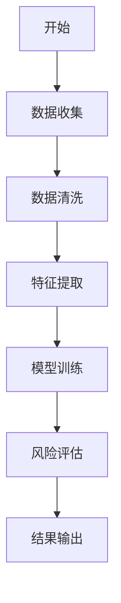

                 

# 彼得林奇如何看待公司的股东结构

## 关键词：股东结构，彼得林奇，投资分析，公司治理，股权激励

## 摘要：本文从彼得林奇的投资者视角出发，分析公司股东结构的重要性，探讨其对公司治理、财务表现和投资价值的影响。通过详细讲解股东结构的核心要素、分析方法和实战案例，帮助读者掌握如何从股东结构中洞察公司潜在风险和投资机会。

---

# 第一部分: 股东结构分析的背景与重要性

## 第1章: 引言

### 1.1 彼得林奇与股东结构分析
#### 1.1.1 彼得林奇的投资者背景介绍
彼得·林奇是美国著名的投资专家，被誉为“股神”之一，他在投资领域有着丰富的实战经验。他认为，公司的股东结构是评估企业健康状况和投资价值的重要指标。通过分析股东结构，投资者可以了解公司治理的稳定性、管理层的激励机制以及潜在的财务风险。

#### 1.1.2 股东结构分析的重要性
股东结构直接关系到公司的控制权分布、管理层的稳定性以及股东的利益分配。一个合理的股东结构能够确保公司治理的有效性，避免因股权分散或集中度过高带来的风险。彼得林奇认为，投资者在分析公司时，必须将股东结构作为核心要素之一。

#### 1.1.3 本文的核心目标与内容框架
本文旨在从彼得林奇的视角，系统地分析公司股东结构的构成、影响因素以及评估方法。通过理论分析与实际案例相结合，帮助投资者掌握如何从股东结构中挖掘潜在的投资机会和风险。

---

## 第2章: 股东结构的核心要素与分析框架

### 2.1 股东结构的核心要素
#### 2.1.1 大股东的持股比例与类型
大股东的持股比例决定了其对公司的话语权和控制权。常见的大股东类型包括创始团队、机构投资者和战略投资者。彼得林奇认为，大股东的持股比例过高可能引发内部人控制风险，而过低则可能导致公司治理不稳定。

#### 2.1.2 中小股东的分布特征
中小股东的分布反映了市场的认可度和投资者信心。通过分析中小股东的分布，可以评估公司的市场流动性、股东结构的分散度以及潜在的收购风险。

#### 2.1.3 股权激励机制
股权激励是绑定管理层与公司利益的重要工具。通过分析股权激励的实施比例、行权价格和时间窗口，可以评估管理层的激励强度和稳定性。

### 2.2 股东结构的分析框架
#### 2.2.1 股东结构的稳定性分析
稳定性分析包括大股东的持股稳定性、中小股东的活跃度以及股权激励的执行情况。彼得林奇认为，一个稳定的股东结构能够降低公司治理的风险。

#### 2.2.2 股东结构的风险评估
风险评估包括大股东控制风险、中小股东利益受损风险以及股权激励失效风险。通过定量和定性分析，可以识别潜在的股东结构风险。

#### 2.2.3 股东结构的优化建议
基于风险评估结果，提出优化股东结构的具体建议，例如调整大股东持股比例、引入战略投资者或完善股权激励机制。

---

## 第3章: 股东结构分析的算法与数学模型

### 3.1 股东结构分析的算法原理
#### 3.1.1 股东结构稳定性指数计算
稳定性指数是衡量股东结构稳定性的关键指标。通过分析大股东的持股比例、中小股东的分布特征以及股权激励的实施情况，可以计算出稳定性指数。

公式：
$$ S = \sum_{i=1}^{n} w_i \cdot s_i $$
其中，$w_i$为第$i$个股东的权重，$s_i$为第$i$个股东的稳定性评分。

#### 3.1.2 股东结构风险评估
风险评估公式：
$$ R = \alpha \cdot D + \beta \cdot C $$
其中，$D$为大股东集中度，$C$为中小股东活跃度，$\alpha$和$\beta$为系数。

#### 3.1.3 算法流程图

---

## 第4章: 股东结构分析的系统架构与实现

### 4.1 系统分析与架构设计
#### 4.1.1 问题场景介绍
设计一个基于彼得林奇股东结构分析方法的系统，用于评估公司股东结构的稳定性与风险。

#### 4.1.2 系统功能设计
系统功能包括数据收集、清洗、特征提取、模型训练和风险评估。

#### 4.1.3 系统架构设计

---

## 第5章: 股东结构分析的实战案例

### 5.1 实战背景与目标
以某公司为例，分析其股东结构，评估稳定性与风险。

### 5.2 数据收集与清洗
收集该公司的股东信息，清洗数据，确保数据的完整性和准确性。

### 5.3 特征提取与模型训练
提取股东结构特征，训练稳定性指数和风险评估模型。

### 5.4 案例分析与结果解读
通过模型计算，得出该公司的股东结构稳定性指数和风险评分。

### 5.5 实战总结与经验分享
总结案例分析的经验，提出优化股东结构的建议。

---

## 第6章: 总结与展望

### 6.1 本章总结
从彼得林奇的视角，系统地分析了公司股东结构的核心要素、分析方法和实战案例。

### 6.2 投资建议与风险提示
投资者在分析股东结构时，应关注大股东的持股比例、中小股东的分布特征以及股权激励机制。同时，需警惕股东结构集中度过高或分散度过低带来的风险。

### 6.3 拓展阅读与进一步思考
建议读者进一步阅读彼得林奇的经典著作，深入理解股东结构分析的精髓。

---

通过本文的分析，读者可以全面掌握彼得林奇看待公司股东结构的方法，学会从股东结构中洞察公司的潜在风险和投资机会。

