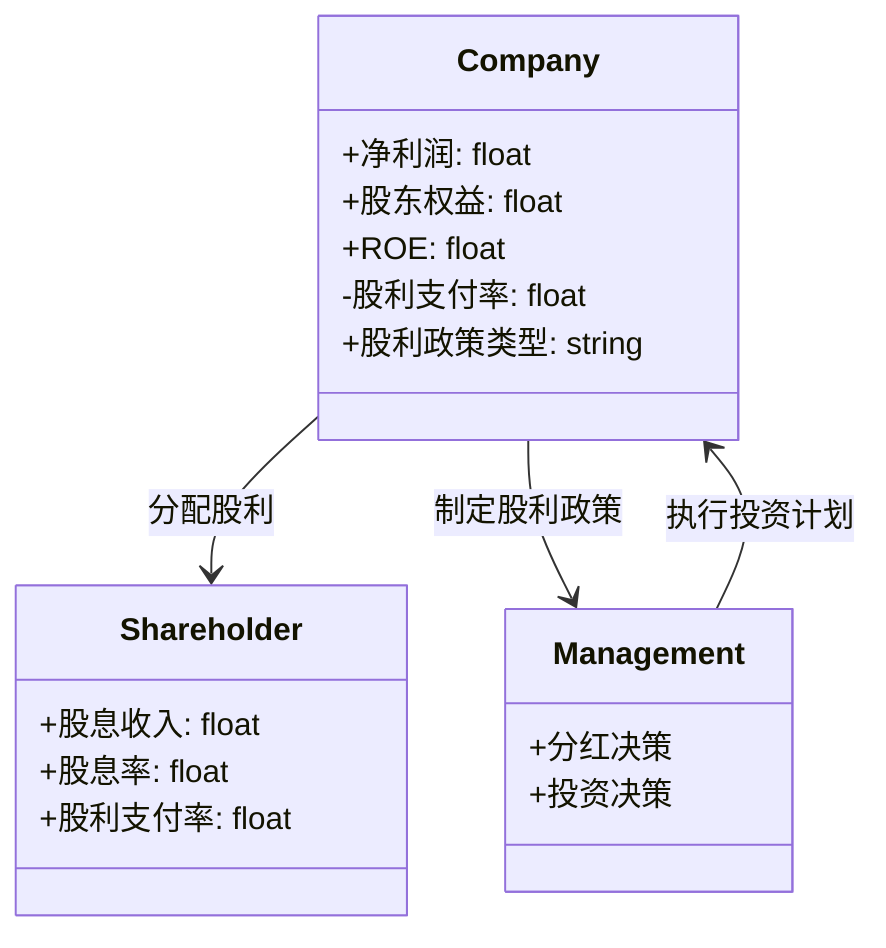
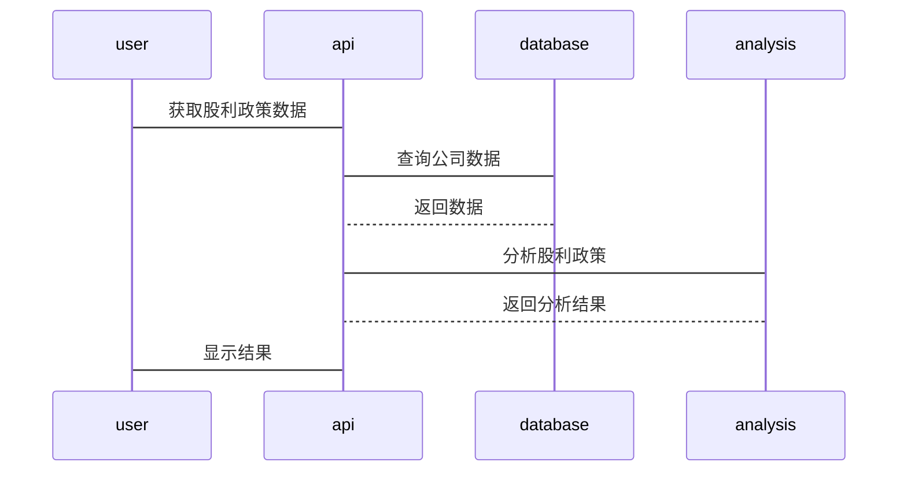

                 


# 彼得·林奇如何看待公司的股利政策

## 关键词：
彼得·林奇，股利政策，投资策略，财务分析，股票投资

## 摘要：
本文深入分析了彼得·林奇对股利政策的见解，探讨了股利政策的核心概念、分析方法和实际应用。通过结合具体案例，本文揭示了股利政策对公司价值的影响，并提供了系统化的分析框架和实战指导。

---

# 第一部分：股利政策概述

## 1.1 股利政策的基本概念
### 1.1.1 股利政策的定义
股利政策是指公司对其净利润分配给股东的方式和比例的策略。它直接影响公司的股价、股东回报和公司成长。

### 1.1.2 股利政策的类型
股利政策主要有四种类型：剩余股利政策、固定股利政策、固定股息率政策和低正常股利加额外股利政策。每种类型有不同的特点和适用场景。

### 1.1.3 股利政策的重要性
股利政策反映了公司的财务健康状况和管理层的分红策略，是投资者评估公司的重要指标。

## 1.2 彼得·林奇的投资理念
### 1.2.1 林奇的投资风格
彼得·林奇以价值投资闻名，注重基本面分析和长期投资，寻找具有持续增长潜力的公司。

### 1.2.2 林奇对股利政策的看法
林奇认为，股利政策是公司财务健康和管理质量的重要体现。稳定的股利支付率通常意味着公司财务稳健。

### 1.2.3 林奇的选股标准
林奇关注高ROE、低市盈率和管理层质量，同时考虑股利政策的稳定性和增长性。

## 1.3 股利政策与股价的关系
### 1.3.1 股利支付率的计算
股利支付率 = （股息 / 净利润）× 100%

### 1.3.2 股利政策对股价的影响
稳定的高股利政策通常会提升股价，但过高的股利可能影响公司发展。

### 1.3.3 高股息率股票的优缺点
高股息率股票提供稳定收益，但可能面临增长受限的风险。

---

# 第二部分：股利政策的核心概念与联系

## 2.1 股利政策的类型分析
### 2.1.1 剩余股利政策
公司优先投资，剩余利润分配给股东，适合高增长公司。

### 2.1.2 固定股利政策
每年支付固定股利，适合财务稳定的公司。

### 2.1.3 固定股息率政策
按固定比例支付股利，适合希望稳定收益的股东。

### 2.1.4 低正常股利加额外股利政策
平时支付低股利，盈利超预期时额外分红，平衡收益与增长。

## 2.2 股利政策与企业价值的关系
### 2.2.1 股利政策对企业价值的影响
稳定的股利支付率提升企业价值，高股利支付率可能影响再投资能力。

### 2.2.2 股利政策与企业成长性的关系
成长性好的企业可能选择低股利政策，将利润用于再投资。

### 2.2.3 股利政策与企业财务状况的联系
良好的财务状况支持稳定的股利政策，反之亦然。

## 2.3 股利政策的决策因素
### 2.3.1 财务状况分析
包括净利润、现金流、ROE等指标。

### 2.3.2 行业特点与竞争环境
高增长行业可能选择低股利政策，成熟行业可能选择高股利政策。

### 2.3.3 公司战略与股东期望
股东期望高回报时，公司可能调整股利政策。

---

# 第三部分：股利政策的分析方法

## 3.1 股利政策的评估指标
### 3.1.1 股利支付率
衡量公司分红比例，计算公式：股利支付率 = （股息 / 净利润）× 100%

### 3.1.2 股息率
衡量股利回报率，计算公式：股息率 = （年股息 / 当前股价）× 100%

### 3.1.3 股利增长 rate
衡量股利增长潜力，通常与公司成长性相关。

## 3.2 彼得·林奇的股利政策分析框架
### 3.2.1 财务指标分析
分析净利润、ROE、现金流等指标，评估公司盈利能力。

### 3.2.2 行业分析与竞争地位
评估公司所在行业的增长潜力和竞争地位，判断股利政策的合理性。

### 3.2.3 管理层质量与股利政策
管理层质量高，股利政策更可靠。

## 3.3 股利政策的财务指标分析
### 3.3.1 净利润与股利的关系
净利润是股利分配的基础，净利润增长支持股利增长。

### 3.3.2 股东权益与股利的关联
股东权益是股利分配的上限，股东权益增长支持股利政策的稳定性。

### 3.3.3 财务健康性评估
通过财务指标评估公司的财务健康，判断股利政策的可持续性。

---

# 第四部分：股利政策的案例

## 4.1 苹果公司的股利政策分析
苹果历史上股利政策较保守，2012年起开始分红，股利支付率稳定，体现公司财务稳健。

## 4.2 可口可乐的股利政策分析
可口可乐长期保持高股利支付率，股利增长稳定，吸引追求稳定收益的投资者。

## 4.3 案例总结
通过分析苹果和可口可乐的股利政策，可以看出股利政策与公司战略、财务状况密切相关。

---

# 第五部分：股利政策的系统分析与架构设计

## 5.1 系统分析框架
### 5.1.1 问题场景介绍
投资者需要评估公司的股利政策，以做出投资决策。

### 5.1.2 领域模型设计
使用mermaid类图展示公司、股东、管理层之间的关系。



### 5.1.3 系统架构设计
使用mermaid架构图展示系统架构，包括数据采集、分析模块、可视化模块。


### 5.1.4 系统接口设计
定义RESTful API接口，用于数据采集和分析结果展示。

### 5.1.5 系统交互设计
使用mermaid序列图展示用户与系统之间的交互流程。



## 5.2 项目实战
### 5.2.1 环境安装
安装Python、Pandas、Matplotlib等工具。

### 5.2.2 核心实现
编写代码实现股利政策分析，包括数据采集、计算股利支付率和股息率。

```python
import pandas as pd
import matplotlib.pyplot as plt

# 数据采集
df = pd.read_csv('stock_data.csv')

# 计算股利支付率
dividend_payout_ratio = df['股息'] / df['净利润'] * 100

# 绘制柱状图
plt.figure(figsize=(10,6))
plt.bar(df['公司'], dividend_payout_ratio)
plt.title('股利支付率分析')
plt.xlabel('公司名称')
plt.ylabel('股利支付率 (%)')
plt.show()
```

### 5.2.3 案例分析
分析实际公司的股利政策，解释结果。

### 5.2.4 项目小结
总结项目实施过程，强调系统化分析的重要性。

---

# 第六部分：最佳实践与总结

## 6.1 最佳实践 tips
- 结合财务指标和行业特点分析股利政策。
- 长期投资，关注公司成长性。
- 分散投资，降低风险。

## 6.2 小结
彼得·林奇的股利政策分析框架提供了系统化的分析方法，帮助投资者做出明智决策。

## 6.3 注意事项
- 股利政策受多种因素影响，需综合分析。
- 股票市场存在不确定性，投资需谨慎。

## 6.4 拓展阅读
推荐相关书籍和文章，深入学习股利政策和投资策略。

---

通过以上目录和内容，您可以系统地撰写一篇关于彼得·林奇如何看待公司股利政策的博客文章，涵盖从基础概念到实战分析的各个方面。

