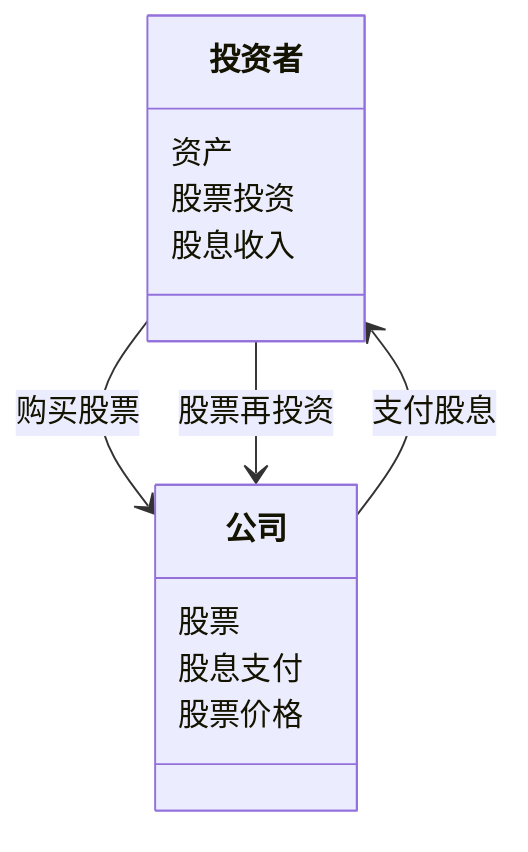

                 


# 彼得·林奇如何看待公司的股息再投资计划对长期回报的影响

> 关键词：股息再投资，彼得·林奇，长期回报，投资策略，股息增长模型

> 摘要：本文深入探讨了彼得·林奇对股息再投资计划的看法，分析了股息再投资的数学模型、算法原理、系统架构，并通过实际案例展示了其对长期回报的影响。文章从背景介绍到项目实战，层层剖析，结合理论与实践，为投资者提供了有价值的见解和策略。

---

## 第一部分: 股息再投资计划的背景与核心概念

### 第1章: 股息再投资计划的定义与背景

#### 1.1 股息再投资计划的定义

- **股息再投资的基本概念**：股息再投资是指公司将分配给股东的股息用于购买更多该公司股票的行为。这种再投资方式无需支付额外的资金，利用复利效应实现资产的长期增值。

- **股息再投资的历史发展**：股息再投资的概念可以追溯到早期的公司分红制度，随着时间的推移，尤其是在20世纪末和21世纪初，随着技术的进步和金融市场的成熟，股息再投资计划逐渐成为一种常见的投资策略。

- **股息再投资的法律与税务背景**：不同国家和地区的税法对股息再投资有不同的规定，投资者需要了解相关的税务政策和法律规定，以避免税务风险。

#### 1.2 股息再投资的核心优势

- **股息再投资的优势**：通过再投资，投资者可以避免缴纳股息所得税（在某些情况下），同时利用复利效应实现资产的长期增值。此外，股息再投资还能帮助投资者积累更多的股份，增强投资组合的稳定性。

- **股息再投资的局限性**：股息再投资的回报取决于公司的股息支付能力和股价表现。如果公司股息增长缓慢或股价下跌，再投资可能无法带来预期的回报。

- **股息再投资与复利效应的关系**：股息再投资通过不断再投资获得的收益再投资，形成复利效应，从而实现资产的长期增值。这种效应在长期投资中尤为显著。

### 第2章: 彼得·林奇的投资理念与股息再投资

#### 2.1 彼得·林奇的投资哲学

- **长期投资的重要性**：彼得·林奇强调长期投资的重要性，认为短期市场波动难以预测，而长期投资可以通过复利效应实现资产的稳定增长。

- **价值投资的核心理念**：林奇主张投资具有强大基本面和良好管理的公司，这些公司能够持续增长并为股东创造价值。

- **股息再投资在彼得·林奇投资策略中的地位**：林奇认为，股息再投资是实现长期回报的重要手段之一，尤其是对于那些能够持续派发股息并增长的公司。

#### 2.2 彼得·林奇对股息再投资的看法

- **股息再投资在长期回报中的作用**：林奇认为，股息再投资可以通过复利效应显著提升长期回报，尤其是在市场表现不佳的情况下，股息再投资能够帮助投资者积累更多的股份，从而在未来实现更高的收益。

- **经典投资案例分析**：林奇曾投资于一些具有稳定股息增长的公司，例如可口可乐和箭牌糖品公司。通过股息再投资，这些投资最终为他带来了丰厚的回报。

- **股息再投资与企业成长的关系**：林奇强调，股息再投资不仅仅是被动地 reinvest dividends，而是通过选择能够持续增长并派发股息的公司，主动地将收益转化为更多的投资，从而推动投资组合的长期增长。

---

## 第二部分: 股息再投资的数学模型与算法原理

### 第3章: 股息再投资的数学模型

#### 3.1 股息再投资的计算公式

- **股息收益率的计算**：股息收益率 = 每股股息（DPS） / 当前股价（P）

- **股息再投资的复利计算**：通过股息再投资形成的复利效应可以用以下公式表示：
  \[
  FV = P \times (1 + r)^n
  \]
  其中，\( FV \) 是未来价值，\( P \) 是初始投资，\( r \) 是年收益率，\( n \) 是投资年数。

- **股息增长模型的数学表达**：股息增长模型可以表示为：
  \[
  P = \frac{D_1}{r - g}
  \]
  其中，\( P \) 是股票价格，\( D_1 \) 是第一年的股息，\( r \) 是折现率，\( g \) 是股息增长率。

#### 3.2 股息再投资的数学模型

- **股息再投资的现金流折现模型**：通过将股息再投资，投资者可以将股息收益再投资于公司，从而在未来获得更多的现金流。

- **股息再投资的数学模型与实际应用**：通过构建股息增长模型，投资者可以预测未来股息的再投资价值，并评估其对投资组合的长期影响。

### 第4章: 股息再投资的算法原理

#### 4.1 股息再投资的算法流程

- **确定股息再投资的条件**：根据公司的股息支付率和股价表现，确定是否进行股息再投资。

- **计算股息再投资的金额**：根据每股股息和当前股价，计算可以再投资的股份数量。

- **更新投资组合的市值**：根据再投资的股份数量和股价变化，更新投资组合的市值。

#### 4.2 股息再投资的优化算法

- **动态调整投资组合**：根据市场变化和公司基本面，动态调整再投资的股份数量和比例。

- **风险控制算法**：通过分散投资和风险评估，控制股息再投资的风险。

- **收益最大化算法**：通过优化股息再投资策略，实现投资组合收益的最大化。

---

## 第三部分: 系统分析与架构设计

### 第5章: 系统分析与架构设计

#### 5.1 问题场景介绍

- **问题背景**：投资者希望通过股息再投资实现长期回报，但需要一套系统化的分析方法和工具。

- **项目介绍**：构建一个股息再投资分析系统，帮助投资者评估股息再投资的长期回报。

#### 5.2 系统功能设计

- **领域模型设计**：通过 Mermaid 绘制领域模型图，展示投资者、公司、股息等核心要素之间的关系。



- **系统架构设计**：通过 Mermaid 绘制系统架构图，展示系统的主要组件和交互关系。

```mermaid
container 股息再投资分析系统 {
    component 数据获取模块 {
        获取公司股价数据
        获取股息数据
    }
    component 分析模块 {
        计算股息收益率
        构建股息增长模型
    }
    component 可视化模块 {
        展示股息再投资回报
        生成投资报告
    }
}
```

- **系统接口设计**：定义系统与外部数据源、用户交互的接口。

- **系统交互设计**：通过 Mermaid 绘制序列图，展示用户与系统的交互流程。

---

## 第四部分: 项目实战

### 第6章: 项目实战

#### 6.1 环境安装

- **安装工具**：安装 Python、Pandas、Matplotlib 等工具，用于数据处理和可视化。

#### 6.2 核心实现源代码

- **股息再投资计算代码**：

```python
import pandas as pd
import matplotlib.pyplot as plt

# 示例数据：假设某公司过去10年的股息和股价
data = {
    '年份': [2013, 2014, 2015, 2016, 2017, 2018, 2019, 2020, 2021, 2022],
    '股息': [1, 1.05, 1.10, 1.15, 1.20, 1.25, 1.30, 1.35, 1.40, 1.45],
    '股价': [100, 105, 108, 110, 112, 115, 118, 120, 125, 130]
}

df = pd.DataFrame(data)

# 计算股息收益率
df['股息收益率'] = df['股息'] / df['股价']

# 计算股息再投资的总回报
initial_investment = 1000
shares = initial_investment / df['股价'].iloc[0]
reinvested_shares = shares
total_shares = shares

for i in range(1, len(df)):
    total_shares += reinvested_shares * df['股息'].iloc[i] / df['股价'].iloc[i]
    reinvested_shares = total_shares * df['股息'].iloc[i] / df['股价'].iloc[i]

final_value = total_shares * df['股价'].iloc[-1]
print(f"初始投资: {initial_investment}")
print(f"最终价值: {final_value}")
```

#### 6.3 案例分析与解读

- **苹果公司的股息再投资分析**：
  以苹果公司为例，分析其股息再投资的回报情况。通过计算股息收益率和股价走势，评估股息再投资的长期回报。

#### 6.4 小结与经验总结

- **小结**：通过股息再投资，投资者可以利用复利效应实现长期回报，但需要选择具有稳定股息增长和良好股价表现的公司。

- **经验总结**：在实际操作中，投资者需要关注公司的财务状况、行业前景以及市场波动，合理配置投资组合，以最大化股息再投资的回报。

---

## 第五部分: 最佳实践与总结

### 第7章: 最佳实践、小结与注意事项

#### 7.1 最佳实践

- **投资策略**：选择具有稳定股息增长和良好基本面的公司，分散投资以降低风险。

- **税务规划**：了解相关的税务政策，合理规划股息再投资的税务负担。

- **风险管理**：关注市场波动和公司基本面变化，及时调整投资策略。

#### 7.2 小结

- 通过本文的分析，可以得出股息再投资是实现长期回报的重要手段，尤其是在市场波动较大的情况下，再投资可以通过复利效应帮助投资者实现资产的稳定增长。

#### 7.3 注意事项

- **税务风险**：不同地区的税务政策不同，投资者需要了解相关法规，避免税务风险。

- **市场风险**：股息再投资的回报取决于公司股息支付能力和股价表现，市场波动可能会影响投资回报。

- **流动性风险**：长期再投资可能会影响资产的流动性，投资者需要根据自身需求合理配置投资组合。

#### 7.4 拓展阅读

- 推荐阅读彼得·林奇的《股市长线法宝》和《巴菲特选股术》，深入了解股息再投资和价值投资的策略。

---

通过以上内容，我们可以看到股息再投资不仅是实现长期回报的重要手段，更是彼得·林奇投资理念的重要组成部分。通过科学的分析和合理的投资策略，投资者可以充分利用股息再投资的复利效应，实现资产的长期增值。

