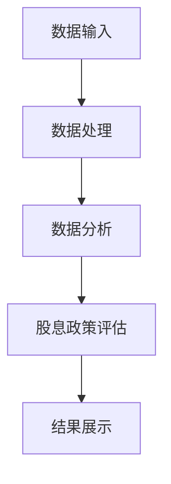
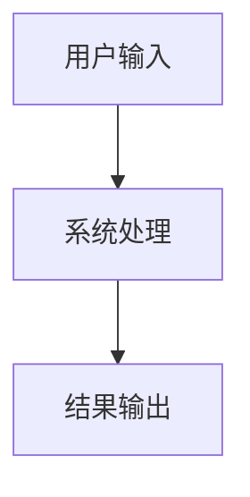

                 

# 彼得林奇如何看待公司的股息政策

**关键词：** 彼得·林奇，股息政策，投资策略，财务分析，价值投资

**摘要：** 彼得·林奇作为全球著名投资家，他如何看待公司的股息政策？本文将从股息政策的核心概念出发，结合彼得·林奇的投资理念，系统地分析股息政策的重要性、评估标准及其实现方法。通过理论分析和实际案例，深入探讨彼得·林奇对股息政策的见解，并结合技术手段提供股息政策的分析框架和实战指导。

---

## 第1章: 股息政策的基本概念

### 1.1 股息政策的定义与分类

#### 1.1.1 股息政策的定义
股息政策是公司对其利润分配策略的制定，包括股息的分配方式、分配时间、分配比例等内容。股息政策是公司治理和财务管理的重要组成部分，直接影响股东的回报和公司的长期发展。

#### 1.1.2 股息政策的分类
股息政策可以分为以下几种类型：
1. **固定股息政策**：公司承诺每年支付固定的股息，通常适用于成熟稳定的公司。
2. **稳定增长股息政策**：公司每年股息按固定比例增长，通常适用于成长型企业。
3. **可变股息政策**：公司根据每年的盈利情况调整股息支付，灵活性较高。
4. **特殊股息政策**：公司根据特殊情况一次性支付股息。

#### 1.1.3 股息政策的核心要素
股息政策的核心要素包括：
- 股息支付率
- 股息收益率
- 股息增长潜力
- 股息政策的可持续性

### 1.2 股息政策的重要性

#### 1.2.1 股息政策对企业价值的影响
股息政策直接影响企业的市场价值。稳定的股息政策能够增强投资者信心，提升股价。

#### 1.2.2 股息政策对股东回报的意义
股息是股东投资回报的重要组成部分，合理的股息政策能够为股东创造稳定收益。

#### 1.2.3 股息政策与企业长期发展的关系
股息政策需要在股东回报和企业再投资之间找到平衡，合理的股息政策能够促进企业的可持续发展。

### 1.3 彼得·林奇的投资理念概述

#### 1.3.1 彼得·林奇的投资风格
彼得·林奇以“价值投资”闻名，注重对公司基本面的深入分析，寻找被低估的股票。

#### 1.3.2 彼得·林奇对股息政策的关注点
彼得·林奇认为，股息政策是公司财务健康的重要指标，能够反映公司的盈利能力和分红能力。

#### 1.3.3 彼得·林奇的投资哲学
彼得·林奇强调长期投资和价值发现，认为股息政策是公司长期价值的重要组成部分。

---

## 第2章: 股息政策的核心概念与分析框架

### 2.1 股息政策的类型

#### 2.1.1 固定股息政策
固定股息政策通常适用于成熟企业，股息支付率稳定，风险较低。

#### 2.1.2 稳定增长股息政策
稳定增长股息政策适用于成长型企业，能够反映公司的盈利能力增长。

#### 2.1.3 可变股息政策
可变股息政策灵活性高，但波动性较大，通常适用于盈利不稳定的企业。

#### 2.1.4 特殊股息政策
特殊股息政策适用于公司特殊情况下的股息分配，通常一次性支付。

### 2.2 股息政策的评估维度

#### 2.2.1 股息支付率
股息支付率是衡量公司股息支付能力的重要指标，公式如下：
$$\text{股息支付率} = \frac{\text{股息支付总额}}{\text{净利润}}$$

#### 2.2.2 股息收益率
股息收益率是衡量股息回报的重要指标，公式如下：
$$\text{股息收益率} = \frac{\text{每股股息}}{\text{股价}}$$

#### 2.2.3 股息增长潜力
股息增长潜力反映了公司未来股息增长的可能性，通常与公司的盈利能力密切相关。

#### 2.2.4 股息政策的可持续性
股息政策的可持续性是衡量公司股息政策稳定性的重要指标，通常需要考虑公司的现金流、负债水平等因素。

### 2.3 彼得·林奇视角下的股息政策分析

#### 2.3.1 彼得·林奇对股息政策的重视
彼得·林奇认为，股息政策是公司财务健康的重要指标，能够反映公司的盈利能力和分红能力。

#### 2.3.2 彼得·林奇对股息政策的评价标准
彼得·林奇通常关注股息支付率、股息收益率以及股息政策的可持续性。

#### 2.3.3 彼得·林奇对股息政策的潜在风险
彼得·林奇提醒投资者，股息政策可能存在过度分红的风险，需要综合考虑公司的财务状况和未来发展。

---

## 第3章: 股息政策的数学模型与分析

### 3.1 股息支付率模型

#### 3.1.1 股息支付率的定义
股息支付率是衡量公司股息支付能力的重要指标，公式如下：
$$\text{股息支付率} = \frac{\text{股息支付总额}}{\text{净利润}}$$

#### 3.1.2 股息支付率的计算公式
例如，某公司净利润为1000万元，股息支付总额为200万元，则股息支付率为20%。

### 3.2 股息收益率模型

#### 3.2.1 股息收益率的定义
股息收益率是衡量股息回报的重要指标，公式如下：
$$\text{股息收益率} = \frac{\text{每股股息}}{\text{股价}}$$

#### 3.2.2 股息收益率的计算公式
例如，某公司每股股息为2元，股价为20元，则股息收益率为10%。

### 3.3 股息政策的可持续性分析

#### 3.3.1 股息政策的财务健康指标
股息政策的可持续性需要考虑公司的净利润、现金流、负债水平等因素。

#### 3.3.2 股息政策的现金流分析
股息政策的现金流分析需要考虑公司的自由现金流是否能够支持股息支付。

#### 3.3.3 股息政策的债务与股权结构分析
股息政策的债务与股权结构分析需要考虑公司的债务水平和股权比例，确保股息支付的可持续性。

---

## 第4章: 股息政策的系统分析与架构设计

### 4.1 股息政策的系统分析框架

#### 4.1.1 股息政策的决策流程
1. 确定公司的财务状况
2. 评估股息支付能力
3. 制定股息政策
4. 监控与调整

#### 4.1.2 股息政策的实施步骤
1. 收集公司财务数据
2. 计算股息支付率和股息收益率
3. 分析股息政策的可持续性
4. 制定股息政策

#### 4.1.3 股息政策的监控与调整
1. 定期评估股息政策
2. 根据公司财务状况调整股息政策

### 4.2 股息政策的系统架构设计

#### 4.2.1 系统功能模块划分
1. 数据采集模块
2. 数据分析模块
3. 股息政策评估模块
4. 结果展示模块

#### 4.2.2 系统数据流图

#### 4.2.3 系统交互流程图

### 4.3 股息政策的系统实现

#### 4.3.1 数据收集与处理
1. 收集公司的财务数据
2. 清洗数据
3. 数据转换

#### 4.3.2 数据分析与建模
1. 计算股息支付率
2. 计算股息收益率
3. 分析股息政策的可持续性

#### 4.3.3 结果展示与报告生成
1. 生成股息政策评估报告
2. 可视化展示

---

## 第5章: 项目实战——彼得·林奇视角下的股息政策分析

### 5.1 项目背景与目标

#### 5.1.1 项目背景
以某公司为例，分析其股息政策是否符合彼得·林奇的投资理念。

#### 5.1.2 项目目标
评估该公司的股息政策，判断其是否具备投资价值。

### 5.2 数据收集与处理

#### 5.2.1 数据来源
1. 公司财务报表
2. 股票市场数据

#### 5.2.2 数据清洗
1. 处理缺失数据
2. 处理异常数据

### 5.3 数据分析与建模

#### 5.3.1 股息支付率计算
$$\text{股息支付率} = \frac{\text{股息支付总额}}{\text{净利润}}$$

#### 5.3.2 股息收益率计算
$$\text{股息收益率} = \frac{\text{每股股息}}{\text{股价}}$$

#### 5.3.3 股息政策可持续性分析
1. 分析公司现金流
2. 分析公司债务水平
3. 分析公司盈利能力

### 5.4 结果展示与报告生成

#### 5.4.1 股息政策评估报告
1. 股息支付率
2. 股息收益率
3. 股息政策可持续性

#### 5.4.2 可视化展示
1. 股息支付率趋势图
2. 股息收益率对比图
3. 股息政策可持续性分析图

---

## 第6章: 最佳实践与小结

### 6.1 最佳实践
1. 关注股息支付率和股息收益率
2. 分析股息政策的可持续性
3. 综合考虑公司财务状况和未来发展

### 6.2 小结
彼得·林奇认为，股息政策是公司财务健康的重要指标，能够反映公司的盈利能力和分红能力。投资者在分析股息政策时，需要综合考虑股息支付率、股息收益率以及股息政策的可持续性。

### 6.3 注意事项
1. 股息政策可能存在过度分红的风险
2. 股息政策需要综合考虑公司财务状况和未来发展

### 6.4 拓展阅读
1. 《彼得·林奇的投资哲学》
2. 《股息投资实战》

---

通过本文的分析，我们从彼得·林奇的视角深入探讨了公司的股息政策，结合理论分析和实际案例，为投资者提供了系统的股息政策分析框架和实战指导。希望本文能够帮助投资者更好地理解和应用股息政策，实现长期稳定的收益。

