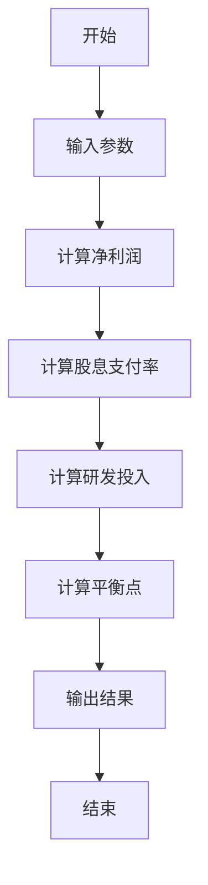
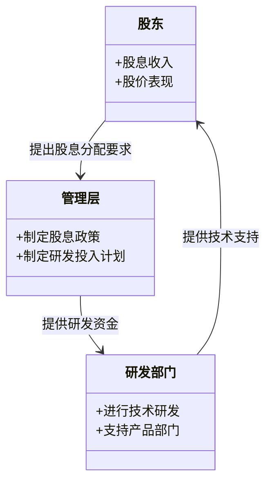
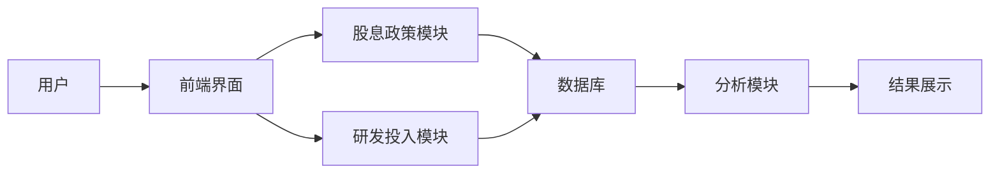
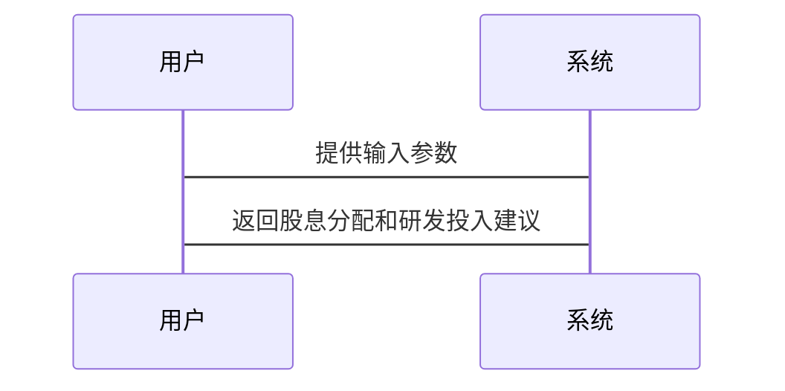

                 


# 彼得·林奇如何看待公司的股息政策与研发投入的平衡

## 关键词：彼得·林奇，股息政策，研发投入，投资策略，企业战略，平衡模型

## 摘要：  
本文从彼得·林奇的投资哲学出发，探讨公司股息政策与研发投入之间的平衡关系。通过分析股息政策和研发投入的核心概念、数学模型以及系统架构，结合实际案例，提出构建平衡模型的方法，并给出系统设计与实现方案，最后总结最佳实践和未来研究方向。

---

# 第一部分：股息政策与研发投入的背景与概念

## 第1章：股息政策与研发投入的背景与概念

### 1.1 股息政策的基本概念

#### 1.1.1 股息政策的定义与分类  
股息政策是指公司董事会决定如何分配利润给股东的策略。常见的股息政策包括固定股息政策、固定股息增长政策、股息支付率政策等。

#### 1.1.2 股息政策的核心要素  
- **股息支付率**：净利润中用于支付股息的比例。  
- **股息稳定性**：股息分配的稳定性和可持续性。  
- **市场反应**：股息政策对股价的影响。

#### 1.1.3 股息政策的市场影响  
股息政策直接影响股东的回报和市场对公司的信心。稳定的股息政策通常被视为公司财务健康的表现，有助于吸引价值投资者。

### 1.2 研发投入的基本概念

#### 1.2.1 研发投入的定义与范围  
研发投入是指公司用于新产品开发、技术改进和创新的支出。包括研发人员工资、设备购置、实验费用等。

#### 1.2.2 研发投入的分类与特点  
- **按时间分类**：短期研发投入和长期研发投入。  
- **按类型分类**：基础研究、应用研究和实验开发。  
- **特点**：高风险、高回报、周期长。

#### 1.2.3 研发投入对企业长期发展的意义  
研发投入是企业保持竞争力的关键。通过技术创新，企业可以降低成本、提高产品附加值，从而在市场中占据优势地位。

### 1.3 股息政策与研发投入的关系

#### 1.3.1 股息政策与研发投入的内在联系  
- **资金分配**：公司需要在股息分配和研发投入之间找到平衡点。  
- **战略目标**：短期回报与长期发展之间的权衡。

#### 1.3.2 股息政策与研发投入的平衡点  
- **短期股东利益**：通过股息分配回报股东。  
- **长期企业价值**：通过研发投入提升企业核心竞争力。

#### 1.3.3 彼得·林奇视角下的投资逻辑  
彼得·林奇强调基本面分析，认为公司应该在股息政策和研发投入之间找到平衡。他倾向于投资那些既有稳定的股息回报，又能持续进行技术研发的企业。

---

## 第2章：股息政策与研发投入的核心概念对比

### 2.1 股息政策的核心属性特征

#### 2.1.1 股息政策的稳定性  
股息政策的稳定性反映了公司财务状况的健康程度。稳定的股息政策能够增强投资者信心。

#### 2.1.2 股息政策的可持续性  
股息政策的可持续性取决于公司的盈利能力和现金流状况。公司需要确保股息支付不会影响到未来的研发投入。

#### 2.1.3 股息政策的市场反应  
股息政策的市场反应可以通过股价波动和投资者情绪来衡量。良好的股息政策通常会提升股价表现。

### 2.2 研发投入的核心属性特征

#### 2.2.1 研发投入的周期性  
研发投入通常需要较长时间才能见效，具有较强的周期性。  

#### 2.2.2 研发投入的风险性  
研发投入存在失败的风险，但成功的研发能够带来超额回报。

#### 2.2.3 研发投入的回报潜力  
成功的研发投入能够显著提升企业的核心竞争力，带来长期的利润增长。

### 2.3 股息政策与研发投入的对比分析

#### 2.3.1 核心要素对比表格

| 核心要素         | 股息政策                     | 研发投入                     |
|------------------|------------------------------|------------------------------|
| 目标             | 回报股东                     | 提升企业竞争力               |
| 时间跨度         | 短期                         | 长期                         |
| 资金分配         | 分配现有利润                 | 投资未来增长                 |
| 风险             | 较低                         | 较高                         |
| 影响             | 股东信心                     | 企业核心竞争力               |

#### 2.3.2 ER实体关系图架构  

```mermaid
erd
    title 股息政策与研发投入的关系
    管理层
    股东
    研发部门
    财务部门
    产品部门
    0..1, 管理层 -> 股东 : 决定股息政策
    0..1, 管理层 -> 研发部门 : 制定研发投入计划
    0..1, 财务部门 -> 股东 : 提供股息分配方案
    0..1, 研发部门 -> 产品部门 : 提供技术支持
```

---

## 第3章：股息政策与研发投入的平衡模型

### 3.1 平衡模型的构建逻辑

#### 3.1.1 模型目标设定  
构建一个能够量化股息政策与研发投入之间关系的数学模型，帮助公司找到最佳平衡点。

#### 3.1.2 模型输入变量  
- **净利润（Net Income）**  
- **股息支付率（Dividend Payout Ratio）**  
- **研发投入比例（R&D Investment Ratio）**  
- **资本支出（Capex）**  

#### 3.1.3 模型输出结果  
- **股息政策与研发投入的平衡点**  
- **企业价值最大化时的参数配置**  

### 3.2 平衡模型的数学公式

#### 3.2.1 股息政策与研发投入的数学关系  

股息政策与研发投入的关系可以表示为：  

$$ \text{Dividends} + \text{R&D} = \text{Net Income} \times \text{Dividend Payout Ratio} $$  

其中，$\text{Dividend Payout Ratio}$ 是股息支付率，$\text{R&D}$ 是研发投入金额。

#### 3.2.2 平衡点的计算公式  

平衡点可以通过以下公式计算：  

$$ \text{Optimal R&D} = \text{Net Income} \times \text{Dividend Payout Ratio} \times \frac{1}{\text{R&D Risk Factor}} $$  

其中，$\text{R&D Risk Factor}$ 是研发投入的风险调整因子。

#### 3.2.3 模型的验证与优化  

通过历史数据分析和回测，验证模型的有效性，并根据实际结果进行参数优化。

### 3.3 平衡模型的算法实现

#### 3.3.1 算法流程图  



#### 3.3.2 算法实现代码  

```python
def calculate_dividend_research_balance(net_income, dividend_payout, r_d_risk):
    dividends = net_income * dividend_payout
    optimal_research = dividends / r_d_risk
    return optimal_research

# 示例
net_income = 10000000  # 净利润
dividend_payout = 0.5  # 股息支付率
r_d_risk = 2  # 研发投入风险因子

optimal_research = calculate_dividend_research_balance(net_income, dividend_payout, r_d_risk)
print(f"Optimal R&D Investment: {optimal_research}")
```

---

## 第4章：系统分析与架构设计方案

### 4.1 问题场景介绍

#### 4.1.1 股息政策与研发投入的平衡问题  
公司需要在股息分配和研发投入之间找到最佳平衡点，以实现股东利益和企业长期发展的双赢。

#### 4.1.2 企业战略决策中的关键点  
- 股东回报与企业增长的平衡。  
- 资金分配的优化与风险控制。

#### 4.1.3 投资者与管理层的双重需求  
投资者希望获得稳定的股息回报，而管理层希望通过研发投入提升企业竞争力。

### 4.2 系统功能设计

#### 4.2.1 领域模型  



#### 4.2.2 系统架构设计  



#### 4.2.3 系统接口设计  
- **输入接口**：净利润、股息支付率、研发投入风险因子。  
- **输出接口**：股息分配方案、研发投入计划。

#### 4.2.4 系统交互设计  



---

## 第5章：项目实战与案例分析

### 5.1 项目环境安装与配置

#### 5.1.1 环境要求  
- Python 3.8 或更高版本  
- 安装mermaid和mathjax插件  

#### 5.1.2 安装依赖  
```bash
pip install mermaid
pip install mathjax
```

### 5.2 系统核心实现源代码

#### 5.2.1 股息政策与研发投入的平衡算法  

```python
import math

def calculate_balance(net_income, dividend_payout, r_d_risk):
    dividends = net_income * dividend_payout
    research = dividends / r_d_risk
    return research

# 示例
net_income = 50000000
dividend_payout = 0.4
r_d_risk = 3

result = calculate_balance(net_income, dividend_payout, r_d_risk)
print(f"Optimal R&D Investment: {result}")
```

#### 5.2.2 系统架构代码  

```python
class DividendResearchBalancer:
    def __init__(self, net_income, dividend_payout, r_d_risk):
        self.net_income = net_income
        self.dividend_payout = dividend_payout
        self.r_d_risk = r_d_risk

    def calculate_dividends(self):
        return self.net_income * self.dividend_payout

    def calculate_research(self):
        return self.calculate_dividends() / self.r_d_risk

# 示例
balancer = DividendResearchBalancer(50000000, 0.4, 3)
print(f"股息分配: {balancer.calculate_dividends()}")
print(f"研发投入: {balancer.calculate_research()}")
```

### 5.3 代码解读与分析

#### 5.3.1 股息政策计算  
股息分配是净利润乘以股息支付率，反映了公司对股东的回报能力。

#### 5.3.2 研发投入计算  
研发投入是股息分配除以研发投入风险因子，反映了公司对未来的投资力度。

### 5.4 实际案例分析

#### 5.4.1 案例背景  
假设某公司净利润为5000万元，股息支付率为40%，研发投入风险因子为3。

#### 5.4.2 计算结果  
- 股息分配：5000 * 0.4 = 2000万元  
- 研发投入：2000 / 3 ≈ 666.67万元  

#### 5.4.3 分析总结  
通过平衡模型，该公司可以在保证股东回报的同时，合理分配资金用于技术研发，实现长期发展。

### 5.5 项目小结

#### 5.5.1 成功经验总结  
- 通过数学模型量化股息政策与研发投入的关系。  
- 确保资金分配的合理性和可持续性。  

#### 5.5.2 可能的问题  
- 模型假设与实际市场可能存在偏差。  
- 需要定期调整参数以适应市场变化。  

---

## 第6章：总结与展望

### 6.1 总结

通过本文的分析，我们可以得出以下结论：  
1. 股息政策和研发投入是公司战略决策中的两个重要方面。  
2. 彼得·林奇的投资理念强调了基本面分析和长期价值创造。  
3. 通过构建平衡模型，公司可以在股息分配和研发投入之间找到最佳平衡点。  

### 6.2 展望

未来的研究可以进一步探索以下方向：  
1. 股息政策与研发投入在不同行业中的具体应用。  
2. 人工智能技术在平衡模型中的应用，提高预测精度。  
3. 股东与管理层的沟通机制优化，确保决策的科学性与透明性。  

---

## 参考文献  

1. 彼得·林奇《投资最重要的事情》  
2. 约翰·C·芬尼西《企业研发投入与创新管理》  
3. 约翰·N·格雷厄姆《股息增长投资》  

---

通过以上思考过程，我们可以系统地完成一篇关于彼得·林奇如何看待公司股息政策与研发投入平衡的专业技术博客文章。

