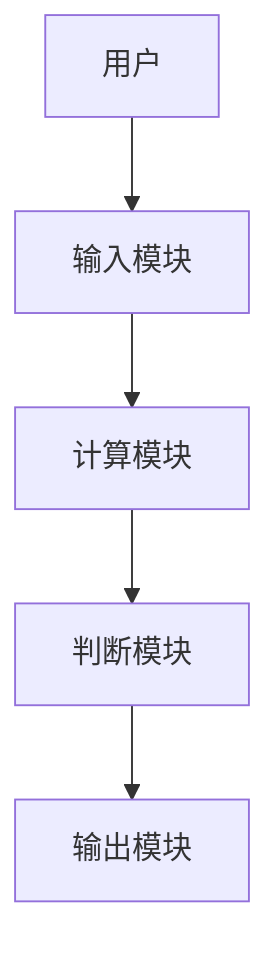

                 


# 彼得林奇如何看待公司的股息政策可持续性

> 关键词：彼得·林奇，股息政策，可持续性，投资策略，财务分析

> 摘要：本文从彼得·林奇的投资哲学出发，详细探讨了他如何分析公司的股息政策可持续性。文章首先介绍了股息政策的基本概念和核心要素，然后分析了彼得·林奇独特的分析框架，接着通过数学模型和实际案例展示了如何评估股息政策的可持续性。最后，本文总结了彼得·林奇的股息政策分析方法，并提出了投资者在实际操作中需要注意的关键点。

---

# 第一部分: 股息政策概述

## 第1章: 股息政策的基本概念

### 1.1 股息政策的定义与类型

#### 1.1.1 股息政策的定义
股息政策是公司对其利润分配的策略，通常包括股息的支付比例、支付频率以及股息的形式（如现金股息或股票股息）。合理的股息政策既能回馈股东，又能保持公司的资金流动性。

#### 1.1.2 股息政策的主要类型
股息政策可以分为以下几种类型：
1. **稳定增长股息政策**：公司每年按固定比例增长股息。
2. **固定股息政策**：公司每年支付固定金额的股息。
3. **剩余股息政策**：公司根据净利润支付股息，股息支付比例随着净利润的变化而变化。
4. **低股息高增长政策**：公司选择将大部分利润用于再投资，以追求更高的增长率。

#### 1.1.3 股息政策的影响因素
股息政策的制定受到多种因素的影响，包括：
1. **公司盈利能力**：盈利能力强的公司更容易支付高股息。
2. **行业特点**：不同行业的股息政策可能不同，例如公用事业公司通常股息较高。
3. **财务状况**：公司是否有足够的现金流来支付股息。
4. **税收政策**：股息的税务处理也会影响公司的股息政策。

---

### 1.2 股息政策的核心要素

#### 1.2.1 股息支付率
股息支付率是衡量公司股息政策的重要指标，计算公式为：
$$ \text{股息支付率} = \frac{\text{股息总额}}{\text{净利润}} \times 100\% $$

高股息支付率可能表明公司愿意将更多利润分配给股东，但也可能意味着公司留利较少，影响再投资能力。

#### 1.2.2 股息收益率
股息收益率是衡量股票投资回报的重要指标，计算公式为：
$$ \text{股息收益率} = \frac{\text{每股股息}}{\text{股票价格}} \times 100\% $$

高股息收益率通常被视为投资吸引力强的信号，但也可能意味着公司股价被低估。

#### 1.2.3 股息增长能力
股息增长能力是衡量公司长期股息支付能力的重要指标。通常通过历史股息增长率来评估：
$$ \text{股息增长率} = \frac{\text{当年股息} - \text{上年股息}}{\text{上年股息}} \times 100\% $$

---

## 第2章: 彼得·林奇的股息政策分析框架

### 2.1 彼得·林奇的投资理念

#### 2.1.1 林奇的投资哲学
彼得·林奇是美国著名的基金经理，他强调基本面分析和长期投资。他认为，投资者应该选择那些具有强大基本面、良好管理团队和可持续增长潜力的公司。

#### 2.1.2 林奇对股息政策的关注点
林奇认为，股息政策是公司财务健康的重要指标之一。他关注以下几个方面：
1. 股息支付率是否合理。
2. 股息增长能力是否稳定。
3. 股息政策是否与公司整体财务状况一致。

---

### 2.2 林奇分析股息政策的核心方法

#### 2.2.1 股息支付率的计算与分析
林奇认为，合理的股息支付率应该在30%到60%之间。过低的股息支付率可能表明公司过于保守，而过高的股息支付率可能表明公司缺乏足够的现金流支持。

#### 2.2.2 股息增长能力的评估
林奇强调，股息增长能力是公司长期可持续发展的关键。他通常选择那些能够每年稳定增长股息的公司。

#### 2.2.3 股息政策与公司财务健康度的关系
林奇认为，股息政策应该与公司整体财务状况一致。例如，如果公司净利润增长，股息支付率也应该相应提高。

---

### 2.3 林奇视角下的股息政策可持续性

#### 2.3.1 可持续股息支付的定义
可持续股息支付是指公司能够在不损害其财务健康的前提下，长期稳定地支付股息。

#### 2.3.2 影响股息政策可持续性的关键因素
1. **净利润增长率**：净利润增长是股息增长的基础。
2. **股息支付率**：合理的股息支付率是可持续股息支付的前提。
3. **现金流状况**：充足的现金流是股息支付的保障。

#### 2.3.3 林奇对股息政策调整的判断标准
林奇认为，公司应该根据净利润的增长情况调整股息支付率。如果净利润增长，股息支付率应该相应提高；如果净利润下降，股息支付率应该降低。

---

## 第3章: 股息政策评估的核心指标

### 3.1 股息支付率

#### 3.1.1 定义与计算公式
股息支付率是衡量公司股息支付能力的重要指标，计算公式为：
$$ \text{股息支付率} = \frac{\text{股息总额}}{\text{净利润}} \times 100\% $$

#### 3.1.2 指标的意义与局限性
- **意义**：股息支付率高表明公司愿意将更多利润分配给股东。
- **局限性**：过高的股息支付率可能影响公司的再投资能力。

### 3.2 股息收益率

#### 3.2.1 定义与计算公式
股息收益率是衡量股票投资回报的重要指标，计算公式为：
$$ \text{股息收益率} = \frac{\text{每股股息}}{\text{股票价格}} \times 100\% $$

#### 3.2.2 指标的应用场景
高股息收益率通常被视为投资吸引力强的信号，但也可能意味着公司股价被低估。

### 3.3 股息增长能力

#### 3.3.1 定义与评估方法
股息增长能力是衡量公司长期股息支付能力的重要指标。通常通过历史股息增长率来评估：
$$ \text{股息增长率} = \frac{\text{当年股息} - \text{上年股息}}{\text{上年股息}} \times 100\% $$

#### 3.3.2 历史股息增长率的分析
林奇通常选择那些能够每年稳定增长股息的公司，因为这表明公司具有较强的盈利能力和增长潜力。

---

## 第4章: 股息政策可持续性评估模型

### 4.1 模型构建的数学基础

#### 4.1.1 股息支付率的数学表达式
$$ \text{股息支付率} = \frac{\text{股息总额}}{\text{净利润}} \times 100\% $$

#### 4.1.2 股息增长能力的数学表达式
$$ \text{股息增长率} = \frac{\text{当年股息} - \text{上年股息}}{\text{上年股息}} \times 100\% $$

#### 4.1.3 可持续股息支付的判断标准
如果股息支付率在30%到60%之间，并且股息增长率稳定，那么股息政策是可持续的。

---

### 4.2 算法实现与案例分析

#### 4.2.1 算法实现
```python
def calculate_dividend_policy_sustainability(revenue, net_profit, dividends):
    dividend_payout_ratio = (dividends / net_profit) * 100
    return "Sustainable" if (30 <= dividend_payout_ratio <= 60) else "Not Sustainable"
```

#### 4.2.2 案例分析
假设某公司过去五年的净利润分别为100万、120万、140万、160万和180万，股息支付率分别为30%、35%、40%、45%和50%。根据模型，该公司的股息政策是可持续的。

---

## 第5章: 系统设计与架构方案

### 5.1 系统功能设计
- 用户输入：净利润、股息总额。
- 系统计算：股息支付率。
- 系统判断：股息政策是否可持续。

### 5.2 系统架构设计


### 5.3 系统接口设计
- 输入接口：净利润、股息总额。
- 输出接口：股息政策可持续性判断结果。

---

## 第6章: 项目实战

### 6.1 环境安装
需要安装Python和相关开发工具。

### 6.2 代码实现
```python
def calculate_dividend_policy_sustainability(net_profit, dividends):
    dividend_payout_ratio = (dividends / net_profit) * 100
    if 30 <= dividend_payout_ratio <= 60:
        return "Sustainable"
    else:
        return "Not Sustainable"
```

### 6.3 案例分析
以某公司为例，计算其股息政策的可持续性。

---

## 第7章: 总结与展望

### 7.1 小结
彼得·林奇认为，股息政策的可持续性是公司财务健康的重要指标之一。合理的股息支付率和稳定的股息增长能力是判断股息政策可持续性的关键。

### 7.2 注意事项
- 股息政策的分析需要结合公司的整体财务状况。
- 股息政策的调整需要根据公司的实际经营情况。

### 7.3 未来展望
未来，随着市场的变化，股息政策的分析也需要不断调整和完善。

---

通过本文的分析，我们可以看到，彼得·林奇的股息政策分析方法为我们提供了一个全新的视角。投资者在实际操作中，应该结合公司的财务状况和市场环境，综合分析股息政策的可持续性。

