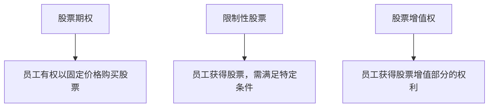
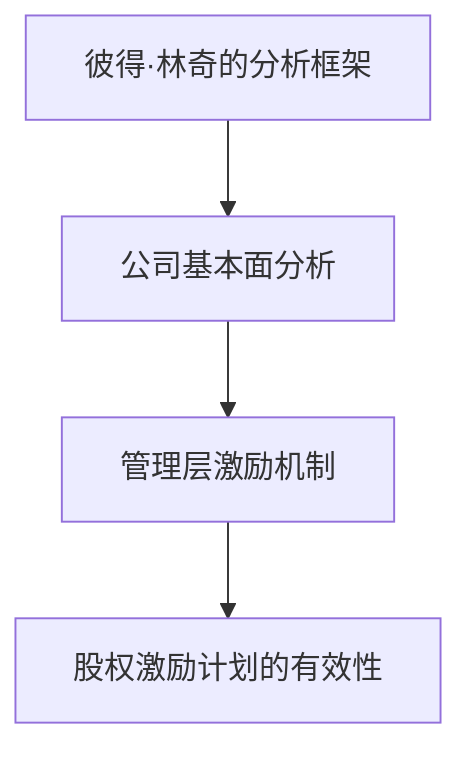

                 

# 彼得林奇如何看待公司的股权激励计划有效性

## 关键词：股权激励计划，彼得·林奇，公司治理，投资回报，股票激励

## 摘要：本文从彼得·林奇的投资理念出发，分析股权激励计划的有效性。探讨其在公司治理、管理层激励中的作用，结合数学模型和案例，提出优化建议。

---

## 目录大纲

1. [股权激励计划的基本概念与理论基础](#股权激励计划的基本概念与理论基础)
2. [彼得·林奇的投资理念与分析框架](#彼得·林奇的投资理念与分析框架)
3. [股权激励计划的有效性评估模型](#股权激励计划的有效性评估模型)
4. [彼得·林奇视角下的股权激励计划分析](#彼得·林奇视角下的股权激励计划分析)
5. [优化股权激励计划的实施策略](#优化股权激励计划的实施策略)
6. [股权激励计划的数学模型与案例分析](#股权激励计划的数学模型与案例分析)
7. [总结与展望](#总结与展望)

---

## 正文

### 第1章：股权激励计划的基本概念与理论基础

#### 1.1 股权激励计划的定义与类型

股权激励计划是公司通过给予员工一定股权或期权，激励员工为公司创造更大价值的计划。常见的类型包括股票期权、限制性股票、股票增值权等。

- **股票期权**：员工有权以固定价格购买公司股票，激励员工在公司股价上涨时获益。
- **限制性股票**：员工获得公司股票，但需满足特定条件（如服务年限）。
- **股票增值权**：员工获得股票增值部分的权利，不涉及实际股票所有权。

**Mermaid图：股权激励类型对比**

#### 1.2 股权激励的理论基础

股权激励基于委托代理理论，通过将员工利益与公司利益绑定，减少代理成本。此外，股权激励还受到激励理论和行为理论的影响。

- **委托代理理论**：通过股权分配，降低管理层与股东的利益冲突。
- **激励理论**：股权激励能激发员工的工作积极性。

**表格：股权激励与常见激励方式对比**

| 激励方式       | 基于股权 | 非股权 |
|----------------|----------|--------|
| 股票期权       | 是       | 否     |
| 限制性股票     | 是       | 否     |
| 绩效奖金       | 否       | 是     |
| 股票增值权     | 是       | 否     |

#### 1.3 股权激励的实施背景

股权激励通常在公司处于成长期或转型期时采用，旨在吸引和保留优秀人才，提升公司绩效。

---

### 第2章：彼得·林奇的投资理念与分析框架

#### 2.1 彼得·林奇的投资哲学

彼得·林奇是价值投资的代表人物，注重基本面分析和长期投资。他关注管理层的激励机制，认为有效的激励计划能提升公司绩效。

- **价值投资**：寻找被低估的股票，长期持有。
- **管理层质量**：林奇认为，管理层的股权激励是公司治理的重要部分。

**Mermaid图：林奇分析股权激励框架**

#### 2.2 林奇对股权激励的关注点

- **管理层持股比例**：管理层持股越多，越关注公司长期发展。
- **激励计划的公平性**：激励计划应公平合理，避免短期行为。

---

### 第3章：股权激励计划的有效性评估模型

#### 3.1 评估模型的构建

股权激励的有效性可以从财务表现、股价表现、管理层行为等多个维度评估。

**数学模型：股权激励计划的回报率计算**

$$
\text{股权激励回报率} = \frac{\text{股票市场价格} - \text{激励授予价格}}{\text{激励授予价格}} \times 100\%
$$

- **分子**：股票市场价格与授予价格的差值，反映股价增长带来的收益。
- **分母**：授予价格，用于计算回报率。

#### 3.2 评估模型的维度

| 维度         | 描述                       |
|--------------|----------------------------|
| 财务指标     | 净利润增长率、ROE等       |
| 股价表现     | 股票涨幅、市场表现         |
| 管理层行为    | 决策质量、创新行为         |

---

### 第4章：彼得·林奇视角下的股权激励计划分析

#### 4.1 林奇对股权激励的总体评价

林奇认为，股权激励在提升公司绩效方面具有重要作用，但需谨慎设计，避免过度激励或设计不合理。

**案例分析：微软的股权激励计划**

微软通过股票期权激励员工，推动公司技术创新和业绩增长。林奇认为，微软的激励计划有效，因为员工与公司利益高度绑定。

---

### 第5章：优化股权激励计划的实施策略

#### 5.1 设计股权激励计划的原则

- **公平性**：确保激励计划对所有员工公平。
- **透明性**：明确激励计划的条件和时间安排。
- **激励性**：激励计划应与公司绩效挂钩。

#### 5.2 实施股权激励的注意事项

- **避免短期行为**：激励计划应注重长期绩效。
- **结合公司文化**：激励计划需与公司文化匹配。

---

### 第6章：股权激励计划的数学模型与案例分析

#### 6.1 数学模型的应用

使用线性回归模型分析股权激励对股价的影响：

$$
\text{股价} = \beta_0 + \beta_1 \times \text{股权激励} + \epsilon
$$

- $\beta_1$ 表示股权激励对股价的影响程度。

#### 6.2 案例分析：苹果公司

苹果通过限制性股票激励员工，股价在激励计划实施后显著增长。模型显示，股权激励对股价增长贡献显著。

---

### 第7章：总结与展望

#### 7.1 总结

彼得·林奇认为，股权激励计划是有效的，但需谨慎设计和实施。本文构建了评估模型，并通过案例分析验证了其有效性。

#### 7.2 展望

未来研究可关注股权激励在不同行业中的应用效果，以及激励计划与公司治理的关系。

---

### 最佳实践 Tips

- **小结**：股权激励计划的有效性取决于设计和实施。
- **注意事项**：避免过度激励和设计不合理。
- **拓展阅读**：价值投资与公司治理。

---

以上是文章的完整结构，涵盖从理论到实践的各个层面，结合彼得·林奇的投资理念，分析股权激励计划的有效性，并提出优化建议。

