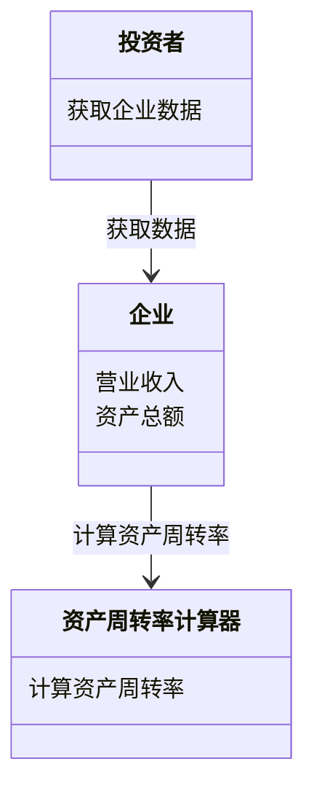
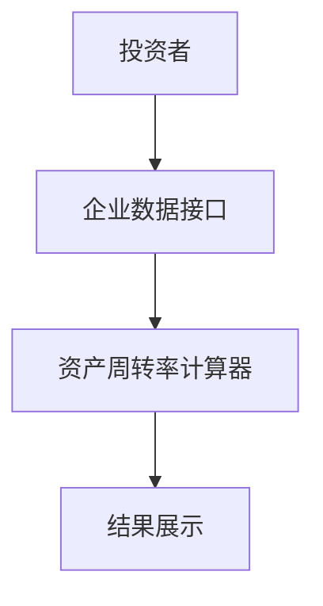
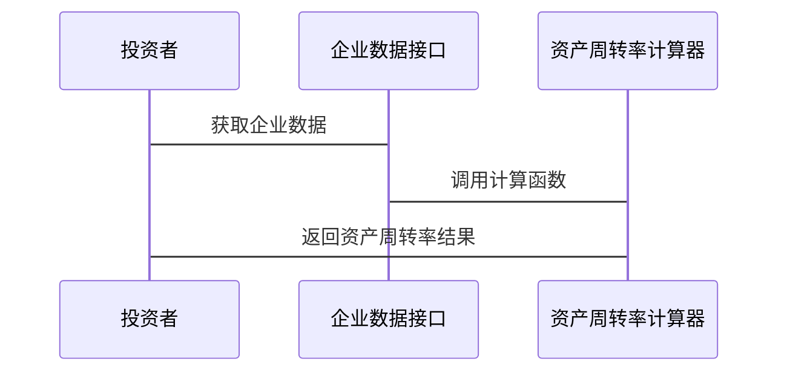

                 


# 彼得林奇如何看待公司的资产周转率

## 关键词：
- 彼得·林奇
- 资产周转率
- 投资策略
- 财务分析
- 企业价值

## 摘要：
本文从彼得·林奇的投资策略出发，详细分析了资产周转率在公司评估中的重要性。通过背景介绍、核心概念、算法原理、系统分析、项目实战和最佳实践等多个方面，深入探讨了资产周转率的计算方法、与财务报表的关系，以及如何利用资产周转率进行投资决策。文章结合具体案例，帮助读者理解如何通过资产周转率评估企业的运营效率和投资价值。

---

# 第一部分：资产周转率的背景与重要性

## 第1章：资产周转率的定义与背景

### 1.1 资产周转率的基本概念

#### 1.1.1 资产周转率的定义
资产周转率是衡量公司资产使用效率的重要指标，表示公司在一定时间内将资产转化为销售额的能力。公式为：
$$
\text{资产周转率} = \frac{\text{营业收入}}{\text{平均资产总额}}
$$

#### 1.1.2 资产周转率在企业运营中的作用
资产周转率反映了企业的运营效率。高周转率意味着公司能够更高效地利用资产创造收入，通常表明公司管理资产的能力较强。

#### 1.1.3 资产周转率与企业价值的关系
资产周转率与企业价值密切相关。高周转率通常意味着更高的盈利能力，从而提升企业价值。

### 1.2 彼得林奇的视角

#### 1.2.1 彼得林奇对资产周转率的重视
彼得·林奇认为，资产周转率是评估公司基本面的重要指标之一，能够帮助投资者识别出那些能够有效利用资产、创造持续收益的企业。

#### 1.2.2 资产周转率在彼得林奇投资策略中的地位
在彼得林奇的投资策略中，资产周转率是筛选潜在投资标的的重要标准之一。他认为，高资产周转率的企业具有更高的成长潜力和投资价值。

#### 1.2.3 彼得林奇如何通过资产周转率评估企业
彼得林奇通过分析企业的资产周转率，结合其他财务指标，评估企业的盈利能力和成长潜力，从而做出投资决策。

---

# 第二部分：资产周转率的核心概念与计算方法

## 第2章：资产周转率的计算与分析

### 2.1 资产周转率的计算公式

#### 2.1.1 资产周转率的数学公式
$$
\text{资产周转率} = \frac{\text{营业收入}}{\text{平均资产总额}}
$$

其中，平均资产总额为：
$$
\text{平均资产总额} = \frac{\text{期初资产总额} + \text{期末资产总额}}{2}
$$

#### 2.1.2 公式中的关键变量与定义
- **营业收入**：公司在一定会计期间内通过销售商品或服务所获得的收入。
- **平均资产总额**：公司资产在会计期间内的平均值，用于衡量资产的总体规模。

### 2.2 资产周转率的计算步骤

#### 2.2.1 获取企业的财务报表数据
从公司年度或季度财务报表中获取营业收入和资产总额数据。

#### 2.2.2 计算平均资产总额
使用公式：
$$
\text{平均资产总额} = \frac{\text{期初资产总额} + \text{期末资产总额}}{2}
$$

#### 2.2.3 计算资产周转率
使用公式：
$$
\text{资产周转率} = \frac{\text{营业收入}}{\text{平均资产总额}}
$$

### 2.3 资产周转率与财务报表的关系

#### 2.3.1 资产周转率与资产负债表的关系
资产周转率与资产负债表中的资产总额密切相关，尤其是流动资产和非流动资产的构成。

#### 2.3.2 资产周转率与利润表的关系
资产周转率与利润表中的营业收入直接相关，营业收入越高，资产周转率可能越高。

#### 2.3.3 资产周转率与现金流量表的关系
资产周转率与现金流量表中的经营活动现金流有关，高周转率通常意味着较强的现金流生成能力。

---

## 第3章：资产周转率与投资决策

### 3.1 资产周转率在投资决策中的应用

#### 3.1.1 资产周转率作为投资筛选指标
投资者可以通过筛选高资产周转率的公司，识别出那些资产使用效率高、盈利能力强的企业。

#### 3.1.2 资产周转率与企业盈利能力的关系
高资产周转率通常意味着企业能够更高效地利用资产创造利润，从而提高净利润率。

### 3.2 彼得林奇的资产周转率筛选标准

#### 3.2.1 彼得林奇对资产周转率的最低要求
彼得林奇通常选择资产周转率高于行业平均水平的公司，特别是在同一行业中，高周转率的公司更具竞争力。

#### 3.2.2 资产周转率与企业成长性的结合
彼得林奇不仅关注资产周转率的高低，还结合企业的成长性和行业前景，选择具有长期增长潜力的公司。

---

## 第4章：资产周转率的行业分析与案例

### 4.1 不同行业的资产周转率差异

#### 4.1.1 高周转率行业
如零售业、制造业，通常具有较高的资产周转率。

#### 4.1.2 低周转率行业
如公用事业、房地产，通常资产周转率较低。

### 4.2 案例分析：某制造公司的资产周转率分析

#### 4.2.1 公司概况
某制造公司2022年的营业收入为50亿元，期初资产总额为30亿元，期末资产总额为35亿元。

#### 4.2.2 计算平均资产总额
$$
\text{平均资产总额} = \frac{30 + 35}{2} = 32.5 \text{亿元}
$$

#### 4.2.3 计算资产周转率
$$
\text{资产周转率} = \frac{50}{32.5} \approx 1.54
$$

#### 4.2.4 分析结论
该公司的资产周转率较高，表明资产利用效率较好，具有较高的投资价值。

---

## 第5章：资产周转率与企业价值评估

### 5.1 资产周转率与企业价值的关系

#### 5.1.1 高资产周转率企业的优势
高资产周转率通常意味着企业能够更高效地利用资产创造收入，从而提升企业价值。

#### 5.1.2 低资产周转率企业的劣势
低资产周转率可能导致资产闲置，影响企业的盈利能力和市场竞争力。

### 5.2 企业价值评估中的资产周转率应用

#### 5.2.1 结合其他财务指标进行综合评估
投资者通常将资产周转率与其他指标（如净利润率、ROE）结合，进行全面评估。

#### 5.2.2 行业基准比较
将企业的资产周转率与行业平均水平进行比较，判断其相对表现。

---

## 第6章：系统分析与架构设计方案

### 6.1 问题场景介绍

#### 6.1.1 背景
投资者需要通过分析企业的资产周转率，评估其投资价值。

#### 6.1.2 目标
构建一个基于资产周转率的企业价值评估系统。

### 6.2 系统功能设计

#### 6.2.1 领域模型


#### 6.2.2 系统架构设计


### 6.3 接口与交互设计

#### 6.3.1 接口设计
- 投资者提供企业数据接口，获取营业收入和资产总额。
- 资产周转率计算器接收数据，计算并返回资产周转率。

#### 6.3.2 交互设计


---

## 第7章：项目实战

### 7.1 环境安装与数据获取

#### 7.1.1 环境安装
安装Python和必要的数据处理库（如Pandas、NumPy）。

#### 7.1.2 数据获取
从公开的财务报表中获取企业的营业收入和资产总额数据。

### 7.2 核心实现源代码

#### 7.2.1 Python代码实现
```python
def calculate_asset_turnover(revenue, initial_assets, final_assets):
    average_assets = (initial_assets + final_assets) / 2
    asset_turnover = revenue / average_assets
    return asset_turnover

# 示例数据
revenue = 500000000  # 营业收入：50亿元
initial_assets = 3000000000  # 期初资产总额：30亿元
final_assets = 3500000000  # 期末资产总额：35亿元

# 计算资产周转率
asset_turnover = calculate_asset_turnover(revenue, initial_assets, final_assets)
print(f"资产周转率: {asset_turnover:.2f}")
```

#### 7.2.2 代码应用解读
通过上述代码，投资者可以计算出企业的资产周转率，并根据结果评估其投资价值。

### 7.3 案例分析

#### 7.3.1 数据分析
以某制造公司为例，计算其资产周转率，并结合行业平均水平进行比较。

#### 7.3.2 结果解读
根据计算结果，判断该公司的资产周转率是否处于行业领先地位，从而评估其投资价值。

---

## 第8章：最佳实践与总结

### 8.1 最佳实践 tips

#### 8.1.1 定期更新数据
资产周转率是动态指标，需要定期更新财务数据，以反映企业的最新情况。

#### 8.1.2 结合其他指标
资产周转率应与净利润率、ROE等其他指标结合，进行全面评估。

#### 8.1.3 考虑行业特点
不同行业的资产周转率差异较大，投资者应结合行业特点进行分析。

### 8.2 小结

#### 8.2.1 资产周转率的重要性
资产周转率是评估企业资产使用效率和投资价值的重要指标，能够帮助投资者识别出那些能够高效利用资产、创造持续收益的企业。

#### 8.2.2 彼得林奇的视角
彼得林奇通过分析资产周转率，结合其他财务指标和行业前景，选择具有长期增长潜力的公司，为投资者提供了重要的参考。

### 8.3 注意事项

#### 8.3.1 数据准确性
确保使用的财务数据准确无误，避免因数据错误导致分析结果偏差。

#### 8.3.2 时间周期
资产周转率的计算应考虑时间周期，通常使用年度或季度数据进行分析。

#### 8.3.3 行业差异
不同行业的资产周转率差异较大，投资者应结合行业特点进行分析，避免简单比较。

### 8.4 拓展阅读

#### 8.4.1 推荐书籍
- 《彼得·林奇的投资智慧》
- 《财务报表分析》

#### 8.4.2 网络资源
- 彼得·林奇投资策略的相关文章和视频
- 财务分析工具和软件的使用教程

---

通过以上内容，读者可以全面了解资产周转率在投资决策中的重要性，掌握如何通过资产周转率评估企业的运营效率和投资价值。同时，结合彼得·林奇的投资策略，读者能够更好地应用资产周转率进行投资分析，做出更明智的投资决策。

