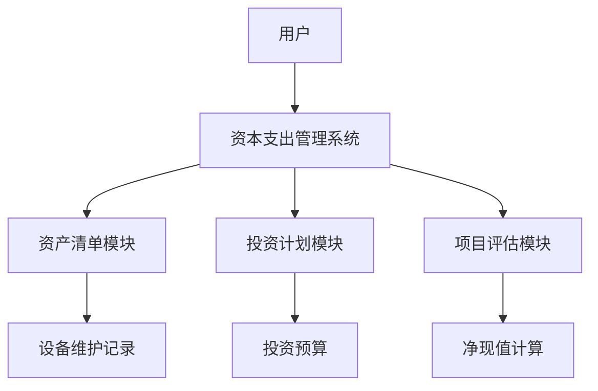

                 

# 彼得林奇如何看待公司的资本支出

## 关键词：资本支出，彼得林奇，投资决策，财务分析，企业价值

## 摘要：
资本支出是企业在扩展和优化其资产基础方面的重要决策。本文深入探讨了资本支出的定义、类型及其对企业发展的影响。结合彼得林奇的投资理念，分析了资本支出与企业价值、现金流的关系，并通过实际案例展示了资本支出的评估与优化过程。文章还详细讲解了资本支出的决策方法和数学模型，提供了实用的工具和建议，帮助读者更好地理解和应用资本支出管理。

---

## 第1章: 资本支出的定义与背景

### 1.1 资本支出的基本概念
#### 1.1.1 资本支出的定义
资本支出（Capital Expenditure，简称CapEx）是指企业在购买、维护或升级长期资产（如工厂、设备、技术等）上的支出。这些支出通常用于增加企业的生产能力或延长资产的使用寿命。

#### 1.1.2 资本支出的分类
资本支出可以分为以下几类：
- **预防性资本支出**：用于维护现有资产，防止其贬值或失效。
- **战略性资本支出**：用于扩展生产能力、进入新市场或开发新产品。
- **其他资本支出**：包括小规模的资产更新或改进步骤。

#### 1.1.3 资本支出与企业发展的关系
资本支出是企业发展的核心驱动力之一。合理的资本支出可以提升企业的生产效率、降低成本，并增强市场竞争力。然而，过度的资本支出可能导致资金链紧张，影响企业的财务健康。

---

### 1.2 资本支出的背景与重要性
#### 1.2.1 资本支出在企业中的作用
资本支出不仅是企业扩张的手段，也是企业价值增长的重要源泉。通过合理的资本支出，企业可以实现资产的优化配置，提升整体运营效率。

#### 1.2.2 资本支出与企业价值的关系
资本支出直接影响企业的未来现金流。高回报的资本支出能够增加企业未来收益，从而提升企业价值。

#### 1.2.3 资本支出对股东价值的影响
资本支出的回报率是衡量股东价值的重要指标。如果资本支出的回报率高于资本成本，企业的股东价值将得到提升。

---

## 第2章: 资本支出与财务指标的关系

### 2.1 资本支出与净利润的关系
#### 2.1.1 净利润的定义与计算
净利润（Net Income）是企业在一定时期内实现的收入减去所有支出后的利润。公式为：
$$ \text{净利润} = \text{收入} - \text{总支出} $$

#### 2.1.2 资本支出对净利润的影响
资本支出通常不直接计入当期净利润，但会影响企业的未来盈利能力。例如，购买新设备可以提高生产效率，从而增加未来的净利润。

#### 2.1.3 净利润与资本支出的平衡
企业需要在资本支出和当前利润之间找到平衡点。过高的资本支出可能导致短期净利润下降，但长期来看可能带来更高的回报。

### 2.2 资本支出与现金流的关系
#### 2.2.1 现金流的定义与分类
现金流（Cash Flow）是指企业在一定时期内现金的流入和流出。分为经营活动现金流、投资活动现金流和筹资活动现金流。

#### 2.2.2 资本支出对现金流的影响
资本支出通常会导致投资活动现金流的流出。然而，通过优化资本支出，企业可以提升未来经营活动的现金流。

#### 2.2.3 现金流与资本支出的平衡
企业需要确保资本支出不会导致现金流的过度流出，从而影响企业的偿债能力和运营能力。

---

## 第3章: 资本支出的类型与应用场景

### 3.1 预防性资本支出
#### 3.1.1 预防性资本支出的定义
预防性资本支出是指用于维护现有资产、防止其贬值的支出。

#### 3.1.2 预防性资本支出的应用场景
例如，企业为了防止设备老化导致的生产中断，可能会定期更换设备。

#### 3.1.3 预防性资本支出的优缺点
- 优点：降低设备故障风险，减少维修成本。
- 缺点：可能需要大量资金投入，影响短期利润。

### 3.2 战略性资本支出
#### 3.2.1 战略性资本支出的定义
战略性资本支出是指用于扩展生产能力、进入新市场或开发新产品的支出。

#### 3.2.2 战略性资本支出的应用场景
例如，企业为了扩大市场份额，可能会投资建设新工厂。

#### 3.2.3 战略性资本支出的优缺点
- 优点：提升企业竞争力，增加未来收益。
- 缺点：风险较高，需要准确的市场预测。

---

## 第4章: 资本支出的决策过程

### 4.1 资本支出的决策方法
#### 4.1.1 净现值法（Net Present Value，NPV）
净现值法是评估资本支出项目的一种常用方法。公式为：
$$ NPV = \sum_{t=1}^{n} \frac{C_t}{(1+r)^t} - 初始投资 $$
其中，\( C_t \) 是第 \( t \) 年的现金流，\( r \) 是贴现率。

#### 4.1.2 内部收益率法（Internal Rate of Return，IRR）
内部收益率法是将资本支出项目的未来现金流折现为零的贴现率。

#### 4.1.3 投资回收期法（Payback Period）
投资回收期法是指资本支出项目收回初始投资所需的时间。

### 4.2 资本支出的决策流程
1. 确定资本支出项目的必要性。
2. 评估项目的财务可行性。
3. 计算项目的净现值、内部收益率等指标。
4. 比较不同项目的回报率，选择最优项目。

---

## 第5章: 系统分析与架构设计方案

### 5.1 系统功能设计
#### 5.1.1 领域模型

#### 5.1.2 系统架构

---

## 第6章: 项目实战

### 6.1 案例分析
#### 6.1.1 需求分析
某制造企业计划投资一条新生产线，预计总投资为500万元，预计未来5年的年现金流为150万元，贴现率为10%。

#### 6.1.2 实施过程
1. 收集历史数据和市场预测。
2. 计算项目的净现值：
$$ NPV = \frac{150}{(1+0.1)^1} + \frac{150}{(1+0.1)^2} + \frac{150}{(1+0.1)^3} + \frac{150}{(1+0.1)^4} + \frac{150}{(1+0.1)^5} - 500 $$
计算结果为正，说明项目可行。

#### 6.1.3 效果评估
项目实施后，企业生产能力提升，市场占有率增加，投资回报率超过预期。

---

## 第7章: 最佳实践与总结

### 7.1 小结
资本支出是企业发展的重要组成部分，合理规划资本支出可以提升企业价值和股东回报。

### 7.2 注意事项
- 资本支出决策需要综合考虑财务、市场和管理因素。
- 避免过度投资或投资不足。

### 7.3 未来趋势
随着技术进步，数字化资本支出（如云计算、人工智能）将变得越来越重要。

### 7.4 拓展阅读
推荐书籍：《彼得·林奇的投资哲学》、《资本预算与项目评估》。

---

通过以上分析，我们可以看到资本支出是企业发展中的关键因素，合理规划和决策能够为企业的长期发展带来巨大价值。

