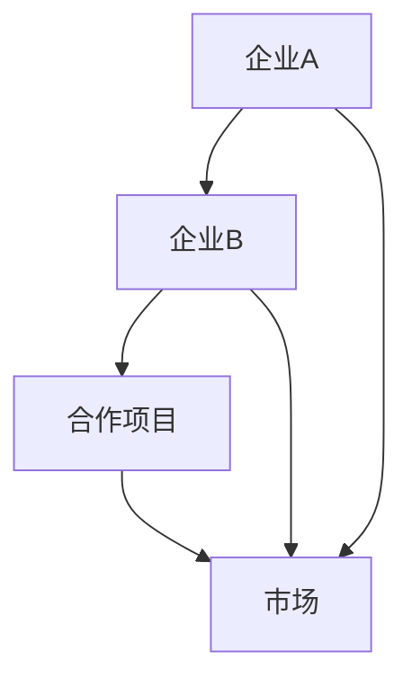
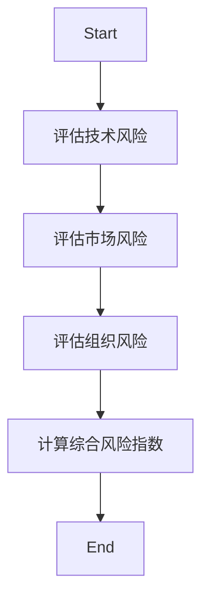
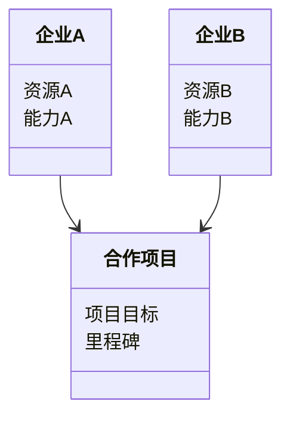
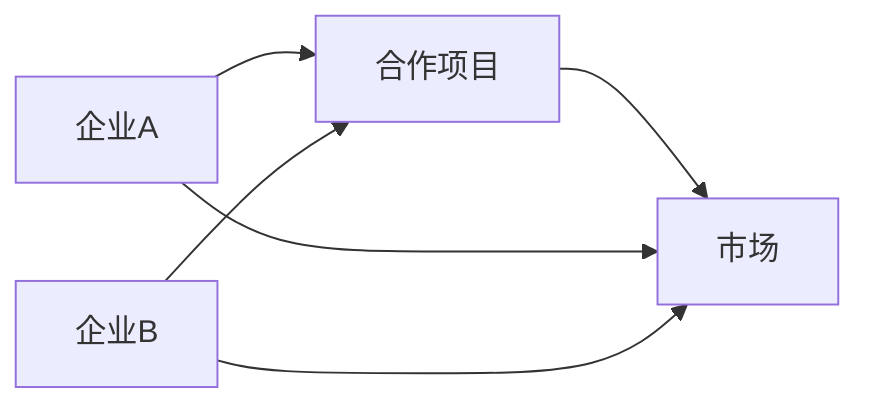
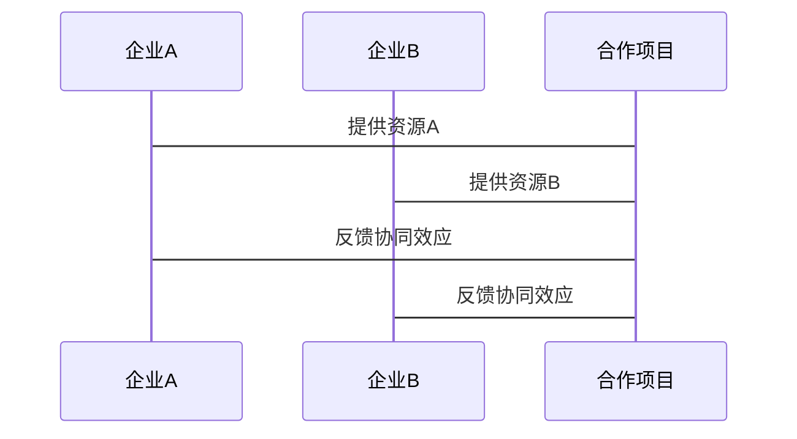

                 


# 彼得林奇如何看待公司的跨界合作策略

## 关键词：彼得林奇、跨界合作、企业战略、投资策略、合作模式

## 摘要：本文从彼得林奇的投资理念出发，深入分析公司跨界合作的策略，探讨如何通过跨界合作提升企业竞争力，并从投资视角评估跨界合作的价值。文章结合实际案例和数学模型，详细阐述了跨界合作的核心概念、评估方法和实施路径。

---

## 第一部分: 背景介绍与核心概念

### 第1章: 跨界合作的定义与背景

#### 1.1 跨界合作的定义
##### 1.1.1 跨界合作的定义与范围
跨界合作是指不同行业或领域的企业之间，通过资源共享、优势互补，共同开发新产品、开拓市场或解决复杂问题的合作模式。其范围涵盖技术、市场、资本等多个领域。

##### 1.1.2 跨界合作的核心要素
跨界合作的核心要素包括：战略协同、资源共享、风险分担和价值共创。

##### 1.1.3 跨界合作的边界与外延
跨界合作的边界在于企业核心竞争力的保护，外延则涉及生态圈构建和跨界创新。

#### 1.2 跨界合作的背景与动因
##### 1.2.1 当前商业环境的变化
数字化转型和市场竞争加剧，企业需要通过跨界合作获取新的增长点。

##### 1.2.2 跨界合作的驱动因素
技术进步、市场需求和政策支持是主要驱动力。

##### 1.2.3 跨界合作的市场趋势
从垂直整合向水平整合转变，生态化合作成为主流。

### 第2章: 彼得林奇投资理念与跨界合作的联系

#### 2.1 彼得林奇投资理念概述
##### 2.1.1 彼得林奇的投资哲学
注重基本面分析，寻找具有持续竞争优势的企业。

##### 2.1.2 彼得林奇的成功案例
以可口可乐为例，分析其长期投资价值。

##### 2.1.3 彼得林奇对企业的独特见解
关注企业的管理层、财务状况和市场地位。

#### 2.2 跨界合作在企业战略中的地位
##### 2.2.1 跨界合作对企业竞争力的影响
提升创新能力和市场响应速度。

##### 2.2.2 跨界合作与企业创新的关系
创新是跨界合作的核心动力。

##### 2.2.3 跨界合作在彼得林奇投资逻辑中的位置
跨界合作是企业保持竞争优势的重要策略。

### 第3章: 跨界合作的核心概念与联系

#### 3.1 跨界合作的核心概念
##### 3.1.1 跨界合作的类型
技术合作、市场合作和资本合作。

##### 3.1.2 跨界合作的模式
联盟模式、合资模式和战略合作模式。

##### 3.1.3 跨界合作的关键成功要素
战略一致性、资源互补性和组织协同性。

#### 3.2 跨界合作的核心概念对比表
| 概念       | 定义                         | 特点                 | 示例                   |
|------------|------------------------------|----------------------|-----------------------|
| 跨界合作   | 不同行业或领域的企业合作     | 跨界性、协同性、创新性 | 汽车与科技企业的合作   |
| 协同效应    | 合作带来的额外收益           | 1+1>2               | 谷歌与苹果的合作       |
| 风险分担    | 合作中的风险分配             | 共担风险             | 药企与科技公司的研发合作 |

#### 3.3 跨界合作的实体关系图


---

## 第二部分: 跨界合作的算法与数学模型

### 第4章: 跨界合作机会评估模型

#### 4.1 跨界合作机会的评估指标
##### 4.1.1 协同效应评估
协同效应是衡量跨界合作价值的关键指标，公式为：
$$ \text{协同效应} = \frac{A \times B}{A + B} $$
其中，A和B分别为合作双方的资源投入。

##### 4.1.2 风险评估
使用风险矩阵模型，评估合作中的技术风险、市场风险和组织风险。

##### 4.1.3 资源匹配度评估
资源匹配度 = min(A资源，B资源) / max(A资源，B资源) × 100%

#### 4.2 跨界合作机会评估算法
##### 4.2.1 协同效应计算公式
$$ \text{协同效应} = \frac{A \times B}{A + B} $$

##### 4.2.2 风险评估流程图


##### 4.2.3 资源匹配度计算公式
资源匹配度 = min(A资源，B资源) / max(A资源，B资源) × 100%

---

## 第三部分: 系统分析与架构设计

### 第5章: 系统分析与架构设计

#### 5.1 系统功能设计
##### 5.1.1 领域模型


#### 5.2 系统架构设计
##### 5.2.1 系统架构图


#### 5.3 系统接口设计
##### 5.3.1 接口定义
- 企业A提供API：`/api/resourceA`
- 企业B提供API：`/api/resourceB`

#### 5.4 系统交互流程图


---

## 第四部分: 项目实战

### 第6章: 项目实战

#### 6.1 环境安装
- 安装Python和相关库（如NumPy、Pandas）。

#### 6.2 系统核心实现源代码
##### 协同效应计算代码
```python
def calculate_synergy(resource_a, resource_b):
    return (resource_a * resource_b) / (resource_a + resource_b)

# 示例
resource_a = 100
resource_b = 50
synergy = calculate_synergy(resource_a, resource_b)
print(f"协同效应为: {synergy}")
```

##### 风险评估代码
```python
def calculate_risk(tech_risk, market_risk, org_risk):
    return (tech_risk + market_risk + org_risk) / 3

# 示例
tech_risk = 0.7
market_risk = 0.6
org_risk = 0.8
total_risk = calculate_risk(tech_risk, market_risk, org_risk)
print(f"综合风险指数为: {total_risk}")
```

#### 6.3 案例分析
以科技公司与汽车制造商的合作为例，分析协同效应和风险。

#### 6.4 项目小结
总结项目实施过程，提出改进建议。

---

## 第五部分: 最佳实践与总结

### 第7章: 最佳实践与总结

#### 7.1 最佳实践
- 明确合作目标和双方责任。
- 建立有效的沟通机制。
- 定期评估合作效果。

#### 7.2 小结
跨界合作是企业提升竞争力的重要策略，彼得林奇的投资理念为企业提供了 valuable insights。

#### 7.3 注意事项
- 选择合作伙伴时，要评估其长期价值。
- 确保合作中的风险可控。

#### 7.4 拓展阅读
建议阅读彼得林奇的《投资最重要的事情》和相关跨界合作案例分析。

---

## 结语
通过本文的分析，读者可以全面理解彼得林奇如何看待公司的跨界合作策略，并能够实际应用这些方法和模型进行投资和企业战略决策。跨界合作不仅是企业发展的趋势，也是投资成功的关键因素。

