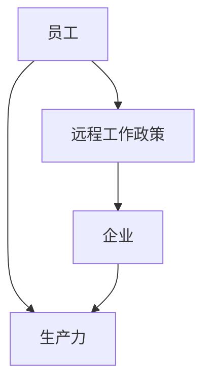
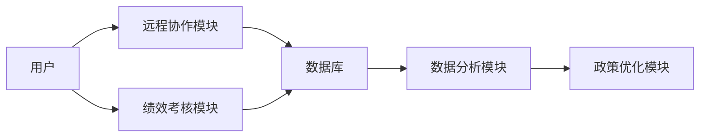

                 


# 彼得林奇如何看待公司的远程工作政策对生产力的影响

> 关键词：彼得·林奇，远程工作政策，生产力，企业管理，技术博客

> 摘要：本文探讨了彼得·林奇对远程工作政策的看法，分析了远程工作政策如何影响公司生产力，并提出了优化远程工作政策的建议。文章从背景、核心概念、数学模型、系统架构、项目实战等多个角度进行了详细阐述，结合实际案例和数据分析，为读者提供了全面的见解。

---

## 第一部分：远程工作政策的背景与现状

### 第1章：远程工作的兴起与影响

#### 1.1 远程工作的兴起背景

远程工作的兴起并非偶然，而是技术进步和全球性事件共同作用的结果。2020年全球新冠疫情的爆发，使得许多企业不得不采取远程办公模式。这种模式不仅在疫情期间发挥了重要作用，也为企业的长期发展提供了新的可能性。

- **数字技术的发展**：互联网、云技术、协同工具（如Zoom、Slack、Trello）的进步，使得远程沟通和协作成为可能。
- **企业需求的变化**：随着市场竞争加剧，企业需要更灵活的组织结构和更高的员工效率，远程工作成为优化管理模式的一种选择。
- **员工期望的提升**：越来越多的员工希望能够在工作与生活之间找到平衡，远程工作政策成为吸引和留住人才的重要因素。

#### 1.2 彼得·林奇的背景介绍

彼得·林奇是美国著名的投资家和基金经理，曾管理麦哲伦基金，创造了卓越的投资业绩。他的投资理念以基本面分析和长期持有著称，对企业的管理、运营和文化有着深刻的理解。

- **投资理念**：林奇强调深入研究企业基本面，关注企业的竞争优势和管理层能力。
- **管理哲学**：他注重企业的文化和员工的创造力，认为一个高效的团队能够为企业创造更大的价值。
- **对远程工作的关注**：随着远程工作的普及，林奇开始关注这种新型工作模式对企业生产力和管理效率的影响。

#### 1.3 彼得·林奇对远程工作的初步看法

林奇对远程工作的看法是基于其投资哲学和管理经验形成的。他认为，远程工作政策的实施需要综合考虑企业的具体情况，包括行业特性、员工类型、管理模式等。

- **效率与灵活性**：林奇认为，远程工作能够提高员工的灵活性和工作效率，尤其是在不需要频繁面对面沟通的岗位上。
- **管理挑战**：他指出，远程工作可能会增加管理难度，特别是在监督员工的工作进度和质量方面。
- **员工满意度**：林奇认为，远程工作能够提升员工的满意度，因为员工可以更好地平衡工作和生活，从而减少流动率。

---

### 第2章：远程工作政策的核心概念与联系

#### 2.1 核心概念的定义与属性

- **远程工作**：指员工不在固定的工作场所办公，而是通过数字化工具远程完成工作任务。
- **生产力**：指在单位时间内完成工作的效率和质量，通常可以用产出与投入的比率来衡量。
- **远程工作政策**：企业为规范远程工作行为而制定的一系列规章制度，包括工作时间、沟通方式、绩效考核等。

#### 2.2 核心概念之间的关系

远程工作政策与生产力之间存在复杂的关联。通过构建ER实体关系图，可以更清晰地理解它们之间的关系。



#### 2.3 核心概念的对比分析

- **远程工作与传统办公的对比**：
  | 对比维度 | 远程工作 | 传统办公 |
  |----------|----------|----------|
  | 工作地点 | 多地办公 | 集中办公 |
  | 沟通方式 | 数字化工具 | 面对面交流 |
  | 管理方式 | 基于结果 | 基于过程 |

- **不同远程工作政策的效果对比**：
  | 政策类型 | 影响效果 | 适用场景 |
  |----------|----------|----------|
  | 灵活时间 | 提高效率 | 创意行业 |
  | 弹性地点 | 降低成本 | 服务行业 |
  | 强制出勤 | 保证协调 | 制造业 |

---

### 第3章：远程工作政策对生产力的数学模型分析

#### 3.1 生产力的数学模型

 productivity = 产出 / 投入

其中，产出可以是完成的任务数量、质量或价值，投入可以是时间、成本或资源。

#### 3.2 远程工作政策的影响因素

远程工作政策的效果可以用以下公式进行评估：

 efficiency_factor = 1 - (远程工作成本 / 传统办公成本)

其中，远程工作成本包括技术投入、管理成本和沟通成本，传统办公成本包括场地租赁、人员配置和日常运营。

---

## 第二部分：远程工作政策的优化与实施

### 第4章：远程工作政策的算法优化

#### 4.1 算法原理

为了评估远程工作政策的效果，可以设计一个基于因子分析的算法模型。以下是算法的步骤：

1. **数据收集**：收集员工的工作效率、满意度、出勤率等数据。
2. **因子提取**：通过因子分析提取关键影响因素，如技术支持、管理方式、沟通效率。
3. **模型构建**：建立多元回归模型，分析各因素对生产力的影响。
4. **政策优化**：根据模型结果调整远程工作政策，如优化沟通工具、加强培训等。

#### 4.2 Python代码实现

```python
import pandas as pd
from sklearn import linear_model

# 数据收集与预处理
data = pd.read_csv('remote_work.csv')
X = data[['技术支持', '管理方式', '沟通效率']]
y = data['生产力']

# 多元回归模型
model = linear_model.LinearRegression()
model.fit(X, y)

# 输出系数和截距
print('系数:', model.coef_)
print('截距:', model.intercept_)
```

---

### 第5章：远程工作政策的系统架构设计

#### 5.1 系统功能设计

- **用户管理**：员工信息管理、权限分配。
- **远程协作**：在线会议、文件共享、任务分配。
- **绩效考核**：工作效率统计、目标设定。
- **数据分析**：生产力评估、政策优化建议。

#### 5.2 系统架构图



---

### 第6章：远程工作政策的项目实战

#### 6.1 实施步骤

1. **需求分析**：明确企业的目标和需求。
2. **技术选型**：选择合适的远程协作工具。
3. **政策制定**：制定远程工作政策。
4. **系统实施**：部署远程协作系统。
5. **效果评估**：监控政策效果并进行优化。

#### 6.2 代码实现

```python
import smtplib
from email.mime.text import MIMEText

# 发送邮件提醒
def send_email(subject, body, to):
    msg = MIMEText(body)
    msg['Subject'] = subject
    msg['To'] = to
    smtp = smtplib.SMTP('smtp.example.com', 587)
    smtp.starttls()
    smtp.login('user@example.com', 'password')
    smtp.sendmail('user@example.com', to, msg.as_string())
    smtp.quit()

send_email('远程会议提醒', '会议将于明天上午10点召开，请准时参加。', 'employee@example.com')
```

---

## 第三部分：总结与展望

### 第7章：总结与展望

#### 7.1 小结

远程工作政策对生产力的影响是多方面的，需要企业在技术、管理和文化等多方面进行优化。彼得·林奇的管理理念为我们提供了重要的启示，即在实施远程工作政策时，既要注重灵活性和效率，也要关注员工的满意度和企业的可持续发展。

#### 7.2 展望

未来，随着人工智能和大数据技术的发展，远程工作政策的优化将更加智能化和个性化。企业需要不断创新，以适应快速变化的商业环境和技术进步。

---

### 最佳实践 Tips

- **技术工具的选择**：优先选择集成度高、易于使用的远程协作工具。
- **员工培训**：加强远程工作技能的培训，提升员工的自主性和责任感。
- **政策调整**：根据企业的实际情况，动态调整远程工作政策。

---

希望这篇文章能够为企业在实施远程工作政策时提供有价值的参考和启示。

