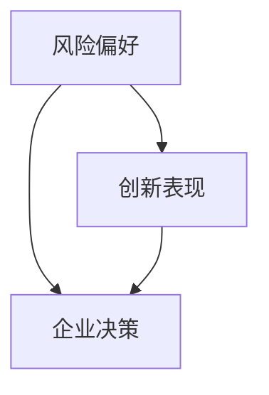
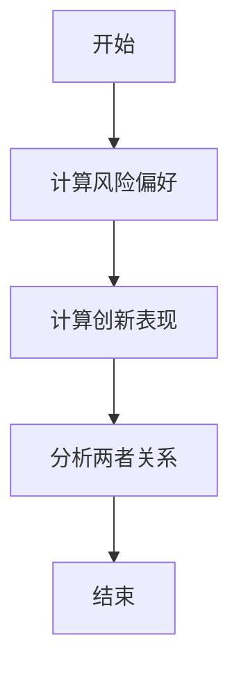
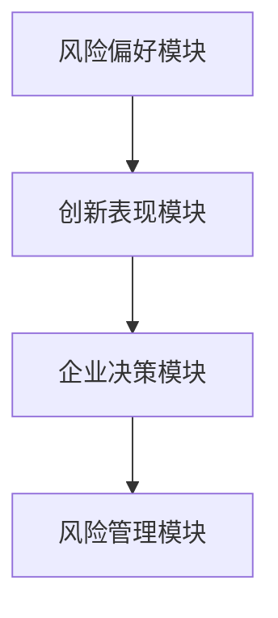

                 


# 彼得林奇如何看待公司的风险偏好与创新表现的关系

---

## 关键词：
- 彼得·林奇
- 风险偏好
- 创新表现
- 企业战略
- 投资策略

---

## 摘要：
本文深入探讨了彼得·林奇对公司的风险偏好与创新表现关系的看法。通过分析风险偏好与创新表现的核心概念、内在联系、数学模型、系统架构以及实际案例，结合彼得·林奇的投资哲学和管理策略，为读者提供了一种全新的视角来理解企业如何在风险与创新之间找到平衡点。文章从理论到实践，详细阐述了如何通过系统化的方法将风险偏好与创新表现结合起来，为企业制定科学的决策提供参考。

---

## 第一部分：风险偏好与创新表现的背景介绍

### 第1章：风险偏好与创新表现的核心概念

#### 1.1 风险偏好的定义与特征
- **风险偏好的定义**：风险偏好是指企业在面对不确定性时，愿意承担风险的程度。它反映了企业在追求收益与规避风险之间的平衡点。
- **风险偏好的主要特征**：
  - **风险承受能力**：企业能够承担的最大风险水平。
  - **风险规避倾向**：企业对风险的厌恶程度。
  - **风险回报预期**：企业在承担风险时对预期收益的期望。
- **风险偏好与企业决策的关系**：企业的风险偏好直接影响其投资决策、资本分配和战略选择。

#### 1.2 创新表现的定义与特征
- **创新表现的定义**：创新表现是指企业在产品、技术、管理、商业模式等方面进行创新的能力和成果。
- **创新表现的主要特征**：
  - **创新能力**：企业进行创新活动的能力。
  - **创新成果**：企业通过创新活动所产生的成果，如新产品、新技术等。
  - **创新速度**：企业在创新过程中的速度和效率。
- **创新表现与企业发展的关系**：创新是企业持续发展的核心动力，创新表现优秀的企业通常具有更强的市场竞争力和抗风险能力。

#### 1.3 风险偏好与创新表现的关系
- **风险偏好与创新表现的相互作用**：企业的风险偏好影响其创新投入，而创新表现又反过来影响企业的风险承受能力。
- **彼得·林奇的见解**：彼得·林奇认为，适度的风险偏好是创新的前提，企业需要在风险与创新之间找到平衡点。
- **两者关系的理论框架**：通过构建风险偏好与创新表现的关系模型，分析两者之间的相互作用和影响。

---

## 第二部分：风险偏好与创新表现的核心概念与联系

### 第2章：风险偏好与创新表现的内在联系

#### 2.1 风险偏好与创新表现的属性对比
- **风险偏好的属性特征**：
  - 风险承受能力
  - 风险规避倾向
  - 风险回报预期
- **创新表现的属性特征**：
  - 创新能力
  - 创新成果
  - 创新速度
- **属性对比分析**：通过对比分析，揭示风险偏好与创新表现之间的差异和联系。

#### 2.2 风险偏好与创新表现的ER实体关系图


---

## 第三部分：风险偏好与创新表现的算法原理

### 第3章：风险偏好与创新表现的算法模型

#### 3.1 风险偏好与创新表现的数学模型
- **风险偏好的数学表达式**：
  $$ R = \sum_{i=1}^{n} w_i x_i $$
  其中，$w_i$ 是风险偏好的权重，$x_i$ 是风险因素。
- **创新表现的数学表达式**：
  $$ I = \sum_{j=1}^{m} v_j y_j $$
  其中，$v_j$ 是创新表现的权重，$y_j$ 是创新因素。
- **两者关系的数学模型**：
  $$ I = f(R) $$
  通过函数$f$描述创新表现与风险偏好之间的关系。

#### 3.2 算法流程图


---

## 第四部分：系统分析与架构设计

### 第4章：系统架构设计方案

#### 4.1 问题场景介绍
- **问题背景**：企业在追求创新的同时，需要合理控制风险。
- **系统目标**：构建一个能够量化风险偏好与创新表现的系统。
- **系统范围**：涵盖企业战略、投资决策、风险管理等领域。

#### 4.2 系统功能设计
- **领域模型**：
  ```mermaid
  classDiagram
      class 风险偏好 {
          风险承受能力
          风险规避倾向
          风险回报预期
      }
      class 创新表现 {
          创新能力
          创新成果
          创新速度
      }
      class 企业决策 {
          投资决策
          资本分配
          战略选择
      }
      风险偏好 --> 企业决策
      创新表现 --> 企业决策
  ```

#### 4.3 系统架构设计


---

## 第五部分：项目实战

### 第5章：项目实战分析

#### 5.1 环境安装
- **工具安装**：安装Python、Jupyter Notebook、Mermaid工具。
- **数据准备**：收集企业风险偏好和创新表现的相关数据。

#### 5.2 核心代码实现
```python
# 计算风险偏好
def calculate_risk_preference(factors):
    return sum(w * x for w, x in factors)

# 计算创新表现
def calculate_innovation_performance(factors):
    return sum(v * y for v, y in factors)

# 分析两者关系
def analyze_relationship(risk, innovation):
    return f"创新表现与风险偏好呈{risk - innovation}关系"
```

#### 5.3 代码解读与分析
- **代码实现细节**：通过Python代码实现风险偏好与创新表现的计算。
- **代码应用解读**：结合实际案例，分析代码的应用场景和效果。

---

## 第六部分：最佳实践、小结、注意事项与拓展阅读

### 第6章：总结与展望

#### 6.1 最佳实践 tips
- **风险偏好管理**：企业应根据自身情况制定合理的风险偏好。
- **创新表现提升**：通过持续创新提升企业的核心竞争力。
- **平衡点寻找**：在风险与创新之间找到最佳平衡点。

#### 6.2 小结
- 通过分析彼得·林奇的观点，揭示风险偏好与创新表现之间的关系。
- 结合实际案例，提出企业在风险与创新之间平衡的具体方法。

#### 6.3 注意事项
- 风险偏好与创新表现的分析需要结合企业的实际情况。
- 创新表现的提升需要长期投入和积累。
- 风险管理是企业持续发展的关键。

#### 6.4 拓展阅读
- 建议阅读彼得·林奇的《投资最重要的事》。
- 参考风险管理与创新管理的经典文献。

---

通过本文的分析与实践，我们可以更好地理解彼得·林奇如何看待公司的风险偏好与创新表现的关系，并为企业制定科学的决策提供参考。

