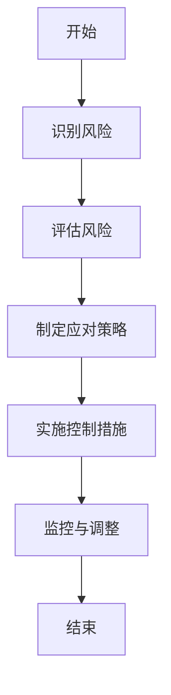
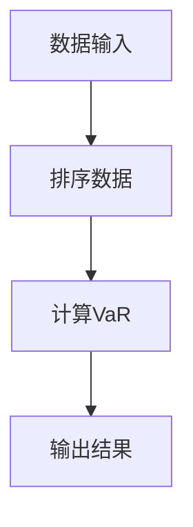
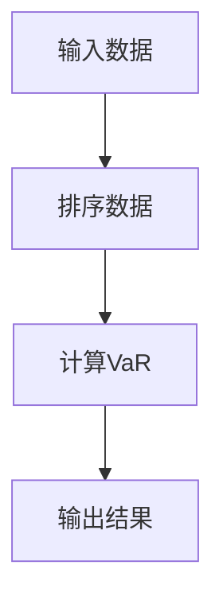
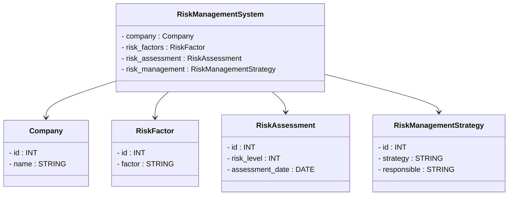
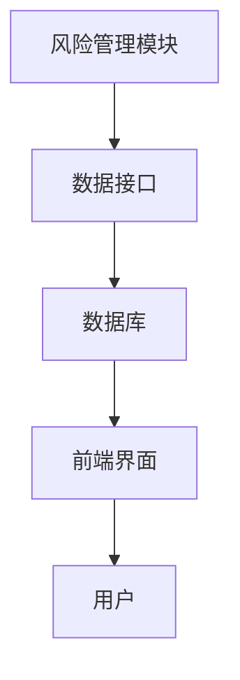
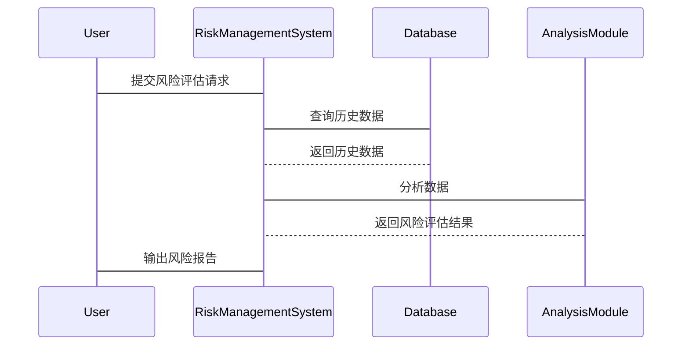

                 


# 彼得林奇如何看待公司的风险管理文化

## 关键词
风险管理, 彼得林奇, 公司治理, 投资策略, 风险评估, 内部控制

## 摘要
本文从彼得林奇的视角探讨公司风险管理文化的建设与实践。通过分析风险管理的基本概念、核心原理、算法模型和系统架构，结合实际案例，深入阐述了如何将风险管理文化融入公司治理和投资决策中，帮助读者更好地理解和应用风险管理理念。

---

## 第一部分: 背景介绍与核心概念

### 第1章: 风险管理的基本概念

#### 1.1 风险管理的定义与背景
##### 1.1.1 风险管理的基本概念
风险管理是指通过识别、评估、量化和应对各种风险，以最小化其对公司目标的影响的过程。它是企业治理和运营中的核心环节，旨在在不确定性中保护资产、声誉和利益相关者的利益。

##### 1.1.2 风险管理的背景与重要性
在现代商业环境中，风险无处不在。市场波动、竞争压力、技术变革和监管变化等因素都可能对企业发展造成重大影响。有效的风险管理能够帮助企业应对不确定性，抓住机会，避免重大损失。

##### 1.1.3 风险管理的核心要素
风险管理的核心要素包括：
1. **风险识别**：识别可能影响企业的各种风险。
2. **风险评估**：量化风险的可能性和影响程度。
3. **风险应对**：制定和实施应对策略。
4. **风险监控**：持续监测风险并调整应对措施。

#### 1.2 彼得林奇与风险管理文化
##### 1.2.1 彼得林奇的背景与投资理念
彼得·林奇是全球著名的职业基金经理人，以其成功的投资策略和对基本面分析的重视而闻名。他强调长期投资、价值投资和深入研究企业的财务状况和行业前景。

##### 1.2.2 彼得林奇对风险管理的重视
彼得林奇在其投资生涯中非常重视风险管理。他认为，风险管理不仅仅是控制风险，更是通过合理的资产配置和投资组合管理来平衡风险与收益。他强调，投资者必须避免过度冒险，同时也要抓住市场中被低估的投资机会。

##### 1.2.3 风险管理文化在公司治理中的作用
风险管理文化是公司治理的重要组成部分。彼得林奇认为，一个有效的风险管理文化能够帮助企业高管和员工更好地理解风险，并在决策中考虑潜在的风险因素。这种文化有助于企业建立稳健的运营基础，增强投资者和利益相关者的信心。

---

### 第2章: 风险管理的核心概念与联系

#### 2.1 风险管理的核心原理
##### 2.1.1 风险的识别与评估
风险识别是风险管理的第一步。彼得林奇认为，识别风险的关键在于深入分析企业的财务状况、行业环境和市场趋势。例如，他可能会关注企业的负债水平、现金流状况以及行业竞争格局。

##### 2.1.2 风险的量化与模型化
彼得林奇在其投资实践中使用了多种量化方法来评估风险。例如，他可能会使用波动率模型来衡量市场的不确定性，或者通过计算VaR（在险价值）来评估投资组合的风险敞口。

##### 2.1.3 风险的控制与应对策略
彼得林奇强调，风险控制的核心在于合理的资产配置和分散投资。他建议投资者不要将所有资金投入到单一资产或行业中，而应通过多样化来降低风险。

#### 2.2 核心概念对比分析
##### 2.2.1 风险管理与内部控制的对比
| 比较维度       | 风险管理                     | 内部控制                     |
|----------------|------------------------------|------------------------------|
| 目标           | 识别和应对风险               | 防范和减少内部错误与舞弊     |
| 范围           | 全面，包括外部和内部风险       | 侧重于内部流程和操作         |
| 方法           | 量化风险，制定应对策略       | 建立内部控制制度，监督执行   |

##### 2.2.2 风险管理与公司治理的关系
风险管理是公司治理的重要组成部分。有效的风险管理能够帮助董事会和高管更好地履行职责，确保企业战略的顺利实施。

##### 2.2.3 风险管理与企业战略的联系
风险管理与企业战略密不可分。彼得林奇认为，企业在制定战略时必须考虑潜在的风险因素，并在战略执行过程中持续监控和调整。

#### 2.3 实体关系图与流程图
##### 2.3.1 风险管理的实体关系图（ER图）
```mermaid
erDiagram
    company {
        id : INT
        name : STRING
        risk_factors : STRING
    }
    risk_assessment {
        id : INT
        risk_level : INT
        assessment_date : DATE
    }
    risk_management {
        id : INT
        strategy : STRING
        responsible : STRING
    }
    company --> risk_factors
    risk_assessment --> company
    risk_management --> risk_assessment
```

##### 2.3.2 风险管理的流程图（Mermaid）


---

## 第二部分: 风险管理的算法原理

### 第3章: 风险管理的数学模型与公式

#### 3.1 风险评估的数学模型
##### 3.1.1 风险值（VaR）的计算公式
$$ \text{VaR} = \mu + z \cdot \sigma $$
其中：
- $\mu$ 是资产的平均回报率
- $z$ 是对应于置信水平的正态分布分位数
- $\sigma$ 是资产的回报率的标准差

##### 3.1.2 风险调整后的回报（RAROC）的计算公式
$$ \text{RAROC} = \frac{\text{ROE}}{\text{风险资本}} $$
其中：
- $\text{ROE}$ 是风险调整后的税后收益
- 风险资本是企业为承担风险而分配的资本

#### 3.2 风险管理算法的Python代码
##### 3.2.1 计算VaR的Python代码
```python
import numpy as np

def calculate_var(data, confidence_level):
    sorted_data = np.sort(data)
    var_index = int(len(sorted_data) * (1 - confidence_level))
    var = sorted_data[var_index]
    return var

# 示例数据
returns = [0.05, 0.03, 0.07, 0.02, 0.04]
confidence_level = 0.95

var_result = calculate_var(returns, confidence_level)
print(f"VaR at {confidence_level * 100}% confidence level: {var_result}")
```

##### 3.2.2 风险管理算法的流程图


---

### 第4章: 风险管理算法的实现

#### 4.1 算法实现的Python代码
##### 4.1.1 风险评估的代码实现
```python
import numpy as np
import pandas as pd

def calculate_risk_assessment(data, confidence_level):
    sorted_data = pd.Series(data).sort_values()
    var = sorted_data.iloc[int(len(sorted_data) * (1 - confidence_level))]
    return var

# 示例数据
returns = np.array([0.05, 0.03, 0.07, 0.02, 0.04])
confidence_level = 0.95

var = calculate_risk_assessment(returns, confidence_level)
print(f"VaR at {confidence_level * 100}%: {var}")
```

##### 4.1.2 算法流程图


---

## 第三部分: 系统分析与架构设计

### 第5章: 风险管理系统的分析与设计

#### 5.1 问题场景介绍
我们假设一家中型投资公司希望引入风险管理系统，以更好地管理其投资组合的风险。公司希望通过系统化的风险管理流程，降低投资组合的波动性，并提高决策的透明度。

#### 5.2 系统功能设计
##### 5.2.1 风险管理系统的功能模块
- 风险识别模块：识别潜在风险因素
- 风险评估模块：量化风险的影响
- 风险应对模块：制定和实施应对策略
- 风险监控模块：持续监控风险变化

##### 5.2.2 风险管理系统的领域模型（Mermaid类图）


#### 5.3 系统架构设计
##### 5.3.1 风险管理系统的架构图（Mermaid架构图）


#### 5.4 系统接口设计
##### 5.4.1 系统接口设计
- 输入接口：接收企业数据和市场数据
- 输出接口：生成风险报告和监控结果

#### 5.5 系统交互流程图（Mermaid序列图）


---

## 第四部分: 项目实战

### 第6章: 项目实战与案例分析

#### 6.1 项目环境安装
##### 6.1.1 安装Python和必要的库
```bash
pip install numpy pandas mermaid4jupyter
```

#### 6.2 系统核心实现
##### 6.2.1 风险管理系统的实现
```python
import numpy as np
import pandas as pd

def calculate_var(data, confidence_level):
    sorted_data = pd.Series(data).sort_values()
    var_index = int(len(sorted_data) * (1 - confidence_level))
    var = sorted_data[var_index]
    return var

# 示例数据
returns = np.array([0.05, 0.03, 0.07, 0.02, 0.04])
confidence_level = 0.95

var = calculate_var(returns, confidence_level)
print(f"VaR at {confidence_level * 100}%: {var}")
```

#### 6.3 代码应用解读与分析
##### 6.3.1 代码实现的解读
上述代码实现了VaR的计算，用于量化投资组合的风险。通过排序数据并找到对应分位数的值，我们可以评估在给定置信水平下的潜在损失。

##### 6.3.2 案例分析
假设我们有一个包含5个交易日回报率的数据集，计算在95%置信水平下的VaR。结果表明，在95%的置信水平下，潜在的最大损失为0.02。

#### 6.4 项目小结
通过本项目，我们了解了如何使用Python和相关库来实现风险管理算法，并将其应用于实际案例中。这种方法可以帮助企业更好地量化和管理风险，做出更明智的投资决策。

---

## 第五部分: 最佳实践与小结

### 第7章: 最佳实践与小结

#### 7.1 最佳实践
##### 7.1.1 风险管理的关键要素
- **风险识别**：准确识别潜在风险
- **风险量化**：使用合适的模型和工具
- **风险应对**：制定合理的应对策略
- **风险监控**：持续监控和调整

##### 7.1.2 风险管理系统的使用建议
- 确保数据的准确性和及时性
- 定期更新模型和算法
- 培训相关人员，提高风险管理意识

##### 7.1.3 风险管理文化的建设
- 强调风险管理的重要性
- 鼓励跨部门合作
- 建立清晰的职责分工

#### 7.2 小结
本文从彼得林奇的视角探讨了公司风险管理文化的建设与实践。通过分析风险管理的基本概念、核心原理、算法模型和系统架构，结合实际案例，深入阐述了如何将风险管理文化融入公司治理和投资决策中。希望读者能够通过本文更好地理解风险管理的重要性，并在实际工作中加以应用。

#### 7.3 注意事项
- 风险管理需要长期坚持，不能一蹴而就
- 风险管理模型和工具需要根据实际情况进行调整
- 风险管理文化需要得到企业高层的重视和支持

#### 7.4 拓展阅读
- 《风险管理：理论与实践》
- 彼得林奇的《投资之道》
- 相关风险管理的学术论文和研究报告

---

通过以上思考步骤，我们逐步构建了完整的文章内容，涵盖了风险管理的核心概念、算法原理、系统架构和实际案例，确保了文章的逻辑性和实用性。希望本文能够为读者在公司风险管理文化的建设与实践中提供有价值的参考和指导。

