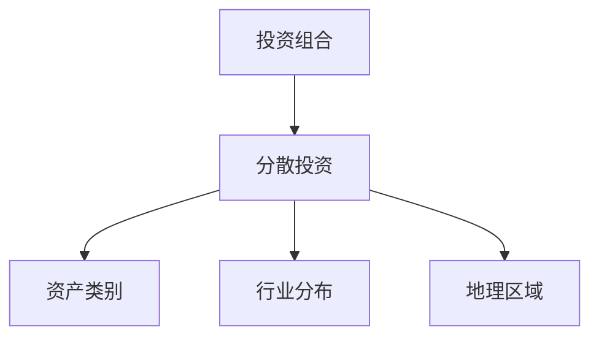
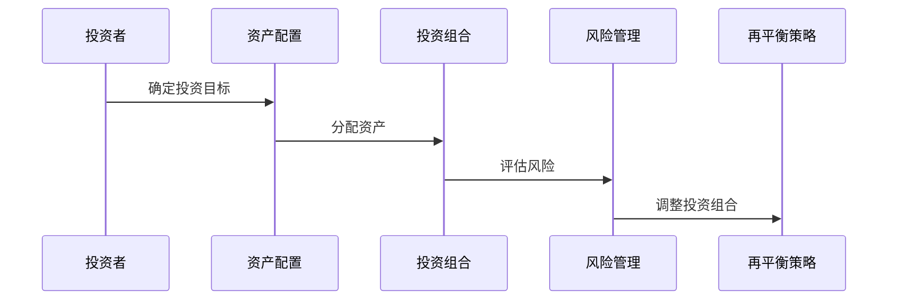

                 

# 彼得林奇如何看待分散投资

## 关键词：分散投资，彼得林奇，投资策略，风险控制，资产配置

## 摘要：本文深入探讨了彼得林奇对分散投资的看法，分析了分散投资的定义、核心原理、数学模型以及实际应用中的策略。通过详细讲解分散投资的重要性、原理和彼得林奇的具体策略，本文为读者提供了全面的理解和实际操作的指导。

---

# 第一部分: 分散投资的背景与重要性

## 第1章: 分散投资的定义与背景

### 1.1 分散投资的定义

#### 1.1.1 投资的基本概念

投资是将资金投入特定资产或项目，以期望获得收益的过程。投资的目标是通过合理配置资产，最大化收益并最小化风险。

#### 1.1.2 分散投资的定义与特点

分散投资是指将资金分配到不同的资产类别、行业或地理区域，以降低整体投资组合的风险。其特点包括多样化、风险分散和稳定性。

#### 1.1.3 分散投资与集中投资的对比

- **集中投资**：将大部分资金投入到少数几种资产或行业中，风险较高，但潜在回报也较高。
- **分散投资**：将资金分配到多种资产或行业，降低风险，但可能限制了高回报的潜力。

### 1.2 分散投资的重要性

#### 1.2.1 投资风险的基本概念

投资风险是指在投资过程中可能遭受损失的可能性。常见的风险包括市场风险、流动性风险和信用风险等。

#### 1.2.2 分散投资在降低风险中的作用

通过将资金分配到不同的资产类别、行业或地理区域，分散投资可以有效降低特定资产或市场的风险。这种策略特别适用于风险承受能力较低的投资者。

#### 1.2.3 分散投资对投资组合稳定性的影响

分散投资能够平衡投资组合的波动性，减少因单一资产价格波动带来的影响，从而提高整体投资组合的稳定性。

### 1.3 彼得林奇与分散投资

#### 1.3.1 彼得林奇的背景介绍

彼得·林奇（Peter Lynch）是美国著名的投资专家，曾担任富达投资集团的经理，管理过麦哲伦基金，取得了显著的投资业绩。

#### 1.3.2 彼得林奇的投资理念

彼得林奇强调长期投资、价值投资和分散投资。他认为，分散投资是降低风险的有效方法，但同时也需要关注投资标的的质量和潜力。

#### 1.3.3 彼得林奇分散投资的成功案例

彼得林奇在管理麦哲伦基金期间，通过分散投资于不同类型和行业的股票，实现了基金的长期稳定增长。

### 1.4 分散投资的边界与外延

#### 1.4.1 分散投资的适用范围

分散投资适用于多种投资类型，包括股票、债券、房地产等。然而，对于短期投资者或高风险承受能力的投资者，集中投资可能更具吸引力。

#### 1.4.2 分散投资的局限性

分散投资可能导致较低的潜在回报，因为资金被分配到多种资产，限制了集中投资的高回报潜力。

#### 1.4.3 分散投资与其他投资策略的关系

分散投资可以与其他策略结合使用，如资产配置和风险管理，以进一步优化投资组合的表现。

### 1.5 本章小结

本章介绍了分散投资的基本概念、重要性以及彼得林奇的分散投资策略。通过对比集中投资和分散投资，强调了分散投资在降低风险和提高投资组合稳定性方面的作用。

---

# 第二部分: 分散投资的核心概念与联系

## 第2章: 分散投资的核心原理

### 2.1 分散投资的原理

#### 2.1.1 风险分散的数学模型

分散投资的数学模型表明，通过将资金分配到不相关的资产，可以有效降低投资组合的整体风险。根据现代投资组合理论，投资组合的总风险等于各资产风险的加权平均减去资产之间相关性的协方差。

#### 2.1.2 投资组合的期望收益与风险关系

投资组合的期望收益可以通过加权平均计算，而风险则通过方差来衡量。分散投资通过降低方差来减少风险。

#### 2.1.3 分散投资对非系统性风险的控制

非系统性风险是指特定资产或行业特有的风险，分散投资可以通过分配资金到不同的资产类别和行业来降低这种风险。

### 2.2 分散投资的核心要素

#### 2.2.1 投资标的的多样性

投资标的的多样性包括股票、债券、房地产等多种资产。每种资产的收益和风险特征不同，通过多样化可以降低整体风险。

#### 2.2.2 行业分布的合理性

分散投资要求投资组合覆盖多个行业，以避免因某一行业波动而带来的重大损失。

#### 2.2.3 地理区域的分散性

通过将资金分配到不同国家和地区的资产，可以降低因地域特定事件带来的风险。

### 2.3 分散投资的属性特征对比

#### 2.3.1 集中投资与分散投资的对比

- **集中投资**：高风险，高回报，适合风险承受能力强的投资者。
- **分散投资**：低风险，稳定回报，适合风险承受能力较低的投资者。

#### 2.3.2 不同分散策略的优缺点分析

- **按资产类别分散**：优点是降低资产特定风险，缺点是可能错失某些资产的高回报。
- **按行业分散**：优点是平衡行业波动，缺点是需要对多个行业进行深入研究。

#### 2.3.3 分散投资与资产配置的关系

资产配置是分散投资的基础，通过合理配置不同类型的资产，可以进一步优化投资组合的风险和收益。

### 2.4 分散投资的ER实体关系图

### 2.5 本章小结

本章详细讲解了分散投资的核心原理，包括风险分散的数学模型、投资标的的多样性以及行业和地理区域的分散性。通过对比集中投资和分散投资，进一步理解分散投资的优势和局限性。

---

## 第3章: 分散投资的算法与数学模型

### 3.1 分散投资的定性分析

#### 3.1.1 投资目标的确定

明确投资目标是分散投资的第一步，包括收益目标和风险承受能力。

#### 3.1.2 风险承受能力的评估

通过自我评估确定能够承受的风险水平，指导分散投资的策略选择。

#### 3.1.3 投资标的的选择标准

选择具有长期增长潜力和良好财务状况的资产。

### 3.2 分散投资的定量分析

#### 3.2.1 投资组合的优化模型

使用数学模型优化投资组合的配置，以达到预期收益和风险目标。

#### 3.2.2 风险调整后的收益计算

通过计算夏普比率等指标，评估投资组合的风险调整后收益。

#### 3.2.3 投资组合的再平衡策略

定期调整投资组合，以保持风险和收益的平衡。

### 3.3 分散投资的数学公式

#### 3.3.1 投资组合的期望收益公式

$$E(r_p) = \sum_{i=1}^{n} w_i E(r_i)$$

其中，$w_i$ 是第 $i$ 个资产的投资比例，$E(r_i)$ 是第 $i$ 个资产的期望收益。

#### 3.3.2 投资组合的方差公式

$$Var(r_p) = \sum_{i=1}^{n} \sum_{j=1}^{n} w_i w_j Cov(r_i, r_j)$$

其中，$Cov(r_i, r_j)$ 是第 $i$ 和 $j$ 个资产的协方差。

### 3.4 本章小结

本章通过定性和定量分析，讲解了分散投资的算法与数学模型，包括投资组合的优化和风险调整后的收益计算。

---

## 第4章: 分散投资的系统分析与架构设计方案

### 4.1 问题场景介绍

投资者希望通过分散投资降低风险，优化投资组合的收益和风险。

### 4.2 项目介绍

本项目旨在设计一个分散投资的系统，帮助投资者进行资产配置和风险控制。

### 4.3 系统功能设计

#### 4.3.1 领域模型类图

### 4.4 系统架构设计

### 4.5 系统交互设计

### 4.6 本章小结

本章通过系统分析和架构设计，展示了如何通过分散投资优化投资组合，降低风险，实现稳定收益。

---

## 第5章: 项目实战

### 5.1 模拟投资案例

假设投资者有100万元，选择分散投资于股票、债券和房地产。

### 5.2 投资组合的具体配置

- 股票：60万元，分散于科技、金融和消费行业。
- 债券：30万元，投资于政府债券和企业债券。
- 房地产：10万元，用于购买商业房地产。

### 5.3 投资组合的优化与调整

定期评估投资组合的表现，根据市场变化进行调整，保持风险和收益的平衡。

### 5.4 案例分析与经验总结

通过实际案例分析，展示分散投资在降低风险和实现稳定收益方面的有效性。

### 5.5 本章小结

本章通过模拟投资案例，展示了分散投资的实际应用，帮助读者理解如何通过分散投资优化投资组合。

---

## 第6章: 总结与展望

### 6.1 本文章总结

本文深入探讨了彼得林奇对分散投资的看法，分析了分散投资的定义、核心原理、数学模型以及实际应用中的策略。

### 6.2 投资者在实际操作中的注意事项

- 分散投资需要长期坚持，避免频繁调整投资组合。
- 选择优质资产和行业，提高投资组合的收益潜力。
- 定期评估和调整投资组合，以适应市场变化。

### 6.3 未来研究方向

- 研究分散投资在不同市场环境下的表现。
- 探讨新技术在分散投资中的应用，如大数据和人工智能。

### 6.4 最佳实践 tips

- 分散投资是降低风险的有效方法，但需要合理配置资产。
- 关注资产的质量和潜力，避免盲目分散。
- 定期评估和调整投资组合，保持风险和收益的平衡。

### 6.5 本章小结

本章总结了分散投资的核心观点，并提出了实际操作中的注意事项和未来研究方向。

---

## 参考文献

（此处列出相关的书籍、文章和资源，供读者进一步阅读和研究。）

---

通过本文的详细讲解，读者可以全面理解彼得林奇如何看待分散投资，并能够在实际投资中应用这些策略，优化投资组合，降低风险，实现稳定收益。

