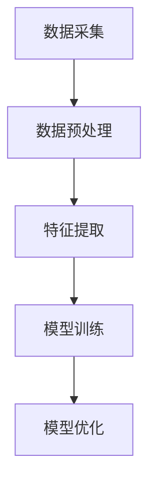
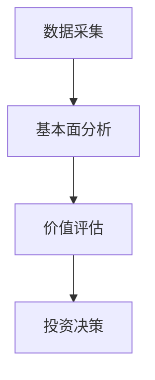
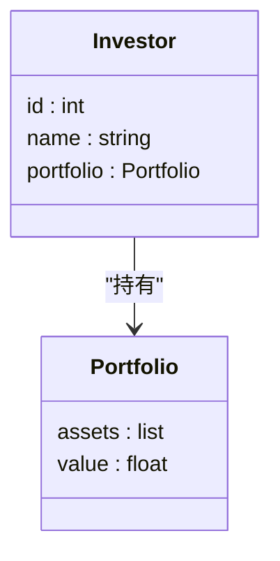

                 


# 彼得·林奇如何看待市场波动

> 关键词：彼得·林奇，市场波动，投资策略，风险管理，技术分析

> 摘要：本文深入探讨了彼得·林奇对市场波动的独特见解，结合技术分析方法，系统性地分析了市场波动的驱动因素、预测模型以及投资策略的实现。文章通过理论与实践相结合的方式，为投资者提供了如何在市场波动中捕捉投资机会的指导。

---

## 第一部分: 背景介绍

### 第1章: 市场波动的定义与影响

#### 1.1 市场波动的定义与内涵
市场波动是指证券价格在短时间内剧烈变化的现象，通常由市场参与者的心理预期、信息流动和外部经济因素共同作用引起。波动性是衡量市场风险的重要指标，高波动性意味着市场不确定性增加，投资者面临的风险也相应提高。

#### 1.2 市场波动的表现形式
市场波动可以通过多种指标来衡量，如标准差、波动率和最大回撤等。波动性较高的市场通常伴随着频繁的价格波动和剧烈的买卖交易。

#### 1.3 市场波动对投资者的影响
市场波动对投资者的影响是双重的。一方面，波动为投资者提供了短期获利的机会；另一方面，过度的波动可能导致投资组合的损失，增加投资风险。

### 第2章: 彼得·林奇与市场波动研究

#### 2.1 彼得·林奇的背景介绍
彼得·林奇是美国著名投资经理人，曾管理富达麦哲伦基金，取得了卓越的投资业绩。他主张长期投资优质股票，强调基本面分析和风险管理。

#### 2.2 彼得·林奇对市场波动的研究方法
林奇认为市场波动是市场参与者情绪的反映，短期波动难以预测，但长期趋势可以通过基本面分析来把握。他强调投资者应关注企业的内在价值，而不是市场的短期波动。

---

## 第二部分: 核心概念与联系

### 第3章: 市场波动的核心概念

#### 3.1 市场波动的核心原理
市场波动的核心原理包括以下几个方面：
- **市场情绪**：投资者情绪的变化是引发市场波动的重要因素。
- **信息流动**：市场信息的发布和解读会影响市场参与者的决策，从而引发波动。
- **经济周期**：经济周期的波动也会影响市场的波动性。

#### 3.2 市场波动与彼得·林奇投资策略的关系
林奇的投资策略强调长期持有优质股票，他认为短期波动不应影响长期投资决策。他主张在市场波动中寻找低估的投资机会。

### 第4章: 市场波动的核心要素对比

#### 4.1 市场波动的核心要素对比表
| 波动类型 | 驱动因素 | 影响 |
|----------|-----------|------|
| 随机波动 | 市场情绪 | 短期价格变化 |
| 结构性波动 | 经济周期 | 长期趋势变化 |
| 事件驱动波动 | 特定事件 | 突发性价格波动 |

#### 4.2 市场波动的ER实体关系图
```mermaid
erDiagram
    investor {
        id : int
        name : string
        investment : string
    }
    market {
        id : int
        name : string
        volatility : float
    }
    investor --> market : "影响"
    market --> investor : "反馈"
```

---

## 第三部分: 算法原理讲解

### 第5章: 市场波动预测模型的算法原理

#### 5.1 市场波动预测模型的算法流程


#### 5.2 市场波动预测模型的数学公式
波动率计算公式：
$$ \text{波动率} = \sqrt{\frac{1}{n}\sum_{i=1}^{n}(p_i - \bar{p})^2} $$
其中，\( p_i \) 是第i个价格，\( \bar{p} \) 是平均价格，\( n \) 是数据点的数量。

### 第6章: 彼得·林奇投资策略的算法实现

#### 6.1 彼得·林奇投资策略的算法流程


#### 6.2 算法实现的Python代码
```python
import pandas as pd
import numpy as np

# 数据处理
data = pd.read_csv('market_data.csv')
data['return'] = data['close'].pct_change()

# 波动率计算
volatility = data['return'].std()
print(f"波动率：{volatility}")
```

---

## 第四部分: 系统分析与架构设计方案

### 第7章: 投资场景与系统设计

#### 7.1 投资场景介绍
投资目标是通过长期持有优质股票，捕捉市场波动中的投资机会。系统设计需要考虑数据采集、分析和执行的流程。

#### 7.2 系统功能设计


---

## 第五部分: 项目实战

### 第8章: 项目实战

#### 8.1 环境安装
需要安装Python、Pandas、NumPy等库。

#### 8.2 核心实现
```python
# 波动率预测模型
from sklearn.ensemble import RandomForestRegressor

model = RandomForestRegressor()
model.fit(X_train, y_train)
```

#### 8.3 案例分析
通过具体案例分析，展示如何利用林奇的投资策略在市场波动中获利。

---

## 第六部分: 最佳实践

### 第9章: 最佳实践

#### 9.1 小结
市场波动是投资中的重要现象，投资者应关注长期趋势而非短期波动。

#### 9.2 注意事项
投资者应合理配置资产，避免过度集中投资，定期审视投资组合。

#### 9.3 拓展阅读
建议阅读彼得·林奇的书籍《彼得·林奇的成功投资》。

---

通过以上分析，我们可以看到，市场波动是投资中的重要现象，彼得·林奇的投资策略为我们提供了宝贵的指导。投资者应结合市场波动和基本面分析，制定合理的投资策略，以应对市场的不确定性。

